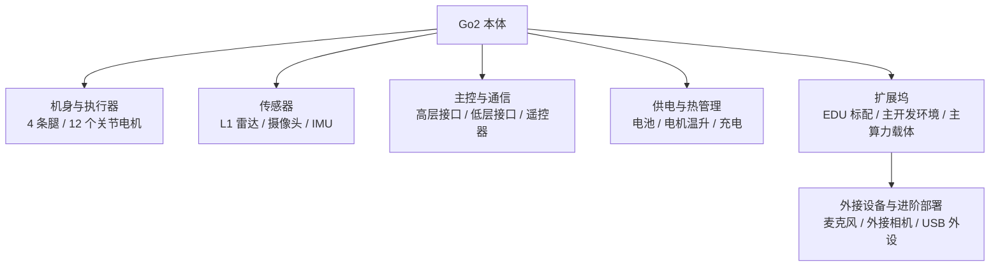

# Go2 硬件一图看懂

> 真正开始写代码前，先别把 Go2 当成一个“会执行命令的黑盒”。你越早知道它身上都挂着什么，后面越少走弯路。

## 本节你将学到

- 从开发者视角看，Go2 最重要的几块硬件分别负责什么
- 为什么“腿、传感器、主控、供电、通信”要分开理解
- 哪些是本体自带能力，哪些由扩展坞承担开发与运行职责，不要混在一起
- 后面章节里最常出现的几个硬件对象：扩展坞、L1 雷达、摄像头、IMU、遥控器
- 实机开发时，哪些硬件细节值得每天看一眼，哪些不用一开始就死记硬背

## 背景与原理

如果把 Go2 只当成一个“能站起来、能坐下、能打招呼”的机器玩具，前两天你会觉得它很酷，第三天就会开始被各种接口名和现象搞晕。

开发者看 Go2，最有用的拆法不是“它有哪些炫酷动作”，而是下面这五层：

1. **机身与关节**：它怎么动
2. **传感器**：它怎么看、怎么感知
3. **主控与通信**：你的代码怎么把命令送进去、把状态读出来
4. **供电与热管理**：它能跑多久，什么时候该停
5. **扩展坞与外挂扩展**：二次开发主要跑在哪儿，以及哪些能力仍然属于本体

你后面会反复遇到的很多概念，其实都能放回这五层里去理解。

比如：

- `/lf/sportmodestate` 本质上是在告诉你“机身当前怎么动”
- `/lf/lowstate` 更靠近电机和底层状态
- 激光雷达和 IMU 属于“感知层”
- 扩展坞更像一台外挂计算机，承担了二次开发的主算力职责，但不等于“机器狗本体的全部能力”

### 为什么不建议一开始死记参数表

新手最容易掉进的坑，就是还没搞清楚硬件角色，就开始背规格、背接口、背缩写。

问题是，这些信息只有放进具体场景里才有意义。

比如你现在最该知道的，不是某个传感器的完整技术指标，而是：

- 它大概看什么
- 你会在哪些章节第一次用到它
- 出问题时你该先怀疑它还是怀疑别的链路

带着这个思路认识硬件，后面真正用到时，你自然会把细节补起来。

## 架构总览

先看一张开发者视角的“硬件地图”：

如果把这张图再展开一点，可以得到后面最常用的“硬件到章节”的对应关系：

| 模块 | 你最先会在哪儿遇到它 | 现在只需要知道什么 |
|---|---|---|
| 4 条腿和 12 个关节 | 第 2 章消息接口、第 3 章之后的控制章节 | Go2 不是小车，动作稳定性高度依赖整套平衡控制 |
| L1 雷达 | 感知篇、建图、导航 | 它负责提供空间感知，不是拿来直接控制电机的 |
| 摄像头 | 交互篇、视觉相关章节 | 它更像“眼睛”，通常和视频流、图片理解配合使用 |
| IMU | 状态反馈、SLAM、姿态判断 | 它告诉系统身体朝向和加速度变化 |
| 遥控器 | 开篇安全、第 2 章状态接口 | 它既是输入设备，也是实机测试时的安全兜底 |
| 电池与温度 | 安全章、实机调试全过程 | 这是最容易被忽略，但最该养成观察习惯的部分 |
| 扩展坞 | 承载全部二次开发程序、ROS2 节点和 Python 环境 | 它是外挂算力，但不是所有内置硬件能力都直接“挂在它上面” |

## 环境准备

这一节不需要你安装任何软件，但建议你在实机旁边做一次“看得见、摸得着”的认识：

| 现在先确认什么 | 为什么值得现在确认 |
|---|---|
| 哪边是机头、哪边是机尾 | 你后面看坐标系、看姿态时会经常用到 |
| 遥控器是否有电、是否能接管 | 实机调试别等出事了才想起它 |
| 网线、充电器、工作台位置是否顺手 | 工程调试最怕频繁拔插时手忙脚乱 |
| 机器狗周围是否有充足空地 | 早期动作测试不要贴着桌腿和墙角搞 |

扩展坞是你后续最重要的开发环境。你写的大部分代码、安装的大部分依赖、跑起来的大部分 ROS2 节点，都会落在这里。

但这里有个技术认知仍然要守住：扩展坞虽然是主算力和主战场，不代表 Go2 所有本体硬件都天然直接挂在它上面。本体、主板、扩展坞、外接 USB 设备依然是不同层级，后面你做部署和接外设时，这个边界会直接决定该在哪边装依赖、在哪边跑程序、哪边能访问到什么能力。

## 实现步骤

### 步骤一：先认识“它怎么动”

Go2 最直观的部分当然是四条腿，但开发时更重要的是：**每条腿不是一个动作单元，而是一组关节单元**。

你可以先把它理解成：

- 四条腿负责整体运动
- 每条腿由多个关节协同
- 机器人能稳不稳，不是靠某一个关节，而是靠整套控制器一起工作

这也是为什么我们后面会反复强调：新手阶段优先使用高层运动接口，而不是一上来就直接碰底层电机命令。

因为四足机器人不像小车那样“左轮快一点、右轮慢一点”就完事了。它随时都在做平衡、落脚、姿态保持这些复杂工作。

### 步骤二：再认识“它怎么感知”

Go2 在开发中最常被你用到的传感器，通常是下面这几类：

| 传感器 | 你可以把它先理解成什么 | 后面最常见的用途 |
|---|---|---|
| L1 雷达 | 机器狗的“空间雷达眼” | 点云、障碍物感知、建图、导航 |
| 摄像头 | 机器狗的 RGB 视觉输入 | 拍照、视频流、视觉理解 |
| IMU | 身体姿态和运动变化感知器 | 姿态估计、里程计辅助、SLAM |

别急着记参数。对初学者更重要的是先建立一个顺序：

先知道“这个传感器在管什么”，再去学“它的数据长什么样”，最后再去碰“我怎么拿它做功能”。

### 步骤三：理解“你的代码是怎么接上它的”

开发 Go2 时，你真正打交道最多的，通常不是裸硬件，而是硬件上层暴露出来的接口。

你可以先把它们粗分成两类：

| 接口层级 | 典型入口 | 现在怎么理解最合适 |
|---|---|---|
| 高层接口 | `/api/sport/request`、`/lf/sportmodestate` | 面向动作和状态，安全、稳定，适合教程前期使用 |
| 低层接口 | `/lowcmd`、`/lf/lowstate` | 更靠近电机和原始控制，能力强，但风险也大 |

这本书前面的主线，基本都围绕高层接口展开。

不是因为低层接口不重要，而是因为**你先得会走，再学跑，再学为什么有人会翻车**。

### 步骤四：认识扩展坞在体系中的位置

在这本书里，扩展坞不是“有最好、没有也无所谓”的附件，而是你后续二次开发的主战场。

更准确的理解应该是：

- Go2 本体负责运动、本体传感器、基础控制链路
- 扩展坞负责二次开发主算力、程序运行、依赖安装和外设接入
- 某些外设和音频链路未必像想象中那样“天然都挂在扩展坞可直接用”

所以你后面会反复看到“SSH 进扩展坞”“在扩展坞上装依赖”“让节点跑在扩展坞里”这种表述。这不是进阶玩法，而是整本书默认的开发姿势。

同时也别把它脑补成“万能中枢”。扩展坞承担的是外挂算力职责，不是说所有本体硬件能力都原生直接暴露给它。这个边界不搞清楚，后面做语音、视觉和 USB 外设时就很容易踩坑。

!!! note "先记住一个很实用的判断方法"
    当你分不清某个能力到底跑在本体链路还是扩展坞链路时，先问自己：这个能力是“机器人原生运动/状态/传感器”还是“我额外装进去并跑起来的程序和外设”？前者大多属于本体控制链路，后者大多落在扩展坞上。

## 编译与运行

这一节仍然不写代码，但建议你现在就做一轮“上电前观察”：

1. 看一眼机身周围有没有杂物和容易绊脚的线
2. 看一眼遥控器是不是在你手边
3. 看一眼电池状态和机器是否有异常热感
4. 看一眼自己是否真的知道下一步准备让它做什么

这个习惯看起来很朴素，实际特别值钱。

很多实机事故，不是因为算法多难，而是因为人一着急，直接跳过了最基本的观察环节。

## 结果验证

读完本节后，你最好能做到下面这几件事：

1. 能把 Go2 粗分成“执行器、传感器、通信、供电、扩展坞”五部分
2. 知道高层接口和低层接口不是一回事
3. 知道扩展坞是你后续一切二次开发的运行载体
4. 知道后面遇到雷达、摄像头、IMU、遥控器这些词时，大概该把它们放回哪一层理解

如果这些认知已经建立起来，后面再看消息接口和环境栈，就不会那么散了。

## 常见问题

### 为什么所有二次开发都默认在扩展坞上做？

因为我们这里讨论的是 Go2 EDU 的标准开发形态。

学校给学生提供的 Go2 EDU 默认就带扩展坞，而二次开发真正需要的主算力、ROS2 运行环境、Python 依赖和外设接入，也都默认落在扩展坞这一层。主板固件和本体链路不是给你随意当通用开发机折腾的。

### 一定要先搞懂 12 个关节的所有细节吗？

不用。

你现在只需要知道 Go2 的运动不是“单个轮子转起来”那种简单模型，而是多关节协同和平衡控制共同作用的结果。

具体到每个关节名字、角度范围、力矩和控制模式，后面在真正用到时再学。

### 雷达、摄像头、IMU，哪个最重要？

没有谁永远最重要，只有“当前章节最重要”。

你做环境和消息接口时，更关心通信链路；做 SLAM 和导航时，雷达和 IMU 更关键；做视觉和语音时，摄像头和扩展算力的重要性会抬上来。

### 我可以现在就去碰 `/lowcmd` 吗？

不建议。

你还没把高层控制链路走通之前，直接碰底层控制，大概率不是“学得更快”，而是“更快地把问题搞复杂”。

## 本节小结

这一节的目标，是把 Go2 从“一个会做动作的黑盒”拆成几个开发上更有意义的部分：执行器、传感器、通信、供电和扩展坞。

当你能用这个视角重新看它，后面学消息接口时，你就不会只盯着话题名本身，而会知道这些消息到底对应哪一层硬件。

## 下一步

下一节我们把视角从机器人本体切到电脑侧，看看 Ubuntu、ROS2、CycloneDDS、`unitree_ros2` 和你的教程工作空间，到底是怎么拼成一套开发环境的。

继续阅读：[开发环境总览](03-env.md)
