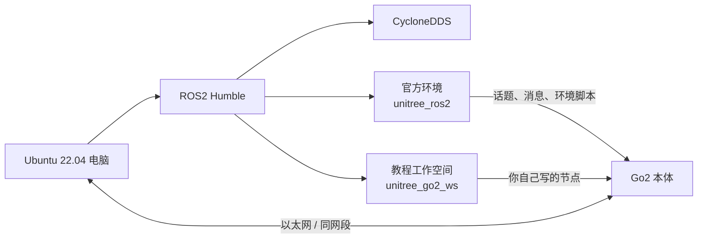

# 开发环境总览

> 电脑侧环境这件事，最怕的不是命令多，而是不知道每一层到底在管什么。先把层次看顺了，第 1 章就不会像拆炸弹。

## 本节你将学到

- Ubuntu 22.04、ROS2 Humble、CycloneDDS、`unitree_ros2`、教程工作空间各自的角色
- 为什么本书把“官方环境”和“你自己的代码”拆成两套目录
- 电脑和 Go2 之间真正跑起来时，数据链路大概长什么样
- 第 1 章你会做哪些事情，哪些只是认识概念、暂时还不用急着操作
- 常见环境误区：把所有东西塞进一个工作空间、乱改默认网络配置、分不清 source 了哪一层

## 背景与原理

第一次接触 Go2 开发时，最容易出现一种错觉：好像电脑上只有一个“开发环境”。

其实不是。

对本书来说，至少有下面这几层需要分清：

1. **Ubuntu 22.04**：操作系统底座
2. **ROS2 Humble**：机器人软件开发框架
3. **CycloneDDS**：ROS2 在本项目里使用的通信中间件
4. **`unitree_ros2`**：Unitree 官方给 Go2 提供的 ROS2 消息、示例和环境脚本
5. **`unitree_go2_ws`**：你跟着本书自己创建和维护的教程工作空间

把这些层分清的意义，不是为了背概念，而是为了回答后面经常会遇到的三个问题：

- 我现在 source 的到底是哪一层？
- 某个报错属于 ROS2 基础环境、Unitree 官方环境，还是我自己的包？
- 我应该改官方仓库，还是应该在自己的工作空间里新建东西？

### 为什么要单独保留教程工作空间

本书不会让你把自己的实验代码直接塞进 `unitree_ros2` 里。

原因很简单：官方仓库是“供应商给你的底座”，而 `unitree_go2_ws` 是“你自己的开发区”。

这两个角色混在一起，短期看像是省事，长期看就会变成：

- 升级官方仓库时不敢拉代码
- 过一段时间已经分不清哪些是官方文件，哪些是自己加的
- 教程里的命名规范和目录结构越来越乱

所以本书会用两套目录：

| 目录 | 角色 | 你主要在里面干什么 |
|---|---|---|
| `unitree_ros2/` | 官方环境 | 编译官方消息、加载官方脚本、对照官方示例 |
| `unitree_go2_ws/` | 教程工作空间 | 创建自己的包、写自己的节点、练习和扩展本书代码 |

### 为什么本书明确要求 CycloneDDS

ROS2 不止一种 DDS 实现，但 Go2 这条链路里，我们要和 Unitree 提供的环境对齐。

对新手来说，最重要的不是去讨论“哪家中间件理论上更强”，而是先让电脑和 Go2 用**同一种能稳定说话的方式**完成通信。

本书因此固定使用 CycloneDDS，并在第 1 章让你明确地把这层配置好。

## 架构总览

把整套环境画成图，大概是这样：

如果换成你每天实际会接触到的对象，可以再看这张表：

| 层级 | 你看到的东西 | 它解决什么问题 |
|---|---|---|
| 操作系统层 | Ubuntu 22.04 | 提供稳定的 Linux 开发环境 |
| ROS2 框架层 | `ros2`、`colcon`、`rclpy`、`rclcpp` | 写节点、编译包、跑 Topic/Service/Action |
| 通信层 | CycloneDDS | 让电脑和 Go2 发现彼此、交换消息 |
| 官方支持层 | `unitree_ros2`、官方消息定义、示例程序 | 告诉你 Go2 的接口长什么样 |
| 教程实践层 | `unitree_go2_ws` | 放你真正跟着本书写出来的代码 |

## 环境准备

在第 1 章真正开工前，建议你先对下面这些对象建立“脸熟”：

| 项目 | 现在先知道什么就够了 |
|---|---|
| Ubuntu 22.04 | 本书默认环境，不讨论跨版本适配 |
| ROS2 Humble | 本书所有命令和依赖按这个版本写 |
| `unitree_ros2` | 你要先把官方底座准备好，后面才能舒服地写自己的节点 |
| `unitree_go2_ws` | 这是你后面真正会频繁进入的工作空间 |
| 网卡 / 网线 | 电脑要和 Go2 在同一网段，DDS 才能顺利通信 |
| RViz、VS Code、终端 | 这三样是最常见的开发/观察窗口 |

!!! tip "先建立正确分工，比先敲命令更重要"
    你现在只要记住一句话：`unitree_ros2` 是“官方提供的底座”，`unitree_go2_ws` 是“你跟着本书自己搭的实验区”。后面很多选择题，靠这句话就能做对。

## 实现步骤

### 步骤一：把“电脑侧环境”拆成两部分看

第一部分是**系统和 ROS2 基础层**。

这部分包括 Ubuntu、ROS2 Humble、编译工具、常见命令行工具等。它们不是 Go2 专属，但没有它们，你连最基础的 `ros2 topic list` 都跑不起来。

第二部分是**Go2 专用层**。

这部分包括 `unitree_ros2`、CycloneDDS 配置、Go2 相关消息类型和环境脚本。它们决定你的电脑能不能真正和 Go2 建立稳定通信。

### 步骤二：理解官方仓库和教程工作空间的分工

你可以把它们理解成“底座”和“实验台”：

- `unitree_ros2` 负责提供官方消息、接口和环境脚本
- `unitree_go2_ws` 负责承载你自己的包和节点

后面第 1 章里，你会先把底座搭起来，再开始搭自己的实验台。

这种分工还有一个额外好处：当你看本书的代码时，不会老是怀疑“这是教程自己写的，还是官方仓库本来就有的”。

### 步骤三：先理解通信链路，再理解目录

对 новичок 来说，目录结构反而不是最难的，真正容易糊的是通信链路。

你可以先记住这条线：

1. 电脑和 Go2 通过有线网络进入同一网段
2. 电脑侧加载 ROS2 和 CycloneDDS 环境
3. 电脑侧通过 `unitree_ros2` 提供的消息定义理解 Go2 的 Topic
4. 你在 `unitree_go2_ws` 里写的节点，才能安全地去订阅和发布这些消息

如果这条线脑子里清楚了，第 1 章的每条命令都会显得合理很多。

### 步骤四：提前知道第 1 章会做什么

第 1 章不是一上来就写业务代码，而是按下面这个顺序把环境落地：

| 顺序 | 你会做什么 | 目的 |
|---|---|---|
| 1 | 确认 Ubuntu 和 ROS2 Humble | 把基础框架立起来 |
| 2 | 准备和编译 CycloneDDS | 让 Go2 通信链路对上 |
| 3 | 克隆并准备 `unitree_ros2` | 拿到官方消息和环境脚本 |
| 4 | 配好电脑和 Go2 的网络 | 让 DDS 真能发现对方 |
| 5 | 创建 `unitree_go2_ws` | 为你自己的代码准备地方 |
| 6 | 跑通第一个节点 | 用 `/lf/sportmodestate` 验证整条链路 |

现在你还不用背具体命令，先把这条顺序记住就够了。

## 编译与运行

这一节虽然还不真正编译代码，但你现在就应该知道：后面每次“运行成功”，本质上都是三层东西同时没掉链子：

1. ROS2 基础环境加载对了
2. Go2 官方环境加载对了
3. 你自己的工作空间也 source 对了

很多初学者第一次遇到“包能编译、运行却找不到节点”这种问题，本质上不是代码写错，而是这三层环境只 source 了前两层，或者 source 顺序乱了。

所以从现在开始，你就可以带着一个习惯往后看：**每当系统表现奇怪时，先检查我到底 source 了哪几层。**

## 结果验证

读完本节后，你不需要已经会写代码，但最好能回答下面这些问题：

1. 为什么本书要把 `unitree_ros2` 和 `unitree_go2_ws` 分开？
2. CycloneDDS 在这套链路里到底是在解决什么问题？
3. 如果后面消息看不到，你应该先查网络和通信层，而不是先怪 Python 语法，对吗？

如果这些问题你已经能回答得比较顺，说明你对环境栈的理解已经够支撑第 1 章了。

## 常见问题

### 我能把自己的包直接写进 `unitree_ros2` 吗？

技术上当然能，但不建议。

这样做短期看像是少进一个目录，长期会把官方仓库和你自己的实验代码搅成一锅粥，后面排错和升级都很难受。

### 我可不可以完全不装官方仓库，只在自己的工作空间里写节点？

不行。

你自己的工作空间要订阅和发布 Go2 的消息，前提是电脑上已经有这些消息定义和环境脚本。官方仓库就是这层底座的一部分。

### 我看到有人用别的 DDS，可以照抄吗？

你当然可以自己研究，但本书主线不这么走。

教程最怕的不是“少学一点扩展知识”，而是“同时换了三件事，最后不知道是哪一层出的错”。先把官方链路走通，再去玩变体更稳。

### 如果我平时还要用有线网口上网怎么办？

别把日常有线配置和 Go2 专用静态 IP 长期混在一个连接配置里。

最稳妥的做法，是给 Go2 单独准备一套网络连接配置；这样你切回正常上网环境时，不至于把所有流量都导到错误网段里。

## 本节小结

这一节真正要帮你建立的，是“环境分层”意识。

从现在开始，你应该把电脑侧这套东西看成五层：Ubuntu、ROS2、CycloneDDS、官方 Go2 环境、你自己的教程工作空间。

只要这几层不混，你后面做环境搭建、消息订阅、节点开发时，很多问题都会更容易定位。

## 下一步

下一节我们把注意力再收紧一点：不讲全貌了，直接开始把第 1 章环境搭起来，并让电脑真正读到 Go2 的第一条状态消息。

继续阅读：[实机安全红线](04-safety.md)
