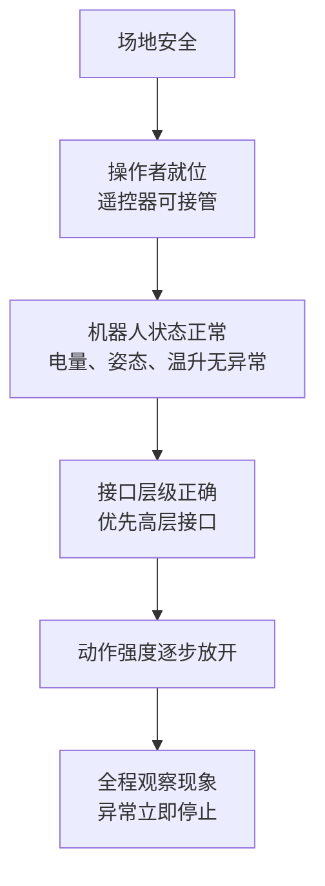

# 实机安全红线

> 机器狗开发里最蠢、也最贵的错误，就是“觉得这次只是试一下，应该没事”。这一节就是专门拿来打断这种想法的。

## 本节你将学到

- 实机测试前，哪些动作必须先确认，哪些条件不满足就别开跑
- 为什么本书前期只让你碰高层接口，不让你直接摸底层电机控制
- 看到抖动、发热、误动作、异常旋转时，第一反应应该是什么
- 哪些“看着像小问题”的现象，其实已经是危险信号
- 后面章节动手前，怎样用一套统一清单给自己降风险

## 背景与原理

Go2 不是一台只会在终端里报错的程序，它会真的站起来、真的转身、真的摔。

这意味着你在电脑上发出去的每一条指令，最后都会通过真实的控制链路变成真实的身体动作。

对初学者来说，最危险的不是“不会写代码”，而是下面这三种心态：

1. 觉得某个底层接口只是名字吓人，先发一下试试
2. 看到机器人已经有点不对劲了，还想“再发一条确认一下”
3. 把导航、旋转、空翻、底层电机这些能力都当成普通调试动作

本书前面的章节故意把主线建立在高层接口上，就是为了先给你一条**安全、可控、反馈清楚**的学习路径。

### 为什么高层接口优先

高层接口的好处，不只是“好用”，更关键是它们在机器人内部已经带着一层运动控制和姿态稳定逻辑。

你发的是“站起来”“趴下”“前进一点”“打招呼”这类意图，底层怎么分配到各个关节，主要由机器人自己的控制器处理。

而底层接口不是这样。

一旦你开始直接发电机层的命令，等于你自己要对更多字段、更细的状态、更高的风险负责。对刚开始上手的人来说，这不是“更专业”，而是“更容易把问题搞成硬件级事故”。

### 为什么异常现象不能拖

实机调试时，抖动、异响、异常热、突发大角速度这些现象，往往不是“先记一下，回头再看”的普通 warning。

它们更像是在告诉你：**这条控制链路已经偏了**。

这时候最不该做的，就是抱着“再试一遍也许就好了”的侥幸心理继续发命令。

!!! danger "先记住一句最重要的话"
    发现异常抖动、误动作、异常发热、原地高速旋转，先停，再查。不要一边觉得不对劲，一边还在继续发布控制指令。

## 架构总览

把安全这件事拆开看，它其实也是一条链：

你可以把这张图理解成一句话：

**不是代码能发出去就叫可以测试，而是场地、人、机器人、接口、动作强度这五层同时过关，才叫可以测试。**

## 环境准备

每次实机动手前，先做一轮最基本的安全检查：

| 检查项 | 为什么必须看 |
|---|---|
| 机器人周围是否留出足够空地 | 防止起步、转向、趴下、起身时碰桌腿或撞墙 |
| 遥控器是否在手边、可随时接管 | 出现误动作时，这是最直接的兜底 |
| 电池和机身温度是否正常 | 带着异常热状态继续跑，风险会累积 |
| 网线、电源线、转接器是否会被腿勾到 | 这是最容易被忽略的物理事故源 |
| 这次测试准备做什么动作 | 没有明确目标时，最容易多试、多碰、多出事 |

如果现场还有其他人，最好让他们站到侧后方，不要围在机器人正前方看热闹。

实机测试不是演示会，尤其在你还没把控制链路彻底摸顺之前更不是。

## 实现步骤

### 步骤一：前几章只走高层接口主线

本书前面的基础篇、功能包篇、通信篇，默认你主要使用的是高层接口，比如 `/api/sport/request` 这一类。

这是刻意设计出来的教学边界，不是因为底层接口不重要，而是因为你现在更需要先建立这三件事：

- 命令发出去了，机器人为什么会这么动
- 状态回来了，哪些字段值得看
- 出现异常时，先查哪条链路

在这三件事没稳之前，去碰底层接口只会让问题空间暴涨。

### 步骤二：把 `/lowcmd` 当成“危险工具”，不是“进阶按钮”

最典型的误区，就是觉得“我只是想改一个底层字段，不会真影响别的东西吧”。

现实往往不是这样。

底层消息里很多字段是一起打包发送的。你以为自己只是在碰某个小功能，机器人实际收到的可能是一整组互相冲突的控制意图。

这也是为什么本书在第 2 章里只会介绍 `/lowcmd` 的角色和风险边界，不会带你在新手阶段实操发送它。

!!! danger "LowCmd 不是拿来顺手试试的"
    真实踩坑记录里，曾经出现过为了控制灯光去发送底层消息，结果同时带出零值电机命令，最终导致电机持续对抗发热、关节过热、机器人摔倒的事故。结论很简单：在你完全理解消息字段之前，不要向 `/lowcmd` 发送任何控制消息。

### 步骤三：危险动作默认需要更高门槛

像原地高速旋转、空翻、连续特技动作这种行为，不是“会调用 API 就可以随便测”。

它们默认需要你同时满足：

- 场地空旷
- 机器人状态正常
- 操作者站位合适
- 遥控器在手
- 你明确知道下一步要怎么停下来

如果以上有任何一条拿不准，就先别测。

后面有些章节会提到“二次确认”“降低速度上限”“先从最小动作开始试”，这些都不是保守，而是工程上的基本素养。

### 步骤四：看到异常旋转、抖动、发热，优先停机而不是解释

你后面会看到一些更复杂的系统，比如导航、自动恢复、行为树、连续动作编排。

这些功能一旦配置不当，最常见的危险现象往往不是“完全不动”，而是“动得不符合预期”，比如：

- 突然开始原地高速旋转
- 关节出现异常抖动
- 明明只是发一条辅助指令，机身却开始不稳定
- 某个关节温度明显上升得特别快

这些时候，正确顺序永远是：

1. 先停止动作
2. 让机器人回到稳定状态或断电冷却
3. 再去查日志、配置和命令链路

反过来做，事故概率会直线上升。

### 步骤五：把“慢一点”当成正常工程习惯

初学者最需要克服的一件事，就是不愿意慢。

可在实机开发里，慢一点通常意味着：

- 一次只验证一条链路
- 一个动作先做最小版本
- 一旦异常，立刻停
- 不同时改三件事

这不是胆小，是在给自己留排错空间。

## 编译与运行

从这一章开始，后面每次真正执行程序前，都建议你先做这套“上机前清单”：

1. 我这次测试的动作目标是什么？
2. 我准备用的是高层接口还是低层接口？
3. 现场有没有足够空地？
4. 遥控器是不是在手边？
5. 如果它现在表现异常，我第一步准备怎么停？

如果其中任何一个问题你回答不上来，就先别按回车。

## 结果验证

读完本节后，你至少应该做到下面这些判断：

1. 知道前期为什么优先用高层接口
2. 知道 `/lowcmd` 在新手阶段只介绍、不实操
3. 知道抖动、发热、异常旋转不是“小毛病”，而是停下来排查的理由
4. 知道每次实机前都要做最基本的场地和遥控器检查

如果你已经把这些变成默认意识，后面真正开始写控制和导航时，风险会低很多。

## 常见问题

### 我只是想试一下底层消息里的某个字段，也不行吗？

不建议。

你以为自己在改一个小字段，机器人实际收到的可能是一整条你没完全理解的底层消息。等你已经把高层链路、消息结构、安全边界都吃透之后，再谈这件事。

### 可以在室内小空间里测试旋转和特技动作吗？

不建议当成默认做法。

这些动作对空间、地面、姿态稳定和紧急接管都更敏感。你如果只是想验证链路通不通，完全没必要上来就挑最危险的动作。

### 如果机器人已经出现轻微抖动，但还没摔，要不要再发一条停止指令看看？

先停、先接管、先让它回稳，再查原因。

不要在“已经明显不对劲”的状态下继续连发命令，尤其不要一边怀疑底层链路有问题，一边还在继续向它发新的控制数据。

### 自动导航为什么也要放进安全章节里？

因为它不是“不会动的算法”，而是会真实驱动物理机器去移动的控制系统。

比如恢复行为里的原地旋转，如果不考虑四足机器人的稳定边界，完全可能从“导航策略”直接演变成“实机摔倒”。

## 本节小结

安全这件事，在 Go2 开发里不是附录，也不是提醒框，而是主线的一部分。

前面这些红线可以压成一句话：**先用高层接口建立稳定链路，任何异常先停再查，危险动作和底层控制都别拿“试一下”当理由。**

只要这条线守住，后面的学习节奏会稳很多。

## 下一步

开篇读到这里，你已经知道这本书怎么用、Go2 身上有什么、电脑侧环境是怎么分层的，也知道哪些事情现在先别乱碰。

接下来就可以进入真正的动手部分了：第 1 章环境搭建。

继续阅读：[第 1 章 环境搭建](../01-foundation/01-install.md)
