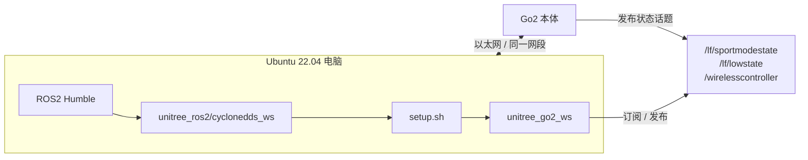

# 第 1 章 环境搭建

!!! info "参考教程说明"
    本书**第 1 到第 9 章**(环境、消息、键盘、Twist 桥、可视化、驱动、话题、服务、动作)主要参考 B 站**赵虚左**老师的《Go2 开发指南》系列视频整理而来,按本书的代码约定和叙事顺序做了改写。

    如果你更习惯看视频,或者想在某一章听到原版讲解,可以对照观看:

    **【ROS2 理论与实践 _ 宇树机器人 Go2 开发指南】** — <https://www.bilibili.com/video/BV1vv5YzBEQH?vd_source=e826416e2d1ee7e81b4a504563d2d78e>

    从第 10 章开始(感知与导航篇),本书主要基于作者自己的实机踩坑与仿真实验,不再对应视频课程。

> 开篇读完之后，这一章要解决的事很具体：把 Ubuntu 电脑和 Go2 真正连起来，并用你自己的第一个 ROS2 节点读到 `/lf/sportmodestate`。

## 本章你将学到

- 为什么本书固定使用 Ubuntu 22.04、ROS2 Humble 和 CycloneDDS 这套组合
- 怎样准备 `unitree_ros2` 官方环境，并知道它和你自己的工作空间怎么分工
- 怎样把电脑和 Go2 放进同一网段，让 DDS 通信真正建立起来
- 怎样创建 `unitree_go2_ws` 和第一个教程包 `go2_hello_py`
- 怎样编译并运行一个最小 Python 节点，让终端打印出 Go2 的实时姿态数据

## 背景与原理

### ROS2 在这一章里到底扮演什么角色

如果你把 Go2 开发想成“我写一个 Python 脚本，然后它就能动”，这章很容易看得乱。

更准确的理解是：

- **Ubuntu 22.04** 提供稳定的 Linux 开发环境
- **ROS2 Humble** 提供节点、话题、消息、编译和运行的基础框架
- **Unitree 官方 `unitree_ros2` 仓库** 提供 Go2 的消息定义、示例程序和环境脚本
- **你的教程工作空间 `unitree_go2_ws`** 才是后面真正写自己代码的地方

这一章的任务，就是把这四层串起来。

等它们串通之后，你后面写的控制节点、状态订阅节点、桥接节点，才不是“凭空运行”，而是挂在一套清晰的机器人软件栈上。

### 为什么这本书坚持把官方环境和教程工作空间分开

第一次搭环境时，很多人会偷懒：直接把自己的代码也塞进 `unitree_ros2`，觉得少开一个目录更省事。

短期看确实省事，长期看很容易变成灾难：

- 你已经分不清哪些文件是官方仓库原有的，哪些是自己加的
- 后面想升级官方仓库时不敢动
- 章节里一旦要统一命名和目录结构，就会越来越乱

所以本书明确分两层：

| 目录 | 作用 | 你在里面做什么 |
|---|---|---|
| `~/unitree_ros2` | 官方底座 | 编译消息、加载环境脚本、参考官方示例 |
| `~/unitree_go2_ws` | 你的开发区 | 创建包、写节点、练习和扩展本书代码 |

这个分工你现在就要记住，因为后面很多“到底该改哪儿”的选择题，都是靠它做对的。

### 为什么还要单独提 CycloneDDS

Go2 这条链路不是“只要装了 ROS2 就随便通”的。

Unitree 的通信机制和 ROS2 的 DDS 层是对齐的，本书主线固定使用 CycloneDDS，就是为了让你和 Go2 使用同一种稳定的通信方式。

你可能会在别的帖子里看到 Fast DDS、默认 DDS 或者别的折腾方案。先别急。

对初学者来说，**先把官方推荐链路跑通**，比一上来就玩变体重要得多。

!!! note "关于 Humble 和 CycloneDDS 的一个现实提醒"
    官方 README 提到在某些 Humble 环境里可以跳过单独编译 CycloneDDS。但结合现有项目材料和本书后续章节的环境约定，我们仍然统一按 `unitree_ros2/cyclonedds_ws` 这条链路来写。这样前后章节口径一致，读者也更容易排错。

### 为什么网络配置是环境搭建的一部分

很多第一次做机器人开发的人，会把网络理解成“先连上，剩下交给代码”。

在 Go2 这里，这种想法不够。

因为你的节点能不能看到 `/lf/sportmodestate`、`/lf/lowstate`、`/wirelesscontroller` 这些话题，首先取决于：

1. 电脑和 Go2 是否在同一网段
2. 你在 `setup.sh` 里写的网卡名是不是对的
3. 你是不是加载了正确的环境脚本

也就是说，这一章的“环境搭建”不是边角料，它本身就是后面所有章节能否成立的前提。

## 架构总览

先看整条链路的样子：



这张图可以翻成一句人话：

1. 先把 ROS2 Humble 准备好
2. 再把 `unitree_ros2` 这套官方底座准备好
3. 再通过 `setup.sh` 把 CycloneDDS 和正确网卡绑起来
4. 最后在 `unitree_go2_ws` 里写你自己的节点

你后面每次打开一个新终端，基本都在重复一件事：把这条链重新 source 回来。

## 环境准备

开始前先确认下面这些前置条件：

| 项目 | 要求 |
|---|---|
| 操作系统 | Ubuntu 22.04 LTS |
| ROS2 版本 | Humble |
| 机器人 | Go2 EDU，能正常上电 |
| 网络 | 一根能稳定工作的有线网口或转接器 |
| 硬盘空间 | 至少留出 20GB 左右可用空间 |
| 本章模式 | 默认真机模式，不是仿真模式 |

建议你额外准备两个习惯：

- 每做完一段配置，就立刻做一次小验证
- 不要在同一个终端里反复叠很多层不确定的环境

这两件事会比你想象中更省时间。

!!! warning "本章默认你在真机模式下动手"
    如果你暂时没有连 Go2，只是想先在本机练命令，可以先看完流程，再用 `setup_local.sh` 或 `setup_default.sh` 熟悉目录和命令。但本章真正的成功标准，仍然是看到真机的 `/lf/sportmodestate` 数据。

## 实现步骤

### 步骤一：安装 ROS2 Humble

如果你的系统还没装 ROS2 Humble，先把基础环境补齐。

先准备系统语言环境和 ROS2 软件源：

```bash
# 配置本地语言环境，避免后面某些依赖和工具链因为 locale 异常报错
sudo apt update
sudo apt install -y locales software-properties-common curl
sudo locale-gen en_US en_US.UTF-8
sudo update-locale LC_ALL=en_US.UTF-8 LANG=en_US.UTF-8
export LANG=en_US.UTF-8

# 打开 universe 仓库，并写入 ROS2 的 apt 源
sudo add-apt-repository universe
sudo curl -sSL https://raw.githubusercontent.com/ros/rosdistro/master/ros.key \
    -o /usr/share/keyrings/ros-archive-keyring.gpg
echo "deb [arch=$(dpkg --print-architecture) signed-by=/usr/share/keyrings/ros-archive-keyring.gpg] \
http://packages.ros.org/ros2/ubuntu $(. /etc/os-release && echo $UBUNTU_CODENAME) main" | \
sudo tee /etc/apt/sources.list.d/ros2.list > /dev/null
```

然后安装 ROS2 Humble 和开发工具：

```bash
# 安装 ROS2 桌面版和常用开发工具
sudo apt update
sudo apt install -y ros-humble-desktop ros-dev-tools
```

最后做一次最小验证：

```bash
# 只加载 ROS2 基础环境，确认 ros2 命令可用
source /opt/ros/humble/setup.bash
ros2 --help
```

如果你能看到 `ros2` 的帮助信息，说明系统级 ROS2 已经装好了。

!!! tip "已经装过 ROS2 的读者怎么做"
    如果你已经确认自己装的是 Humble，而且 `source /opt/ros/humble/setup.bash` 后 `ros2 --help` 正常，就可以直接跳到下一步，不用重复安装。

### 步骤二：拉取 `unitree_ros2` 并安装 Go2 相关依赖

现在开始搭官方底座。

先把仓库克隆到家目录：

```bash
# 这个仓库里包含 Go2 的消息定义、环境脚本和示例程序
cd ~
git clone https://github.com/unitreerobotics/unitree_ros2
```

如果你本地已经有这个目录，就不要重复 clone 了，直接进入目录继续下面步骤。

接着安装 Go2 这条链路最关键的两个依赖：

```bash
# rmw_cyclonedds_cpp: 让 ROS2 用 CycloneDDS 作为底层通信实现
# rosidl-generator-dds-idl: 生成与 DDS 相关的消息描述文件
sudo apt install -y \
    ros-humble-rmw-cyclonedds-cpp \
    ros-humble-rosidl-generator-dds-idl
```

到这里为止，你只是把“官方环境需要的积木”备齐了，还没有真正把消息工作空间编译出来。

### 步骤三：编译 `cyclonedds_ws`

这一步容易踩坑，先记住一个规则：**编译 `cyclonedds_ws` 之前，当前终端不要叠加别的 ROS2 工作空间环境。**

最稳妥的做法，是重新开一个干净终端，先确认没有残留的 ROS2 叠加环境：

```bash
# 理想情况应该输出 humble 或者为空；重点是不要叠了别的工作空间 install
echo $ROS_DISTRO
```

然后进入 `cyclonedds_ws` 的源码目录，准备 CycloneDDS 相关仓库：

```bash
# 进入官方消息工作空间的 src 目录
cd ~/unitree_ros2/cyclonedds_ws/src

# 这两个仓库如果已经存在，就跳过 clone
git clone https://github.com/ros2/rmw_cyclonedds -b humble
git clone https://github.com/eclipse-cyclonedds/cyclonedds -b releases/0.10.x
```

回到工作空间根目录，只编译 `cyclonedds` 包：

```bash
# 先把 CycloneDDS 自身编出来，后面 setup.sh 会直接 source 它
cd ~/unitree_ros2/cyclonedds_ws
colcon build --packages-select cyclonedds
```

如果这一步报错，最常见的原因不是代码问题，而是终端里叠了不该叠的环境。

`colcon build` 成功后，再编译整个官方消息工作空间：

```bash
# 这一步开始需要 ROS2 Humble 基础环境
source /opt/ros/humble/setup.bash
cd ~/unitree_ros2/cyclonedds_ws
colcon build
```

这一步完成后，`unitree_go` 和 `unitree_api` 这些消息包才真正对你的系统可用。

### 步骤四：把电脑和 Go2 放进同一网段

Go2 真机开发时，最常见的链路是：

- Go2 默认地址在 `192.168.123.*` 网段
- 你的电脑要给连接 Go2 的那块网卡配置同网段地址

先找出你准备用来连 Go2 的网卡名：

```bash
# 看网卡列表，记住连接 Go2 的那块有线网卡名称
ip link show
```

如果你更习惯从 NetworkManager 视角看，也可以先列出现有连接：

```bash
# 查看当前有线连接配置名称
nmcli connection show
```

然后把连接 Go2 的那条有线连接切到手动 IP。

下面示例里的连接名写成 `"Wired connection 1"`，你要替换成自己的实际连接名：

```bash
# 把连接 Go2 的有线连接改到 192.168.123.x 网段
sudo nmcli connection modify "Wired connection 1" \
    ipv4.addresses "192.168.123.99/24" \
    ipv4.method manual

# 重新激活连接，让新配置立刻生效
sudo nmcli connection down "Wired connection 1"
sudo nmcli connection up "Wired connection 1"
```

配置完成后，用 `ip addr` 检查结果：

```bash
# 把 enp111s0 替换成你的网卡名
ip addr show enp111s0
```

如果能看到 `192.168.123.99/24`，说明这一步已经对上了。

!!! warning "不要把日常上网配置和 Go2 静态 IP 长期混在一起"
    如果你的电脑平时也会用同一个有线口连路由器、交换机或校园网，最好给 Go2 单独准备一条专用连接配置。否则你哪天切回正常上网环境时，很容易因为残留的静态 IP 把网络搞乱。

### 步骤五：修改 `setup.sh`，把 CycloneDDS 绑到正确网卡

网络进了同一网段还不够，你还要告诉 CycloneDDS：**该走哪块网卡去发现 Go2。**

打开 `setup.sh`：

```bash
# 这个脚本会统一加载 ROS2、官方消息工作空间和 CycloneDDS 配置
gedit ~/unitree_ros2/setup.sh
```

把里面最关键的部分改成你自己的网卡名：

```bash
#!/bin/bash
echo "Setup unitree ros2 environment"
source /opt/ros/humble/setup.bash
source $HOME/unitree_ros2/cyclonedds_ws/install/setup.bash
export RMW_IMPLEMENTATION=rmw_cyclonedds_cpp
export CYCLONEDDS_URI='<CycloneDDS><Domain><General><Interfaces>
                            <NetworkInterface name="enp111s0" priority="default" multicast="default" />  # (1)!
                        </Interfaces></General></Domain></CycloneDDS>'
```

1. 这里的 `enp111s0` 只是示例，必须替换成你真正连 Go2 的那块网卡名

保存后，加载这个脚本：

```bash
# 后面每次要和 Go2 真机通信，基本都从这条命令开始
source ~/unitree_ros2/setup.sh
```

你可以顺手检查两件事：

```bash
# 检查当前 ROS2 发行版
echo $ROS_DISTRO

# 检查当前 DDS 实现
echo $RMW_IMPLEMENTATION
```

理想输出应该分别是 `humble` 和 `rmw_cyclonedds_cpp`。

### 步骤六：验证电脑和 Go2 已经能说上话

先做最朴素的网络连通性测试：

```bash
# Go2 默认地址通常在 192.168.123.161
ping 192.168.123.161
```

如果能收到回复，再去看 ROS2 话题：

```bash
# 先加载官方环境，再查看 Go2 是否已经在发布话题
source ~/unitree_ros2/setup.sh
ros2 topic list
```

正常情况下，你应该能看到类似下面这些主题：

- `/api/sport/request`
- `/lf/sportmodestate`
- `/lf/lowstate`
- `/wirelesscontroller`

再做一次关键验证：

```bash
# 抓一帧高层状态，证明 DDS 通信和消息定义都工作正常
ros2 topic echo /lf/sportmodestate --once
```

如果这里已经能看到一帧状态数据，说明“电脑 ↔ Go2 ↔ ROS2 话题”这条主链已经打通了。

### 步骤七：创建教程工作空间 `unitree_go2_ws`

官方环境打通之后，开始准备你自己的开发区。

```bash
# 创建教程工作空间，后面全书的自定义包都放在这里
mkdir -p ~/unitree_go2_ws/src
cd ~/unitree_go2_ws/src
```

本章我们先建一个最小 Python 包：

```bash
# 创建第一个教程包，用它来订阅 Go2 的高层状态
ros2 pkg create go2_hello_py \
    --build-type ament_python \
    --dependencies rclpy unitree_go
```

这里的 `unitree_go` 就是我们前面辛苦准备官方底座的原因之一：没有它，你根本拿不到 `SportModeState` 这类消息类型。

### 步骤八：写第一个状态订阅节点

现在在 `go2_hello_py/go2_hello_py/` 目录下创建 `hello_sport_state.py`，填入下面这段代码。

接下来这段代码只做一件事：订阅 `/lf/sportmodestate`，每隔半秒打印一次位置、速度和偏航角速度。

```python
import rclpy                                       # ROS2 Python 客户端库，节点入口
from rclpy.node import Node                        # 所有自定义 ROS2 节点的基类
from unitree_go.msg import SportModeState          # Go2 高层运动状态消息


class HelloSportState(Node):
    def __init__(self) -> None:
        super().__init__("hello_sport_state")
        self.last_log_ns = 0

        self.subscription = self.create_subscription(  # (1)!
            SportModeState,
            "/lf/sportmodestate",
            self.state_callback,
            10,                                        # (2)!
        )

    def state_callback(self, msg: SportModeState) -> None:
        now_ns = self.get_clock().now().nanoseconds
        if now_ns - self.last_log_ns < 500_000_000:    # (3)!
            return

        self.last_log_ns = now_ns
        self.get_logger().info(
            f"position=({msg.position[0]:.2f}, {msg.position[1]:.2f}, {msg.position[2]:.2f}), "
            f"velocity=({msg.velocity[0]:.2f}, {msg.velocity[1]:.2f}, {msg.velocity[2]:.2f}), "
            f"yaw={msg.yaw_speed:.2f}"
        )


def main() -> None:
    rclpy.init()
    node = HelloSportState()
    try:
        rclpy.spin(node)
    finally:
        node.destroy_node()
        rclpy.shutdown()


if __name__ == "__main__":
    main()
```

1. 这里创建了一个订阅者，目标话题是 `/lf/sportmodestate`
2. `10` 是队列深度。消息来得太快、节点来不及处理时，会优先保留较新的消息
3. `/lf/sportmodestate` 默认频率很高，这里主动限流到 0.5 秒打印一次，避免终端被刷爆

这段代码看起来不长，但它已经同时验证了四件事：

- 你自己的 Python 包能正确 import `rclpy`
- 你已经拿到了 `unitree_go` 的消息定义
- 你的节点真的能订阅到 Go2 的高层状态
- 终端里看到的输出，不是本地假数据，而是真机状态反馈

### 步骤九：注册入口并编译 `go2_hello_py`

只写 Python 文件还不够，你还要把它注册成可运行入口。

打开 `go2_hello_py/setup.py`，把 `entry_points` 改成这样：

```python
entry_points={
    "console_scripts": [
        "hello_sport_state = go2_hello_py.hello_sport_state:main",
    ],
},
```

然后回到工作空间根目录，按顺序加载环境并编译：

```bash
# 先加载官方 Go2 环境，再编译你自己的工作空间
source ~/unitree_ros2/setup.sh
cd ~/unitree_go2_ws
colcon build --packages-select go2_hello_py
```

如果编译完成后没有报错，再加载你自己的工作空间：

```bash
# 把刚编译好的 go2_hello_py 包叠加到当前终端
source install/setup.bash
```

### 步骤十：运行第一个教程节点

现在终于可以运行你自己的第一个 Go2 节点了：

```bash
# 运行 hello_sport_state 节点，终端会定期打印实时姿态数据
source ~/unitree_ros2/setup.sh
cd ~/unitree_go2_ws
source install/setup.bash
ros2 run go2_hello_py hello_sport_state
```

如果一切正常，你会在终端里看到持续刷新的日志，例如：

```text
[INFO] [hello_sport_state]: position=(0.12, -0.03, 0.31), velocity=(0.00, 0.00, -0.01), yaw=0.02
```

这就是本章最重要的里程碑：**你已经不是只会列 Topic 了，而是写出了自己的 ROS2 节点，并且它真的从 Go2 上拿到了状态数据。**

!!! tip "为什么本章用 `/lf/sportmodestate`，而不是先用低频话题"
    因为本章的目标不是“舒服地看日志”，而是直接证明最核心的高层状态流已经通了。我们在代码里自己做了打印限流，所以依然不会被 500Hz 消息刷爆终端。

## 编译与运行

如果你想从零重新跑一遍本章的最小闭环，可以直接照着下面这组命令执行：

```bash
# 1. 加载官方 Go2 环境
source ~/unitree_ros2/setup.sh

# 2. 确认 Go2 话题已经在线
ros2 topic list
ros2 topic echo /lf/sportmodestate --once

# 3. 编译教程包
cd ~/unitree_go2_ws
colcon build --packages-select go2_hello_py

# 4. 加载教程工作空间并运行第一个节点
source install/setup.bash
ros2 run go2_hello_py hello_sport_state
```

如果你还想顺手验证官方示例，也可以额外执行：

```bash
# 可选：编译并运行官方 example 工作空间
source ~/unitree_ros2/setup.sh
cd ~/unitree_ros2/example
colcon build
./install/unitree_ros2_example/bin/read_motion_state
```

这一步不是本章主线必须，但它很适合作为“官方底座没问题”的对照组。

## 结果验证

本章完成后，你至少要完成下面这几条验证：

1. `source ~/unitree_ros2/setup.sh` 后，`ros2 topic list` 能看到 Go2 的核心 Topic
2. `ros2 topic echo /lf/sportmodestate --once` 能抓到一帧真实状态数据
3. `go2_hello_py` 能成功编译
4. `ros2 run go2_hello_py hello_sport_state` 会持续打印位姿和速度

如果你准备后面补媒体，建议在这里补一张“终端中运行 `hello_sport_state`、持续打印位姿和速度”的截图。

<!-- TODO(媒体): 补一张终端成功运行 hello_sport_state 的截图 -->
<!-- TODO(媒体): 录制从 source setup.sh 到 ros2 run hello_sport_state 成功打印状态的终端演示 -->

## 常见问题

### `ros2 topic list` 看不到 Go2 相关话题

先按下面顺序排查：

1. Go2 是否已经正常上电
2. 网线和网卡是否真的连对
3. 电脑的有线网卡是否已经进入 `192.168.123.x` 网段
4. `setup.sh` 里的网卡名是否写成了真正连接 Go2 的那块网卡
5. 当前终端是否真的执行了 `source ~/unitree_ros2/setup.sh`

这类问题九成不是代码问题，而是网络或环境层的问题。

### `ros2 topic list` 有话题，但 `ros2 topic echo /lf/sportmodestate --once` 一直没输出

这种情况通常说明“发现到了对方，但数据没有顺利进来”。

优先怀疑：

- `CYCLONEDDS_URI` 里绑定错了网卡
- 你 source 的不是当前改完的 `setup.sh`
- 机器人虽然在线，但当前链路不稳定

先别急着去改节点代码，因为这一步连你自己的包还没上场。

### 编译 `go2_hello_py` 时提示找不到 `unitree_go`

说明你在编译教程工作空间前，没有先把官方环境 source 进来。

重新执行：

```bash
source ~/unitree_ros2/setup.sh
cd ~/unitree_go2_ws
colcon build --packages-select go2_hello_py
```

### `ros2 run go2_hello_py hello_sport_state` 提示找不到可执行入口

常见原因有两个：

1. `setup.py` 里的 `entry_points` 没配对
2. 编译后忘了执行 `source install/setup.bash`

这个报错很常见，但别慌，它通常只是打包流程没走完整，不是节点本身逻辑有问题。

### 编译 CycloneDDS 时就报错

优先检查当前终端是不是叠了不该叠的环境。

最稳妥的做法是重新开一个干净终端，只保留系统级 ROS2 基础环境，不要先 source 别的工作空间，再去编译 `cyclonedds_ws`。

## 本章小结

这一章完成后，你已经做成了三件真正有分量的事：

- 搭好了 Go2 官方 ROS2 底座
- 让 Ubuntu 电脑和 Go2 在同一条通信链路上对上了
- 写出了自己的第一个教程节点，并成功读到 `/lf/sportmodestate`

这一步一旦走通，后面很多事情都会变简单。

因为你已经从“我能看到一堆话题名”进化到了“我知道怎么在自己的工作空间里把 Go2 的消息接进来”。

## 下一步

下一章我们不再满足于“能看到消息”，而是要把 Go2 最核心的几类 Topic 真正拆开来看：高层状态、低层状态、遥控器状态，以及高层控制和低层控制的边界。

继续阅读：[第 2 章 认识 Go2 消息接口](02-messages.md)

## 拓展阅读

- [ROS2 Humble 官方文档](https://docs.ros.org/en/humble/index.html)
- [Unitree `unitree_ros2` 仓库](https://github.com/unitreerobotics/unitree_ros2)
- [CycloneDDS 与 ROS2 中间件说明](https://docs.ros.org/en/humble/Concepts/About-Different-Middleware-Vendors.html)

??? note "附:C++ 实现"
    如果你已经会一点 C++，可以顺手对照一版等价的状态订阅节点。主线仍以 Python 为准，这里只看关键差异。

    在 `go2_hello/go2_hello/hello_sport_state.cpp` 中写入：

    ```cpp
    #include "rclcpp/rclcpp.hpp"
    #include "unitree_go/msg/sport_mode_state.hpp"

    class HelloSportState : public rclcpp::Node {
     public:
      HelloSportState() : Node("hello_sport_state") {
        subscription_ = this->create_subscription<unitree_go::msg::SportModeState>(
            "/lf/sportmodestate", 10,
            [this](const unitree_go::msg::SportModeState::SharedPtr msg) {
              RCLCPP_INFO(
                  this->get_logger(),
                  "position=(%.2f, %.2f, %.2f), velocity=(%.2f, %.2f, %.2f), yaw=%.2f",
                  msg->position[0], msg->position[1], msg->position[2],
                  msg->velocity[0], msg->velocity[1], msg->velocity[2],
                  msg->yaw_speed);
            });
      }

     private:
      rclcpp::Subscription<unitree_go::msg::SportModeState>::SharedPtr subscription_;
    };

    int main(int argc, char **argv) {
      rclcpp::init(argc, argv);
      rclcpp::spin(std::make_shared<HelloSportState>());
      rclcpp::shutdown();
      return 0;
    }
    ```

    和 Python 版相比，C++ 版最需要注意的是三件事：

    - 你要自己处理 `CMakeLists.txt` 和 `package.xml`
    - 节点类继承自 `rclcpp::Node`
    - 订阅回调里拿到的是 `SharedPtr`，字段访问写成 `msg->position[0]`
