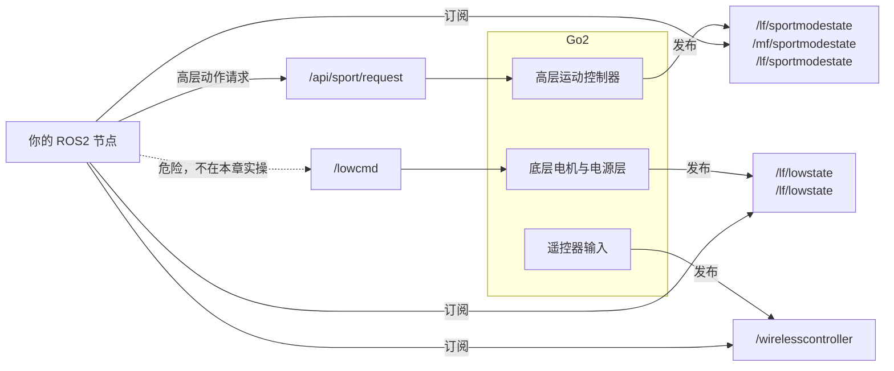

# 第 2 章 认识 Go2 消息接口

> 上一章你已经把电脑和 Go2 连起来了。这一章要做的事，是把那些看起来像黑话的 Topic 真正拆开：谁在发布、谁在订阅、哪些能安全动手、哪些现在只准认识名字。

## 本章你将学到

- ROS2 的 Topic、消息类型和 Go2 的高层 / 低层接口到底怎么对应
- 为什么 `/lf/sportmodestate`、`/lf/lowstate`、`/wirelesscontroller` 是三类完全不同的信息
- 怎样用最小 Python 节点订阅 `/lf/sportmodestate` 和 `/wirelesscontroller`
- 怎样向 `/api/sport/request` 发送一条最简单、相对安全的高层动作指令
- 为什么新手阶段只介绍 `/lowcmd`，但绝不在本章实操发送它

## 背景与原理

### Topic、消息和机器人接口是什么关系

到这一章为止，你已经知道 ROS2 节点之间主要通过 Topic 通信。

但在 Go2 场景里，Topic 不只是“频道”，它通常还自带接口层级。

比如：

- `/lf/sportmodestate` 更像“高层运动状态出口”
- `/lf/lowstate` 更像“底层电机和电源状态出口”
- `/wirelesscontroller` 反映的是遥控器输入
- `/api/sport/request` 是高层动作入口
- `/lowcmd` 是底层电机控制入口

如果你不先把这些 Topic 放回它们所属的层级，后面最容易发生的事情就是：

- 看到 `/lf/lowstate` 觉得“信息更全，直接用它吧”
- 看到 `/lowcmd` 觉得“名字高级，直接发它应该更专业”
- 把“高层动作接口”和“底层电机接口”混成一类

而这几件事，恰恰是 Go2 新手最容易踩的大坑。

### 为什么 Go2 要把高层接口和低层接口分开

四足机器人不是小车，也不是舵机玩具。

当 Go2 在站立、起身、坐下、转向、走路时，它内部一直在做平衡和姿态控制。为了让开发者不必一上来就面对整套电机级控制问题，官方把接口切成了两层：

| 层级 | 你发的是什么 | 机器人内部替你做了什么 |
|---|---|---|
| 高层接口 | “站起来”“趴下”“往前走”“转一下”这类意图 | 平衡、步态、姿态稳定、动作编排 |
| 低层接口 | 每个电机怎么转、用多少增益、给多少扭矩 | 基本不帮你兜底，更多责任落到你自己身上 |

所以本章的核心不是“把所有接口都试一遍”，而是先建立一个正确判断：

**前期学习主线，用高层接口；低层接口先理解结构和风险，不碰实操。**

### 为什么“能看到消息”和“看懂消息”不是一回事

上一章你已经能用 `ros2 topic echo /lf/sportmodestate --once` 抓到一帧数据。

但“抓到了”只是第一步。

你真正要学会的是：

- 看到这个字段时，它是姿态、速度、步态，还是电池、温度、按键输入
- 这个 Topic 更适合拿来做监控、控制前反馈，还是底层诊断
- 这个入口现在能不能直接拿来发控制命令

从这一章开始，我们就要把“看得到”升级成“看得懂、敢判断、知道边界”。

## 架构总览

先把最核心的 Topic 放进一张图里：



把这张图翻译成一句话就是：

- 想知道机器人“整体正在怎么动”，先看 `/lf/sportmodestate`
- 想知道底层电机、电池、足端力这些更靠近硬件的状态，再看 `/lf/lowstate`
- 想知道手柄摇杆和按键在干嘛，看 `/wirelesscontroller`
- 想让机器人执行基础动作，走 `/api/sport/request`
- 想直接碰电机层，才会碰到 `/lowcmd`

## 环境准备

这一章不需要额外安装新环境，直接复用上一章已经搭好的链路：

| 你现在应该已经有的东西 | 作用 |
|---|---|
| `unitree_ros2` 官方环境 | 提供 `unitree_go` 和 `unitree_api` 的消息定义 |
| `unitree_go2_ws` | 放你这一章新建的练习包 |
| `setup.sh` | 让当前终端进入 Go2 真机通信环境 |
| 真机在线的 Go2 | 这章的大部分验证都依赖真机消息流 |

如果你上一章的 `hello_sport_state` 还能跑，说明这章的前置条件已经具备。

!!! tip "本章最好的打开方式"
    准备两个终端：一个专门跑 `ros2 topic` 命令观察系统，一个专门跑你自己的节点。这样你很容易看清“系统本来就在发什么”和“我的程序做了什么”之间的区别。

## 实现步骤

### 步骤一：先用 ROS2 CLI 看清楚你手里有哪些核心 Topic

先加载官方环境：

```bash
# 进入 Go2 真机通信环境
source ~/unitree_ros2/setup.sh
```

然后列出所有话题，并只过滤本章最关键的几个：

```bash
# 先列全部，再用 grep 缩小范围
ros2 topic list
ros2 topic list | grep -E 'sportmodestate|lowstate|wirelesscontroller|request'
```

你大概率会看到下面这些名字：

- `/lf/sportmodestate`
- `/mf/sportmodestate`
- `/lf/sportmodestate`
- `/lf/lowstate`
- `/lf/lowstate`
- `/wirelesscontroller`
- `/api/sport/request`

这一步虽然看起来简单，但非常关键。

因为你后面写代码时，真正该订阅和发布什么，不是凭印象选，而是要先用 CLI 把系统实际在线的话题看清楚。

### 步骤二：先认识 `/lf/sportmodestate`

高层状态是本章的主角。

先看它的三档频率：

```bash
# 查看高层状态的三个常用话题
ros2 topic hz /lf/sportmodestate
ros2 topic hz /mf/sportmodestate
ros2 topic hz /lf/sportmodestate
```

从已有材料和官方示例可以归纳出下面这张表：

| 话题 | 典型频率 | 适合做什么 |
|---|---|---|
| `/lf/sportmodestate` | 20Hz 左右 | 人眼观察、调试日志、低频监控 |
| `/mf/sportmodestate` | 200Hz 左右 | 中频控制与调试 |
| `/lf/sportmodestate` | 500Hz 左右 | 高频状态反馈、精确观察 |

再确认消息类型：

```bash
# 高层状态对应的消息类型
ros2 topic type /lf/sportmodestate
ros2 interface show unitree_go/msg/SportModeState
```

你会看到它的核心字段大致包括：

| 字段名 | 含义 | 单位 | 范围 |
|---|---|---|---|
| `stamp.sec` / `stamp.nanosec` | 这帧状态的时间戳 | 秒 / 纳秒 | 随时间增长 |
| `mode` | 当前高层运动模式 | — | 枚举值 |
| `progress` | 某些动作的执行进度 | — | 0.0 到 1.0 |
| `gait_type` | 当前步态类型 | — | 枚举值 |
| `position[3]` | 机身在里程计坐标系下的位置 | 米 | 取决于场地与运动 |
| `body_height` | 当前机身高度 | 米 | 取决于姿态和动作 |
| `velocity[3]` | 机身线速度 | 米/秒 | 取决于当前动作 |
| `yaw_speed` | 偏航角速度 | 弧度/秒 | 取决于当前动作 |
| `foot_position_body[12]` | 四条腿在机身坐标系下的足端位置 | 米 | 12 维数组 |
| `foot_speed_body[12]` | 四条腿在机身坐标系下的足端速度 | 米/秒 | 12 维数组 |

这张表里最值得你先记住的，不是全部字段，而是三组最常用信息：

1. `position` / `velocity` / `yaw_speed`：整体运动状态
2. `mode` / `gait_type`：当前控制器处于什么状态
3. `foot_position_body` / `foot_speed_body`：更细一点的足端信息

!!! note "时间戳别看成“北京时间”"
    `stamp` 在这里是消息时间戳，不会长得像“2026-04-20 14:30:00”这种字符串。你先把它理解成“这一帧是什么时刻来的”，而不是拿它当可读日期。

### 步骤三：再认识 `/lf/lowstate`

`/lf/lowstate` 不是更“高级”的状态，而是更“底层”的状态。

先确认消息类型：

```bash
# 低层状态对应的消息类型
ros2 topic type /lf/lowstate
ros2 interface show unitree_go/msg/LowState
```

相比 `/lf/sportmodestate`，`/lf/lowstate` 的关注点明显更靠近硬件：

| 字段名 | 含义 | 单位 | 范围 |
|---|---|---|---|
| `imu_state` | IMU 原始姿态与惯性信息 | 混合 | 取决于运动状态 |
| `motor_state[i].q` | 第 `i` 个电机的关节角度 | 弧度 | 取决于关节位置 |
| `motor_state[i].dq` | 第 `i` 个电机的角速度 | 弧度/秒 | 取决于当前动作 |
| `motor_state[i].tau_est` | 第 `i` 个电机的估计力矩 | — | 取决于负载和动作 |
| `motor_state[i].temperature` | 第 `i` 个电机温度 | 摄氏度 | 随负载变化 |
| `foot_force[4]` | 四足接触力 | — | 4 维数组 |
| `bms_state.soc` | 电池剩余电量百分比 | % | 0 到 100 |
| `power_v` | 电池电压 | V | 随电量变化 |
| `power_a` | 当前电流 | A | 随动作负载变化 |

`/lf/lowstate` 很有用，但它和 `/lf/sportmodestate` 的定位不同。

如果你现在只是想判断“机器人整体有没有站稳、有没有在前进、当前位置和速度是多少”，高层状态更顺手。

如果你已经在做电机级诊断、温度观察、底层驱动联调，那才会更频繁地盯 `/lf/lowstate`。

### 步骤四：认识 `/wirelesscontroller`

遥控器状态看起来最简单，但它很实用。

先确认它的消息类型：

```bash
# 遥控器状态只有一个核心话题
ros2 topic type /wirelesscontroller
ros2 interface show unitree_go/msg/WirelessController
```

这个消息很短，核心字段只有下面这些：

| 字段名 | 含义 | 单位 | 范围 |
|---|---|---|---|
| `lx` | 左摇杆横向值 | — | 约 -1.0 到 1.0 |
| `ly` | 左摇杆纵向值 | — | 约 -1.0 到 1.0 |
| `rx` | 右摇杆横向值 | — | 约 -1.0 到 1.0 |
| `ry` | 右摇杆纵向值 | — | 约 -1.0 到 1.0 |
| `keys` | 按键状态位掩码 | — | 16 位整型 |

这类消息特别适合做两件事：

- 把手柄输入转换成你自己的控制逻辑
- 调试“我刚刚推了摇杆，系统有没有真的收到”

按键位的完整定义在官方 SDK 文档和后续进阶实践里会更常见，本章不要求你把它背下来。

你现在先知道：**这是一条遥控器输入状态流，不是运动状态流，也不是控制命令流。**

### 步骤五：在教程工作空间里创建 `go2_topics_py`

这一章我们不再复用上一章的 `go2_hello_py`，而是单独建一个更贴近“消息接口练习”的包。

```bash
# 在教程工作空间里新建一个专门练消息接口的 Python 包
cd ~/unitree_go2_ws/src
ros2 pkg create go2_topics_py \
    --build-type ament_python \
    --dependencies rclpy unitree_go unitree_api
```

这个包里我们会放三类脚本：

- `print_sport_state.py`：看高层状态
- `print_controller.py`：看遥控器输入
- `send_sport_request.py`：发一条最简单的高层动作请求

### 步骤六：写一个真正能看懂 `/lf/sportmodestate` 的节点

先在 `go2_topics_py/go2_topics_py/print_sport_state.py` 里写一个比上一章稍微更完整的版本。

接下来这段代码会打印位置、速度、偏航角速度、步态类型和机身高度。

```python
import rclpy                                       # ROS2 Python 客户端库
from rclpy.node import Node                        # 自定义节点的基类
from unitree_go.msg import SportModeState          # Go2 高层运动状态消息


class SportStatePrinter(Node):
    def __init__(self) -> None:
        super().__init__("sport_state_printer")
        self.last_log_ns = 0

        self.subscription = self.create_subscription(
            SportModeState,
            "/lf/sportmodestate",
            self.on_state,
            10,
        )

    def on_state(self, msg: SportModeState) -> None:
        now_ns = self.get_clock().now().nanoseconds
        if now_ns - self.last_log_ns < 200_000_000:
            return

        self.last_log_ns = now_ns
        self.get_logger().info(
            f"mode={msg.mode} gait={msg.gait_type} "
            f"pos=({msg.position[0]:.2f}, {msg.position[1]:.2f}, {msg.position[2]:.2f}) "
            f"vel=({msg.velocity[0]:.2f}, {msg.velocity[1]:.2f}, {msg.velocity[2]:.2f}) "
            f"yaw={msg.yaw_speed:.2f} height={msg.body_height:.2f}"
        )


def main() -> None:
    rclpy.init()
    node = SportStatePrinter()
    try:
        rclpy.spin(node)
    finally:
        node.destroy_node()
        rclpy.shutdown()


if __name__ == "__main__":
    main()
```

这段代码和上一章的 hello 版相比，多做了两件事：

1. 把 `mode` 和 `gait_type` 一起打出来，开始让你建立“当前控制器状态”意识
2. 把 `body_height` 也带上，方便后面理解姿态和站立状态变化

### 步骤七：再写一个遥控器状态节点

在 `go2_topics_py/go2_topics_py/print_controller.py` 中写入：

```python
import rclpy                                       # ROS2 Python 客户端库
from rclpy.node import Node                        # 自定义节点的基类
from unitree_go.msg import WirelessController      # 遥控器输入消息


class ControllerPrinter(Node):
    def __init__(self) -> None:
        super().__init__("controller_printer")
        self.last_log_ns = 0

        self.subscription = self.create_subscription(
            WirelessController,
            "/wirelesscontroller",
            self.on_message,
            10,
        )

    def on_message(self, msg: WirelessController) -> None:
        now_ns = self.get_clock().now().nanoseconds
        if now_ns - self.last_log_ns < 200_000_000:
            return

        self.last_log_ns = now_ns
        self.get_logger().info(
            f"lx={msg.lx:+.2f} ly={msg.ly:+.2f} "
            f"rx={msg.rx:+.2f} ry={msg.ry:+.2f} keys=0x{msg.keys:04x}"
        )


def main() -> None:
    rclpy.init()
    node = ControllerPrinter()
    try:
        rclpy.spin(node)
    finally:
        node.destroy_node()
        rclpy.shutdown()


if __name__ == "__main__":
    main()
```

这个脚本的重点不是“打印更多字”，而是帮你建立一个判断：

当你推摇杆、按按键时，系统到底有没有把这些输入原样收到。

后面你做键盘控制、语音控制、动作编排时，这种“输入是不是先被正确采到”的判断非常有用。

### 步骤八：认识高层动作入口 `/api/sport/request`

状态看明白之后，才轮到控制入口。

先用 CLI 确认接口类型：

```bash
# 看高层动作请求使用什么消息类型
ros2 topic type /api/sport/request
ros2 interface show unitree_api/msg/Request
```

`Request` 消息真正最关键的部分，其实就三样：

| 字段名 | 含义 | 单位 | 范围 |
|---|---|---|---|
| `header.identity.api_id` | 要执行哪类高层动作 | — | 取决于具体 API |
| `parameter` | 这条动作的参数，通常是 JSON 字符串 | — | 取决于动作 |
| `binary` | 二进制扩展参数 | — | 本章不用 |

`api_id` 就像“动作编号”，而 `parameter` 就像“动作参数”。

在本章里，我们只挑最简单、最安全的一类：**无参数基础动作**。

下面这些 API ID 你现在就应该先认识：

| API ID | 指令名 | 作用 | 参数格式 |
|---|---|---|---|
| `1002` | `BALANCESTAND` | 平衡站立 | 无 |
| `1003` | `STOPMOVE` | 停止运动 | 无 |
| `1004` | `STANDUP` | 站起来 | 无 |
| `1005` | `STANDDOWN` | 趴下 | 无 |
| `1006` | `RECOVERYSTAND` | 恢复站立 | 无 |
| `1008` | `MOVE` | 高层移动控制 | `{"x":vx,"y":vy,"z":vyaw}` |
| `1016` | `HELLO` | 打招呼动作 | 无 |

这里最容易记错的是：有些动作没有参数，比如 `STANDUP` 和 `STANDDOWN`；有些动作需要 JSON 参数，比如 `MOVE`。

### 步骤九：用最小脚本发一条安全的高层动作

在 `go2_topics_py/go2_topics_py/send_sport_request.py` 中写一个只负责发送“站起 / 趴下”的最小脚本。

这一版故意写得很克制：不发连续速度，只发单次基础动作。

```python
import sys                                         # 读取命令行参数

import rclpy                                       # ROS2 Python 客户端库
from rclpy.node import Node                        # 自定义节点的基类
from unitree_api.msg import Request                # Go2 高层动作请求消息

ACTION_IDS = {"stand_up": 1004, "stand_down": 1005}


class SportRequestOnce(Node):
    def __init__(self, action: str) -> None:
        super().__init__("sport_request_once")
        self.action = action
        self.sent = False
        self.publisher = self.create_publisher(Request, "/api/sport/request", 10)
        self.timer = self.create_timer(0.5, self.send_once)

    def send_once(self) -> None:
        if self.sent:
            rclpy.shutdown()
            return

        msg = Request()
        msg.header.identity.api_id = ACTION_IDS[self.action]
        self.publisher.publish(msg)
        self.get_logger().info(f"sent action: {self.action}")
        self.sent = True


def main() -> None:
    if len(sys.argv) != 2 or sys.argv[1] not in ACTION_IDS:
        raise SystemExit("usage: send_sport_request [stand_up|stand_down]")

    rclpy.init()
    rclpy.spin(SportRequestOnce(sys.argv[1]))


if __name__ == "__main__":
    main()
```

这个脚本虽然短，但已经把高层动作请求的核心逻辑讲明白了：

- 通过 `Request` 消息发动作
- 真正关键的是 `header.identity.api_id`
- `stand_up` 和 `stand_down` 这类动作不需要额外参数

!!! warning "第一次发高层动作前先看一眼周围"
    这一节虽然只让你发最基础的 `stand_up` / `stand_down`，但它们依然是真实的实机动作。先确认机器人周围空旷、遥控器在手、你知道下一步怎么停，再执行。

### 步骤十：只介绍 `/lowcmd`，但不在本章实操

先看它是什么：

```bash
# 底层电机控制入口
ros2 topic type /lowcmd
ros2 interface show unitree_go/msg/LowCmd
```

从消息结构上看，`LowCmd` 的核心部分大概是：

| 字段名 | 含义 | 单位 | 范围 |
|---|---|---|---|
| `motor_cmd[i].mode` | 第 `i` 个电机的控制模式 | — | 枚举值 |
| `motor_cmd[i].q` | 目标关节角度 | 弧度 | 取决于关节 |
| `motor_cmd[i].dq` | 目标关节角速度 | 弧度/秒 | 取决于关节 |
| `motor_cmd[i].tau` | 目标扭矩前馈 | — | 取决于控制策略 |
| `motor_cmd[i].kp` | 位置环增益 | — | 取决于控制策略 |
| `motor_cmd[i].kd` | 速度环增益 | — | 取决于控制策略 |
| `led[12]` | 低层消息里携带的灯光字段 | — | 12 字节数组 |
| `crc` | 校验字段 | — | 32 位整型 |

光看这个表你就应该能感觉到：这已经不是“发一个动作编号”的层级了。

你现在不仅要知道自己想让机器人做什么，还要知道每个电机命令字段意味着什么，彼此之间怎么配合，CRC 怎么算，当前控制模式和上层运动控制是否冲突。

!!! danger "本书前 9 章不实操 `/lowcmd`"
    这不是卖关子，而是安全边界。真实踩坑里，曾经出现过为了改灯光去碰底层消息，结果把零值电机命令一起发出去，最后导致关节持续对抗发热、机器人摔倒的事故。所以本章只带你认识它，不给发送代码，不鼓励“先发一条试试”。

### 步骤十一：注册入口并编译 `go2_topics_py`

打开 `go2_topics_py/setup.py`，把入口注册成下面这样：

```python
entry_points={
    "console_scripts": [
        "print_sport_state = go2_topics_py.print_sport_state:main",
        "print_controller = go2_topics_py.print_controller:main",
        "send_sport_request = go2_topics_py.send_sport_request:main",
    ],
},
```

然后回到工作空间根目录，编译这个包：

```bash
# 先加载官方环境，再编译消息练习包
source ~/unitree_ros2/setup.sh
cd ~/unitree_go2_ws
colcon build --packages-select go2_topics_py
source install/setup.bash
```

到这里，你这一章的三个练习脚本都已经变成可运行节点了。

## 编译与运行

建议你按下面这个顺序完整跑一遍：

```bash
# 1. 加载 Go2 真机环境
source ~/unitree_ros2/setup.sh

# 2. 加载教程工作空间
cd ~/unitree_go2_ws
source install/setup.bash

# 3. 看高层状态
ros2 run go2_topics_py print_sport_state
```

再开一个新终端，看遥控器输入：

```bash
source ~/unitree_ros2/setup.sh
cd ~/unitree_go2_ws
source install/setup.bash
ros2 run go2_topics_py print_controller
```

确认这两条链路都通了之后，再执行最小高层动作：

```bash
# 让 Go2 趴下
source ~/unitree_ros2/setup.sh
cd ~/unitree_go2_ws
source install/setup.bash
ros2 run go2_topics_py send_sport_request stand_down

# 再让 Go2 站起来
ros2 run go2_topics_py send_sport_request stand_up
```

如果你想对照官方示例，也可以额外运行下面这些：

```bash
# 官方高层状态示例
source ~/unitree_ros2/setup.sh
cd ~/unitree_ros2/example
./install/unitree_ros2_example/bin/read_motion_state

# 官方遥控器状态示例
./install/unitree_ros2_example/bin/read_wireless_controller

# 官方高层运动示例（例如 3=stand_down, 4=stand_up）
./install/unitree_ros2_example/bin/go2_sport_client 3
```

这组官方示例不是本章主线必须，但它很适合拿来对照“是我自己的脚本有问题，还是官方环境本身就没通”。

## 结果验证

本章完成后，你应该能稳定做到下面这几件事：

1. 看懂 `/lf/sportmodestate` 和 `/lf/lowstate` 的分工差异
2. 推一下摇杆时，`print_controller` 会在终端里看到对应的 `lx/ly/rx/ry` 变化
3. 运行 `send_sport_request stand_down` 后，Go2 会执行一次趴下动作
4. 你能清楚说出：为什么本章只介绍 `/lowcmd`，但不实操发送

媒体建议先记在这里，后面统一补：

<!-- TODO(媒体): 补一张 print_sport_state 终端输出截图，显示 mode、gait、pos、vel 等字段 -->
<!-- TODO(媒体): 补一张 print_controller 终端输出截图，推摇杆后 lx/ly/rx/ry 数值发生变化 -->
<!-- TODO(媒体): 录制 stand_down -> stand_up 的最小高层动作演示 GIF -->

## 常见问题

### `print_sport_state` 一直没有输出

先别改脚本，先做三件事：

1. 运行 `ros2 topic echo /lf/sportmodestate --once`
2. 运行 `ros2 topic type /lf/sportmodestate`
3. 回头确认上一章的 `setup.sh`、网卡和 Go2 连通性

如果 CLI 本身都拿不到数据，你自己的节点大概率也拿不到。

### `print_controller` 没反应，但机器人能动

这种情况通常说明你验证方式不对，或者当前遥控器输入没有被你预期地采到。

先用：

```bash
ros2 topic echo /wirelesscontroller
```

确认这条状态流本身是否在线，再判断是不是你脚本的打印节流写得太保守。

### 我能不能直接从这一章开始玩 `/lowcmd`

不建议。

你现在还在打基础，最重要的是把“消息层级”和“实机边界”吃透。直接跳到底层控制，得到的通常不是更快的进步，而是更快地把问题和风险放大。

### 为什么我发了高层动作，机器人动了一下又回到平衡站立？

这正是高层动作接口的一部分特点。

很多动作是“请求执行某个动作”，而不是“永久切到某个控制模式”。所以你会看到执行完成后，系统回到更稳定的状态。

### 我看到 `keys` 是一个整数，看不懂具体哪个按键按下了怎么办？

先别急着硬背位定义。

本章的重点不是完整遥控器协议，而是建立一个判断：**手柄输入有没有进系统、摇杆值有没有变化、按键状态有没有变化。**

## 本章小结

这一章真正完成的，不是“又多会了几个命令”，而是把 Go2 的核心消息接口按层级拆开了：

- `/lf/sportmodestate` 看整体运动状态
- `/lf/lowstate` 看更底层的电机和电源状态
- `/wirelesscontroller` 看手柄输入
- `/api/sport/request` 发高层动作
- `/lowcmd` 只认识结构，不在新手阶段实操

从这一章开始，你看 Topic 就不再只是看名字，而是会开始判断“它属于哪一层、我现在该不该碰、碰了之后应该看到什么现象”。

## 下一步

下一章我们就不只盯着接口看了，而是开始做第一个更像“功能模块”的节点：用键盘直接操控 Go2，让 Topic、消息和动作第一次变成你可直观感受到的交互效果。

继续阅读：[第 3 章 键盘控制节点](../02-packages/03-keyboard.md)

## 拓展阅读

- [ROS2 Topic 官方文档](https://docs.ros.org/en/humble/Tutorials/Beginner-CLI-Tools/Understanding-ROS2-Topics/Understanding-ROS2-Topics.html)
- [Unitree `unitree_ros2` 仓库](https://github.com/unitreerobotics/unitree_ros2)
- [Unitree 官方开发者文档](https://support.unitree.com/)

??? note "附:C++ 实现"
    本章只要求正文主线用 Python。如果你想顺手对照一版 C++ 的高层状态订阅，可以参考下面这个最小版本。

    ```cpp
    #include "rclcpp/rclcpp.hpp"
    #include "unitree_go/msg/sport_mode_state.hpp"

    class SportStatePrinter : public rclcpp::Node {
     public:
      SportStatePrinter() : Node("sport_state_printer") {
        subscription_ = this->create_subscription<unitree_go::msg::SportModeState>(
            "/lf/sportmodestate", 10,
            [this](const unitree_go::msg::SportModeState::SharedPtr msg) {
              RCLCPP_INFO(
                  this->get_logger(),
                  "mode=%u gait=%u pos=(%.2f, %.2f, %.2f) vel=(%.2f, %.2f, %.2f) yaw=%.2f height=%.2f",
                  msg->mode, msg->gait_type,
                  msg->position[0], msg->position[1], msg->position[2],
                  msg->velocity[0], msg->velocity[1], msg->velocity[2],
                  msg->yaw_speed, msg->body_height);
            });
      }

     private:
      rclcpp::Subscription<unitree_go::msg::SportModeState>::SharedPtr subscription_;
    };

    int main(int argc, char **argv) {
      rclcpp::init(argc, argv);
      rclcpp::spin(std::make_shared<SportStatePrinter>());
      rclcpp::shutdown();
      return 0;
    }
    ```

    这一版和 Python 版的核心区别只有两点：

    - 消息字段通过 `msg->field` 访问
    - 你需要自己补 `CMakeLists.txt` 和 `package.xml` 的依赖声明
