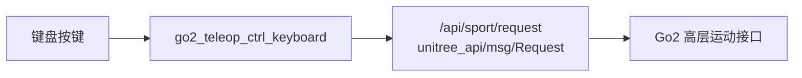
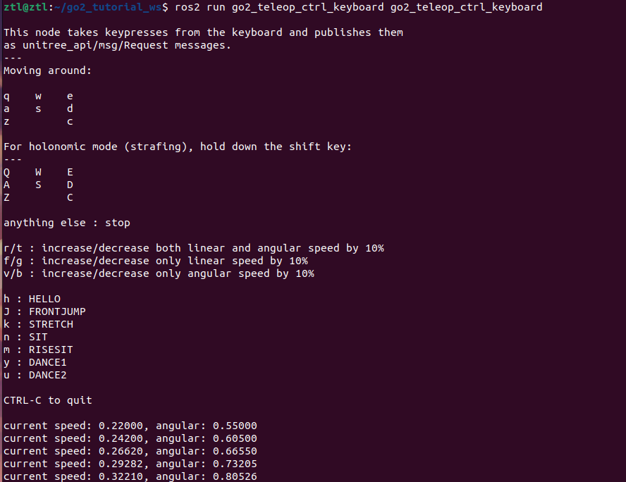

# 第 3 章 键盘控制节点

> 上一章我们已经认识了 Go2 的高层控制消息。这一章开始写第一个真正“能上手玩起来”的节点:你按下键盘，节点就把按键翻译成 `Request`，再直接发给 Go2。

## 本章你将学到

- 看懂 `go2_teleop_ctrl_keyboard` 这类终端遥控节点的基本结构
- 理解 `termios`、`tty`、`threading` 在“边读键盘边跑 ROS2”里的分工
- 掌握当前源码里的真实键位映射，而不是方向键那套旧口径

## 背景与原理

键盘控制节点的本质其实很朴素:它仍然是一个 Publisher。

不同的地方只在于，它的输入不来自传感器，也不来自另一个 ROS2 节点，而是来自终端里的按键事件。我们按了哪个键，节点就决定要往 `/api/sport/request` 发什么 `unitree_api/msg/Request`。

这件事听起来简单，真正写起来会有两个坑。

第一个坑是，普通的 `input()` 要等你按回车，根本不适合遥控。我们要的是“按下去立刻生效”，所以要用 `termios` 和 `tty` 把终端切到原始输入模式。

第二个坑是，ROS2 节点本身还得继续 `spin()`。所以源码用了一个子线程去跑 `rclpy.spin()`，主线程专门负责读键盘。这样两边才不会互相堵住。

## 架构总览



这条链路里没有 `/cmd_vel`，也没有中间桥接节点。

也就是说，第 3 章和第 4 章虽然都能“遥控 Go2”，但思路完全不同:

- 第 3 章直接发 Go2 专有 `Request`
- 第 4 章先发 `Twist`，再由桥接节点转成 `Request`

## 环境准备

当前工作空间里，键盘包已经放在 `src/base/go2_teleop_ctrl_keyboard/` 下。你先记住三个名字:

| 项目 | 真名 |
|---|---|
| 包名 | `go2_teleop_ctrl_keyboard` |
| 节点名 | `teleop_ctrl_keyboard` |
| 可执行入口 | `go2_teleop_ctrl_keyboard` |

这章后面所有编译和运行命令，都按这个口径来。

如果你想先确认可执行入口有没有注册对，可以看 `setup.py` 里的 `console_scripts`:

```python
package_name = "go2_teleop_ctrl_keyboard"

entry_points = {
    "console_scripts": [
        "go2_teleop_ctrl_keyboard = "
        "go2_teleop_ctrl_keyboard.go2_teleop_ctrl_keyboard:main",
    ],
}
```

## 实现步骤

### 步骤一:先把按键说明看懂

源码最上面有一段帮助字符串，节点启动时就会先打印它。里面最重要的是三组按键:

- 移动键
- 调速键
- 动作键

先把真实映射表记清楚:

| 类别 | 按键 | 实际行为 |
|---|---|---|
| 移动 | `q w e` | 前左转、前进、前右转 |
| 移动 | `a s d` | 左转、后退、右转 |
| 移动 | `z c` | 后右转、后左转 |
| 平移/全向 | `Q W E` | 前左平移、前进、前右平移 |
| 平移/全向 | `A S D` | 左平移、后退、右平移 |
| 平移/全向 | `Z C` | 后左平移、后右平移 |
| 调速 | `r / t` | 总线速度和角速度同时 `+10% / -10%` |
| 调速 | `f / g` | 只调线速度 `+10% / -10%` |
| 调速 | `v / b` | 只调角速度 `+10% / -10%` |
| 动作 | `h` | `HELLO` |
| 动作 | `J` | `FRONTJUMP` |
| 动作 | `k` | `STRETCH` |
| 动作 | `n` | `SIT` |
| 动作 | `m` | `RISESIT` |
| 动作 | `y` | `DANCE1` |
| 动作 | `u` | `DANCE2` |
| 退出 | `Ctrl-C` | 退出节点 |

!!! warning "别再用方向键那套旧口径了"
    当前仓库的真实按键映射是 `qwe/asd/zc` 这一套九宫格风格，不是方向键、`Space`、`+/-`。如果你照旧资料去按，节点当然不会按你预期响应。

这里还有一个很细的源码事实:当前代码里并没有单独给 `X` 绑定全向后退键，真正有绑定的是 `Q/W/E/A/S/D/Z/C` 这 8 个大写键。

### 步骤二:看懂三张映射表

接下来这段代码是整章的核心，它把“键盘字符”映射成“Go2 动作”。

把下面这几段对应到 `go2_teleop_ctrl_keyboard.py` 去看:

```python
sportModel = {
    "h": ROBOT_SPORT_API_IDS["HELLO"],
    "J": ROBOT_SPORT_API_IDS["FRONTJUMP"],
    "k": ROBOT_SPORT_API_IDS["STRETCH"],
    "n": ROBOT_SPORT_API_IDS["SIT"],
    "m": ROBOT_SPORT_API_IDS["RISESIT"],
    "y": ROBOT_SPORT_API_IDS["DANCE1"],
    "u": ROBOT_SPORT_API_IDS["DANCE2"],
}

moveBindings = {
    "w": (1, 0, 0, 0),
    "e": (1, 0, 0, -1),
    "a": (0, 0, 0, 1),
    "d": (0, 0, 0, -1),
    "q": (1, 0, 0, 1),
    "s": (-1, 0, 0, 0),
    "c": (-1, 0, 0, 1),
    "z": (-1, 0, 0, -1),
    "E": (1, -1, 0, 0),
    "W": (1, 0, 0, 0),
    "A": (0, 1, 0, 0),
    "D": (0, -1, 0, 0),
    "Q": (1, 1, 0, 0),
    "S": (-1, 0, 0, 0),
    "C": (-1, -1, 0, 0),
    "Z": (-1, 1, 0, 0),
}

speedBindings = {
    "r": (1.1, 1.1),
    "t": (0.9, 0.9),
    "f": (1.1, 1),
    "g": (0.9, 1),
    "v": (1, 1.1),
    "b": (1, 0.9),
}
```

这三张表分工很清楚:

- `sportModel` 负责“按一下就触发某个离散动作”
- `moveBindings` 负责“移动方向和旋转方向”
- `speedBindings` 负责“把当前速度乘一个系数”

也正因为源码是“乘系数”，不是“设绝对值”，所以你连续按几次 `r`，速度会一档一档往上加。

### 步骤三:看懂节点本体怎么发消息

映射表有了之后，节点本体要做的事就简单很多。

先看节点初始化部分:

```python
class TeleopNode(Node):
    def __init__(self):
        super().__init__("teleop_ctrl_keyboard")
        self.pub = self.create_publisher(Request, "/api/sport/request", 10)
        self.declare_parameter("speed", 0.2)
        self.declare_parameter("angular", 0.5)

        self.speed = self.get_parameter("speed").value
        self.angular = self.get_parameter("angular").value

    def publish(self, api_id, x=0.0, y=0.0, z=0.0):
        req = Request()
        req.header.identity.api_id = api_id
        req.parameter = json.dumps({"x": x, "y": y, "z": z})
        self.pub.publish(req)
```

这段代码里要记两个点。

第一，节点名是 `teleop_ctrl_keyboard`，不是 `keyboard`。你后面如果用 `ros2 node list` 看节点，一定会看到这个名字。

第二，它发布的始终是 `Request`，不是 `Twist`。所以第 3 章是 Go2 专有接口路线，第 4 章才是 ROS2 标准速度路线。

### 步骤四:主循环是怎么读键盘的

真正让“按一下就生效”的，是下面这套循环:

```python
def getkey(settings):
    tty.setraw(sys.stdin.fileno())
    key = sys.stdin.read(1)
    termios.tcsetattr(sys.stdin, termios.TCSADRAIN, settings)
    return key


def main():
    print(msg)
    settings = termios.tcgetattr(sys.stdin)

    rclpy.init()
    teleop_node = TeleopNode()
    spinner = threading.Thread(target=rclpy.spin, args=(teleop_node,))
    spinner.start()

    try:
        while True:
            key = getkey(settings)

            if key == "\x03":
                break
            elif key in sportModel:
                teleop_node.publish(sportModel[key])
            elif key in moveBindings:
                x_bind = moveBindings[key][0]
                y_bind = moveBindings[key][1]
                z_bind = moveBindings[key][3]
                teleop_node.publish(
                    ROBOT_SPORT_API_IDS["MOVE"],
                    x=x_bind * teleop_node.speed,
                    y=y_bind * teleop_node.speed,
                    z=z_bind * teleop_node.angular,
                )
            elif key in speedBindings:
                s_bind = speedBindings[key][0]
                a_bind = speedBindings[key][1]
                teleop_node.speed = s_bind * teleop_node.speed
                teleop_node.angular = a_bind * teleop_node.angular
                print(
                    "current speed: %.5f, angular: %.5f"
                    % (teleop_node.speed, teleop_node.angular)
                )
            else:
                teleop_node.publish(ROBOT_SPORT_API_IDS["BALANCESTAND"])
    finally:
        rclpy.shutdown()
```

你不用一口气把每行都背下来，先记住流程就够了:

1. 先把终端切到原始模式，读一个字符
2. ROS2 节点放到子线程去 `spin()`
3. 主线程一直循环读键
4. 根据按键去查三张映射表
5. 查不到就发 `BALANCESTAND`，相当于“停住”

这里的“未知按键就停住”，是很典型的遥控保护思路。因为实时控制里，安全默认值应该是“停”，不是“继续沿用上一次命令”。

## 编译与运行

先把键盘包编译掉:

```bash
# 编译键盘遥控包，并重新加载环境
cd ~/unitree_go2_ws
colcon build --packages-select go2_teleop_ctrl_keyboard
source install/setup.bash
```

第一终端启动键盘节点:

```bash
# 启动键盘遥控节点
cd ~/unitree_go2_ws
source install/setup.bash
ros2 run go2_teleop_ctrl_keyboard go2_teleop_ctrl_keyboard
```

第二终端观察节点到底发了什么消息:

```bash
# 观察 /api/sport/request
cd ~/unitree_go2_ws
source install/setup.bash
ros2 topic echo /api/sport/request
```

如果你想先保守一点，可以在启动时把速度调小:

```bash
# 把默认线速度和角速度调低一点
cd ~/unitree_go2_ws
source install/setup.bash
ros2 run go2_teleop_ctrl_keyboard go2_teleop_ctrl_keyboard \
  --ros-args -p speed:=0.1 -p angular:=0.2
```

!!! danger "第一次实机测试键盘时先小步试"
    键盘控制最容易出现的问题不是“代码错”，而是你按快了、速度给大了。第一次上真机时，先把 `speed` 和 `angular` 压低，短按单个方向键，侧后方站人，手里握好急停。

## 结果验证

这一章跑通后，你应该能稳定看到这些现象:

1. `ros2 run go2_teleop_ctrl_keyboard go2_teleop_ctrl_keyboard` 能启动，并打印按键帮助
2. 按 `q/w/e/a/s/d/z/c` 时，`/api/sport/request` 里的 `api_id` 会切到 `MOVE`
3. 按 `h/J/k/n/m/y/u` 时，`api_id` 会切到对应动作
4. 按 `r/t/f/g/v/b` 时，终端会打印新的 `speed` 和 `angular`

推荐用下面两条命令交叉验证:

```bash
# 看节点是不是已经起来
ros2 node list

# 看请求消息是不是正在变化
ros2 topic echo /api/sport/request --once
```

{ width="600" }

## 常见问题

### 1. 按键没反应

**现象**:节点看起来启动了，但按键没有任何效果。

**原因**:最常见的是当前终端焦点不在运行键盘节点的那个窗口里。

**解决**:

- 直接点回运行 `ros2 run` 的终端
- 再按一次 `w` 或 `h`
- 同时观察另一个终端里的 `/api/sport/request`

### 2. 退出后终端回显乱了

**现象**:按 `Ctrl-C` 退出后，终端打字不回显或显示异常。

**原因**:原始模式的终端属性没有正确恢复。

**解决**:

- 先敲一次回车试试
- 还不行的话执行 `reset`
- 下次调试时尽量用 `Ctrl-C` 正常退出，不要直接强杀终端

### 3. 速度越按越大，机器人越来越猛

**现象**:`r` 连续按几次后，动作变得很激进。

**原因**:源码里的调速是“按比例乘上去”，不是“回到某个固定值”。

**解决**:

- 用 `t/g/b` 把速度往回减
- 或者直接重启节点，让它回到默认 `speed=0.2`、`angular=0.5`

### 4. `j` 没反应，但 `J` 有反应

**现象**:你按小写 `j` 没事，按大写 `J` 才会前跳。

**原因**:当前源码绑定的是大写 `J`，不是小写 `j`。

**解决**:

- 按住 `Shift` 再按 `j`
- 如果你只按小写，自然不会命中 `sportModel`

## 本章小结

这一章我们写出了第一份真正可交互的 Go2 遥控节点。

它背后的套路很值得记住:终端负责产生按键事件，映射表负责决定动作语义，ROS2 节点负责把最终结果发到 `/api/sport/request`。这其实就是“输入层 + 逻辑层 + 输出层”的最小工程拆分。

下一章我们会换一条更通用的路线，不再直接发 Go2 专有消息，而是先发 ROS2 标准 `Twist`，再通过桥接节点转成 `Request`。
