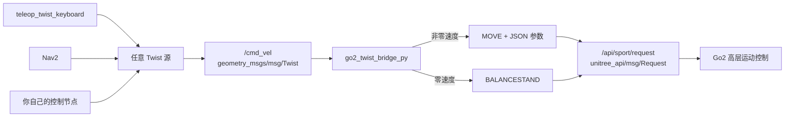
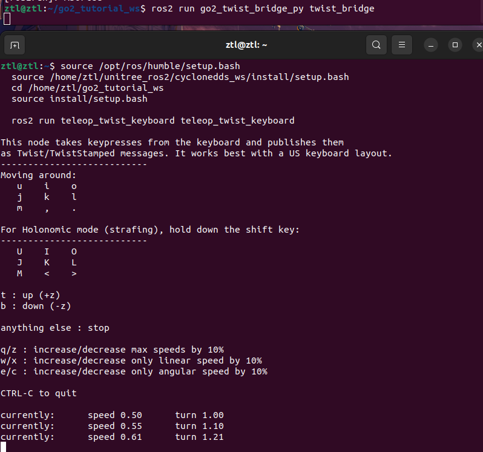

# 第 4 章 Twist 消息桥接

> 上一章我们已经能“自己写一个键盘节点直接控 Go2”了，但那还只是你自己的输入协议。现在我们往 ROS2 生态再走一步：让任何会发 `Twist` 的节点，都能直接驱动 Go2。

---

## 本章你将学到

- 理解为什么 `geometry_msgs/msg/Twist` 是 ROS2 生态里最常见的速度指令接口
- 看懂 `Twist.linear.x / linear.y / angular.z` 到 Go2 `Request.parameter` 的映射关系
- 自己创建一个 `go2_twist_bridge_py` Python 包，把标准 `Twist` 转成 `/api/sport/request`
- 用 JSON 序列化把 `x`、`y`、`z` 三个速度参数写进 `parameter`
- 给桥接节点补上死区和限幅保护，并用 `teleop_twist_keyboard` 实测整条链路

---

## 背景与原理

### 为什么还要多写一个“桥接节点”

如果你只站在上一章的视角看，这件事会显得有点绕：

- 我已经能发 `/api/sport/request`
- Go2 也已经能动
- 为什么还要在中间再塞一个节点？

答案很直接：**因为 ROS2 生态里绝大多数“移动控制上层”说的是 `Twist`，不是 Unitree 自家的 `Request`。**

这意味着两边天然有一道接口缝：

| 上游生态 | 习惯发送什么 | 为什么 |
|---|---|---|
| `teleop_twist_keyboard` | `geometry_msgs/msg/Twist` | 它面向所有 ROS2 移动机器人 |
| Nav2 | `geometry_msgs/msg/Twist` | 导航栈默认就用 `cmd_vel` 表达速度命令 |
| 你自己的规划/控制节点 | 往往也会发 `Twist` | 因为它是标准接口，最容易复用 |
| Go2 高层运动接口 | `unitree_api/msg/Request` | 这是 Unitree 定义的专用控制消息 |

如果不做桥接，后面每写一个上层应用，你都得在那个应用里重复写一遍：

- `api_id` 设多少
- `parameter` 长什么样
- JSON 要怎么拼
- 零速度时发什么更安全

这会把本来很通用的上游逻辑，硬绑死在某一家机器人的接口上。

桥接节点的意义，就是把这个厂商差异集中到一处。

### `Twist` 和 `Request` 到底差在哪儿

这一章最核心的，不是“多学一个消息类型”，而是看懂**两种消息背后的设计思路差异**。

`Twist` 代表的是**标准速度语义**：

```text
geometry_msgs/msg/Twist
├── linear.x   # 前后线速度
├── linear.y   # 左右线速度
├── linear.z   # 上下线速度（本章不用）
├── angular.x  # 绕 x 轴角速度（本章不用）
├── angular.y  # 绕 y 轴角速度（本章不用）
└── angular.z  # 绕 z 轴角速度，也就是平面转向
```

它不关心你是不是 Go2，也不关心你是不是小车、全向底盘还是四足机器人。它只表达：“我现在想让底盘以什么速度运动”。

而 Go2 的 `Request` 代表的是**厂商动作调用**：

```text
unitree_api/msg/Request
├── header.identity.api_id   # 我要调用哪一个运动能力
└── parameter                # 参数字符串，很多场景下是 JSON
```

这就是两个接口的本质差异：

- `Twist` 直接表达速度语义
- `Request` 先表达“我要调哪个接口”，再把参数塞进字符串

### 这一章具体桥接什么

对 Go2 的高层移动接口来说，我们真正需要的只有三项：

| `Twist` 字段 | 含义 | 映射到 `Request.parameter` |
|---|---|---|
| `linear.x` | 前后速度，单位 m/s | `x` |
| `linear.y` | 左右速度，单位 m/s | `y` |
| `angular.z` | 偏航角速度，单位 rad/s | `z` |

也就是说，本章的桥接逻辑可以先粗暴地概括成一句话：

**把 `Twist(linear.x, linear.y, angular.z)` 包成 `{"x": ..., "y": ..., "z": ...}`，再配上 `MOVE` 这个 `api_id` 发出去。**

### 为什么 `parameter` 要做 JSON 序列化

这一步看着像“字符串拼接小技巧”，其实是 Go2 高层接口的关键约束。

上一章你已经见过，`/api/sport/request` 的 `parameter` 字段不是一个结构化子消息，而是一段字符串。对 `MOVE` 这类运动指令来说，这段字符串通常要长成：

```json
{"x": 0.2, "y": 0.0, "z": 0.5}
```

如果你把 Python 字典直接塞进去，比如：

```python
{"x": 0.2, "y": 0.0, "z": 0.5}
```

那只是 Python 内存里的对象，不是 Go2 接口认识的字符串格式。

所以桥接节点里一定会出现：

```python
json.dumps({"x": x, "y": y, "z": z})
```

这一步的本质不是“把它打印漂亮一点”，而是把 Python 数据结构转换成接口能认的 JSON 字符串。

### 为什么不能把 `Twist` 原样直通给 Go2

还有两个很现实的工程问题，决定了我们不能只做“字段对拷”。

第一，**上游的 `Twist` 往往不是专门为 Go2 调好的**。

比如 `teleop_twist_keyboard` 的默认速度更像是给通用移动底盘准备的，直接拿来喂四足机器人，第一次实机测试风险偏高。

第二，**很多上游节点会带一点很小的残余速度**。

如果你不做死区过滤，就可能出现：

- 键盘明明已经松开，但机器人还在轻微抖
- 控制器输出里只剩很小的噪声，但 Go2 还在收到“非零运动”命令

所以一个“教材里能放心给学生抄”的桥接节点，至少还要做两层保护：

1. **死区(deadband)**：特别小的速度直接归零
2. **限幅(clamp)**：超过安全阈值的速度强行截断

---

## 架构总览

先把这一章真正要搭起来的数据流看清楚：



这张图最值得你盯住的不是箭头，而是它带来的工程收益：

- 上游统一说 `Twist`
- 只有桥接节点知道 Go2 的 `Request`
- 后面你想换键盘、换导航、换自己的上层算法，都不用重复改 Go2 接口细节

### 这一章采用的“停止策略”

桥接节点除了处理“有速度”时怎么发，也要处理“没速度”时怎么发。

这一章沿用整理版和旧工程的做法：

- `x/y/z` 只要有一个非零，就发 `MOVE`
- `x/y/z` 全部为零，就发 `BALANCESTAND`

这么做的理由很简单：**对教学阶段来说，零速时切回稳定站立，比让学生自己研究更多停止细节更稳。**

如果以后你做更复杂的控制器，也可以把这部分策略换成：

- 零速仍发 `MOVE`，但参数全零
- 或者改用 `STOPMOVE`

但本章先不把分支扩太多。

### 本章采用的保护阈值

为了让第一次接 `teleop_twist_keyboard` 的实机测试更稳，我们会在桥接节点里加一组保守的保护值：

| 项目 | 数值 | 来源与说明 |
|---|---|---|
| 线速度限幅 | `0.30 m/s` | 对齐本项目后续 Nav2 配置里的 `max_vel_x: 0.3`，让手动遥控和后续导航口径一致 |
| 角速度限幅 | `0.50 rad/s` | 对齐本项目后续 Nav2 配置里的 `max_vel_theta: 0.5` |
| 线速度死区 | `0.02 m/s` | 本教程额外加的抗抖保护，不是接口强制要求 |
| 角速度死区 | `0.05 rad/s` | 本教程额外加的抗抖保护，避免微小残余角速度让机身原地磨蹭 |

!!! warning "这组阈值是教程保护值，不是 Go2 的物理极限"
    这里的限幅目标是“第一次实机测试稳一点”，不是告诉你 Go2 的最高速度只能到这里。我们只是把桥接节点做成最后一道保险丝，避免上游发出过激的 `Twist` 直接传到实机。

---

## 环境准备

开始这一章之前，你最好已经完成下面两件事：

1. 你已经读过 [第 2 章 认识 Go2 消息接口](../01-foundation/02-messages.md)，知道 `/api/sport/request` 的结构
2. 你已经读过 [第 3 章 键盘控制节点](../02-packages/03-keyboard.md)，知道高层移动本质上还是在发 `MOVE`

这一章我们会新建一个 Python 包，名字叫 `go2_twist_bridge_py`。

先在工作空间的 `src/` 目录里创建它：

```bash
# 进入教程工作空间源码目录，创建 Twist 桥接包
cd ~/unitree_go2_ws/src
ros2 pkg create go2_twist_bridge_py \
    --build-type ament_python \
    --dependencies rclpy geometry_msgs unitree_api
```

创建完之后，目录大致会长这样：

```text
go2_twist_bridge_py/
├── go2_twist_bridge_py/
│   └── __init__.py
├── package.xml
├── resource/
│   └── go2_twist_bridge_py
├── setup.cfg
├── setup.py
└── test/
```

这一章最终要改的核心文件有三个：

- `package.xml`
- `setup.py`
- `go2_twist_bridge_py/twist_bridge.py`

!!! danger "第一次把 Twist 接到真机前，先把场地空出来"
    和上一章一样，第一次实机测试请默认按“有概率出意外”来准备：
    
    1. 机器人周围 1.5 米内没有人和硬障碍物
    2. 先用短按验证，不要一上来连续长按
    3. 遥控器急停在手边，能随时接管

---

## 实现步骤

### 步骤一：先把包信息和可执行入口补齐

我们还是先把“包的壳”搭起来，确保后面写完脚本能被 `ros2 run` 找到。

先把 `package.xml` 整理成下面这样：

```xml
<?xml version="1.0"?>
<package format="3">
  <name>go2_twist_bridge_py</name>
  <version>0.0.0</version>
  <description>Twist to Go2 Request bridge for the tutorial.</description>
  <maintainer email="student@example.com">student</maintainer>
  <license>Apache-2.0</license>

  <depend>rclpy</depend>
  <depend>geometry_msgs</depend>
  <depend>unitree_api</depend>

  <test_depend>ament_flake8</test_depend>
  <test_depend>ament_pep257</test_depend>
  <test_depend>python3-pytest</test_depend>

  <export>
    <build_type>ament_python</build_type>
  </export>
</package>
```

这里和上一章最大的不同，是多了：

- `geometry_msgs`：因为我们要订阅 `Twist`
- `unitree_api`：因为我们还要发布 `Request`

接着打开 `setup.py`，把脚本注册成 `twist_bridge`：

```python
from setuptools import setup

package_name = "go2_twist_bridge_py"

setup(
    name=package_name,
    version="0.0.0",
    packages=[package_name],
    data_files=[
        ("share/ament_index/resource_index/packages", ["resource/" + package_name]),
        ("share/" + package_name, ["package.xml"]),
    ],
    install_requires=["setuptools"],
    zip_safe=True,
    maintainer="student",
    maintainer_email="student@example.com",
    description="Twist to Go2 Request bridge for the tutorial.",
    license="Apache-2.0",
    tests_require=["pytest"],
    entry_points={
        "console_scripts": [
            "twist_bridge = go2_twist_bridge_py.twist_bridge:main",
        ],
    },
)
```

这样后面你运行的命令就会是：

```bash
ros2 run go2_twist_bridge_py twist_bridge
```

如果这里写错了，最常见的表现就是：

```text
No executable found
```

### 步骤二：先把 API 常量和保护参数写清楚

现在开始写主程序。

先在 `go2_twist_bridge_py/go2_twist_bridge_py/` 目录下新建 `twist_bridge.py`，从文件头开始写：

```python
#!/usr/bin/env python3

import json                               # 把速度字典序列化成 Go2 接口需要的 JSON 字符串

import rclpy                              # ROS2 Python 客户端库，程序入口
from geometry_msgs.msg import Twist       # ROS2 标准速度消息，很多上层节点都会发它
from rclpy.node import Node               # 自定义节点要继承的基类
from unitree_api.msg import Request       # Go2 高层控制请求消息，发布到 /api/sport/request


ROBOT_SPORT_API_IDS = {
    "BALANCESTAND": 1002,  # 平衡站立，零速度时回到稳定姿态
    "MOVE": 1008,          # 高层移动接口，parameter 里要带 x/y/z JSON 参数
}


DEFAULT_CMD_VEL_TOPIC = "cmd_vel"
DEFAULT_REQUEST_TOPIC = "/api/sport/request"

MAX_LINEAR_VEL = 0.30      # 教程限幅：与后续 Nav2 配置的 max_vel_x 保持一致
MAX_ANGULAR_VEL = 0.50     # 教程限幅：与后续 Nav2 配置的 max_vel_theta 保持一致
LINEAR_DEADBAND = 0.02     # 教程额外加的抗抖死区，不是接口强制要求
ANGULAR_DEADBAND = 0.05    # 角速度残余更容易让机身磨蹭，所以死区稍大一点
```

这一段看起来只是常量区，但它其实已经回答了后面三分之一的问题：

- 订阅哪个话题
- 发布哪个话题
- 速度最多放多大
- 小到什么程度直接当成零

把这些值集中放在文件头，有两个好处：

1. 读者一打开文件，就能看见“这章到底用了哪些关键阈值”
2. 以后如果你要调速度，不用去回调函数里满世界找数字

### 步骤三：把桥接节点一次写完整

前面其实已经把关键设计都讲完了：订阅 `cmd_vel`、做死区和限幅、零速切 `BALANCESTAND`、非零时发 `MOVE + JSON`。现在直接把它们合成一份可以落地的 `twist_bridge.py`。

```python
#!/usr/bin/env python3

import json                               # 把速度字典序列化成 Go2 接口需要的 JSON 字符串

import rclpy                              # ROS2 Python 客户端库，程序入口
from geometry_msgs.msg import Twist       # ROS2 标准速度消息，很多上层节点都会发它
from rclpy.node import Node               # 自定义节点要继承的基类
from unitree_api.msg import Request       # Go2 高层控制请求消息，发布到 /api/sport/request


ROBOT_SPORT_API_IDS = {
    "BALANCESTAND": 1002,  # 平衡站立，零速度时回到稳定姿态
    "MOVE": 1008,          # 高层移动接口，parameter 里要带 x/y/z JSON 参数
}

DEFAULT_CMD_VEL_TOPIC = "cmd_vel"
DEFAULT_REQUEST_TOPIC = "/api/sport/request"

MAX_LINEAR_VEL = 0.30      # 教程限幅：与后续 Nav2 配置的 max_vel_x 保持一致
MAX_ANGULAR_VEL = 0.50     # 教程限幅：与后续 Nav2 配置的 max_vel_theta 保持一致
LINEAR_DEADBAND = 0.02     # 教程额外加的抗抖死区，不是接口强制要求
ANGULAR_DEADBAND = 0.05    # 角速度残余更容易让机身磨蹭，所以死区稍大一点


def apply_deadband(value: float, threshold: float) -> float:
    if abs(value) < threshold:
        return 0.0
    return value


def clamp(value: float, limit: float) -> float:
    return max(-limit, min(value, limit))


class TwistBridge(Node):
    def __init__(self):
        super().__init__("twist_bridge")

        self.request_pub = self.create_publisher(
            Request,
            DEFAULT_REQUEST_TOPIC,
            10,
        )

        self.twist_sub = self.create_subscription(
            Twist,
            DEFAULT_CMD_VEL_TOPIC,
            self.twist_callback,
            10,
        )

        self.get_logger().info(
            "Twist 桥接节点已启动：/cmd_vel -> /api/sport/request"
        )

    def sanitize_twist(self, msg: Twist):
        x = clamp(
            apply_deadband(msg.linear.x, LINEAR_DEADBAND),
            MAX_LINEAR_VEL,
        )
        y = clamp(
            apply_deadband(msg.linear.y, LINEAR_DEADBAND),
            MAX_LINEAR_VEL,
        )
        z = clamp(
            apply_deadband(msg.angular.z, ANGULAR_DEADBAND),
            MAX_ANGULAR_VEL,
        )
        return x, y, z

    def build_move_request(self, x: float, y: float, z: float) -> Request:
        request = Request()
        request.header.identity.api_id = ROBOT_SPORT_API_IDS["MOVE"]
        request.parameter = json.dumps({"x": x, "y": y, "z": z})
        return request

    def build_balance_request(self) -> Request:
        request = Request()
        request.header.identity.api_id = ROBOT_SPORT_API_IDS["BALANCESTAND"]
        return request

    def twist_callback(self, msg: Twist) -> None:
        x, y, z = self.sanitize_twist(msg)

        if x == 0.0 and y == 0.0 and z == 0.0:
            request = self.build_balance_request()
        else:
            request = self.build_move_request(x, y, z)

        self.request_pub.publish(request)


def main():
    rclpy.init()
    node = TwistBridge()

    try:
        rclpy.spin(node)
    finally:
        node.destroy_node()
        rclpy.shutdown()


if __name__ == "__main__":
    main()
```

这份代码里最值得你记住的点只有四个：

1. 只取 `linear.x`、`linear.y`、`angular.z` 这三个平面运动分量
2. 先过死区，再过限幅，桥接节点是最后一道保险丝
3. 三项都为零时发 `BALANCESTAND`
4. 三项中只要有一个非零，就发 `MOVE`，并用 `json.dumps()` 生成 `parameter`

!!! warning "桥接节点最好做成最后一道保险丝"
    `teleop_twist_keyboard`、Nav2 乃至你自己写的上层控制器，都有可能发出超出当前测试预期的速度。桥接节点不该只是“搬运工”，它还应该是最后一道速度保护层。

### 步骤四：把字段名、单位和坐标方向彻底说清楚

写完代码之后，最容易留下的坑不是语法，而是语义。

先把本章真正传递的三个量重新整理成一张表：

| JSON 字段 | 来自哪个 `Twist` 字段 | 含义 | 单位 |
|---|---|---|---|
| `x` | `linear.x` | 前后线速度 | m/s |
| `y` | `linear.y` | 左右线速度 | m/s |
| `z` | `angular.z` | 偏航角速度 | rad/s |

如果你按 ROS 常见平面移动坐标系去记，这组方向可以先理解成：

- `x > 0`：向前
- `x < 0`：向后
- `y > 0`：向左
- `y < 0`：向右
- `z > 0`：逆时针转
- `z < 0`：顺时针转

一旦把这组约定理解反了，现象看起来会像“控制器有毒”，但本质上往往只是方向没对齐。

### 步骤五：为什么用 `teleop_twist_keyboard` 来验桥

这一章强烈推荐你用 `teleop_twist_keyboard` 来做第一次联调，不是因为它最酷，而是因为它有三个优点：

1. 它是 ROS2 生态里最经典的 `Twist` 生产端之一
2. 它不需要你额外再写一个上游节点
3. 它的输出够直观，很适合验证桥接链路

你可以把这一章的联调想成三层：上游先发出 `Twist`，桥接节点把它翻成 `Request`，最后 Go2 再执行高层运动接口。哪一层出问题，都更容易定位。

---

## 编译与运行

!!! warning "桥接节点自己不会产生速度命令"
    `go2_twist_bridge_py` 只是中间适配层，职责就是把 `/cmd_vel` 翻译成 `/api/sport/request`。如果系统里没有别的节点往 `/cmd_vel` 发消息，它虽然挂着，但既没有输入也不会产生输出，很容易让人误以为"桥接节点坏了"。
    
    另外，第 3 章 `go2_teleop_ctrl_keyboard` 直接发布的是 `Request`，**不走 `/cmd_vel`、不经过本章桥接**。如果同时打开第 3 章键盘节点和本章桥接节点后发现 Go2 动了，这并不能证明本章桥接生效——真正起作用的可能只是第 3 章节点。所以本章必须用 `teleop_twist_keyboard` 这类发布 `Twist` 的上游来验证。

这一章最推荐的验证方式，是开三个终端：

- 终端 1：跑桥接节点
- 终端 2：跑 `teleop_twist_keyboard`（或其他发布 `/cmd_vel` 的上游）
- 终端 3：观察 `/api/sport/request`

三者缺一不可：少了终端 2，桥接没有输入；少了终端 3，你无法区分"桥接没收到"和"Go2 没响应"这两种情况。

先回到工作空间根目录，编译 `go2_twist_bridge_py`：

```bash
# 先加载 Go2 官方环境，再编译 Twist 桥接包
source ~/unitree_ros2/setup.sh
cd ~/unitree_go2_ws
colcon build --packages-select go2_twist_bridge_py
source install/setup.bash
```

### 终端 1：启动桥接节点

先把桥本身跑起来：

```bash
# 启动 Twist 桥接节点
source ~/unitree_ros2/setup.sh
cd ~/unitree_go2_ws
source install/setup.bash
ros2 run go2_twist_bridge_py twist_bridge
```

### 终端 2：启动 `teleop_twist_keyboard`

如果你还没安装这个工具，先装一次：

```bash
# 安装 ROS2 标准键盘速度控制工具
sudo apt install ros-humble-teleop-twist-keyboard
```

然后启动它：

```bash
# 启动 Twist 键盘控制工具，默认发布到 /cmd_vel
source ~/unitree_ros2/setup.sh
cd ~/unitree_go2_ws
source install/setup.bash
ros2 run teleop_twist_keyboard teleop_twist_keyboard
```

这时候你大概率会看到它打印一张按键表。

对本章来说，最值得先试的几个键是：

| 按键 | 作用 | 你主要在验什么 |
|---|---|---|
| `i` | 前进 | `linear.x > 0` |
| `,` | 后退 | `linear.x < 0` |
| `j` | 左转 | `angular.z > 0` |
| `l` | 右转 | `angular.z < 0` |
| `Shift + J` | 左平移 | `linear.y > 0` |
| `Shift + L` | 右平移 | `linear.y < 0` |

!!! note "为什么这里不是上一章的方向键"
    因为我们现在故意不用自定义键盘节点，而是换成 ROS2 生态里的标准 `Twist` 生产端。目的就是验证：只要上游会发 `Twist`，Go2 就能被这座桥接起来。

### 终端 3：盯住转换后的请求

为了确认桥接是不是按预期工作，再开一个终端观察输出：

```bash
# 观察桥接节点发布出来的 Go2 Request
source ~/unitree_ros2/setup.sh
cd ~/unitree_go2_ws
source install/setup.bash
ros2 topic echo /api/sport/request
```

你按下 `teleop_twist_keyboard` 的不同按键时，应该能看到：

- 有速度时：`api_id` 变成 `1008`，也就是 `MOVE`
- 零速度时：`api_id` 回到 `1002`，也就是 `BALANCESTAND`
- `parameter` 里出现 `{"x": ..., "y": ..., "z": ...}` 这样的 JSON

### 手动发布一条 `Twist` 做最小联调

如果你想先不接键盘，而是用一条确定的命令测试桥接是否正确，可以这样做：

```bash
# 手动发一条前进速度，验证 Twist -> Request 的最小链路
source ~/unitree_ros2/setup.sh
cd ~/unitree_go2_ws
source install/setup.bash
ros2 topic pub /cmd_vel geometry_msgs/msg/Twist \
    "{linear: {x: 0.2, y: 0.0, z: 0.0}, angular: {x: 0.0, y: 0.0, z: 0.0}}" \
    --once
```

---

## 结果验证

这一章跑通之后，你至少要确认下面四件事：

1. 上游 `Twist` 确实发出来了：

```bash
ros2 topic echo /cmd_vel
```

典型现象是：`i` 让 `linear.x` 为正，`j` 让 `angular.z` 为正，`Shift + J` 让 `linear.y` 为正。

2. 桥接后的 `Request` 确实长对了：

```bash
ros2 topic echo /api/sport/request
```

至少要满足：前进时 `x` 为正，后退时 `x` 为负，左平移时 `y` 为正，左转时 `z` 为正，松键后 `api_id` 回到 `1002`。

3. 限幅确实在生效，而不是原样照抄上游速度：

如果你让上游发一条明显更大的速度，比如：

```bash
ros2 topic pub /cmd_vel geometry_msgs/msg/Twist \
    "{linear: {x: 0.8, y: 0.0, z: 0.0}, angular: {x: 0.0, y: 0.0, z: 1.2}}" \
    --once
```

那么 `/api/sport/request` 里更应该接近：

```json
{"x": 0.3, "y": 0.0, "z": 0.5}
```

4. 实机表现稳定：`i` / `,` 能前后走，`j` / `l` 能原地转，`Shift + J` / `Shift + L` 能左右平移，松手后不会继续磨蹭。

### 结果演示

下面这张截图用来确认本章最关键的映射关系:上游 `/cmd_vel` 里是标准 `Twist`,桥接节点输出到 `/api/sport/request` 后变成 Go2 高层接口能识别的 `Request`。看到 `parameter` 里出现 `x/y/z` 这组 JSON,才算真的经过了桥接,不是上一章键盘节点直接在控制 Go2。

{ width="620" }

---

## 常见问题

### 明明没再按键了，Go2 还在微微抖

这通常就是死区没设，或者死区太小。先检查 `apply_deadband()` 是否真的作用在 `linear.x`、`linear.y`、`angular.z` 上，以及线速度和角速度是否分别设置了阈值。

### `parameter` 看起来像字典，但 Go2 不认

这通常是 JSON 序列化没做对。最常见的错误是直接写：

```python
request.parameter = {"x": x, "y": y, "z": z}
```

正确做法必须是：

```python
request.parameter = json.dumps({"x": x, "y": y, "z": z})
```

还有一个坑是字段名拼错。对这条接口来说，本章固定用 `x`、`y`、`z` 这三个键。

### 左转右转的方向和你预期相反

这种情况优先怀疑坐标约定。本章默认 `angular.z > 0` 是逆时针，`angular.z < 0` 是顺时针。如果你在桥接里手滑写成了：

```python
z = -msg.angular.z
```

那所有转向都会反过来。

### `teleop_twist_keyboard` 明明在跑，但桥接节点没反应

优先排查四件事：`/cmd_vel` 到底有没有数据、桥接节点是不是已经 `source install/setup.bash`、订阅话题是不是还叫 `cmd_vel`、你有没有把 `teleop_twist_keyboard` 改成别的话题或别的发布模式。

### 用 Nav2 时，桥接又显得太保守了怎么办

这不是 bug，而是本章的教学取舍。先确认桥接逻辑没问题，再统一调整 `max_vel_x`、`max_vel_theta` 这类上限；不要今天上游一套数，桥里一套数，机器人上再靠猜。

---

## 本章小结

这一章你真正做成的，不只是“又多写了一个节点”，而是把 Go2 接进了 ROS2 生态最常见的一条速度控制主线。

从现在开始，你可以把上游控制逻辑和厂商接口拆开来看：

- 上游统一说 `Twist`
- 桥接节点负责翻译成 `Request`
- Go2 只需要专心执行高层运动接口

这层抽象一旦有了，后面不管是 `teleop_twist_keyboard`、Nav2，还是你自己写的路径跟随器，都会顺很多。

---

## 下一步

现在 Go2 已经能通过标准 `Twist` 接口被驱动了，下一章我们把关注点从“怎么控它动”转到“怎么把它在 ROS2 世界里看清楚”。

继续阅读：[第 5 章 机器人可视化与完整驱动包](../02-packages/05-visualization.md)

---

## 拓展阅读

- [ROS2 `geometry_msgs/msg/Twist` 文档](https://docs.ros.org/en/humble/p/geometry_msgs/msg/Twist.html)
- [ROS2 `teleop_twist_keyboard` 仓库](https://github.com/ros2/teleop_twist_keyboard)
- [Unitree `unitree_ros2` 仓库](https://github.com/unitreerobotics/unitree_ros2)
- [Unitree SDK2 `sport_client` 头文件](https://github.com/unitreerobotics/unitree_sdk2/blob/main/include/unitree/robot/go2/sport/sport_client.hpp)

---

??? note "附:C++ 实现"
    主线到这里已经足够。C++ 版和 Python 版解决的是同一件事：订阅 `Twist`，做死区和限幅，再发布 `Request`。

    如果你想对照一版等价结构，最值得看的不是整套工程文件，而是下面这个回调核心：

    ```cpp
    #include <algorithm>
    #include <cmath>
    #include <string>

    #include "geometry_msgs/msg/twist.hpp"
    #include "nlohmann/json.hpp"
    #include "rclcpp/rclcpp.hpp"
    #include "unitree_api/msg/request.hpp"

    constexpr int32_t ROBOT_SPORT_API_ID_BALANCESTAND = 1002;
    constexpr int32_t ROBOT_SPORT_API_ID_MOVE = 1008;

    constexpr double MAX_LINEAR_VEL = 0.30;
    constexpr double MAX_ANGULAR_VEL = 0.50;
    constexpr double LINEAR_DEADBAND = 0.02;
    constexpr double ANGULAR_DEADBAND = 0.05;

    double apply_deadband(double value, double threshold) {
      return std::abs(value) < threshold ? 0.0 : value;
    }

    double clamp(double value, double limit) {
      return std::max(-limit, std::min(value, limit));
    }

    void twist_callback(const geometry_msgs::msg::Twist::SharedPtr twist) {
      auto request = unitree_api::msg::Request();

      double x = clamp(apply_deadband(twist->linear.x, LINEAR_DEADBAND), MAX_LINEAR_VEL);
      double y = clamp(apply_deadband(twist->linear.y, LINEAR_DEADBAND), MAX_LINEAR_VEL);
      double z = clamp(apply_deadband(twist->angular.z, ANGULAR_DEADBAND), MAX_ANGULAR_VEL);

      if (x == 0.0 && y == 0.0 && z == 0.0) {
        request.header.identity.api_id = ROBOT_SPORT_API_ID_BALANCESTAND;
      } else {
        request.header.identity.api_id = ROBOT_SPORT_API_ID_MOVE;

        nlohmann::json payload;
        payload["x"] = x;
        payload["y"] = y;
        payload["z"] = z;
        request.parameter = payload.dump();
      }

      request_pub_->publish(request);
    }
    ```

    这一版和 Python 版相比，最主要的差异只有三点：

    - `json.dumps()` 换成了 `nlohmann::json` 的 `dump()`
    - 限幅与死区还是同一套逻辑，只是函数签名改成了 C++ 风格
    - 你还需要自己在 `CMakeLists.txt` 和 `package.xml` 里补 `rclcpp`、`geometry_msgs`、`unitree_api`、`nlohmann_json` 这些依赖
