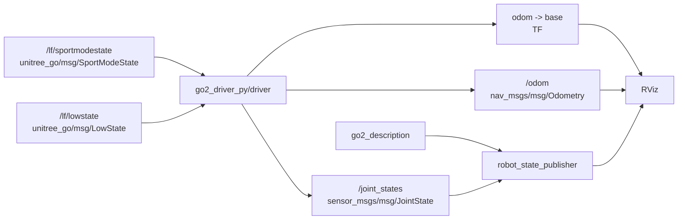
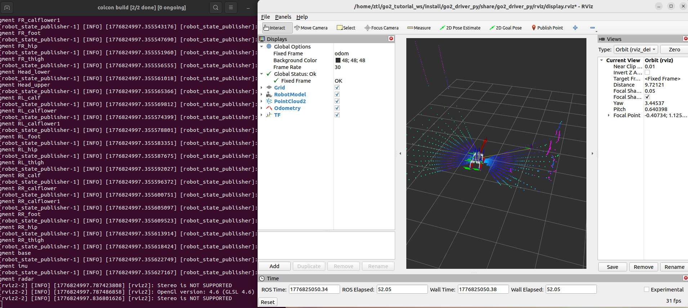

# 第 5 章 在 RViz 里看见 Go2

> 前两章我们已经让 Go2 能接收控制命令了，但“机器人会动”和“我们能看懂它怎么动”是两回事。从这一章开始，我们把视线转到可视化链路，让 `odom`、TF 和 `/joint_states` 一起在 RViz 里连起来。

## 本章你将学到

- 理解 `/odom`、TF、`/joint_states` 在 RViz 可视化里的分工
- 看懂为什么当前代码树里不再需要单独的关节桥接节点
- 学会直接复用 `go2_driver_py` 作为可视化底座

## 背景与原理

RViz 之所以这么重要，不是因为它“看起来直观”，而是因为它把三类最关键的信息摆到了一起:

- 机器人整体在哪儿:看 `/odom`
- 机器人各个 link 怎么连:看 TF
- 机器人每个关节转了多少:看 `/joint_states`

这三条线只要有一条断了，后面做 SLAM、导航、传感器标定时都会很难排错。

和旧版教学资料不同，当前代码树里没有单独的“关节桥接过渡包”。现在的做法更直接:

- `go2_driver_py/driver` 同时发布 `/odom`
- `go2_driver_py/driver` 同时广播 `odom -> base`
- `go2_driver_py/driver` 也直接发布 `/joint_states`

也就是说，原来"关节桥接"这一层独立节点，现在已经并入 `driver` 了。但这不代表第 5 章和第 6 章就该合成一步——本章只用 `driver` 产出的状态链（`/odom`、TF、`/joint_states`）把机器人在 RViz 里立起来，**还不引入 `twist_bridge` 这层控制通道**，那部分属于第 6 章完整驱动包的事。

## 架构总览



这套链路最关键的变化是:关节状态发布不再是独立节点，而是直接并进了 `driver`。

好处也很直接。本章只需要启动 `visualization.launch.py`，模型、关节、TF、里程计就能一起起来，不会再出现两个节点抢着发 `/joint_states` 的问题。`twist_bridge` 这层控制桥留给第 6 章的 `driver.launch.py` 再并入。

## 环境准备

开始前先确认两个包已经在工作空间里:

- `go2_description`
- `go2_driver_py`

你还需要知道，当前 `driver` 节点订阅的真机原生话题是:

- `/lf/sportmodestate`
- `/lf/lowstate`

前者拿机器人整体位姿和速度，后者拿 12 个关节角度。这个分工后面第 6 章还会再展开讲，这一章先把它当成“可视化数据源”就够了。

## 实现步骤

### 步骤一:先确认 `driver.py` 已经把三类可视化数据都包进去了

先看 `src/base/go2_driver_py/go2_driver_py/driver.py` 里最关键的初始化部分:

```python
class Driver(Node):
    def __init__(self):
        super().__init__("driver_py")

        self.declare_parameter("odom_frame", "odom")
        self.declare_parameter("base_frame", "base")
        self.declare_parameter("publish_tf", "true")

        self.odom_pub = self.create_publisher(Odometry, "odom", 10)
        self.mode_sub = self.create_subscription(
            SportModeState, "/lf/sportmodestate", self.mode_cb, 10
        )
        self.tf_bro = TransformBroadcaster(self)

        self.joint_pub = self.create_publisher(JointState, "joint_states", 10)
        self.state_sub = self.create_subscription(
            LowState, "/lf/lowstate", self.state_cb, 10
        )
```

这段代码已经把第 5 章最关心的三样东西都准备好了:

- `odom`
- TF 广播器
- `joint_states`

所以你现在不用再去找什么单独的关节桥接脚本。当前仓库里，关节状态就是在 `state_cb()` 里直接从 `LowState` 解析出来，然后发布到 `/joint_states`。

### 步骤二:看懂关节状态和里程计分别从哪来

先看关节状态回调:

```python
def state_cb(self, state: LowState):
    joint_state = JointState()
    joint_state.header.stamp = self.get_clock().now().to_msg()

    joint_state.name = [
        "FL_hip_joint", "FL_thigh_joint", "FL_calf_joint",
        "FR_hip_joint", "FR_thigh_joint", "FR_calf_joint",
        "RL_hip_joint", "RL_thigh_joint", "RL_calf_joint",
        "RR_hip_joint", "RR_thigh_joint", "RR_calf_joint",
    ]

    for i in range(12):
        joint_state.position.append(float(state.motor_state[i].q))

    self.joint_pub.publish(joint_state)
```

这一段很典型:它做的不是“控制”，而是“翻译”。

`LowState` 是 Go2 自己的原生消息格式，RViz 和 `robot_state_publisher` 更喜欢标准的 `sensor_msgs/msg/JointState`。所以 `driver` 节点在这里充当的角色，正是消息标准化。

再看里程计和 TF 回调:

```python
def mode_cb(self, mode: SportModeState):
    odom = Odometry()
    odom.header.frame_id = self.odom_frame
    odom.child_frame_id = self.base_frame

    odom.pose.pose.position.x = float(mode.position[0])
    odom.pose.pose.position.y = float(mode.position[1])
    odom.pose.pose.position.z = float(mode.position[2])

    odom.pose.pose.orientation.w = float(mode.imu_state.quaternion[0])
    odom.pose.pose.orientation.x = float(mode.imu_state.quaternion[1])
    odom.pose.pose.orientation.y = float(mode.imu_state.quaternion[2])
    odom.pose.pose.orientation.z = float(mode.imu_state.quaternion[3])

    self.odom_pub.publish(odom)

    if self.publish_tf:
        transform = TransformStamped()
        transform.header.frame_id = self.odom_frame
        transform.child_frame_id = self.base_frame
        transform.transform.translation.x = odom.pose.pose.position.x
        transform.transform.translation.y = odom.pose.pose.position.y
        transform.transform.translation.z = odom.pose.pose.position.z
        transform.transform.rotation = odom.pose.pose.orientation
        self.tf_bro.sendTransform(transform)
```

这段代码说明一件很关键的事:当前可视化链不是“自己积分推 odom”，而是直接用 `SportModeState` 里已有的位置和姿态字段，整理成标准 `Odometry` 和 TF。

### 步骤三:用 `visualization.launch.py` 一次拉起可视化底座

现在看本章专用的启动文件 `src/base/go2_driver_py/launch/visualization.launch.py`。这一份 launch 做了四件事:

- 包含 `go2_description` 的模型显示 launch
- 按需启动 RViz
- 启动一个 `radar -> utlidar_lidar` 的静态 TF
- 启动 `driver` 节点（发 `/odom`、TF、`/joint_states`）

注意**这里故意不启动 `twist_bridge`**。本章目标是"把 Go2 在 RViz 里立起来"，不涉及控制链；`twist_bridge` 要到第 6 章的 `driver.launch.py` 里才会并进来。

关键部分如下:

```python
return LaunchDescription([
    use_rviz,
    IncludeLaunchDescription(
        PythonLaunchDescriptionSource(
            os.path.join(go2_description_pkg, "launch", "display.launch.py")
        ),
        launch_arguments={"use_joint_state_publisher": "false"}.items(),
    ),
    Node(
        package="rviz2",
        executable="rviz2",
        arguments=["-d", os.path.join(go2_driver_pkg, "rviz", "display.rviz")],
        condition=IfCondition(LaunchConfiguration("use_rviz")),
    ),
    Node(
        package="tf2_ros",
        executable="static_transform_publisher",
        arguments=["--frame-id", "radar", "--child-frame-id", "utlidar_lidar"],
    ),
    Node(
        package="go2_driver_py",
        executable="driver",
        parameters=[os.path.join(go2_driver_pkg, "params", "driver.yaml")],
    ),
])
```

注意这里专门把 `use_joint_state_publisher` 关成了 `false`。

原因很简单:默认的 `joint_state_publisher` 是给"没有真机关节数据时"用的；我们现在已经有真实的 `/joint_states` 了，再开一份假的就会跟真实数据打架。

## 编译与运行

先把相关包编译好:

```bash
# 编译可视化底座相关的两个包
cd ~/unitree_go2_ws
colcon build --packages-select go2_description go2_driver_py
source install/setup.bash
```

最推荐的启动方式是一条命令直接拉起可视化底座:

```bash
# 启动模型、RViz、静态 TF 和 driver
cd ~/unitree_go2_ws
source install/setup.bash
ros2 launch go2_driver_py visualization.launch.py
```

如果你只想先确认数据链，不想开 RViz，可以关掉它:

```bash
# 只起数据链，不开 RViz
cd ~/unitree_go2_ws
source install/setup.bash
ros2 launch go2_driver_py visualization.launch.py use_rviz:=false
```

也可以单独跑 `driver` 节点本身:

```bash
# 只启动 driver 节点
cd ~/unitree_go2_ws
source install/setup.bash
ros2 run go2_driver_py driver
```

## 结果验证

这一章跑通后，你应该能确认下面三件事:

1. `/joint_states` 正在发布
2. `/odom` 正在发布
3. TF 树里已经有 `odom -> base`

推荐按下面顺序检查:

```bash
# 看关节状态
ros2 topic echo /joint_states --once

# 看里程计
ros2 topic echo /odom --once

# 看 TF 树
ros2 run tf2_tools view_frames
```

如果 RViz 也开着，你还应该看到:

- RobotModel 能正常加载
- 机器人姿态会跟着真实状态变化
- Fixed Frame 设成 `odom` 后，模型位置不再飘成一坨

{ width="600" }

## 常见问题

### 1. 模型加载出来了，但四条腿完全不动

**现象**:RobotModel 能显示，但关节姿态像被焊死了一样。

**原因**:通常是 `/joint_states` 没有数据，或者被别的节点抢着发布了假数据。

**解决**:

- 先 `ros2 topic echo /joint_states --once`
- 确认当前系统里只有 `go2_driver_py/driver` 在发 `/joint_states`
- 不要再额外启动 `joint_state_publisher`

### 2. Fixed Frame 设成 `odom` 后，RViz 一直报 TF 缺失

**现象**:RobotModel 存在，但 RViz 顶部不断提示缺少 `odom -> base`。

**原因**:`driver` 没有成功发布 TF，或者 `publish_tf` 被关掉了。

**解决**:

- 先检查 `/odom` 是否正常
- 再执行 `ros2 param get /driver_py publish_tf` 或直接看 `driver.yaml`
- 确认参数还是 `true`

### 3. 点云或者雷达框架位置怪怪的

**现象**:后面叠加点云时，传感器看起来像“漂在机器人外面”。

**原因**:通常是 `radar -> utlidar_lidar` 这条静态 TF 没起来。

**解决**:

- 用 `ros2 run tf2_tools view_frames` 看有没有这条边
- 如果没有，检查 `driver.launch.py` 里的 `static_transform_publisher` 是否正常启动

### 4. 我明明看过旧资料，为什么这里没有那层独立关节桥接

**现象**:你按旧资料在找那份单独的关节桥接脚本，但当前代码树里根本没有。

**原因**:当前仓库已经把那层过渡逻辑合并进 `go2_driver_py/driver` 了。

**解决**:

- 把"关节桥接"这件事直接理解成 `driver` 的一部分
- 后面所有章节默认也都按这个新结构往下讲

### 5. 节点刚起就全挂:`failed to enumerate interfaces for "udp"`

**现象**:`ros2 launch` 命令看起来已经正确展开，`robot_state_publisher`、`static_transform_publisher`、`driver` 都已进入初始化阶段，但随后集体报错退出，核心信息是:

```text
failed to enumerate interfaces for "udp": -1
rmw_create_node: failed to create domain, error Error
rcl node's rmw handle is invalid
```

**原因**:这不是本章代码或 launch 写错，而是 CycloneDDS 运行环境没准备好——通常是 Humble 或 `cyclonedds_ws` 的环境变量没 source 进当前终端。ROS2 创建节点时无法枚举 UDP 接口，所有节点都会跟着挂掉。

**解决**:

- 先在当前终端重新 source 一遍环境:

    ```bash
    source /opt/ros/humble/setup.bash
    source ~/unitree_ros2/cyclonedds_ws/install/setup.bash
    source ~/unitree_go2_ws/install/setup.bash
    ```

- 再用最朴素的命令验证 DDS 能不能通:

    ```bash
    ros2 topic list
    ```

    如果这条都挂，说明 DDS 环境本身坏了，需要回头检查 `CYCLONEDDS_URI`、网卡状态，而不是继续调本章代码。

- DDS 正常后再重新执行 `ros2 launch go2_driver_py visualization.launch.py`。

## 本章小结

这一章我们把 Go2 在 RViz 里的可视化链真正跑顺了。

最重要的收获不是“能看到模型”，而是你已经知道这套可视化依赖哪三类数据: `/odom`、TF、`/joint_states`。更关键的是，当前代码树里这三类数据都由 `go2_driver_py/driver` 统一输出。

下一章我们就不再只把它当成“可视化底座”了，而是把这个 `driver` 节点本身完整拆开，看清楚它到底是怎么从原始机器人状态整理出标准 ROS2 数据的。
