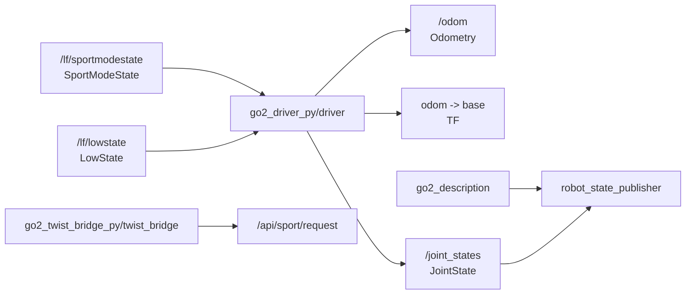
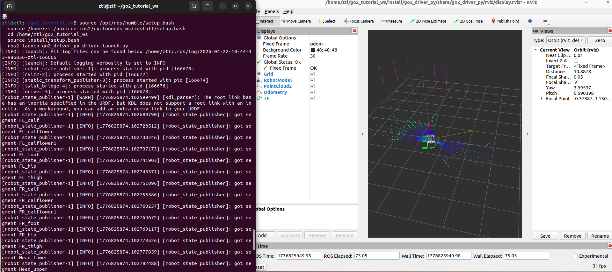

# 第 6 章 完整驱动包集成

> 前一章我们已经在 RViz 里看见了 Go2。这一章不再把 `go2_driver_py` 当成“黑盒可视化底座”，而是把它完整拆开，弄清楚它到底发布了什么、怎么发布、哪些参数是真的存在。

## 本章你将学到

- 理解 `go2_driver_py` 在当前代码树里的职责边界
- 看懂 `driver.py` 如何同时发布 `/odom`、TF 和 `/joint_states`
- 确认当前驱动节点真正支持的参数只有 `odom_frame`、`base_frame`、`publish_tf`

## 背景与原理

一个靠谱的驱动基座，不应该替上层应用做太多事，但也不能只丢原始消息不管。

对当前这套 Go2 教程来说，`go2_driver_py` 的职责可以概括成三句话:

- 把 Go2 原生状态整理成标准 ROS2 里程计
- 把机器人整体位姿广播成 TF
- 把 12 个关节角度整理成标准 `/joint_states`

你可以把它理解成“状态标准化层”。它不负责巡航，不负责 Action，不负责导航；它负责的是把后面所有章节都想用的基础状态统一产出。

## 架构总览



从这张图可以看出，`go2_driver_py` 并不直接发控制命令给 Go2。控制链还是第 3/4 章那边的事情。

它真正做的是“把状态准备好”，让 RViz、SLAM、Nav2 这些上层模块都能直接消费标准话题。

## 环境准备

开始前先确认下面几个包已经在工作空间里:

- `go2_driver_py`
- `go2_description`
- `go2_twist_bridge_py`

当前驱动节点订阅的真机原生话题固定是:

- `/lf/sportmodestate`
- `/lf/lowstate`

这一点要特别强调。当前源码里，这两个订阅话题是**硬编码**的，不是参数。后面如果你看到旧资料里把这两个话题写成可配置参数，那已经不是这份代码树的真实口径了。

## 实现步骤

### 步骤一:先确认真实参数到底有哪些

打开 `src/base/go2_driver_py/go2_driver_py/driver.py`，最开头的参数声明只有三项:

```python
self.declare_parameter("odom_frame", "odom")
self.declare_parameter("base_frame", "base")
self.declare_parameter("publish_tf", "true")
```

再看 `src/base/go2_driver_py/params/driver.yaml`:

```yaml
/**:
  ros__parameters:
    base_frame: base
    odom_frame: odom
    publish_tf: "true"
    use_sim_time: false
```

所以当前仓库里，真正由驱动节点自己读取并使用的参数，只有:

| 参数 | 默认值 | 作用 |
|---|---|---|
| `odom_frame` | `odom` | 里程计父坐标系名字 |
| `base_frame` | `base` | 机器人主体坐标系名字 |
| `publish_tf` | `true` | 是否广播 `odom -> base` |

!!! warning "当前源码没有订阅话题的可配置参数"
    这两个订阅话题现在是写死在 `driver.py` 里的。如果你想换 topic，得改源码的订阅行，而不是在 launch 命令里传一个所谓的参数。

### 步骤二:看懂 `driver.py` 如何发布 `/joint_states`

先看和关节相关的部分:

```python
self.joint_pub = self.create_publisher(JointState, "joint_states", 10)
self.state_sub = self.create_subscription(
    LowState, "/lf/lowstate", self.state_cb, 10
)

def state_cb(self, state: LowState):
    joint_state = JointState()
    joint_state.header.stamp = self.get_clock().now().to_msg()

    joint_state.name = [
        "FL_hip_joint", "FL_thigh_joint", "FL_calf_joint",
        "FR_hip_joint", "FR_thigh_joint", "FR_calf_joint",
        "RL_hip_joint", "RL_thigh_joint", "RL_calf_joint",
        "RR_hip_joint", "RR_thigh_joint", "RR_calf_joint",
    ]

    for i in range(12):
        joint_state.position.append(float(state.motor_state[i].q))

    self.joint_pub.publish(joint_state)
```

这段逻辑说明一件事:当前仓库里，关节状态桥接已经彻底并进 `driver` 了。

也就是说，第 5 章里我们说的“不要再单开独立关节桥接节点”，不是文案优化，而是当前代码结构本来就这么设计的。

### 步骤三:看懂 `driver.py` 如何发布 `/odom` 和 TF

接着看整体位姿那一段:

```python
self.odom_pub = self.create_publisher(Odometry, "odom", 10)
self.mode_sub = self.create_subscription(
    SportModeState, "/lf/sportmodestate", self.mode_cb, 10
)
self.tf_bro = TransformBroadcaster(self)

def mode_cb(self, mode: SportModeState):
    odom = Odometry()
    odom.header.stamp = self.get_clock().now().to_msg()
    odom.header.frame_id = self.odom_frame
    odom.child_frame_id = self.base_frame

    odom.pose.pose.position.x = float(mode.position[0])
    odom.pose.pose.position.y = float(mode.position[1])
    odom.pose.pose.position.z = float(mode.position[2])

    odom.pose.pose.orientation.w = float(mode.imu_state.quaternion[0])
    odom.pose.pose.orientation.x = float(mode.imu_state.quaternion[1])
    odom.pose.pose.orientation.y = float(mode.imu_state.quaternion[2])
    odom.pose.pose.orientation.z = float(mode.imu_state.quaternion[3])

    odom.twist.twist.linear.x = float(mode.velocity[0])
    odom.twist.twist.linear.y = float(mode.velocity[1])
    odom.twist.twist.linear.z = float(mode.velocity[2])
    odom.twist.twist.angular.z = float(mode.yaw_speed)

    self.odom_pub.publish(odom)

    if self.publish_tf:
        transform = TransformStamped()
        transform.header.stamp = self.get_clock().now().to_msg()
        transform.header.frame_id = self.odom_frame
        transform.child_frame_id = self.base_frame
        transform.transform.translation.x = odom.pose.pose.position.x
        transform.transform.translation.y = odom.pose.pose.position.y
        transform.transform.translation.z = odom.pose.pose.position.z
        transform.transform.rotation = odom.pose.pose.orientation
        self.tf_bro.sendTransform(transform)
```

这里你会看到一个很重要的工程选择:当前驱动不是自己对速度积分算位姿，而是直接使用 `SportModeState` 已经给出的 `position`、四元数和速度字段，再整理成标准 `Odometry`。

这让整个驱动节点保持得很“薄”，但对教学来说反而是好事，因为你现在更容易把注意力放在 ROS2 标准接口上，而不是先陷进状态估计细节里。

### 步骤四:用 `driver.launch.py` 把底座拉起来

再看总启动文件 `src/base/go2_driver_py/launch/driver.launch.py`。它做的事情很集中:

- 包含 `go2_description` 的显示 launch
- 按需启动 RViz
- 发布 `radar -> utlidar_lidar` 静态 TF
- 启动 `go2_twist_bridge_py/twist_bridge`
- 启动 `go2_driver_py/driver`

关键片段如下:

```python
Node(
    package="tf2_ros",
    executable="static_transform_publisher",
    arguments=["--frame-id", "radar", "--child-frame-id", "utlidar_lidar"],
),
Node(
    package="go2_twist_bridge_py",
    executable="twist_bridge",
),
Node(
    package="go2_driver_py",
    executable="driver",
    parameters=[os.path.join(go2_driver_pkg, "params", "driver.yaml")],
),
```

这里要记住一个边界:

- `twist_bridge` 是控制适配层
- `driver` 是状态标准化层

它们可以一起出现在同一份 launch 里，但职责并没有混在一起。

## 编译与运行

先把驱动基座相关包一起编译:

```bash
# 编译驱动底座相关包
cd ~/unitree_go2_ws
colcon build --packages-select go2_driver_py go2_description go2_twist_bridge_py
source install/setup.bash
```

最推荐的启动方式是一条命令把整套底座拉起来:

```bash
# 启动 driver.launch.py
cd ~/unitree_go2_ws
source install/setup.bash
ros2 launch go2_driver_py driver.launch.py
```

如果你只想验证状态链，不想看 RViz:

```bash
# 关闭 RViz，只验证数据链
cd ~/unitree_go2_ws
source install/setup.bash
ros2 launch go2_driver_py driver.launch.py use_rviz:=false
```

也可以只单独跑驱动节点:

```bash
# 单独运行 driver
cd ~/unitree_go2_ws
source install/setup.bash
ros2 run go2_driver_py driver
```

如果你想临时换坐标系名字，可以改真实存在的参数:

```bash
# 临时改 frame 名字，并关闭 TF 广播
cd ~/unitree_go2_ws
source install/setup.bash
ros2 run go2_driver_py driver \
  --ros-args -p odom_frame:=odom -p base_frame:=base -p publish_tf:=false
```

## 结果验证

这一章跑通后，至少要确认四个输出都在:

1. `/odom`
2. `/joint_states`
3. `odom -> base`
4. `radar -> utlidar_lidar`

推荐按下面顺序检查:

```bash
# 看里程计
ros2 topic echo /odom --once

# 看关节状态
ros2 topic echo /joint_states --once

# 看 TF 树
ros2 run tf2_tools view_frames
```

成功时，你应该能看到:

- `/odom` 里有当前位置和姿态
- `/joint_states` 里有 12 个关节角度
- TF 图里已经连上 `odom -> base`

{ width="600" }

## 常见问题

### 1. `ros2 launch` 能起来，但 `/odom` 一直没数据

**现象**:launch 没报错，可是 `/odom` 空空如也。

**原因**:通常是 `/lf/sportmodestate` 没有进来，而不是 `driver` 发布逻辑本身有问题。

**解决**:

- 先 `ros2 topic echo /lf/sportmodestate --once`
- 如果连原始话题都没数据，就先回头检查 Go2 通信环境

### 2. `/joint_states` 没数据

**现象**:模型能显示，但关节就是不动。

**原因**:通常是 `/lf/lowstate` 没有进来，或者系统里有别的节点在争 `/joint_states`。

**解决**:

- 先 `ros2 topic echo /lf/lowstate --once`
- 再 `ros2 topic echo /joint_states --once`
- 确保没有额外的 `joint_state_publisher` 在持续发假数据

### 3. 我在命令行里传订阅话题名参数，为什么没效果

**现象**:你照旧资料传了订阅话题名的参数覆盖，节点完全没理会。

**原因**:因为当前源码里压根没有这个参数。

**解决**:

- 只使用真实存在的 `odom_frame`、`base_frame`、`publish_tf`
- 如果真要换订阅话题，请直接改 `driver.py` 的订阅行

### 4. RViz 一直提示缺少 `base_link`

**现象**:有些第三方配置或旧 RViz 视图一直在找 `base_link`。

**原因**:当前 Go2 代码口径统一使用 `base`，不是 `base_link`。

**解决**:

- 把相关配置里的机器人底座坐标系统一改成 `base`
- 别在同一套系统里混用 `base` 和 `base_link`

## 本章小结

这一章我们把 `go2_driver_py` 的真实职责彻底拆开看了一遍。

最重要的结论有两个:

- 它确实同时发布 `/odom`、TF、`/joint_states`
- 它真正支持的参数只有三个，不存在"订阅话题名可配置"这条参数链

后面不管是 SLAM、Nav2 还是传感器处理，都会默认依赖这套驱动基座。所以这一章的边界感，一定要现在就立住。

## 下一步

控制链和状态链到这里已经够扎实了。接下来我们把注意力切到感知侧，先从 Go2 的点云数据开始，把它整理成后面 SLAM 和导航都能直接吃的标准输入。
