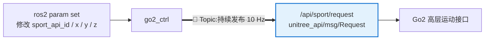
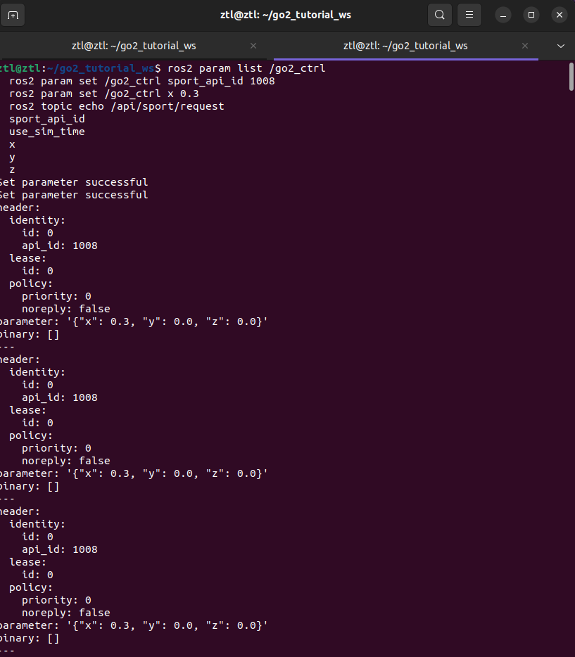

# 第 7 章 用参数驱动 Go2 运动

> 上一章我们已经把 `Twist` 和 Go2 的 `Request` 接口接通了。这一章换一条更直接的路:不再走 `/cmd_vel`，而是写一个最小控制节点 `go2_ctrl`，用 ROS2 参数驱动 Go2，底层走的是 **Topic 通信**。

!!! info "📡 本章通信方式:Topic(话题发布)"
    **形状**:单向 · 异步广播 · 持续发布  
    **本章关键 API**:`self.create_publisher(Request, "/api/sport/request", 10)`  
    **要记住的事**:节点每 0.1 秒往话题上发一条 `Request`,谁订阅谁收;没人订阅它也照发不误。Topic 不关心"消息有没有被处理完",只负责把数据流源源不断推出去。
    
    这是 ROS2 三大通信机制里最基础的一种。下一章我们会看到不一样的形状——Service(请求/响应)。

## 本章你将学到

- 看懂 `go2_ctrl` 这类"参数 + 定时器 + 专有消息"的最小控制节点
- 学会用 `ros2 param set` 在运行时切换 Go2 的动作 id 和运动参数
- 分清"参数驱动控制"和"`/cmd_vel` 桥接控制"是两条不同的工程链路

## 背景与原理

前面几章里，我们已经见过 Go2 的高层控制入口 `/api/sport/request`。它的特点很鲜明:消息格式是 Go2 专有的 `unitree_api/msg/Request`，不是 ROS2 生态里常见的 `Twist`。

这意味着，除了第 4 章那种“先发 `Twist`，再桥接成 `Request`”的路线，我们还可以更直接一点:节点自己组织 `Request`，定时发给机器人。

`go2_ctrl` 就是这个思路的最小实现。它不读 `/odom`，不算控制闭环，也不管路径规划。它只做一件事:把当前参数里的动作 id、`x/y/z` 速度值，持续封装成 `Request` 并发布出去。

## 架构总览



这张图里最关键的两件事:

1. 外部没有直接往话题发消息,而是先改节点参数;`go2_ctrl` 把参数翻译成消息再持续推出去
2. **`go2_ctrl` → `/api/sport/request` 这条粗箭头就是本章的 Topic 通信**:单向、持续、不等任何人回应

`go2_ctrl` 每 `0.1` 秒读一次参数，再把最新值发到 `/api/sport/request`。所以你在另一个终端里执行 `ros2 param set`，机器人动作会马上跟着变。

## 环境准备

开始前先确认三件事:

- 你已经完成第 6 章，能够用 `go2_driver_py` 让 Go2 的底层 ROS2 链路跑起来
- 工作空间里已经有 `go2_tutorial_py` 这个教程包
- 你知道 `BALANCESTAND`、`MOVE`、`STOPMOVE` 这些动作 id 都定义在 `sport_model.py` 里

本章继续复用教程包 `go2_tutorial_py`，不新建额外功能包。对应目录结构大致如下:

```text
unitree_go2_ws/
└── src/
    └── tutorial/
        ├── go2_tutorial_inter/
        └── go2_tutorial_py/
            ├── go2_tutorial_py/
            │   ├── sport_model.py
            │   └── go2_ctrl.py
            ├── package.xml
            └── setup.py
```

## 实现步骤

### 步骤一:先把 `go2_ctrl` 注册成可执行入口

这一小步只做一件事:让 `ros2 run` 能找到我们的控制节点。

在 `src/tutorial/go2_tutorial_py/setup.py` 里，入口应该像下面这样挂到 `console_scripts`:

```python
entry_points={
    "console_scripts": [
        "go2_ctrl = go2_tutorial_py.go2_ctrl:main",
        "go2_state = go2_tutorial_py.go2_state:main",
        "go2_cruising_service = go2_tutorial_py.go2_cruising_service:main",
        "go2_cruising_client = go2_tutorial_py.go2_cruising_client:main",
        "go2_nav_client = go2_tutorial_py.go2_nav_client:main",
        "go2_nav_server = go2_tutorial_py.go2_nav_server:main",
    ],
}
```

这一段的重点不是“会不会写 setup.py”，而是记住:

- 可执行名叫 `go2_ctrl`
- 真正的 Python 模块在 `go2_tutorial_py/go2_ctrl.py`
- 后面所有运行命令都以这个入口为准

### 步骤二:实现 `go2_ctrl.py`

现在进入主角。接下来这段代码做三件事:

- 声明四个参数:动作 id、线速度 `x/y`、角速度 `z`
- 创建一个 `Request` 发布者，目标话题是 `/api/sport/request`
- 用定时器周期性读参数并发消息

把下面代码放进 `src/tutorial/go2_tutorial_py/go2_tutorial_py/go2_ctrl.py`:

```python
import json                                # 把 Python 字典转成 JSON 字符串

import rclpy                              # ROS2 Python 客户端库
from rclpy.node import Node               # 所有 ROS2 节点的基类
from unitree_api.msg import Request       # Go2 高层控制消息

from .sport_model import ROBOT_SPORT_API_IDS  # Go2 动作 id 常量表


class Go2Ctrl(Node):
    def __init__(self):
        super().__init__("go2_ctrl")

        # 四个参数就是这个节点全部的“控制面板”
        self.declare_parameter("sport_api_id", ROBOT_SPORT_API_IDS["BALANCESTAND"])
        self.declare_parameter("x", 0.0)
        self.declare_parameter("y", 0.0)
        self.declare_parameter("z", 0.0)

        # 直接把 Request 发给 Go2 的高层接口
        self.req_pub = self.create_publisher(Request, "/api/sport/request", 10)

        # 每 0.1 秒读取一次参数并发送，保证机器人持续收到控制命令
        self.timer = self.create_timer(0.1, self.on_timer)

    def on_timer(self):
        request = Request()

        api_id = self.get_parameter("sport_api_id").get_parameter_value().integer_value
        request.header.identity.api_id = api_id

        if api_id == ROBOT_SPORT_API_IDS["MOVE"]:
            params = {
                "x": self.get_parameter("x").get_parameter_value().double_value,
                "y": self.get_parameter("y").get_parameter_value().double_value,
                "z": self.get_parameter("z").get_parameter_value().double_value,
            }
            request.parameter = json.dumps(params)

        self.req_pub.publish(request)


def main():
    rclpy.init()
    rclpy.spin(Go2Ctrl())
    rclpy.shutdown()


if __name__ == "__main__":
    main()
```

这段代码里有两个非常容易记混的点。

第一，`sport_api_id` 决定"发的是什么动作"。如果你把它设成 `1002`，那就是 `BALANCESTAND`；如果设成 `1008`，那就是 `MOVE`。

第二，`x/y/z` 只有在 `sport_api_id == MOVE` 时才会真的写进 `request.parameter`。这就是为什么我们改完速度参数后，还得把动作 id 切到 `MOVE`，机器人才会动起来。

!!! info "📡 本章 Topic 通信的钥匙就是这一行"
    ```python
    self.req_pub = self.create_publisher(Request, "/api/sport/request", 10)
    ```
    `create_publisher` 就是把这个节点注册为 Topic 发布者。三个参数依次是:**消息类型**、**话题名**、**队列长度**。
    
    配合下一行的 `self.create_timer(0.1, self.on_timer)`,就形成了本章"10 Hz 持续往 Topic 推 Request"的控制链。下一章的 Service 会换成 `create_service(...)`,形状完全不同——那时候你回过头来对比这一行,Topic 和 Service 的分野就会非常清晰。

### 步骤三:弄清楚四个参数到底怎么配

读代码时别急着背整段逻辑，先记住这四个参数各自负责什么:

| 参数名 | 类型 | 作用 |
|---|---|---|
| `sport_api_id` | 整数 | 指定 Go2 执行动作类型 |
| `x` | 浮点数 | 前后线速度，常用于前进/后退 |
| `y` | 浮点数 | 左右线速度，常用于平移 |
| `z` | 浮点数 | 绕 z 轴角速度，常用于原地转向 |

本章最常用的动作 id 可以先记这三个:

| 动作 | id |
|---|---|
| `BALANCESTAND` | `1002` |
| `STOPMOVE` | `1003` |
| `MOVE` | `1008` |

如果你想查更多动作，比如 `STANDUP`、`HELLO`、`STRETCH`，直接去看 `sport_model.py` 里的字典就行。

### 步骤四:理解它和第 4 章 `twist_bridge` 的关系

这里很容易脑子打结。我们把两条路线摆在一起看:

| 路线 | 输入 | 中间层 | 输出 |
|---|---|---|---|
| 第 4 章 | `/cmd_vel` | `go2_twist_bridge_py` | `/api/sport/request` |
| 第 7 章 | ROS2 参数 | `go2_ctrl` | `/api/sport/request` |

它们最后都落到同一个 Go2 专有接口上，但前端控制方式完全不同。

第 4 章更像“兼容 ROS2 通用生态”；第 7 章更像“直接操作 Go2 原生高层动作”。后面讲 Service 和 Action 时，我们会继续沿着这一章这种“直接控制 Go2 动作”的思路往上封装。

## 编译与运行

先回到工作空间根目录，把教程包重新编译一遍:

```bash
# 编译教程通信示例包，并重新加载环境
cd ~/unitree_go2_ws
colcon build --packages-select go2_tutorial_py go2_tutorial_inter
source install/setup.bash
```

先开第一个终端，把 `go2_ctrl` 跑起来:

```bash
# 启动最小控制节点
cd ~/unitree_go2_ws
source install/setup.bash
ros2 run go2_tutorial_py go2_ctrl
```

然后开第二个终端，用参数直接驱动它:

```bash
# 先切到平衡站立
cd ~/unitree_go2_ws
source install/setup.bash
ros2 param set /go2_ctrl sport_api_id 1002

# 切到 MOVE，并给一个前进速度
ros2 param set /go2_ctrl sport_api_id 1008
ros2 param set /go2_ctrl x 0.3
ros2 param set /go2_ctrl y 0.0
ros2 param set /go2_ctrl z 0.0

# 需要停下时，把动作切回 STOPMOVE
ros2 param set /go2_ctrl sport_api_id 1003
```

如果你想试原地转向，可以保持 `sport_api_id=1008`，把 `x` 设为 `0.0`，再把 `z` 设成一个较小的角速度，比如 `0.3`。

!!! danger "第一次实机调参数时别上大速度"
    本章的控制链是直接发 Go2 高层动作，不经过额外限幅器。第一次实机测试时，`x/y/z` 先从 `0.1` 或 `0.2` 这种小值开始，旁边留出安全空间，手里握好急停。

## 结果验证

这一章跑通后，你应该能看到三类现象。

第一类是参数层面:

```bash
# 查看节点当前参数
ros2 param list /go2_ctrl
ros2 param get /go2_ctrl sport_api_id
ros2 param get /go2_ctrl x
```

第二类是消息层面:

```bash
# 观察 go2_ctrl 实际发出的 Request
ros2 topic echo /api/sport/request --once
```

当 `sport_api_id=1008` 时，你应该能在 `parameter` 字段里看到一段 JSON 字符串，里面包含 `x/y/z`。

第三类是动作层面:

- 设 `sport_api_id=1002` 时，机器人应回到平衡站立
- 设 `sport_api_id=1008` 且 ==`x=0.3`== 时，机器人应开始向前**匀速运动**，速度约 ==0.3 m/s==
- 设 `sport_api_id=1003` 时，机器人应停止运动

### 结果演示

下面这张图展示的是把 `x` 调到 `0.3` 后,Go2 通过 Topic 控制向前走的实机结果。它对应的是本章最核心的验证点:`ros2 param set` 改的是节点参数,节点再把参数组合成 `/api/sport/request`,最后才落到 Go2 的高层运动接口。

{ width="520" }

!!! tip "想自己调着玩？高亮的就是可改的入口"
    上面凡是用 ==黄底高亮== 的数值，都是你可以通过 `ros2 param set /go2_ctrl ...` 现场改的参数。推荐第一次实机时的安全范围:

    - ==`x`==(前后线速度):先从 `0.1`~`0.3` 试起,不要超过 `0.5`
    - ==`y`==(左右线速度):同样 `0.1`~`0.3`,想侧移再开
    - ==`z`==(偏航角速度):`0.2`~`0.5` 即可观察到明显转向
    
    每次改参数前先确认 `sport_api_id=1008`,否则 `x/y/z` 再怎么改机器人也不会动。调完记得切回 `sport_api_id=1003` 正式停车。

!!! warning "停运动 ≠ 停节点"
    教材里"让机器人停下来"和"关掉节点"是两件不同的事,别搞混:
    
    - **停止机器人运动**:`ros2 param set /go2_ctrl sport_api_id 1003`(STOPMOVE,这是正式停车方式)
    - **结束节点进程**:在运行 `go2_ctrl` 的终端按 ++ctrl+c++
    
    实机场景下应当优先走 `1003`——先让 Go2 正常收到停车命令,再关节点。直接 `Ctrl-C` 会让进程立即退出,最后一条控制消息可能还没发出去,机器人可能还在按上一条指令继续动作。

## 常见问题

### 1. `ros2 param set` 成功了，但机器人完全没反应

**现象**:终端显示参数设置成功，但 Go2 没动作。

**原因**:最常见的是你只改了 `x/y/z`，却没把 `sport_api_id` 切到 `MOVE`。

**解决**:

- 先执行 `ros2 param get /go2_ctrl sport_api_id`
- 确认它是不是 `1008`
- 如果不是，先 `ros2 param set /go2_ctrl sport_api_id 1008`

### 2. 机器人一直走，不肯停

**现象**:你把 `x` 改回 `0.0`，但机器人还在动作链里。

**原因**:`go2_ctrl` 不是“速度一归零就自动停”的写法，它会继续按当前动作 id 发消息。

**解决**:

- 显式执行 `ros2 param set /go2_ctrl sport_api_id 1003`
- 把动作切到 `STOPMOVE`

### 3. `ros2 run` 找不到 `go2_ctrl`

**现象**:`ros2 run go2_tutorial_py go2_ctrl` 报找不到可执行入口。

**原因**:通常是 `setup.py` 的 `console_scripts` 没注册，或者编译后当前终端没重新 `source`。

**解决**:

- 检查 `setup.py` 里有没有 `go2_ctrl = go2_tutorial_py.go2_ctrl:main`
- 重新执行 `colcon build --packages-select go2_tutorial_py`
- 重新 `source install/setup.bash`

### 4. 改了参数，但 `/api/sport/request` 里还是旧值

**现象**:参数已经变了，话题里却没看到更新。

**原因**:大多不是参数没生效，而是你看的那一帧刚好是旧消息。

**解决**:

- 用 `ros2 topic echo /api/sport/request` 持续观察几帧
- 再执行一次 `ros2 param set`
- 确认 `go2_ctrl` 进程还在运行，没有被你中途退出

## 本章小结

这一章我们第一次写出了一个真正“直接控制 Go2”的最小 ROS2 节点。

它的结构并不复杂:四个参数、一个 `Request` 发布者、一个定时器。真正值得记住的，是这种工程思路:节点自己维护控制状态，再周期性把状态刷到机器人接口上。

后面你会看到，Service 和 Action 虽然接口形式不同，但它们也都离不开这种“内部有状态，外部给命令”的套路。

## 下一步

现在我们已经能手动用参数驱动 Go2 了，但每次都敲 `ros2 param set` 还是太原始。下一章我们把它封装成一个 Service，让“开始巡航 / 停止巡航”变成一次请求、一条响应的短事务。
