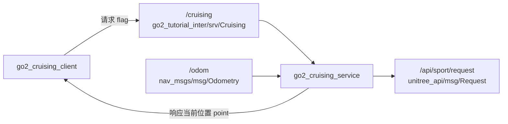

# 第 8 章 用 Service 控制巡航开关

> 上一章我们已经能用参数直接驱动 Go2 了，但每次都手敲 `ros2 param set` 还是很粗糙。这一章我们把“开始巡航 / 停止巡航”封装成一个 Service，让控制动作变成一次请求、一条响应。

## 本章你将学到

- 看懂 `Cruising.srv` 这种最小 Service 接口是怎么描述“开关型命令”的
- 学会编写 `go2_cruising_service` 和 `go2_cruising_client`
- 分清 Service 适合“短事务控制”，不适合持续高速数据流

## 背景与原理

Service 的核心气质是一问一答。

客户端发出一条请求，服务端收到后立即处理，然后回一条结果。整个过程像是在说:“帮我做这件事。”“好，我做完了，这是结果。”

这特别适合“切状态”“触发动作”“读一次结果”这种短事务。而像 `/api/sport/request` 这种需要持续刷新、不断发送的控制流，依然应该留在节点内部的定时器里完成。

`go2_cruising_service` 就是这个分层思路:

- 外部世界通过 Service 说“开始巡航”或“停止巡航”
- 节点内部继续每 `0.1` 秒发布一次 `Request`
- 响应结果里顺手带回当前机器人的坐标

## 架构总览



这里最容易看错的是响应方向。

`Cruising.srv` 里真正返回给客户端的不是 `success/message`，而是一个 `geometry_msgs/msg/Point`。也就是说，服务端每次收到请求后，会把它当前记住的机器人位置回给客户端。

## 环境准备

本章继续复用两个已有包:

- `go2_tutorial_inter`：只放接口定义
- `go2_tutorial_py`：放服务端和客户端节点

先看一下本章真正会用到的接口定义。`Cruising.srv` 在 `src/tutorial/go2_tutorial_inter/srv/` 下，内容非常短:

```text
int32 flag
---
geometry_msgs/Point point
```

这四行的含义很直接:

- 请求只有一个 `flag`
- `flag == 0` 表示停止巡航
- `flag != 0` 表示开始巡航
- 响应里返回当前坐标 `point`

## 实现步骤

### 步骤一:先把接口定义认清楚

开始写代码前，我们先把接口语义说清楚，不然后面很容易拿旧版 Service 例子来套。

这一章的接口包名叫 `go2_tutorial_inter`，不是别的名字。Service 名字也叫 `cruising`，不是 `/cruise_start`。

如果你想在终端里直接检查接口，可以用这条命令:

```bash
# 查看 Cruising.srv 的生成结果
cd ~/unitree_go2_ws
source install/setup.bash
ros2 interface show go2_tutorial_inter/srv/Cruising
```

看到输出里是 `int32 flag` 和 `geometry_msgs/Point point`，说明接口这一层已经对上了。

### 步骤二:实现 `go2_cruising_service`

接下来这段服务端代码做四件事:

- 创建 `cruising` 这个 Service Server
- 订阅 `/odom`，把当前位置存在 `self.point` 里
- 用定时器持续往 `/api/sport/request` 发送控制消息
- 在回调里根据 `flag` 决定是 `MOVE` 还是 `STOPMOVE`

把下面代码放进 `src/tutorial/go2_tutorial_py/go2_tutorial_py/go2_cruising_service.py`:

```python
import json                                # 把速度参数打包成 JSON

import rclpy                              # ROS2 Python 客户端库
from geometry_msgs.msg import Point       # Service 响应里返回的位置类型
from nav_msgs.msg import Odometry         # 里程计消息，用来拿当前位置
from rclpy.node import Node               # 自定义节点基类
from unitree_api.msg import Request       # Go2 高层控制消息

from go2_tutorial_inter.srv import Cruising      # 本章的自定义 Service
from .sport_model import ROBOT_SPORT_API_IDS     # Go2 动作 id 常量表


class Go2CruisingService(Node):
    def __init__(self):
        super().__init__("go2_cruising_service")

        self.service = self.create_service(Cruising, "cruising", self.cru_cb)
        self.point = Point()
        self.odom_sub = self.create_subscription(Odometry, "odom", self.odom_cb, 10)

        self.declare_parameter("x", 0.0)
        self.declare_parameter("y", 0.0)
        self.declare_parameter("z", 0.5)

        self.api_id = ROBOT_SPORT_API_IDS["BALANCESTAND"]
        self.req_pub = self.create_publisher(Request, "/api/sport/request", 10)
        self.timer = self.create_timer(0.1, self.on_timer)

    def on_timer(self):
        req = Request()
        req.header.identity.api_id = self.api_id

        params = {
            "x": self.get_parameter("x").value,
            "y": self.get_parameter("y").value,
            "z": self.get_parameter("z").value,
        }
        req.parameter = json.dumps(params)
        self.req_pub.publish(req)

    def cru_cb(self, request: Cruising.Request, response: Cruising.Response):
        flag = request.flag

        if flag == 0:
            self.get_logger().info("结束巡航")
            self.api_id = ROBOT_SPORT_API_IDS["STOPMOVE"]
        else:
            self.get_logger().info("开始巡航")
            self.api_id = ROBOT_SPORT_API_IDS["MOVE"]

        response.point = self.point
        return response

    def odom_cb(self, odom: Odometry):
        self.point = odom.pose.pose.position
```

这段代码的关键不在语法，而在分工。

Service 回调 `cru_cb()` 只负责“切状态”和“回结果”。真正持续发控制消息的，还是 `on_timer()` 这个定时器。所以你要把它理解成“Service 改内部状态，定时器负责持续执行”。

### 步骤三:实现 `go2_cruising_client`

服务端有了之后，客户端就简单很多了。它只负责连上服务、发一个 `flag`，然后把响应里的坐标打出来。

把下面代码放进 `src/tutorial/go2_tutorial_py/go2_tutorial_py/go2_cruising_client.py`:

```python
import sys                                # 读取命令行参数

import rclpy                             # ROS2 Python 客户端库
from rclpy.logging import get_logger     # 用来打印日志
from rclpy.node import Node              # 自定义节点基类
from rclpy.task import Future            # 异步请求返回值类型

from go2_tutorial_inter.srv import Cruising      # 本章的自定义 Service


class Go2CruisingClient(Node):
    def __init__(self):
        super().__init__("go2_cruising_client")
        self.client = self.create_client(Cruising, "cruising")

    def connect_server(self):
        while not self.client.wait_for_service(1.0):
            if not rclpy.ok():
                get_logger("rclpy").error("连接被中断")
                return False
            self.get_logger().info("服务器连接中...")
        return True

    def send_request(self, flag) -> Future:
        req = Cruising.Request()
        req.flag = int(flag)
        return self.client.call_async(req)


def main():
    if len(sys.argv) != 2:
        get_logger("rclpy").error("请提交一个整型数据！")
        return

    rclpy.init()
    cru_client = Go2CruisingClient()

    if not cru_client.connect_server():
        return

    future = cru_client.send_request(sys.argv[1])
    rclpy.spin_until_future_complete(cru_client, future)

    if future.done():
        response: Cruising.Response = future.result()
        get_logger("rclpy").info(
            "机器人坐标：(%.2f, %.2f)" % (response.point.x, response.point.y)
        )

    rclpy.shutdown()
```

你会发现，这个客户端根本没有碰 `/api/sport/request`，也没有碰 `/odom`。这正是 Service 的职责边界:客户端只说“我要开始”或“我要停止”，具体执行细节全留给服务端。

### 步骤四:顺手理解三个参数 `x/y/z`

服务端节点里还声明了三个参数:

- `x`
- `y`
- `z`

它们不是 Service 请求的一部分，而是服务端自己的运行参数。也就是说，如果你想改巡航速度，不是通过请求体改，而是在启动服务端时用 `--ros-args -p ...` 传进去。

这是个很典型的工程拆分:

- **Service 请求** 负责“开始还是停止”
- **节点参数** 负责“开始之后按多大速度跑”

## 编译与运行

先编译接口包和教程包:

```bash
# 编译 Service 相关的两个包，并重新加载环境
cd ~/unitree_go2_ws
colcon build --packages-select go2_tutorial_inter go2_tutorial_py
source install/setup.bash
```

第一终端启动服务端:

```bash
# 启动巡航服务端，并给一个默认角速度
cd ~/unitree_go2_ws
source install/setup.bash
ros2 run go2_tutorial_py go2_cruising_service --ros-args -p z:=0.5
```

第二终端启动客户端，让它发送开始巡航请求:

```bash
# 发送 flag=1，表示开始巡航
cd ~/unitree_go2_ws
source install/setup.bash
ros2 run go2_tutorial_py go2_cruising_client 1
```

如果你想停下机器人，再发一次 `0`:

```bash
# 发送 flag=0，表示停止巡航
cd ~/unitree_go2_ws
source install/setup.bash
ros2 run go2_tutorial_py go2_cruising_client 0
```

也可以不用客户端，直接在终端里调用 Service:

```bash
# 直接调用 /cruising Service
cd ~/unitree_go2_ws
source install/setup.bash
ros2 service call /cruising go2_tutorial_inter/srv/Cruising "{flag: 1}"
```

这里要特别注意，请求里只有 `flag`，没有别的字段。别把旧版 `mode/success/message` 之类的写法抄进来。

## 结果验证

这一章跑通后，你至少要确认四件事:

1. `ros2 service list -t` 里能看到 `/cruising [go2_tutorial_inter/srv/Cruising]`
2. 服务端收到 `flag=1` 时，日志会打印“开始巡航”
3. 服务端收到 `flag=0` 时，日志会打印“结束巡航”
4. 客户端输出里能看到服务端返回的当前位置

可以用下面几条命令交叉验证:

```bash
# 看服务是否已经上线
ros2 service list -t

# 看接口定义是不是对的
ros2 interface show go2_tutorial_inter/srv/Cruising

# 看控制消息有没有持续发到 Go2
ros2 topic echo /api/sport/request --once
```

{ width="600" }

## 常见问题

### 1. 客户端一直提示“服务器连接中...”

**现象**:客户端启动后一直在等服务上线。

**原因**:通常是服务端没启动，或者你编译后忘了 `source install/setup.bash`。

**解决**:

- 先检查 `ros2 service list -t`
- 确认列表里是否出现 `/cruising`
- 没有的话，回到服务端终端看是不是已经异常退出

### 2. Service 调通了，但机器人没动

**现象**:`ros2 service call` 有响应，客户端也收到了坐标，但 Go2 没动作。

**原因**:Service 只是改了 `api_id`，真正让机器人动的是后台定时器持续发 `Request`。如果服务端节点没正常运行，或者 `/api/sport/request` 链路没通，机器人就不会响应。

**解决**:

- 服务端终端保持常驻运行
- 用 `ros2 topic echo /api/sport/request --once` 看消息是否真的发出
- 确认前面章节的 Go2 通信环境已经跑通

### 3. `ros2 service call` 报接口找不到

**现象**:系统提示找不到 `go2_tutorial_inter/srv/Cruising`。

**原因**:大概率是接口包没编译好，或者当前终端没有加载最新环境。

**解决**:

- 重新执行 `colcon build --packages-select go2_tutorial_inter`
- 重新 `source install/setup.bash`
- 再运行 `ros2 interface show go2_tutorial_inter/srv/Cruising`

### 4. 每次请求回来的坐标都是 `(0.00, 0.00)`

**现象**:服务能调通，但响应里的 `point` 一直像没更新。

**原因**:服务端拿位置的来源是 `/odom`。如果里程计链没起来，它当然只能回默认值。

**解决**:

- 先确认 `/odom` 是否存在
- 用 `ros2 topic echo /odom --once` 看有没有数据
- 没数据的话，先回第 6 章把 `go2_driver_py` 跑起来

## 本章小结

这一章我们第一次把“持续控制”外面包了一层 Service。

真正持续发控制消息的还是服务端节点里的定时器；Service 只是负责收一个开关命令，再把内部状态切过去。这种分层很常见，你后面写更复杂的机器人应用时也会经常用到。

更重要的是，你现在应该已经能分清 Topic 和 Service 的边界了:连续数据流走 Topic，短事务控制走 Service。

## 下一步

Service 适合“一问一答”，但不适合执行一个可能持续十几秒的长任务。下一章我们把这个思路再往前推一步，用 Action 来封装“前进 X 米”这种需要反馈和结束结果的任务。
