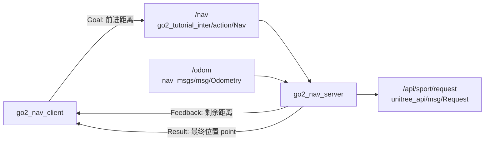

# 第 9 章 用 Action 封装“前进 X 米”

> 上一章我们已经把“开始 / 停止”这种短事务封装成了 Service。这一章再往前走一步:让 Go2 接收一个“前进多少米”的长任务，在执行过程中持续回报剩余距离，结束时再给出最终位置。

## 本章你将学到

- 看懂 `Nav.action` 里 `Goal / Feedback / Result` 三段分别表达什么
- 学会编写 `go2_nav_server` 和 `go2_nav_client`
- 分清 Action 为什么比 Service 更适合“会持续一段时间的任务”

## 背景与原理

Action 可以把一个长任务拆成三层信息:

- **Goal**：我要做什么
- **Feedback**：我做到哪一步了
- **Result**：我最终做成什么样

这正好适合“前进 X 米”这种任务。因为它不是一句“开始”就完事了，中间还需要不断告诉客户端“还剩多少距离”，最后再回一个结果。

当前仓库里的 `go2_nav_server` 实现也很直白:

- 接收一个正的前进距离 `goal`
- 订阅 `/odom`，持续计算已经走了多远
- 每隔 `0.5` 秒发一次反馈 `distance`
- 到达阈值后切到 `STOPMOVE`，再把当前位置作为结果返回

## 架构总览



和上一章相比，最大的区别不是控制链，而是接口层级更丰富了。

客户端不只是“发一次请求然后等结果”，还会在任务过程中不断收到反馈。所以它更像“盯着一个任务跑完”，而不是“打一通电话问一句”。

## 环境准备

这一章继续复用前一章的两个教程包:

- `go2_tutorial_inter`
- `go2_tutorial_py`

先把 Action 定义看清楚。`Nav.action` 位于 `src/tutorial/go2_tutorial_inter/action/` 下:

```text
float32 goal
---
geometry_msgs/Point point
---
float32 distance
```

这三段要牢牢记住:

- `goal`：目标前进距离，单位米
- `point`：任务结束后机器人的最终位置
- `distance`：执行过程中的剩余距离

这里没有 `target_x/target_y`，也没有 `success/message`。这章的任务就是最小版本的“沿当前朝向直线前进 X 米”。

## 实现步骤

### 步骤一:先理解 `go2_nav_server` 的职责

`go2_nav_server` 不是完整导航栈，也不是避障器。它只做一个很小的实验:

- 接一个正数目标距离
- 让机器人向前走
- 一边走一边计算还剩多少
- 到点后停下并回传结果

所以你可以把它理解成“Action 机制教学例子”，而不是可上生产的导航系统。

### 步骤二:实现 `go2_nav_server`

下面这段代码做五件事:

- 创建 `nav` 这个 Action Server
- 订阅 `/odom` 保存当前位置
- 用定时器持续给 Go2 发送 `Request`
- 在 `goal_cb()` 里校验目标距离是否合法
- 在 `execute()` 里计算剩余距离并发布反馈

把下面代码放进 `src/tutorial/go2_tutorial_py/go2_tutorial_py/go2_nav_server.py`:

```python
import json                                # 把速度参数打包成 JSON
import math                                # 计算两点之间的距离
import time                                # 控制反馈发送节奏

import rclpy                              # ROS2 Python 客户端库
from geometry_msgs.msg import Point       # Action 结果里的位置类型
from nav_msgs.msg import Odometry         # 里程计消息
from rclpy.action import ActionServer     # ROS2 Action 服务端
from rclpy.action.server import CancelResponse, GoalResponse, ServerGoalHandle
from rclpy.executors import MultiThreadedExecutor  # 让回调和执行逻辑并发工作
from rclpy.node import Node               # 自定义节点基类
from unitree_api.msg import Request       # Go2 高层控制消息

from go2_tutorial_inter.action import Nav        # 本章的 Action 定义
from .sport_model import ROBOT_SPORT_API_IDS     # Go2 动作 id 常量表


class Go2NavServer(Node):
    def __init__(self):
        super().__init__("go2_nav_server")

        self.point = Point()
        self.odom_sub = self.create_subscription(Odometry, "odom", self.odom_cb, 10)

        self.declare_parameter("x", 0.3)
        self.api_id = ROBOT_SPORT_API_IDS["BALANCESTAND"]
        self.req_pub = self.create_publisher(Request, "/api/sport/request", 10)
        self.timer = self.create_timer(0.1, self.on_timer)

        self.action_server = ActionServer(
            self,
            Nav,
            "nav",
            self.execute,
            goal_callback=self.goal_cb,
            cancel_callback=self.cancel_cb,
        )

    def execute(self, goal_handle: ServerGoalHandle):
        feedback = Nav.Feedback()

        while rclpy.ok():
            time.sleep(0.5)

            dis_x = self.point.x - self.start_point.x
            dis_y = self.point.y - self.start_point.y
            dis = math.sqrt(math.pow(dis_x, 2) + math.pow(dis_y, 2))
            distance = goal_handle.request.goal - dis

            feedback.distance = distance
            goal_handle.publish_feedback(feedback)

            if distance < 0.2:
                self.api_id = ROBOT_SPORT_API_IDS["STOPMOVE"]
                break

        goal_handle.succeed()
        result = Nav.Result()
        result.point = self.point
        return result

    def goal_cb(self, goal_request: Nav.Goal):
        if goal_request.goal > 0.0:
            self.start_point = self.point
            self.get_logger().info("提交的数据合法，机器人开始运动")
            self.api_id = ROBOT_SPORT_API_IDS["MOVE"]
            return GoalResponse.ACCEPT

        self.get_logger().error("提交的数据非法")
        self.api_id = ROBOT_SPORT_API_IDS["STOPMOVE"]
        return GoalResponse.REJECT

    def cancel_cb(self, cancel_request):
        self.api_id = ROBOT_SPORT_API_IDS["STOPMOVE"]
        return CancelResponse.ACCEPT

    def odom_cb(self, odom: Odometry):
        self.point = odom.pose.pose.position

    def on_timer(self):
        req = Request()
        req.header.identity.api_id = self.api_id

        params = {
            "x": self.get_parameter("x").value,
            "y": 0.0,
            "z": 0.0,
        }
        req.parameter = json.dumps(params)
        self.req_pub.publish(req)


def main():
    rclpy.init()

    node = Go2NavServer()
    executor = MultiThreadedExecutor()
    executor.add_node(node)
    executor.spin()

    rclpy.shutdown()
```

读这段代码时，有三件事值得重点盯住。

第一，`goal_cb()` 只接受 **大于 0** 的目标距离。也就是说，本章 Action 不支持负数倒车，更不支持给二维坐标点。

第二，真正的运动控制还是靠后台定时器 `on_timer()` 一直发 `Request`。Action 不会替代这条控制链，它只是把“什么时候开始、什么时候停、什么时候发反馈”组织起来了。

第三，执行函数 `execute()` 里判断到 `distance < 0.2` 才停止，这就是它当前的“到达阈值”。

### 步骤三:实现 `go2_nav_client`

服务端准备好之后，客户端要做的事情就清楚多了:

- 连上 `/nav`
- 发送一个目标距离
- 持续接收 `distance`
- 最后打印 `point`

把下面代码放进 `src/tutorial/go2_tutorial_py/go2_tutorial_py/go2_nav_client.py`:

```python
import sys                                # 读取命令行参数

import rclpy                             # ROS2 Python 客户端库
from rclpy.action import ActionClient    # ROS2 Action 客户端
from rclpy.logging import get_logger     # 打印日志
from rclpy.node import Node              # 自定义节点基类

from go2_tutorial_inter.action import Nav        # 本章的 Action 定义


class Go2NavClient(Node):
    def __init__(self):
        super().__init__("go2_nav_client")
        self.client = ActionClient(self, Nav, "nav")
        self.done = False

    def connect_server(self):
        while not self.client.wait_for_server(1.0):
            self.get_logger().info("服务连接中...")
            if not rclpy.ok():
                return False
        return True

    def send_goal(self, goal):
        goal_msg = Nav.Goal()
        goal_msg.goal = goal
        future = self.client.send_goal_async(goal_msg, self.feedback_callback)
        future.add_done_callback(self.goal_response)

    def goal_response(self, future):
        goal_handle = future.result()
        if goal_handle.accepted:
            self.get_logger().info("目标请求被接收")
            future = goal_handle.get_result_async()
            future.add_done_callback(self.result_response)
        else:
            self.get_logger().info("目标请求被拒绝")
            self.done = True

    def result_response(self, future):
        result = future.result().result
        self.get_logger().info(
            "机器人到达后坐标：(%.2f, %.2f)" % (result.point.x, result.point.y)
        )
        self.done = True

    def feedback_callback(self, fb_msg):
        fb = fb_msg.feedback
        self.get_logger().info("距离目标还有 %.2f 米" % fb.distance)


def main():
    if len(sys.argv) != 2:
        get_logger("rclpy").error("请提交一个浮点类型的参数！")
        return

    rclpy.init()
    go2_nav_client = Go2NavClient()

    if not go2_nav_client.connect_server():
        rclpy.shutdown()
        return

    go2_nav_client.send_goal(float(sys.argv[1]))

    while rclpy.ok() and not go2_nav_client.done:
        rclpy.spin_once(go2_nav_client, timeout_sec=0.1)

    go2_nav_client.destroy_node()
    rclpy.shutdown()
```

这段客户端代码的关键在于 `feedback_callback()`。

Service 是“发一次、等一次”；Action 是“发一次，但中间还能不断收反馈”。所以你看到的“距离目标还有多少米”，本质上就是 Action 比 Service 多出来的那一层能力。

### 步骤四:顺手理解为什么这里要用多线程执行器

`go2_nav_server` 用的是 `MultiThreadedExecutor()`，不是普通 `rclpy.spin()`。

原因很实际:服务端一边要执行 `execute()` 里的长循环，一边还要继续跑定时器和其他回调。如果只有单线程，某些回调可能会被长时间卡住。

对初学者来说，这里先记一个工程经验就够了:

- 短回调、简单节点，普通 `spin()` 就够用
- 有 Action、定时器、长循环同时存在时，多线程执行器更稳

## 编译与运行

先编译接口包和教程包:

```bash
# 编译 Action 示例相关的两个包，并重新加载环境
cd ~/unitree_go2_ws
colcon build --packages-select go2_tutorial_inter go2_tutorial_py
source install/setup.bash
```

第一终端启动 Action 服务端:

```bash
# 启动 Nav Action 服务端
cd ~/unitree_go2_ws
source install/setup.bash
ros2 run go2_tutorial_py go2_nav_server
```

第二终端启动客户端，让机器人前进 `1.0` 米:

```bash
# 发送一个 1.0 米的前进目标
cd ~/unitree_go2_ws
source install/setup.bash
ros2 run go2_tutorial_py go2_nav_client 1.0
```

也可以不用客户端，直接从终端发 Action Goal:

```bash
# 直接从命令行发送 Goal，并持续查看反馈
cd ~/unitree_go2_ws
source install/setup.bash
ros2 action send_goal /nav go2_tutorial_inter/action/Nav "{goal: 1.0}" --feedback
```

如果你想让机器人走得慢一点，可以在服务端启动时改参数:

```bash
# 把前进速度改成 0.2 m/s
cd ~/unitree_go2_ws
source install/setup.bash
ros2 run go2_tutorial_py go2_nav_server --ros-args -p x:=0.2
```

## 结果验证

这一章跑通后，你应该能确认下面几件事:

1. `ros2 action list -t` 里能看到 `/nav [go2_tutorial_inter/action/Nav]`
2. 客户端会持续打印“距离目标还有 xx 米”
3. 到达阈值后，客户端会输出最终坐标 `point`
4. 服务端在任务结束后会把动作切回 `STOPMOVE`

推荐按下面顺序自检:

```bash
# 看 Action Server 是否上线
ros2 action list -t

# 查看接口定义
ros2 interface show go2_tutorial_inter/action/Nav

# 观察 Go2 控制消息
ros2 topic echo /api/sport/request --once
```

当任务执行中时，`/api/sport/request` 的 `api_id` 应该是 `MOVE`；到达终点后，它应切回 `STOPMOVE`。

{ width="600" }

## 常见问题

### 1. `ros2 action send_goal` 直接被拒绝

**现象**:一发 Goal，客户端就提示目标请求被拒绝。

**原因**:当前代码只接受大于 `0.0` 的 `goal`。你传了 `0` 或负数，就会被 `goal_cb()` 拒绝。

**解决**:

- 用正数重新发 Goal，比如 `1.0`
- 如果以后你想支持倒车，那是后续扩展，不是当前仓库这版逻辑

### 2. 能收到反馈，但机器人不动

**现象**:日志一直在更新剩余距离，机器人却没明显前进。

**原因**:Action 本身没有直接驱动电机，它只是组织任务流程。真正的运动还是依赖 `/api/sport/request` 那条控制链。

**解决**:

- 用 `ros2 topic echo /api/sport/request --once` 确认消息确实在发
- 确认 Go2 高层控制环境已经就绪
- 必要时把服务端参数 `x` 调大一点点，比如 `0.3`

### 3. 剩余距离一直不变

**现象**:`distance` 每次打印都差不多，像卡住了一样。

**原因**:服务端依赖 `/odom` 来计算已经走了多远。如果 `/odom` 没更新，剩余距离当然不会变。

**解决**:

- 先看 `ros2 topic echo /odom --once`
- 确认第 6 章驱动链已经跑通
- 再检查机器人是不是实际真的在移动

### 4. 任务结束了，但机器人没有立刻停稳

**现象**:客户端已经打印最终坐标，机器人动作还有一点余量。

**原因**:当前代码用的是 `distance < 0.2` 作为停止阈值，本来就留了一点工程余量，不是“距离精确到 0.000 就停”。

**解决**:

- 先把它理解成教学版容差，不是 bug
- 如果后续想更严格，可以再单独调阈值逻辑

## 本章小结

这一章我们把 Go2 的一个长任务封装成了标准 ROS2 Action。

和上一章相比，最大的收获不是“又多了一个接口”，而是你真正看懂了 Goal、Feedback、Result 三段信息各自负责什么。对于机器人开发来说，这是一种非常常见的任务组织方式。

更重要的是，你现在已经能把前三章通信主线串起来了:

- 第 7 章教你最小控制节点怎么持续发 `Request`
- 第 8 章教你怎么用 Service 做短事务控制
- 第 9 章教你怎么用 Action 管一个会持续一段时间的任务

## 下一步

前面三章都还停留在“通信机制怎么用”。从下一章开始，我们把视线转回感知链路，先去把 Go2 的点云数据吃明白，再慢慢往 SLAM 和导航栈推进。
