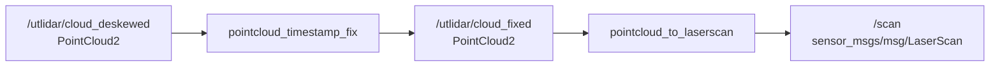

# 第 10 章 点云预处理与 2D LaserScan 投影

> 前面几章我们一直在搭控制和驱动底座。从这一章开始，主线正式切到感知侧。当前仓库里，雷达相关的真实包叫 `go2_sensors`，它负责把 Go2 的点云整理成后面 SLAM 和导航都能直接消费的标准输入。

## 本章你将学到

- 理解为什么当前感知链要先修点云时间戳，再做点云转 LaserScan
- 看懂 `go2_sensors` 包里的真实可执行入口和 launch 文件
- 学会把 `/utlidar/cloud_deskewed` 整理成 `/scan`

## 背景与原理

当前 Go2 感知链不是直接“拿到点云就去做 SLAM”，中间还要补两步预处理:

1. 修时间戳
2. 把 3D 点云投影成 2D `LaserScan`

第一步的原因很工程化。原始点云的时间戳如果和当前 TF 时间对不上，后面的坐标变换就容易失败。`pointcloud_timestamp_fix` 的作用，就是把点云时间戳改成“当前时间”，让后面的 TF 查询更稳定。

第二步则是因为这一期 2D SLAM 和 Nav2 基线都吃 `LaserScan`。所以我们要把 `/utlidar/cloud_deskewed` 先整理成 `/scan`，后面的建图和导航章节才接得上。

## 架构总览



和旧版资料不同，当前代码树里没有那层独立的“雷达实验包 + 统计/过滤示例节点”。

现在这条链路非常明确:

- 包名是 `go2_sensors`
- 可执行入口是 `pointcloud_timestamp_fix`
- 总启动文件是 `pointcloud_to_laserscan.launch.py`

## 环境准备

开始前先确认下面几个条件成立:

- 第 6 章的 `go2_driver_py` 已经能正常跑
- 机器人侧点云话题 `/utlidar/cloud_deskewed` 已经有数据
- 工作空间里已经装好了 `pointcloud_to_laserscan` 依赖

当前 `go2_sensors` 包的真实入口在 `setup.py` 里长这样:

```python
package_name = "go2_sensors"

entry_points = {
    "console_scripts": [
        "pointcloud_timestamp_fix = go2_sensors.pointcloud_timestamp_fix:main",
    ],
}
```

这意味着本章真正能 `ros2 run` 的只有 `pointcloud_timestamp_fix`，不是别的自定义实验节点。

## 实现步骤

### 步骤一:看懂 `pointcloud_timestamp_fix.py`

先看点云时间戳修复节点的核心部分:

```python
class PointCloudTimestampFix(Node):
    def __init__(self):
        super().__init__("pointcloud_timestamp_fix")

        self.declare_parameter("input_topic", "/utlidar/cloud")
        self.declare_parameter("output_topic", "/utlidar/cloud_fixed")

        input_topic = self.get_parameter("input_topic").value
        output_topic = self.get_parameter("output_topic").value

        self.subscription = self.create_subscription(
            PointCloud2, input_topic, self.pointcloud_callback, sub_qos
        )
        self.publisher = self.create_publisher(
            PointCloud2, output_topic, pub_qos
        )

    def pointcloud_callback(self, msg: PointCloud2):
        fixed_msg = PointCloud2()
        fixed_msg.header = msg.header
        fixed_msg.height = msg.height
        fixed_msg.width = msg.width
        fixed_msg.fields = msg.fields
        fixed_msg.is_bigendian = msg.is_bigendian
        fixed_msg.point_step = msg.point_step
        fixed_msg.row_step = msg.row_step
        fixed_msg.data = msg.data
        fixed_msg.is_dense = msg.is_dense

        fixed_msg.header.stamp = self.get_clock().now().to_msg()
        self.publisher.publish(fixed_msg)
```

这段代码最关键的动作就一句:把 `fixed_msg.header.stamp` 改成当前时间。

换句话说，它并没有改点云坐标，也没有做滤波，甚至没有改字段结构。它只是复制整帧点云，再把时间戳修正掉。这也解释了为什么它能作为一层非常薄的预处理节点存在。

### 步骤二:看懂 `pointcloud_to_laserscan.launch.py`

当前感知链最推荐的入口不是单独起两个节点，而是直接用 launch 把它们串起来。

`src/navigation/go2_sensors/launch/pointcloud_to_laserscan.launch.py` 的主线如下:

```python
return LaunchDescription([
    Node(
        package="go2_sensors",
        executable="pointcloud_timestamp_fix",
        name="pointcloud_timestamp_fix",
        parameters=[{
            "input_topic": "/utlidar/cloud_deskewed",
            "output_topic": "/utlidar/cloud_fixed",
        }],
        output="screen",
    ),
    Node(
        package="pointcloud_to_laserscan",
        executable="pointcloud_to_laserscan_node",
        name="pointcloud_to_laserscan",
        parameters=[params_file],
        remappings=[
            ("cloud_in", "/utlidar/cloud_fixed"),
            ("scan", "/scan"),
        ],
        output="screen",
    ),
])
```

这份 launch 已经把本章最关键的两步都串好了:

- 输入点云固定走 `/utlidar/cloud_deskewed`
- 修完时间戳后发到 `/utlidar/cloud_fixed`
- 再把它投影成 `/scan`

所以你后面只要 `ros2 launch go2_sensors pointcloud_to_laserscan.launch.py`，就相当于整条 3D -> 2D 预处理链一起起来了。

### 步骤三:看懂配置文件里最关键的三个参数

再来看 `src/navigation/go2_sensors/config/pointcloud_to_laserscan_params.yaml`。

这份配置有很多参数，但当前最值得先记住的是这三个:

```yaml
cloud_in: /utlidar/cloud_fixed
scan_out: /scan
target_frame: "base"
```

它们分别回答了三个问题:

- 从哪里读点云
- 最后往哪里发 `LaserScan`
- 扫描结果要落在哪个坐标系里

这里的 `target_frame` 一定要注意是 `base`，不是 `base_link`。因为当前实机侧 Go2 代码口径统一就是 `base`。

### 步骤四:为什么这里不再写旧版雷达实验包

你如果对照旧资料，会发现以前会先拉一个独立实验包做点云统计、点云过滤，再慢慢过渡到正式感知包。

当前代码树已经不这么组织了。现在我们直接把真正会复用到后面章节的功能收进 `go2_sensors`:

- 时间戳修复
- 点云转 `LaserScan`

这种结构对后面的 SLAM 和 Nav2 更友好，因为它更像正式工程里的“可复用预处理层”，而不是一个临时实验包。

## 编译与运行

先编译感知链相关包:

```bash
# 编译点云预处理相关包
cd ~/unitree_go2_ws
colcon build --packages-select go2_sensors go2_driver_py
source install/setup.bash
```

最推荐的启动方式是直接拉起整条预处理链:

```bash
# 启动点云时间戳修复 + 点云转 LaserScan
cd ~/unitree_go2_ws
source install/setup.bash
ros2 launch go2_sensors pointcloud_to_laserscan.launch.py
```

如果你只想单独看时间戳修复节点，也可以这样起:

```bash
# 只启动 pointcloud_timestamp_fix
cd ~/unitree_go2_ws
source install/setup.bash
ros2 run go2_sensors pointcloud_timestamp_fix \
  --ros-args -p input_topic:=/utlidar/cloud_deskewed -p output_topic:=/utlidar/cloud_fixed
```

## 结果验证

这一章跑通后，至少要确认下面三条话题关系已经成立:

1. `/utlidar/cloud_deskewed` 有原始点云
2. `/utlidar/cloud_fixed` 有修好时间戳后的点云
3. `/scan` 有最终投影后的 `LaserScan`

推荐按下面顺序检查:

```bash
# 看原始点云
ros2 topic echo /utlidar/cloud_deskewed --once

# 看修复后的点云
ros2 topic echo /utlidar/cloud_fixed --once

# 看最终的 LaserScan
ros2 topic echo /scan --once
```

你还可以用下面这条命令检查最终发布的扫描是不是稳定:

```bash
# 看 /scan 的发布频率
ros2 topic hz /scan
```

## 常见问题

### 1. `/scan` 一直没有数据

**现象**:launch 正常启动，但 `/scan` 空空如也。

**原因**:最常见的是上游点云没进来，或者时间戳修复节点根本没吃到 `/utlidar/cloud_deskewed`。

**解决**:

- 先看 `/utlidar/cloud_deskewed`
- 再看 `/utlidar/cloud_fixed`
- 哪一层断了，就回哪一层排

### 2. `pointcloud_to_laserscan` 报 TF 相关错误

**现象**:日志里不断提示无法做坐标变换。

**原因**:通常是点云时间戳和当前 TF 时间对不上，或者 `target_frame` 配错了。

**解决**:

- 确认 `pointcloud_timestamp_fix` 已经在跑
- 确认配置里的 `target_frame` 是 `base`
- 确认第 6 章驱动链已经发布 `odom -> base`

### 3. 我为什么找不到 `lidar_stats` 或 `cloud_filter`

**现象**:你按旧资料在找那几个独立雷达实验节点，但当前仓库没有。

**原因**:当前代码树已经直接把正式预处理链收进 `go2_sensors` 了，不再维护那层教学实验包。

**解决**:

- 直接用 `pointcloud_timestamp_fix`
- 直接用 `pointcloud_to_laserscan.launch.py`
- 后面建图和导航也都默认走这条链

### 4. `/scan` 有数据，但建图效果很差

**现象**:消息层面都正常，可一到 SLAM 就飘。

**原因**:这一章只是把输入整理成标准格式，不保证后面算法一定稳。建图效果还会受到 QoS、TF、机器人运动方式等多种因素影响。

**解决**:

- 先确认本章这三条话题都稳定
- 再到下一章去排 SLAM Toolbox 的配置和 QoS

## 本章小结

这一章我们把当前代码树里真正存在的感知预处理链梳理清楚了。

最重要的结论是:

- 包名是 `go2_sensors`
- 可执行入口是 `pointcloud_timestamp_fix`
- 总启动文件是 `pointcloud_to_laserscan.launch.py`

后面做 2D SLAM、Nav2 基线时，都会默认建立在这条 `/utlidar/cloud_deskewed -> /utlidar/cloud_fixed -> /scan` 的链路上。

## 下一步

现在点云已经能稳定投影成 `LaserScan` 了，下一章我们就正式把这份 `/scan` 接给 SLAM Toolbox，让 Go2 开始在真实环境里建第一张 2D 地图。
