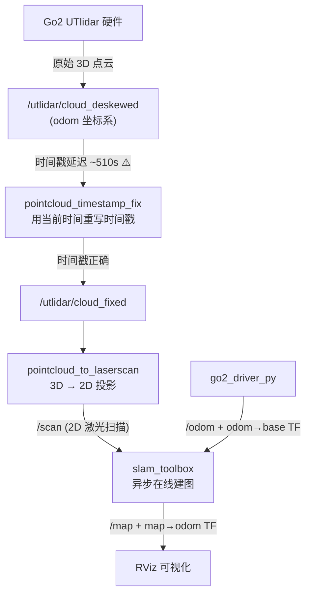
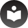

# 第 11 章 2D SLAM 建图实战

> 前面十章,你已经让 Go2 能动、能听话、能在 RViz 里"照镜子"。但它还没有"空间记忆"—— 走出去十米就不知道自己走了多远,更别提回家。从本章开始,我们给它装上这块记忆。

---

## 本章你将学到

- 理解激光 SLAM 的基本思路(前端扫描匹配 + 后端图优化 + 回环检测)
- 明白为什么 Go2 的**3D 点云**要被"压扁"成 **2D 激光扫描**
- 用 SLAM Toolbox 在线建出一张可用的 2D 栅格地图
- 诊断 3 类典型踩坑:**点云时间戳延迟**、**QoS 策略不兼容**、**TF 坐标系缺失**
- 把建好的地图保存下来,为第 13 章的自主导航打底

---

## 背景与原理

### 什么是 SLAM

SLAM 全称 **Simultaneous Localization And Mapping**,同时定位与建图。

想象你第一次进一座迷宫 —— 没有地图,但你得一边走一边做两件事:

1. **记住自己在哪**(相对于起点往北走了多少、左转了几次)
2. **画一张地图**(把看到的墙壁、门、拐角记下来)

这两件事是**互相依赖**的:你得先知道"我在哪",才知道刚刚看到的墙画在地图的什么位置;反过来,地图画出来后又能帮你确认"我真的走到这儿了吗"。

机器人做 SLAM 就是这个过程自动化。算法层面通常拆成三块:

| 模块 | 干什么 | 类比 |
|---|---|---|
| **前端(Scan Matching)** | 把当前这一帧激光数据,和上一帧(或最近的关键帧)对齐,算出"我移动了多少" | 数步子 |
| **后端(Graph Optimization)** | 把所有关键帧连成一张图,反复微调让整体一致 | 回家后对着笔记把地图画端正 |
| **回环检测(Loop Closure)** | 识别出"哎?这地方我好像来过",把累积的误差一次性修正 | 走了一圈发现回到起点,把地图首尾对齐 |

### 2D 还是 3D?

SLAM 按地图维度分 2D(平面栅格)和 3D(点云/体素)两大类。本书**第一次建图选 2D**,因为:

- 教学友好 —— 一张俯视图,眼睛一看就懂
- 硬件要求低 —— 不需要强劲 GPU
- Nav2 原生支持 —— 下一章导航直接用
- 室内平地够用 —— Go2 的主战场就是这种场景

至于 3D SLAM(KISS-ICP / FAST-LIO / Point-LIO 之类),我们放在第 12 章再讲。

### SLAM Toolbox 是什么

[SLAM Toolbox](https://github.com/SteveMacenski/slam_toolbox) 是 ROS2 生态里最主流的 2D 激光 SLAM 包。它的卖点:

- 开源、文档全、社区活跃
- 支持**在线建图**(边走边画) 和 **离线建图**(回放 bag)
- 支持**异步模式**(async) —— 不保证每帧都处理,但低延迟,适合实时建图
- 原生支持**地图序列化** —— 下次可以继续在这张地图上补建,不用重新开始

本章我们用**异步在线模式**。

### Go2 雷达的"适配问题"

Go2 EDU 自带的是 **L1 4D 雷达**,发布的是 **3D 点云**(`/utlidar/cloud_deskewed`)。但 SLAM Toolbox 只吃 **2D LaserScan**(`/scan`)。

解决办法:**把 3D 点云压扁成 2D 扫描** —— 只保留某个高度区间内的点,投影到一个水平面上。这个活由 ROS2 官方的 `pointcloud_to_laserscan` 包完成。

!!! note "为什么这样做不是"掉精度""
    建图只关心"哪里能走、哪里是墙"。墙从地面到天花板都是墙,保留 0.1m 高度的那一圈就够判断。天花板和地板,我们**主动过滤掉**—— 因为地板会被当成"障碍物"把路堵死。

---

## 架构总览

### 数据流



### TF 树

```
map                  ← SLAM Toolbox 发布
  └── odom           ← go2_driver_py 发布(里程计)
        └── base     ← 机器人躯干中心,离地约 0.31m
              ├── FL_hip → ... → FL_foot
              ├── FR_hip → ... → FR_foot
              ├── RL_hip → ... → RL_foot
              ├── RR_hip → ... → RR_foot
              ├── imu
              └── radar → utlidar_lidar
```

!!! warning "坐标系叫 `base` 不是 `base_link`"
    Go2 原生 TF 用的是 `base`,Nav2 默认期望 `base_link`。全书统一用 **`base`**,凡是第三方配置里写着 `base_link` 的地方都要改成 `base`。

---

## 环境准备

### 前置成果

本章**直接复用第 6 章完成的 `go2_driver_py` 包** —— 它已经能发布 `/odom` 和 `odom→base` 的 TF。如果你跳着看到这儿,先回第 6 章把驱动跑起来。

### 新增依赖

打开终端,装三件套:

```bash
# slam_toolbox: SLAM 核心包
# pointcloud_to_laserscan: 3D 点云压扁成 2D 扫描
# nav2_map_server: 用来保存地图成 pgm + yaml 格式
# tf2_tools: 可视化 TF 树(调试用)
sudo apt install -y \
    ros-humble-slam-toolbox \
    ros-humble-pointcloud-to-laserscan \
    ros-humble-nav2-map-server \
    ros-humble-tf2-tools
```

检查装没装上:

```bash
# 列一下相关包,有输出就是装上了
ros2 pkg list | grep -E "slam_toolbox|pointcloud_to_laserscan"
```

---

## 实现步骤

我们会在工作空间里新建两个 ROS2 包:

- `go2_sensors` —— 传感器数据处理(时间戳修复、点云转扫描)
- `go2_slam` —— SLAM 配置、启动文件、地图存储

### 步骤一:创建 go2_sensors 包

在工作空间的 `src/` 目录下创建感知包:

```bash
# 进入工作空间源码目录
cd ~/unitree_go2_ws/src

# 创建 Python 类型的 ROS2 包,声明需要的依赖
ros2 pkg create go2_sensors \
    --build-type ament_python \
    --dependencies rclpy sensor_msgs
```

### 步骤二:写"时间戳修复"节点

**为什么需要**:Go2 的 UTlidar 驱动发布点云时,带的时间戳比系统时间**早约 510 秒**(原因未明,可能是固件内部时钟漂移)。这会让下游节点查不到对应时刻的 TF,整条管线直接崩掉。

**怎么修**:写一个"中转节点",收到点云后把时间戳替换成**当前系统时间**,数据本身不动,再重新发出去。

在 `go2_sensors/go2_sensors/` 目录下创建 `pointcloud_timestamp_fix.py`:

```python
#!/usr/bin/env python3
"""
时间戳修复节点:订阅原始点云,重写时间戳为当前系统时间后重新发布。
专治 Go2 UTlidar 点云时间戳早于系统时间的毛病。
"""

import rclpy                                       # ROS2 Python 客户端库,节点的入口
from rclpy.node import Node                        # 所有 ROS2 节点的基类
from rclpy.qos import QoSProfile, ReliabilityPolicy, HistoryPolicy  # QoS 策略,控制通信可靠性
from sensor_msgs.msg import PointCloud2            # 标准点云消息类型


class PointCloudTimestampFix(Node):
    def __init__(self):
        super().__init__("pointcloud_timestamp_fix")

        # 订阅 QoS:BEST_EFFORT(不保证每一帧都收到,但延迟低)
        # 选 BEST_EFFORT 是因为 Go2 驱动发布时兼容这个策略
        sub_qos = QoSProfile(
            reliability=ReliabilityPolicy.BEST_EFFORT,
            history=HistoryPolicy.KEEP_LAST,
            depth=5,
        )

        # 发布 QoS:RELIABLE(保证 SLAM 一帧不漏,必要时重传)
        pub_qos = QoSProfile(
            reliability=ReliabilityPolicy.RELIABLE,
            history=HistoryPolicy.KEEP_LAST,
            depth=5,
        )

        # 订阅原始点云
        self.sub = self.create_subscription(
            PointCloud2,
            "/utlidar/cloud_deskewed",
            self.on_cloud,
            sub_qos,
        )

        # 发布时间戳修复后的点云,下游节点来订这个话题
        self.pub = self.create_publisher(
            PointCloud2,
            "/utlidar/cloud_fixed",
            pub_qos,
        )

        self.get_logger().info("时间戳修复节点已启动")

    def on_cloud(self, msg: PointCloud2) -> None:
        # 用当前系统时间覆盖原来的时间戳,其他字段不动
        msg.header.stamp = self.get_clock().now().to_msg()
        self.pub.publish(msg)


def main():
    rclpy.init()
    node = PointCloudTimestampFix()
    try:
        rclpy.spin(node)
    finally:
        node.destroy_node()
        rclpy.shutdown()


if __name__ == "__main__":
    main()
```

**这段代码做了三件事**:

1. 声明两种 QoS:订阅端**宽松**(跟得上 Go2 原生驱动就行),发布端**严格**(不能让 SLAM 丢帧)
2. 订阅 `/utlidar/cloud_deskewed`,在回调里只改 `header.stamp`,其余 `fields` / `data` 完全不动
3. 发布到 `/utlidar/cloud_fixed`,下游节点订这个就拿到时间戳正确的点云

然后把节点注册进 `setup.py` 的 `entry_points`:

```python
entry_points={
    "console_scripts": [
        "pointcloud_timestamp_fix = go2_sensors.pointcloud_timestamp_fix:main",
    ],
},
```

### 步骤三:配置 pointcloud_to_laserscan

`pointcloud_to_laserscan` 是现成的包,我们只需要给它一份参数文件。在 `go2_sensors/config/pointcloud_to_laserscan_params.yaml` 写:

```yaml
# 3D 点云 → 2D 扫描 的转换参数
/pointcloud_to_laserscan_node:
  ros__parameters:
    # ---- 坐标系 ----
    target_frame: base               # 输出的 LaserScan 定义在 base 坐标系下

    # ---- 高度过滤(相对 base 坐标系)----
    # base 原点离地面 ~0.31m,即地面在 base 中 Z ≈ -0.31
    min_height: -0.28                # 略高于地面,防止地面反射当障碍
    max_height: 1.0                  # 足够覆盖大部分室内障碍(桌椅/人)

    # ---- 距离过滤 ----
    range_min: 0.3                   # 低于此距离的点视为自身反射或近场噪声
    range_max: 20.0                  # L1 雷达有效测距远端

    # ---- 角度分辨率 ----
    angle_increment: 0.0087          # 约 0.5°/射线,一圈 723 射线

    # ---- 性能 ----
    use_inf: true                    # 无返回时填 inf 而非最大距离(SLAM 更稳)
```

!!! tip "高度过滤参数是调出来的,不是算出来的"
    我们用对照实验测过三组参数:
    
    | min_height | max_height | range_min | 有效射线 | 平均距离 | 评价 |
    |:-:|:-:|:-:|:-:|:-:|---|
    | -0.5 | 1.0 | 0.1 | 255 (35%) | 0.79 m | 地面噪声太多,墙壁被淹没 |
    | -0.1 | 0.5 | 0.1 | 61 (8%) | 2.25 m | 过滤过头,看不到桌椅 |
    | **-0.28** | **1.0** | **0.3** | **51 (7%)** | **4.75 m** | **本书选用** |
    
    别看有效射线只有 7%,这些射线的"信噪比"最高,建出的地图最干净。

### 步骤四:创建 go2_slam 包

```bash
cd ~/unitree_go2_ws/src

# SLAM 包只放配置和 launch,不需要 Python 节点,用最轻的 ament_cmake 即可
ros2 pkg create go2_slam \
    --build-type ament_cmake
```

建立子目录:

```bash
# config 放参数文件,launch 放启动文件,maps 存建好的地图
mkdir -p go2_slam/config go2_slam/launch go2_slam/maps
```

### 步骤五:配置 SLAM Toolbox

在 `go2_slam/config/slam_toolbox_params.yaml` 写:

```yaml
# SLAM Toolbox 异步在线建图参数
slam_toolbox:
  ros__parameters:
    # ---- 运行模式 ----
    use_sim_time: false              # 实机运行,使用系统时间
    mode: mapping                    # mapping(建图) / localization(纯定位)

    # ---- 坐标系 ----
    odom_frame: odom
    map_frame: map
    base_frame: base                 # ⚠ Go2 用 base 不是 base_link
    scan_topic: /scan

    # ---- QoS 匹配 ----
    # /scan 上游用 BEST_EFFORT,这里必须对齐,否则订不到
    qos_overrides:
      /scan:
        subscription:
          reliability: best_effort

    # ---- 建图触发条件 ----
    # 机器人移动/转动超过阈值才触发一次新的关键帧,避免同一位置刷帧
    minimum_travel_distance: 0.2     # 移动 0.2 m 才更新
    minimum_travel_heading: 0.2      # 转动 0.2 rad(~11.5°)才更新

    # ---- 地图参数 ----
    resolution: 0.05                 # 5 cm / 像素,室内场景够用
    map_update_interval: 5.0         # 每 5 秒向 /map 话题推一次最新地图

    # ---- 回环检测 ----
    do_loop_closing: true            # 开启回环,绕一圈能对齐的话地图质量大大提升
    loop_search_maximum_distance: 3.0
    loop_match_minimum_chain_size: 10

    # ---- 扫描匹配参数(默认值通常够用,列出来便于调优)----
    link_match_minimum_response_fine: 0.1
    correlation_search_space_dimension: 0.5
    correlation_search_space_resolution: 0.01
    fine_search_angle_offset: 0.00349
    coarse_search_angle_offset: 0.349
```

### 步骤六:写一键启动 launch

一次启动涉及的节点挺多,手工敲 7 个终端太痛苦。我们写一个 launch 文件把它们串起来。`go2_slam/launch/mapping.launch.py`:

```python
"""
一键启动建图:驱动 + 传感器处理 + SLAM + RViz
"""

from pathlib import Path                              # 处理 launch 文件内的相对路径
from launch import LaunchDescription                  # ROS2 launch 的顶层描述对象
from launch_ros.actions import Node                   # 启动一个 ROS2 节点
from launch.actions import IncludeLaunchDescription   # 嵌套另一个 launch 文件
from launch.launch_description_sources import PythonLaunchDescriptionSource
from ament_index_python.packages import get_package_share_directory


def generate_launch_description():
    # 本包的 share 目录,用来定位 config 文件
    slam_share = Path(get_package_share_directory("go2_slam"))
    sensors_share = Path(get_package_share_directory("go2_sensors"))

    slam_params = str(slam_share / "config" / "slam_toolbox_params.yaml")
    scan_params = str(sensors_share / "config" / "pointcloud_to_laserscan_params.yaml")

    # 1) Go2 驱动 —— 复用第 6 章的包,提供 odom/TF
    driver = IncludeLaunchDescription(
        PythonLaunchDescriptionSource(
            str(Path(get_package_share_directory("go2_driver_py"))
                / "launch" / "driver.launch.py")
        )
    )

    # 2) 时间戳修复 —— 第 11 章新增
    timestamp_fix = Node(
        package="go2_sensors",
        executable="pointcloud_timestamp_fix",
        name="pointcloud_timestamp_fix",
        output="screen",
    )

    # 3) 3D 点云 → 2D 扫描
    pc_to_scan = Node(
        package="pointcloud_to_laserscan",
        executable="pointcloud_to_laserscan_node",
        name="pointcloud_to_laserscan_node",
        parameters=[scan_params],
        remappings=[
            ("cloud_in", "/utlidar/cloud_fixed"),     # 订时间戳修复后的点云
            ("scan", "/scan"),                         # 输出标准 /scan 话题
        ],
        output="screen",
    )

    # 4) SLAM Toolbox 本体
    slam = Node(
        package="slam_toolbox",
        executable="async_slam_toolbox_node",
        name="slam_toolbox",
        parameters=[slam_params],
        output="screen",
    )

    # 5) RViz —— 加载 SLAM 专用配置(Fixed Frame = map)
    rviz_cfg = str(slam_share / "config" / "slam.rviz")
    rviz = Node(
        package="rviz2",
        executable="rviz2",
        arguments=["-d", rviz_cfg],
        output="screen",
    )

    return LaunchDescription([driver, timestamp_fix, pc_to_scan, slam, rviz])
```

### 步骤七:准备 RViz 配置

最后在 `go2_slam/config/slam.rviz` 保存一个专用 RViz 布局:

- **Fixed Frame**:`map`(建图时要站在地图视角看机器人移动)
- **显示项**:Map + LaserScan(颜色选绿、Reliability 选 `Best Effort`) + RobotModel + TF
- **视角**:`TopDownOrtho`(俯视正交,2D 地图看得最清)

!!! tip "RViz 配置文件怎么来"
    实际操作:在 RViz 里手动布好界面 → **File → Save Config As** → 存到 `go2_slam/config/slam.rviz`。之后每次 launch 自动加载。

---

## 编译与运行

### 编译

```bash
# 回到工作空间根目录
cd ~/unitree_go2_ws

# 只编译本章新增的两个包,节省时间
colcon build --packages-select go2_sensors go2_slam

# 加载编译产物到当前终端
source install/setup.bash
```

### 启动建图

```bash
# 一条命令,所有相关节点一起上
ros2 launch go2_slam mapping.launch.py
```

启动后你会看到:

1. 终端刷出 5 个节点的启动日志
2. RViz 弹出,左上角 Fixed Frame 是 `map`
3. 几秒后,机器人模型出现,周围开始画出 2D 地图雏形

### 操控机器人建图

**新开一个终端**,用第 3 章的键盘节点驱动 Go2 慢慢走:

```bash
# 记得先 source
source ~/unitree_go2_ws/install/setup.bash

# 启动键盘控制
ros2 run go2_teleop_ctrl_keyboard go2_teleop_ctrl_keyboard
```

建图小技巧:

- 🐢 **慢走** —— 每秒 0.2 m 最稳;快走会让扫描匹配失败,地图出现扭曲
- 🔄 **尽量绕圈回起点** —— 触发回环检测,地图一次性对齐
- 🧱 **特征丰富的路径优先** —— 空旷走廊建图质量差,因为扫描匹配找不到参照
- 👀 **实时看 RViz** —— 发现地图歪了/重影了,马上停,排查问题比硬建强

### 保存地图

建完满意后,**不要关终端**,新开一个终端保存地图:

```bash
# 保存为标准 pgm + yaml 格式,给下一章 Nav2 用
ros2 run nav2_map_server map_saver_cli \
    -f ~/unitree_go2_ws/src/go2_slam/maps/my_map
```

你会得到两个文件:

- `my_map.pgm` —— 地图图像(黑=障碍、白=空地、灰=未知)
- `my_map.yaml` —— 元数据(分辨率、原点、阈值)

如果希望**下次继续在这张地图上补建**,用 SLAM Toolbox 的序列化功能:

```bash
# 序列化保存,包含位姿图信息,可恢复
ros2 service call /slam_toolbox/serialize_map \
    slam_toolbox/srv/SerializePoseGraph \
    "{filename: 'my_map'}"
```

---

## 结果验证

{ width="640" }

### 命令行检查

打开另一个终端,依次跑:

```bash
# 1) /scan 话题应该有数据,类型是 LaserScan
ros2 topic echo /scan --no-arr --once

# 2) /map 话题应该在推送 OccupancyGrid
ros2 topic hz /map

# 3) TF 树应该是连通的: map → odom → base → 各关节
ros2 run tf2_tools view_frames
# 会在当前目录生成 frames.pdf,用 PDF 阅读器打开检查
```

**正常标志**:

- `/scan` 有稳定的 `ranges` 数组输出(~723 个数值)
- `/map` 话题频率在 0.2 Hz 左右(5 秒一帧,与 `map_update_interval` 对应)
- `frames.pdf` 里能看到从 `map` 一路连到 `base`,中间无断裂

### 地图质量自检

建图结束后打开 `my_map.pgm`:

- ✅ **好地图**:墙壁连续、拐角清晰、房间轮廓闭合
- ❌ **差地图的常见症状**:
  - 一堵墙画成两条平行线 → 回环检测没触发,或者走太快
  - 整张图歪斜 → 里程计漂移严重,需要 IMU 融合(进阶话题,本书暂不展开)
  - 地板被画成障碍 → `min_height` 设太低

---

## 常见问题

### Q1: 启动后 `/scan` 话题没数据

**排查顺序**:

```bash
# 1. 检查原始点云是否在发
ros2 topic hz /utlidar/cloud_deskewed
# 没输出 → Go2 雷达驱动没起;检查 unitree_ros2 setup.sh 有没 source

# 2. 检查时间戳修复节点是否在发
ros2 topic hz /utlidar/cloud_fixed
# 没输出 → pointcloud_timestamp_fix 没启,看 launch 日志

# 3. 检查 pointcloud_to_laserscan 节点
ros2 node list | grep pointcloud_to_laserscan
# 没有 → launch 里的节点配置有误
```

### Q2: 地图出现"鬼影"(同一墙壁画在多个位置)

**典型原因**:机器人被抱起/猛推/滑了一下,里程计瞬间跳变,SLAM 没跟上。

**应对**:

- 建图时**不要强行抬起或推机器人**
- 若已经出现鬼影,可以用 SLAM Toolbox 的手动清除服务:
  ```bash
  ros2 service call /slam_toolbox/clear_changes std_srvs/srv/Empty "{}"
  ```
- 终极方案:IMU 融合(用 `robot_localization` 做 EKF),不在本章范围,留作进阶

### Q3: RViz 报 "Transform data too old" 或 "Lookup would require extrapolation"

**原因**:TF 时间戳和查询时间对不上,常见于时间戳修复节点没起来。

**快速判断**:

```bash
# 看看 cloud_fixed 的 header.stamp 是不是接近系统时间
ros2 topic echo /utlidar/cloud_fixed --no-arr --once
# 对比 `date +%s.%N` 的输出,差值应该在 1 秒内
```

如果差值很大(几百秒),说明你订到的是没修过的 `cloud_deskewed`,检查 launch 里 `remappings` 的配置。

### Q4: SLAM Toolbox 收不到 `/scan`

**原因 9 成是 QoS 不匹配**。SLAM Toolbox 默认用 RELIABLE 订阅,而我们的 `/scan` 是 BEST_EFFORT 发布。

**验证**:

```bash
# -v 展开显示 QoS 信息
ros2 topic info /scan -v
# 找 "Reliability: BEST_EFFORT" 和 "Reliability: RELIABLE" 的发订者
# 发布 BEST_EFFORT + 订阅 RELIABLE = 兼容不上
```

**修复**:确认 `slam_toolbox_params.yaml` 里有 `qos_overrides` 段,并重启 SLAM 节点。

### Q5: 机器人不动 / 动了但 /odom 不变

检查第 6 章的 `go2_driver_py` 有没有起来:

```bash
ros2 node list | grep driver
ros2 topic hz /odom
```

没起就单独 launch 驱动,再看一遍本章步骤。

---

## 本章小结

- SLAM = **前端(扫描匹配) + 后端(图优化) + 回环检测**,让机器人边走边画边修正
- Go2 的 3D 点云需要**过滤高度 + 压扁成 2D 扫描**才能喂给 SLAM Toolbox
- 实战中踩了三个典型坑:**时间戳延迟、QoS 不对齐、TF 要用 `base` 不是 `base_link`** —— 记住这三点能省一天调试
- 建完地图用 `nav2_map_server` 保存成 pgm + yaml,下一章 Nav2 要加载它

---

## 下一步

本章的地图只是"看着像样"。真正的考验是 —— **让 Go2 加载这张地图、自己找到起点、然后自主走到你指定的目标**。那就是 [第 12 章 Nav2 基线导航](12-nav2-baseline.md) 的任务。

第 12 章我们会先绕个小弯,对比 3D SLAM 的几个主流方案(KISS-ICP / FAST-LIO / Point-LIO),给想进一步折腾的同学一条路径。只想把 Go2 用起来的同学可以跳过 12 章直奔 13 章。

---

## 拓展阅读

- **SLAM Toolbox 官方仓库** —— <https://github.com/SteveMacenski/slam_toolbox>
- **`pointcloud_to_laserscan` 官方包** —— <https://github.com/ros-perception/pointcloud_to_laserscan>
- **《概率机器人》(Probabilistic Robotics)** —— Thrun 等著,想啃算法底层的必读
- **ROS2 TF2 教程** —— <https://docs.ros.org/en/humble/Tutorials/Intermediate/Tf2/Tf2-Main.html>
- **激光 SLAM 综述(中文)** —— 《视觉 SLAM 十四讲》高翔,虽然主讲视觉 SLAM,但前端后端那套通用
