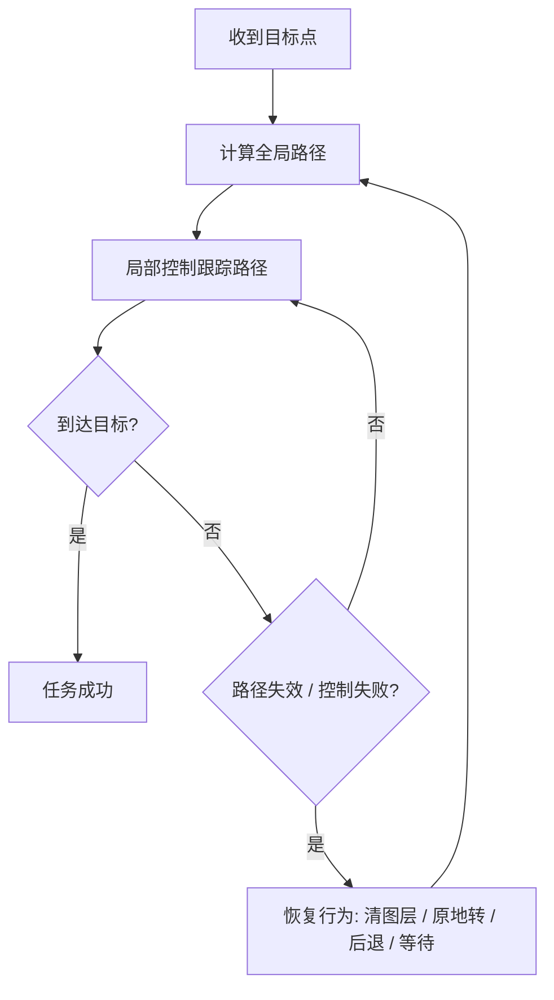
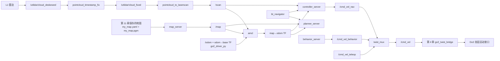

# 第 12 章 实机 Nav2 2D 基线

> 第 11 章我们已经拿到了一张可用的 2D 地图。现在终于轮到一个很上头的时刻:让 Go2 在实机上接入 Nav2,自己规划、自己走到目标点。但你也会马上看到,这条路的上限其实很明确:它能跑通,却远没到“够用”的程度。

---

## 本章你将学到

- 认识 Nav2 里几块最核心的模块:地图服务、定位、全局规划、局部控制、恢复行为和生命周期管理
- 理解为什么 Go2 明明是四足机器人,我们却先故意把它当成一个“平地 2D 移动底座”来跑基线
- 创建 `go2_navigation` 包,写出一份能直接复用的 `nav2_params.yaml` 和 `navigation.launch.py`
- 用 `twist_mux` 把导航控制、恢复行为和人工接管收束成一条安全的 `/cmd_vel` 输出链
- 学会判断这套 **L1 + 2D Nav2** 方案到底卡在哪儿,为下一章的升级动机做好准备

## 背景与原理

### Nav2 到底是什么

Nav2 可以理解成 ROS2 时代最常见的一套“移动机器人导航操作系统”。它不只是一份路径规划器,而是一组协同工作的节点:

| 组件 | 作用 | 你在本章会看到什么 |
|---|---|---|
| `map_server` | 读取并发布静态地图 | 加载第 11 章保存下来的 `my_map.yaml` |
| `amcl` | 在已知地图里做 2D 定位 | 发布 `map → odom`,让机器人知道自己在图上哪儿 |
| `planner_server` | 计算全局路径 | 从当前位置到目标点画一条可走的路线 |
| `controller_server` | 跟踪路径并输出速度指令 | 往 `/cmd_vel_nav` 发平地速度命令 |
| `bt_navigator` | 负责“先规划、再跟踪、失败就恢复”的总调度 | 这是 Nav2 的任务编排中枢 |
| `behavior_server` | 提供原地转、后退、等待等恢复动作 | 目标失败时经常就是它在救场 |
| `lifecycle_manager` | 按顺序激活前面这些节点 | 不然你会看到一堆节点起了但没真正进入工作态 |

旧资料里你有时会看到 `recoveries_server` 这个名字。在 ROS2 Humble 这一代里,它已经统一成 `behavior_server` 了。别在这儿被版本差异阴一下。

### BehaviorTree 是什么

一句话版:BehaviorTree(行为树)就是一棵“任务执行树”,它把**规划**、**跟踪**、**检查是否失败**、**触发恢复动作**这些步骤串成一个可反复重试的流程。

下面这张图故意只保留主线,你先看懂“它怎么组织流程”就够了,不用一头扎进自定义节点:



这也是为什么 Nav2 不是“一个规划器”那么简单。它更像一个有明确失败处理逻辑的导航工作流。

### 为什么现在先做 Go2 的 2D 基线

如果你只看机器人宣传图,会觉得 Go2 明明是四足,为什么导航第一步却走得像个保守的小车?

原因很现实:

- 第 11 章我们已经拿到了可用的 `/scan` 和 2D 栅格地图,继续往前接 Nav2 的成本最低
- Nav2 的 2D 栈成熟、资料多、RViz 可视化直观,很适合第一次把“自主到点”跑起来
- 真正的 3D 导航链不只是“把 2D 参数改成 3D”那么简单,它会牵涉地形表达、局部可通行性、仿真验证和更重的算力负担

所以本章的定位很明确:

**先让 Go2 在平地上自己走起来,再诚实地承认它的天花板。**

### 2D 基线在四足机器人上的隐含假设

这部分一定要先讲清楚,不然后面你会误以为“既然跑通了,那就说明方案天然正确”。

| 2D 栈默认假设 | 在普通移动底盘上为什么常成立 | 到 Go2 身上会遇到什么问题 |
|---|---|---|
| 地面基本是平的 | 小车通常就在平地滚动 | 四足上坡、下台阶、跨坎时机身姿态变化更大 |
| 障碍都能在扫描平面里看见 | 2D 雷达那一圈经常正好扫到桌腿、墙角 | 高于或低于扫描高度的障碍会直接漏掉 |
| 里程计比较平滑 | 轮式底盘连续滚动,震动模式单一 | 四足步态会把 IMU 和里程计噪声放大 |
| 机器人外形能近似成一个圆 | 小车外轮廓稳定 | Go2 的腿部摆动和机身姿态会让“圆形足迹”只是保守近似 |

这就是为什么本章我们会故意做两件“看起来很怂”的事:

- 把 `max_vel_y` 关成 `0.0`,先不追求侧移
- 把 AMCL 的运动模型设成 `DifferentialMotionModel`,先把它当成一个平地差速式底盘

!!! note "这不是在否认 Go2 的能力"
    Go2 当然能做更复杂的运动。但本章追求的是**先稳定跑通一条教学基线**,不是第一天就把侧移、地形、三维避障全塞进来。后面章节会专门讨论为什么这条基线会撞到天花板。

## 架构总览

### 数据流

先把整条链路画出来,你会更容易判断“到底是雷达没来、定位没稳,还是控制链断了”。



### TF 树里最关键的一件事

这章最容易把人卡死的,不是 AMCL 算法本身,而是坐标系名字写错。

本书这一套 Go2 链路里,关键 TF 应该长这样:

```text
map
  └── odom
        └── base
```

请盯住最后这个名字:

- Go2 驱动侧用的是 `base`
- Nav2 默认教程里常写的是 `base_footprint` 或 `base_link`

如果你不手动覆盖,最典型的报错就是:

```text
Waiting for transform map -> base_footprint
```

这不是 Nav2 坏了,而是你把默认坐标系照抄进 Go2 了。

## 环境准备

### 前置章节成果

开始之前,你至少要有三样东西:

1. 第 4 章的 `go2_twist_bridge`,并且它默认订阅 `/cmd_vel`
2. 第 6 章的 `go2_driver_py`,能稳定提供 `/odom` 和 `odom → base`
3. 第 11 章的 `go2_slam`,已经能输出 `/scan`,并且你手里有一张保存好的 2D 地图

如果这三样里缺一件,先别硬启动 Nav2。你只会在报错堆里来回翻,最后不知道是谁先坏的。

### 安装本章依赖

如果你是顺着第 11 章往后做,`pointcloud_to_laserscan` 多半已经装过了。这里把本章需要的包一次补齐:

```bash
# Nav2 主体 + 官方 bringup 资源 + 指令仲裁 twist_mux
sudo apt install -y \
    ros-humble-navigation2 \
    ros-humble-nav2-bringup \
    ros-humble-pointcloud-to-laserscan \
    ros-humble-twist-mux \
    ros-humble-teleop-twist-keyboard
```

装完顺手查一下:

```bash
# 有输出就说明包已经在当前系统里了
ros2 pkg list | grep -E "nav2_amcl|nav2_bt_navigator|twist_mux|pointcloud_to_laserscan"
```

### 地图文件怎么放

第 11 章保存地图时,推荐路径是:

```text
~/unitree_go2_ws/src/go2_slam/maps/
├── my_map.yaml
└── my_map.pgm
```

这里有两个小规则:

- `.yaml` 和 `.pgm` 要放在同一目录里,因为 `yaml` 里会引用图片文件
- 如果你想复制到别的位置,请两个文件一起复制,别只搬 `yaml`

本章的 `navigation.launch.py` 会要求你显式传入地图路径。这样做有点啰嗦,但最稳,也最贴合第 11 章“地图是你自己现场建出来的”这个事实。

!!! danger "第一次发 Nav2 Goal 前先把安全条件拉满"
    这是 Go2 第一次按导航栈自己动,别把它当成“只是一个软件演示”。

    - 机器人前方至少空出 2 米
    - 身边有人能随时遥控接管或急停
    - 初始测试先选平地、宽通道、静态环境
    - 别上来就对着玻璃门、台阶口、密集人流发目标点

## 实现步骤

本章只新增一个包:`go2_navigation`。它不写自定义控制器,也不碰自定义 BT 节点,只负责把现有 Nav2 组件和前面章节的成果接起来。

### 步骤一:创建 `go2_navigation` 包

先在工作空间里创建导航包:

```bash
# 在 src/ 下新建一个只放配置和 launch 的包
cd ~/unitree_go2_ws/src
ros2 pkg create go2_navigation \
    --build-type ament_cmake

mkdir -p go2_navigation/config go2_navigation/launch
```

因为这个包主要放的是 `launch/` 和 `config/`,所以 `ament_cmake` 就够了,没必要再多套一层 Python 包壳。

接着把 `go2_navigation/CMakeLists.txt` 里补上一段安装规则,不然 `ros2 launch` 在安装空间里找不到这些文件:

```cmake
install(DIRECTORY
  launch
  config
  DESTINATION share/${PROJECT_NAME}
)
```

这一步很不起眼,但漏掉之后你会收获一种特别烦人的报错体验:

- 包能编译
- `source install/setup.bash` 也没报错
- 一到 `ros2 launch go2_navigation navigation.launch.py` 就说文件不存在

### 步骤二:写 `twist_mux.yaml`

我们先把速度仲裁器搭起来。目标很简单:

- 导航控制输出到 `/cmd_vel_nav`
- 恢复行为输出到 `/cmd_vel_behavior`
- 人工接管输出到 `/cmd_vel_teleop`
- 最终统一汇总回 `/cmd_vel`,继续复用第 4 章的桥接节点

在 `go2_navigation/config/twist_mux.yaml` 写入:

```yaml
twist_mux:
  ros__parameters:
    topics:
      navigation:
        topic: /cmd_vel_nav
        timeout: 0.5
        priority: 10

      behavior:
        topic: /cmd_vel_behavior
        timeout: 0.5
        priority: 50

      teleop:
        topic: /cmd_vel_teleop
        timeout: 0.5
        priority: 100
```

优先级的意思很好理解:

- 没人接管时,导航控制最低优先级,正常走
- 触发恢复动作时,`behavior_server` 可以暂时覆盖导航速度
- 你一按键盘,人工接管优先级最高,直接拿走控制权

这比让多个节点直接抢 `/cmd_vel` 稳得多。

### 步骤三:写 `nav2_params.yaml`

这一份参数文件的主基调只有两个词:

- **保守**
- **诚实**

它不是“Go2 的最终最优参数”,而是一个**平地实机第一次跑通 Nav2 的基线值**。你先把这份跑起来,再根据现场情况一点点调。

在 `go2_navigation/config/nav2_params.yaml` 写入:

```yaml
amcl:
  ros__parameters:
    use_sim_time: false

    # ---- 坐标系与输入 ----
    base_frame_id: base
    global_frame_id: map
    odom_frame_id: odom
    scan_topic: /scan
    tf_broadcast: true
    transform_tolerance: 1.0

    # ---- AMCL 基本模型 ----
    robot_model_type: nav2_amcl::DifferentialMotionModel
    laser_model_type: likelihood_field
    alpha1: 0.2
    alpha2: 0.2
    alpha3: 0.2
    alpha4: 0.2
    alpha5: 0.2
    beam_skip_distance: 0.5
    beam_skip_error_threshold: 0.9
    beam_skip_threshold: 0.3
    do_beamskip: false
    lambda_short: 0.1
    sigma_hit: 0.2
    z_hit: 0.7
    z_short: 0.05
    z_max: 0.05
    z_rand: 0.25

    # ---- 粒子与更新频率 ----
    min_particles: 1000
    max_particles: 5000
    pf_err: 0.05
    pf_z: 0.99
    resample_interval: 1
    recovery_alpha_fast: 0.1
    recovery_alpha_slow: 0.001
    update_min_d: 0.1
    update_min_a: 0.1
    max_beams: 180
    laser_likelihood_max_dist: 4.0
    laser_max_range: 20.0
    laser_min_range: 0.15

    # ---- 让 RViz 手动给初始位姿 ----
    set_initial_pose: false
    save_pose_rate: 0.5

bt_navigator:
  ros__parameters:
    use_sim_time: false
    global_frame: map
    robot_base_frame: base
    odom_topic: /odom
    bt_loop_duration: 10
    default_server_timeout: 20
    wait_for_service_timeout: 1000

    # 这一串是 Humble 默认 BT 插件列表,先别手痒删
    plugin_lib_names:
      - nav2_compute_path_to_pose_action_bt_node
      - nav2_compute_path_through_poses_action_bt_node
      - nav2_smooth_path_action_bt_node
      - nav2_follow_path_action_bt_node
      - nav2_spin_action_bt_node
      - nav2_wait_action_bt_node
      - nav2_assisted_teleop_action_bt_node
      - nav2_back_up_action_bt_node
      - nav2_drive_on_heading_bt_node
      - nav2_clear_costmap_service_bt_node
      - nav2_is_stuck_condition_bt_node
      - nav2_goal_reached_condition_bt_node
      - nav2_goal_updated_condition_bt_node
      - nav2_globally_updated_goal_condition_bt_node
      - nav2_is_path_valid_condition_bt_node
      - nav2_initial_pose_received_condition_bt_node
      - nav2_reinitialize_global_localization_service_bt_node
      - nav2_rate_controller_bt_node
      - nav2_distance_controller_bt_node
      - nav2_speed_controller_bt_node
      - nav2_truncate_path_action_bt_node
      - nav2_truncate_path_local_action_bt_node
      - nav2_goal_updater_node_bt_node
      - nav2_recovery_node_bt_node
      - nav2_pipeline_sequence_bt_node
      - nav2_round_robin_node_bt_node
      - nav2_transform_available_condition_bt_node
      - nav2_time_expired_condition_bt_node
      - nav2_path_expiring_timer_condition
      - nav2_distance_traveled_condition_bt_node
      - nav2_single_trigger_bt_node
      - nav2_goal_updated_controller_bt_node
      - nav2_is_battery_low_condition_bt_node
      - nav2_navigate_through_poses_action_bt_node
      - nav2_navigate_to_pose_action_bt_node
      - nav2_remove_passed_goals_action_bt_node
      - nav2_planner_selector_bt_node
      - nav2_controller_selector_bt_node
      - nav2_goal_checker_selector_bt_node
      - nav2_controller_cancel_bt_node
      - nav2_path_longer_on_approach_bt_node
      - nav2_wait_cancel_bt_node
      - nav2_spin_cancel_bt_node
      - nav2_back_up_cancel_bt_node
      - nav2_assisted_teleop_cancel_bt_node
      - nav2_drive_on_heading_cancel_bt_node
      - nav2_is_battery_charging_condition_bt_node

controller_server:
  ros__parameters:
    use_sim_time: false
    controller_frequency: 20.0
    min_x_velocity_threshold: 0.001
    min_y_velocity_threshold: 0.5
    min_theta_velocity_threshold: 0.001
    failure_tolerance: 0.3
    progress_checker_plugin: progress_checker
    goal_checker_plugins: [general_goal_checker]
    controller_plugins: [FollowPath]

    progress_checker:
      plugin: nav2_controller::SimpleProgressChecker
      required_movement_radius: 0.3
      movement_time_allowance: 10.0

    general_goal_checker:
      plugin: nav2_controller::SimpleGoalChecker
      stateful: true
      xy_goal_tolerance: 0.20
      yaw_goal_tolerance: 0.20

    FollowPath:
      plugin: dwb_core::DWBLocalPlanner
      debug_trajectory_details: true
      min_vel_x: 0.0
      min_vel_y: 0.0
      max_vel_x: 0.30
      max_vel_y: 0.0
      max_vel_theta: 0.50
      min_speed_xy: 0.0
      max_speed_xy: 0.30
      min_speed_theta: 0.0
      acc_lim_x: 0.30
      acc_lim_y: 0.0
      acc_lim_theta: 1.0
      decel_lim_x: -0.30
      decel_lim_y: 0.0
      decel_lim_theta: -1.0
      vx_samples: 20
      vy_samples: 1
      vtheta_samples: 30
      sim_time: 1.5
      linear_granularity: 0.05
      angular_granularity: 0.025
      transform_tolerance: 0.2
      xy_goal_tolerance: 0.20
      trans_stopped_velocity: 0.10
      short_circuit_trajectory_evaluation: true
      stateful: true
      critics: [RotateToGoal, Oscillation, BaseObstacle, GoalAlign, PathAlign, PathDist, GoalDist]
      BaseObstacle.scale: 0.02
      PathAlign.scale: 24.0
      PathAlign.forward_point_distance: 0.1
      GoalAlign.scale: 18.0
      GoalAlign.forward_point_distance: 0.1
      PathDist.scale: 24.0
      GoalDist.scale: 18.0
      RotateToGoal.scale: 24.0
      RotateToGoal.slowing_factor: 5.0
      RotateToGoal.lookahead_time: -1.0

local_costmap:
  local_costmap:
    ros__parameters:
      use_sim_time: false
      update_frequency: 8.0
      publish_frequency: 2.0
      global_frame: odom
      robot_base_frame: base
      rolling_window: true
      width: 4.0
      height: 4.0
      resolution: 0.05
      robot_radius: 0.30
      plugins: [obstacle_layer, inflation_layer]

      obstacle_layer:
        plugin: nav2_costmap_2d::ObstacleLayer
        enabled: true
        observation_sources: scan
        scan:
          topic: /scan
          data_type: LaserScan
          clearing: true
          marking: true
          raytrace_max_range: 3.0
          raytrace_min_range: 0.0
          obstacle_max_range: 2.5
          obstacle_min_range: 0.0
          max_obstacle_height: 0.6

      inflation_layer:
        plugin: nav2_costmap_2d::InflationLayer
        cost_scaling_factor: 3.0
        inflation_radius: 0.45

      always_send_full_costmap: true

global_costmap:
  global_costmap:
    ros__parameters:
      use_sim_time: false
      update_frequency: 1.0
      publish_frequency: 1.0
      global_frame: map
      robot_base_frame: base
      resolution: 0.05
      track_unknown_space: true
      robot_radius: 0.30
      plugins: [static_layer, obstacle_layer, inflation_layer]

      static_layer:
        plugin: nav2_costmap_2d::StaticLayer
        map_subscribe_transient_local: true

      obstacle_layer:
        plugin: nav2_costmap_2d::ObstacleLayer
        enabled: true
        observation_sources: scan
        scan:
          topic: /scan
          data_type: LaserScan
          clearing: true
          marking: true
          raytrace_max_range: 3.0
          raytrace_min_range: 0.0
          obstacle_max_range: 2.5
          obstacle_min_range: 0.0
          max_obstacle_height: 0.6

      inflation_layer:
        plugin: nav2_costmap_2d::InflationLayer
        cost_scaling_factor: 3.0
        inflation_radius: 0.45

      always_send_full_costmap: true

planner_server:
  ros__parameters:
    use_sim_time: false
    expected_planner_frequency: 10.0
    planner_plugins: [GridBased]
    GridBased:
      plugin: nav2_navfn_planner/NavfnPlanner
      tolerance: 0.3
      use_astar: false
      allow_unknown: true

behavior_server:
  ros__parameters:
    use_sim_time: false
    global_frame: odom
    robot_base_frame: base
    costmap_topic: local_costmap/costmap_raw
    footprint_topic: local_costmap/published_footprint
    cycle_frequency: 10.0
    transform_tolerance: 0.1
    simulate_ahead_time: 1.0
    max_rotational_vel: 0.5
    min_rotational_vel: 0.2
    rotational_acc_lim: 1.0
    behavior_plugins: [spin, backup, wait]

    spin:
      plugin: nav2_behaviors/Spin

    backup:
      plugin: nav2_behaviors/BackUp

    wait:
      plugin: nav2_behaviors/Wait

map_server:
  ros__parameters:
    use_sim_time: false
    yaml_filename: ""
```

这份配置里,最值得你反复理解的是下面七个键。

#### `robot_radius`

这里我们把 Go2 在 2D 地图里先近似成一个半径 `0.30 m` 的圆。

- 设得太小:路径会更激进,但脚或机身更容易贴着障碍蹭过去
- 设得太大:窄门、桌椅缝、走廊边缘会被 Nav2 判成“根本过不去”

如果你现场一看就觉得机器人总在离墙很远的位置绕大圈,先怀疑这个值是不是偏大了。

#### `inflation_radius`

膨胀半径决定“障碍物周围要留出多大安全气泡”。本章先给 `0.45 m`,是一个偏保守的室内值。

- 设大一点:更稳,但容易出现“明明有路,它说过不去”
- 设小一点:更敢走窄路,但实机擦边风险会上来

#### `max_vel_x`

这是平地前进速度上限。本章用 `0.30 m/s`,故意和第 4 章桥接里的保守限幅对齐。

- 它不是 Go2 的物理极限
- 它只是本章这套 L1 + 2D 基线的安全上限

第一次调参时,宁可先慢一点,也别为了图爽把 AMCL 和局部控制一起抖散了。

!!! note "`laser_max_range: 20.0` 只是当前实验链的上限"
    这里的 `20.0` 表示“本章这条点云转 `/scan` 再进 AMCL 的实验链,先按 20 米内观测来处理”。它不是在替 L1 的官方硬件标称量程背书。教材里凡是这类过滤上限,都优先按**工程可用范围**理解。

#### `acc_lim_x`

前向加速度上限直接影响“起步和刹车有多猛”。本章给 `0.30 m/s²`,目的就是别让 Go2 在小空间里一脚油门往前窜。

- 设得太大:轨迹看着更灵活,实机更容易抖、急停也更生硬
- 设得太小:看起来会“很怂”,有时追不上局部路径

#### `controller_frequency`

局部控制器多久算一次速度命令。本章用 `20.0 Hz`。

- 太低:你会明显感觉机器人反应慢、转角发虚、局部路径跟踪一顿一顿
- 太高:如果板载负载压不住,实际频率反而掉得更厉害

你不用死盯参数本身,更该盯 `controller_server` 日志里**实际跑出来的频率**。

#### `global_frame`

在 Nav2 里,全局规划和全局定位都应站在 `map` 这个坐标系上。

- 用 `map`:目标点和地图是一个世界坐标,路径稳定
- 错写成 `odom`:短时间也许还能动,但一旦里程计漂了,全局目标会跟着飘

#### `robot_base_frame`

这章里所有涉及机器人底座坐标系的地方,都要坚定写成 `base`。

- `bt_navigator.robot_base_frame`
- `local_costmap.robot_base_frame`
- `global_costmap.robot_base_frame`
- `behavior_server.robot_base_frame`
- `amcl.base_frame_id`

只要有一个地方偷懒沿用了 `base_footprint` 或 `base_link`,你后面就等着查 TF 吧。

!!! tip "这份参数最核心的设计选择"
    你会发现 YAML 里把 `max_vel_y` 彻底关成了 `0.0`,AMCL 也选了 `DifferentialMotionModel`。这不是因为 Go2 不能侧移,而是因为我们先把它收敛成一台“平地低速 2D 移动平台”。这样做很保守,但第一次让实机 Nav2 跑通时最省命。

### 步骤四:写总启动文件 `navigation.launch.py`

接下来把前面几章的成果接起来。这个 launch 负责做六件事:

1. 复用第 6 章的 `go2_driver_py`
2. 复用第 11 章的 `pointcloud_timestamp_fix` 和 `pointcloud_to_laserscan`
3. 启动 `twist_mux`
4. 启动 `map_server` 和 `amcl`
5. 用 `TimerAction` 稍微等一会儿,再启动 `planner_server`、`controller_server`、`bt_navigator`、`behavior_server`
6. 可选拉起 RViz,直接观察定位、路径和 costmap

在 `go2_navigation/launch/navigation.launch.py` 写入:

```python
"""
实机 Nav2 2D 基线:
驱动 + 点云转 LaserScan + AMCL + Nav2 + twist_mux + RViz
"""

from pathlib import Path                                      # 处理 share 目录里的配置文件路径
from launch import LaunchDescription                          # ROS2 launch 的顶层描述对象
from launch.actions import (                                  # launch 里常用的动作
    DeclareLaunchArgument,
    IncludeLaunchDescription,
    TimerAction,
)
from launch.conditions import IfCondition                     # 条件启动 RViz
from launch.launch_description_sources import PythonLaunchDescriptionSource
from launch.substitutions import LaunchConfiguration, PathJoinSubstitution
from launch_ros.actions import Node                           # 启动 ROS2 节点
from launch_ros.substitutions import FindPackageShare         # 在安装空间里找功能包 share 目录
from ament_index_python.packages import get_package_share_directory


def generate_launch_description():
    map_yaml = LaunchConfiguration("map")
    use_rviz = LaunchConfiguration("use_rviz")

    nav_share = Path(get_package_share_directory("go2_navigation"))
    sensors_share = Path(get_package_share_directory("go2_sensors"))
    driver_share = Path(get_package_share_directory("go2_driver_py"))

    nav2_params = str(nav_share / "config" / "nav2_params.yaml")
    twist_mux_params = str(nav_share / "config" / "twist_mux.yaml")
    scan_params = str(sensors_share / "config" / "pointcloud_to_laserscan_params.yaml")
    driver_launch = str(driver_share / "launch" / "driver.launch.py")

    rviz_config = PathJoinSubstitution(
        [FindPackageShare("nav2_bringup"), "rviz", "nav2_default_view.rviz"]
    )

    # 1) 底层驱动:提供 /odom、TF、/joint_states 和最终的 /cmd_vel 桥接
    driver = IncludeLaunchDescription(
        PythonLaunchDescriptionSource(driver_launch),
        launch_arguments={"use_rviz": "false"}.items(),
    )

    # 2) 复用第 11 章的时间戳修复节点
    timestamp_fix = Node(
        package="go2_sensors",
        executable="pointcloud_timestamp_fix",
        name="pointcloud_timestamp_fix",
        output="screen",
    )

    # 3) 复用第 11 章的 3D 点云 → 2D LaserScan 参数
    pointcloud_to_scan = Node(
        package="pointcloud_to_laserscan",
        executable="pointcloud_to_laserscan_node",
        name="pointcloud_to_laserscan",
        parameters=[scan_params],
        remappings=[
            ("cloud_in", "/utlidar/cloud_fixed"),
            ("scan", "/scan"),
        ],
        output="screen",
    )

    # 4) 统一仲裁导航、恢复行为和人工接管
    twist_mux = Node(
        package="twist_mux",
        executable="twist_mux",
        name="twist_mux",
        parameters=[twist_mux_params],
        remappings=[("cmd_vel_out", "/cmd_vel")],
        output="screen",
    )

    # 5) 定位相关节点
    map_server = Node(
        package="nav2_map_server",
        executable="map_server",
        name="map_server",
        parameters=[nav2_params, {"yaml_filename": map_yaml}],
        output="screen",
    )

    amcl = Node(
        package="nav2_amcl",
        executable="amcl",
        name="amcl",
        parameters=[nav2_params],
        output="screen",
    )

    localization_lifecycle = Node(
        package="nav2_lifecycle_manager",
        executable="lifecycle_manager",
        name="lifecycle_manager_localization",
        parameters=[
            {
                "use_sim_time": False,
                "autostart": True,
                "node_names": ["map_server", "amcl"],
            }
        ],
        output="screen",
    )

    # 6) 导航相关节点
    planner_server = Node(
        package="nav2_planner",
        executable="planner_server",
        name="planner_server",
        parameters=[nav2_params],
        output="screen",
    )

    controller_server = Node(
        package="nav2_controller",
        executable="controller_server",
        name="controller_server",
        parameters=[nav2_params],
        remappings=[("cmd_vel", "/cmd_vel_nav")],
        output="screen",
    )

    behavior_server = Node(
        package="nav2_behaviors",
        executable="behavior_server",
        name="behavior_server",
        parameters=[nav2_params],
        remappings=[("cmd_vel", "/cmd_vel_behavior")],
        output="screen",
    )

    bt_navigator = Node(
        package="nav2_bt_navigator",
        executable="bt_navigator",
        name="bt_navigator",
        parameters=[nav2_params],
        output="screen",
    )

    navigation_lifecycle = Node(
        package="nav2_lifecycle_manager",
        executable="lifecycle_manager",
        name="lifecycle_manager_navigation",
        parameters=[
            {
                "use_sim_time": False,
                "autostart": True,
                "node_names": [
                    "planner_server",
                    "controller_server",
                    "behavior_server",
                    "bt_navigator",
                ],
            }
        ],
        output="screen",
    )

    # 让 map_server + amcl 先进入工作态,再启导航主链
    delayed_navigation = TimerAction(
        period=3.0,
        actions=[
            planner_server,
            controller_server,
            behavior_server,
            bt_navigator,
            navigation_lifecycle,
        ],
    )

    rviz = Node(
        package="rviz2",
        executable="rviz2",
        name="rviz2",
        arguments=["-d", rviz_config],
        condition=IfCondition(use_rviz),
        output="screen",
    )

    return LaunchDescription(
        [
            DeclareLaunchArgument(
                "map",
                description="第 11 章保存的地图 yaml,例如 ~/unitree_go2_ws/src/go2_slam/maps/my_map.yaml",
            ),
            DeclareLaunchArgument("use_rviz", default_value="true"),
            driver,
            timestamp_fix,
            pointcloud_to_scan,
            twist_mux,
            map_server,
            amcl,
            localization_lifecycle,
            delayed_navigation,
            rviz,
        ]
    )
```

这段 launch 有三个设计点值得你记住:

- 它**没有**自己重写点云处理参数,而是直接复用第 11 章 `go2_sensors` 那一套
- `controller_server` 和 `behavior_server` 都没直接写 `/cmd_vel`,而是先走内部话题再交给 `twist_mux`
- `TimerAction` 不是装饰品,而是为了避免导航主链在定位链还没就绪时抢跑

### 步骤五:启动后先做 `++2D Pose Estimate++`,再发 `++Nav2 Goal++`

这一步一定要照顺序来,别跳:

1. 启动整条导航链
2. 在 RViz 里确认地图、机器人模型和 `ParticleCloud` 都已经出来
3. 点击 `++2D Pose Estimate++`,在地图上给出机器人当前真实位置和朝向
4. 等粒子云开始收敛,再点击 `++Nav2 Goal++`

为什么我一直重复这件事?

因为 AMCL 不知道你“开机时到底站在地图哪儿”。你不主动给它一个初始位姿,它只能在整张图里瞎猜。结果通常就是:

- 粒子云一团乱飘
- 路径从地图另一头算出来
- 机器人原地打转,像在想人生

!!! warning "AMCL 不会读心"
    这一步不是可选项。第一次定位没收敛前,你发再多目标点也没意义。先把初始位姿对上,再谈路径规划。

### 步骤六:看懂哪几个话题最关键

第一次跑通后,别只盯着“狗是不是走了”。更重要的是知道每一层有没有在工作:

| 话题 | 看到什么算正常 |
|---|---|
| `/scan` | 有持续更新的 `LaserScan`,否则 Nav2 根本没感知输入 |
| `/particlecloud` | 初始位姿给完后逐渐收敛,而不是四散乱飞 |
| `/plan` | 发目标点后能看到全局路径 |
| `/local_plan` | 局部路径会持续刷新 |
| `/cmd_vel_nav` | `controller_server` 的速度输出 |
| `/cmd_vel_behavior` | 只有触发恢复动作时才会有明显输出 |
| `/cmd_vel` | `twist_mux` 仲裁后的最终速度,也是第 4 章桥接真正订阅的输入 |

这张图应该是你最终想看到的 RViz 画面:

{ width="600" }

## 编译与运行

### 编译 `go2_navigation`

先把新包编译掉:

```bash
# 编译 go2_navigation 并重新加载环境
cd ~/unitree_go2_ws
colcon build --packages-select go2_navigation
source install/setup.bash
```

### 一条命令启动导航基线

因为 `ros2 launch` 里不会替你展开 `~`,这里最好先用一个环境变量把地图路径写清楚:

```bash
# 把第 11 章保存好的地图路径交给 launch 参数
MAP_YAML=$HOME/unitree_go2_ws/src/go2_slam/maps/my_map.yaml
ros2 launch go2_navigation navigation.launch.py map:=$MAP_YAML
```

如果你想看日志更干净一点,可以先关掉 RViz:

```bash
# 先只看后台节点,确认 map_server / amcl / Nav2 都起稳了
MAP_YAML=$HOME/unitree_go2_ws/src/go2_slam/maps/my_map.yaml
ros2 launch go2_navigation navigation.launch.py \
    map:=$MAP_YAML \
    use_rviz:=false
```

### 人工接管怎么接进来

`twist_mux` 已经把 `/cmd_vel_teleop` 预留好了。你单独开一个终端:

```bash
# 人工接管通道,优先级高于导航输出
source ~/unitree_go2_ws/install/setup.bash
ros2 run teleop_twist_keyboard teleop_twist_keyboard \
    --ros-args -r cmd_vel:=/cmd_vel_teleop
```

只要你开始按键盘,`twist_mux` 就会把控制权切给人工遥控。手一松,导航速度在超时后会重新接管。

!!! tip "推荐的上电顺序"
    第一次跑这章,我建议你就记这一套顺序:

    1. 先确认 Go2 网络和第 6 章驱动正常
    2. 再启动 `navigation.launch.py`
    3. 看 RViz 里 `map`、`scan`、`particlecloud`
    4. 手动 `++2D Pose Estimate++`
    5. 发一个 1 米以内的短目标点
    6. 随时准备键盘接管

## 结果验证

本章的“成功”,不是只让 Go2 动一下,而是至少完成下面三组验证。

### 验证一:连续完成 3 个平地到点任务

你可以在走廊、实验室或教室里选三个比较稳的目标:

1. 正前方 `1.0 ~ 1.5 m` 的短距离到点
2. 需要轻微转向的侧前方到点
3. 回到起点附近的返程到点

每个目标都应该能看到:

- RViz 里出现全局路径和局部路径
- Go2 先对准方向,再平稳前进
- 到达后速度收敛为零,而不是一直在目标点附近磨蹭

### 验证二:定位和控制链都在工作

用下面这些命令抽查关键话题:

```bash
# 看看 AMCL 有没有在发布粒子云
ros2 topic echo /particlecloud --once

# 看看局部控制器有没有在输出速度
ros2 topic echo /cmd_vel_nav --once

# 看看最终输出到桥接节点的是不是 /cmd_vel
ros2 topic echo /cmd_vel --once
```

如果你想确认 costmap 和路径话题都在:

```bash
# 列出几条最关键的导航话题
ros2 topic list | grep -E "/plan|/local_plan|/global_costmap|/local_costmap|/particlecloud"
```

### 验证三:人工接管能随时生效

这一步别省。实机导航的“能控”比“能走”更重要。

- Go2 正在按 Nav2 路径行走时,按一次键盘控制
- 机器人应该立刻服从 `/cmd_vel_teleop`
- 松开按键后,导航链能重新恢复

如果这一步做不到,你就还没把系统收拾到能放心继续做实验的程度。

!!! warning "这就是 L1 + 2D Nav2 的天花板"
    本章最重要的,其实不是“终于能自动到点了”,而是你要开始清楚地看到这套基线的边界。

    1. **步态 IMU 噪声会持续污染 `/odom`**。AMCL 虽然能纠偏,但走久了、走快了、转得猛了,定位还是会一阵一阵发飘。
    2. **L1 本质上只给你一圈 2D 可用观测**。超出扫描高度的障碍,比如悬空桌面边缘、玻璃门把附近、某些低矮门槛,它就是看不全。
    3. **动态障碍很容易在 costmap 里“留痕”**。人从面前走过去后,局部地图可能一时半会儿清不干净,规划就会绕大圈甚至卡死。
    4. **楼梯、台阶、明显坡道不在这套系统的能力圈内**。纯 2D 栈没有高度表达,你不能指望它理解“这儿能跨、那儿会摔”。
    5. **长走廊会让定位几何退化**。两边全是平行墙时,AMCL 粒子云很容易分裂,方向稍微错一点就越走越偏。
    6. **一旦控制频率掉到 5~10 Hz,轨迹跟踪会肉眼可见地抖**。这不是“手感不好”,而是已经在逼近实机体验的下限。
    7. **所以这章的结论只能是“能走但有限”**。第 13 章我们就来认真聊:这些问题到底能不能补,为什么很多补法最后还是会撞墙。

## 常见问题

### 1. `/scan` 没出来

**现象**:Nav2 全部起了,但 costmap 一片空白,`amcl` 也不怎么更新。

**原因**:大概率不是 Nav2 的锅,而是第 11 章的点云处理链没通。

**解决**:

- 先看 `/utlidar/cloud_fixed` 有没有数据
- 再看 `pointcloud_to_laserscan` 是否真的订的是 `/utlidar/cloud_fixed`
- 回第 11 章检查 `pointcloud_to_laserscan_params.yaml` 里的高度过滤和 QoS 配置

### 2. AMCL 粒子云一片混乱,怎么都不收敛

**现象**:`/particlecloud` 到处乱飞,机器人明明在门口,粒子却铺满整张图。

**原因**:

- 没有手动做 `++2D Pose Estimate++`
- 初始位姿给得离真实位置太远
- 现场环境和建图时差别太大

**解决**:

- 先把机器人推回地图里好辨认的位置
- 重新给一次更接近真实方向的初始位姿
- 发第一个目标点前,先观察粒子云有没有明显收敛

### 3. 日志一直刷 `Waiting for transform map -> base_footprint`

**现象**:Nav2 节点不工作,日志里反复等 `base_footprint`。

**原因**:你很可能照抄了默认教程里的坐标系名字,没把 Go2 的 `base` 覆盖进去。

**解决**:

- 把 `robot_base_frame` 全部改成 `base`
- 把 `amcl.base_frame_id` 也改成 `base`
- 别在不同节点里混着用 `base`、`base_link`、`base_footprint`

### 4. 机器人一直原地打转,就是不肯往前

**现象**:路径算出来了,速度也在发,但实机总在目标附近转圈。

**原因**通常有三类:

- 初始位姿和真实朝向差得太多
- `robot_radius` 太大,局部控制器一直觉得前面不安全
- 你把 Go2 当成全向底盘调参了,但本章明明是按“前进 + 转向”基线在跑

**解决**:

- 先重新做 `++2D Pose Estimate++`
- 把 `robot_radius` 适当往下微调一点
- 确认 `max_vel_y: 0.0` 没被你手滑改掉

### 5. `Goal failed` 很频繁

**现象**:目标点一发出去,过一会儿就失败,日志里能看到恢复动作来回触发。

**原因**:

- 局部控制参数偏激进
- 恢复行为在狭窄环境里帮倒忙
- 定位本来就不稳,恢复动作反而把姿态越转越偏

**解决**:

- 先把 `max_vel_x` 和 `acc_lim_x` 再降一点
- 优先在开阔平地验证,别在复杂障碍场景里调第一版
- 如果现场一直被 `spin` / `backup` 搞崩,可以先临时缩减 `behavior_plugins`

### 6. `/cmd_vel_nav` 有数据,Go2 却完全没反应

**现象**:`controller_server` 看起来工作正常,但狗一动不动。

**原因**:

- `twist_mux` 没启动
- 第 4 章桥接节点没起
- 最终输出没有回到 `/cmd_vel`

**解决**:

- 检查 `/cmd_vel_nav`、`/cmd_vel_behavior`、`/cmd_vel` 三条话题是不是都存在
- 确认 `twist_mux` 的输出 remap 到了 `/cmd_vel`
- 确认第 4 章 `go2_twist_bridge` 订阅的还是 `/cmd_vel`

### 7. costmap 里总有“幽灵障碍”

**现象**:人走开了,地图上还残着一团障碍,机器人开始绕远路。

**原因**:

- `inflation_radius` 太大,一团小障碍被膨胀成了一堵墙
- 2D 激光对动态障碍的清理本来就不够利落
- 实际环境里有玻璃、反光或悬空结构,导致观测不稳定

**解决**:

- 先把 `inflation_radius` 轻轻往下调
- 尽量在静态场景里验证第一版基线
- 接受一个现实:这正是下一章要升级路线的原因之一

## 本章小结

这一章你第一次把 Go2 真正接进了 Nav2 的完整链路:第 11 章的 `/scan` 和地图喂给 `amcl` 与 Nav2,第 4 章的桥接继续接收最终 `/cmd_vel`,整台机器人第一次具备了“点目标点自己走过去”的能力。

但更重要的是,你应该已经亲眼看到这套方案的代价:

- 它强依赖平地
- 它强依赖 2D 可见障碍
- 它对里程计噪声和动态环境都不够从容

所以本章真正的价值,不是把 Nav2 写成“终局方案”,而是把一个**诚实可复现的基线**摆在你面前。

## 下一步

第 12 章的能力上限,就是第 13 章的起点。下一章我们不急着继续堆参数,而是先认真讨论:为什么这套 **L1 + 2D Nav2** 会在关键场景里撞墙,以及为什么要转向仿真环境去验证升级路线。

继续阅读:[第 13 章 升级动机与仿真环境搭建](./13-upgrade-simulation.md)

## 拓展阅读

- [Navigation2 官方文档](https://docs.nav2.org/)
- [Nav2 Tuning Guide](https://docs.nav2.org/tuning/index.html)
- [navigation2 GitHub 仓库](https://github.com/ros-planning/navigation2)
- [SLAM Toolbox 项目主页](https://github.com/SteveMacenski/slam_toolbox)
