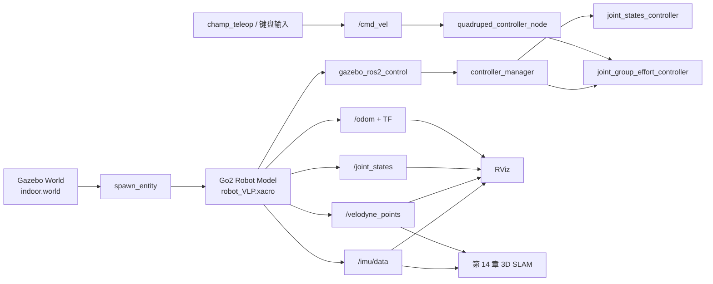
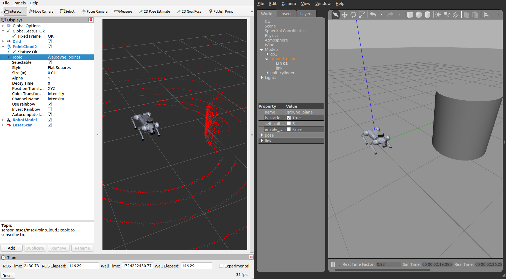

# 第 13 章 升级动机与仿真环境搭建

> 第 12 章我们已经让 Go2 在实机上跑通了 **L1 + 2D Nav2** 基线。但如果你还记得章末那张“能走但有限”的清单,就会发现一个残酷事实:继续在这条链上硬抠参数,大概率只会越调越累。这一章,我们先把“为什么要换路”讲透,再把一套能走能扫的 Gazebo 仿真基础盘搭起来,给下一章真正的 3D 升级做准备。

---

## 本章你将学到

- 用真实实验数据说明:为什么 Go2 的 **L1 + 实机 3D LIO** 这条路,不是“再调一调就能救回来”
- 看懂 L1 的四个关键限制:步态 IMU 噪声、坐标系问题、稀疏单环点云、扩展坞官方支持范围
- 比较 Gazebo Classic、Gazebo Gz、Isaac Sim、Webots 这几条仿真路线,理解为什么本书先选 **Gazebo Classic**
- 在 `go2_sim_ws` 里搭起 **unitree-go2-ros2 + CHAMP + VLP-16** 这一套仿真底座
- 识别 8 个真正容易把人卡住的坑,避免把一周时间浪费在路径、DDS、控制器时序和传感器插件上

## 背景与原理

### 引子:为什么第 12 章不是终点

如果只看阶段性成果,第 11 章和第 12 章其实已经很像“胜利前夜”了:

- 第 11 章我们有了 2D 地图
- 第 12 章我们看到了 Go2 能自己走到目标点

但我当时很快就发现,这条路线有一个非常难受的现实:

**我们想要的不是“平地里慢慢到点”,而是后面那条完整任务链:自主导航、感知、识别、再去放置。**

一旦目标变成这个级别,2D 基线就只是起点,不是终点。

更糟的是,我最开始以为“再把 L1 接到 3D LIO 上,事情就自然升级了”。结果后面的几轮实验基本把这个幻想打碎了。

### 第一部分:L1 为什么升不动

这一节不是为了贬低 L1,而是为了把边界讲清楚。讲清楚边界,后面的换路才不是拍脑袋。

#### 硬伤 1:步态 IMU 噪声淹没了真实运动

Point-LIO 在 Go2 上最迷惑人的地方是:

- **静止时很好看**
- **一走起来就崩**

实验里最稳定的一次结果是:

- 机器人静止时,建图精度可以压到 **±2 cm**
- 一旦开始行走,点云会穿透墙体、旧信息丢失、位姿估计直接发散

我当时最先怀疑的是“是不是 IMU 太吵,低通滤波一下就好了”。结果实验数据很无情:

| 方案 | 截止频率 | 结果 |
|---|---|---|
| 一阶低通滤波 | `1 Hz` | 静止还行,旋转时位置飘到 **-98 m** |
| 一阶低通滤波 | `3 Hz` | 启动就炸,`z` 直接飘到 **-557 m** |

这组数字很值钱,因为它直接说明了一个工程事实:

**Go2 步态振动的频段,和机器人真实运动引起的有效加速度变化频段,高度重叠。**

也就是说:

- 你把滤波器调狠了,步态噪声是少了,但真实运动信号也一起被你削掉了
- 你把滤波器调松了,有效信号是保住了,步态噪声又原封不动灌进去了

这不是“参数还没调到位”,而是线性滤波在这个场景里的能力边界。

#### 硬伤 2:L1 IMU 坐标系问题不是普通的小偏差

第二个坑比“IMU 很吵”更阴。

按官方 L1 手册的定义:

- IMU 坐标系和 LiDAR 坐标系是平行对齐的
- `+Z` 指向上方

但真正装到 Go2 身上之后,事情就没这么简单了。

一方面,Go2 上的 L1 是倒装的;另一方面,我在实测里又发现:

- 直接照搬 CMU 开源项目里的 `negate Y/Z + 15.1°` 变换,重力方向会偏掉将近 **30°**
- 进一步拆开看,加速度和角速度的坐标约定甚至不像是同一套“简单轴翻转”关系

也就是说,这里不是一个“差个 5° 再微调一下”的问题,而是传感器契约本身就不够规整。

!!! info "来自宇树的回复"
    我当时把问题提给了宇树技术支持,拿到的几个关键信息如下:

    - L1 安装外参给到的是 `xyzrpy = [0.28945, 0, -0.046825, 0, 2.8782, 0]`
    - 官方给过一个 `point_lio_unilidar` 仓库,但它是 **ROS1 Noetic** 方案,不是 Go2 ROS2 直接可抄的成品
    - `slam_operate` 这套导航接口只支持 **MID-360** 和 **XT-16**, **L1 不支持**
    - 机器人里的 `uslam` 主要是 App 侧功能,不提供这条开发链可直接接入的开放接口

这个回复其实非常关键。因为它帮我们确认了:

- 你不是“姿势没找对”
- 而是官方支持范围本来就不包括“L1 直接走这条开发链”

#### 硬伤 3:`ring = 1` 的稀疏点云,只够做 2D 基线

第 10 章我们已经看过 L1 的点云性格了:

- 单帧大约 `4193 ~ 4194` 点
- 发布频率大约 `10 Hz`
- `ring` 字段实测基本全是 `1`

这种点云当然不是“完全不能用”。第 11 章和第 12 章已经证明了:

- 把它压成 `/scan`,做 2D SLAM 和 2D Nav2 是能跑的

但问题在于,3D LIO 对点云的要求比“能压成一圈二维扫描”高得多。

至少在我当时验证的这几条路上:

- `KISS-ICP` 会嫌点云几何特征太稀
- `Point-LIO` 会越来越依赖 IMU,而 IMU 又刚好是最不稳的那环
- 依赖更强结构特征或稳定逐点时间的 3D LIO/回环方案,会更加难受

所以这里别把“L1 能输出 PointCloud2”误听成“L1 天然适合做 3D LIO 前端”。

#### 硬伤 4:扩展坞这条官方链,本来就没把 L1 放进来

根据第 4 周那轮官方文档调研,以及后面自己查 `graph_pid_ws` 的结果:

- 官方 SLAM 导航文档默认前提是 **EDU + 扩展坞 + 官方购入激光雷达**
- 支持口径明确写的是 **MID-360** 或 **XT-16**
- 扩展坞那套预装链路里,雷达 IP、驱动脚本和 `lio_sam` 配置也都是围着它们写的

比如当时已经能确认的事实就包括:

- 雷达默认 IP 直指 `192.168.123.20`
- `mid360_lidar.sh` 调的就是 `livox_ros_driver2`
- `lio_sam` 相关配置是 `sensor: livox`, `N_SCAN: 4`

这意味着什么?

意味着就算你愿意继续为 L1 坐标系和 IMU 数据硬啃,扩展坞那条官方“教育版 SLAM 导航主线”也并没有在前方等你。

!!! danger "此路不通"
    到这里,我们其实已经能下结论了:

    - **步态 IMU 噪声** 不是调一两个滤波参数能救的
    - **IMU 坐标系问题** 不是普通的“小偏差”,而是传感器契约不够规整
    - **L1 稀疏单环点云** 足够做 2D 基线,但并不适合作为这条 3D LIO 升级链的稳定前端
    - **扩展坞官方支持** 本来就站在 MID-360 / XT-16 这边,不站在 L1 这边

    所以第 12 章之后最理性的决定,不是继续在实机 L1 上死磕 3D,而是先把算法链放到一个传感器契约更干净的地方跑通。

### 第二部分:为什么先去仿真

我当时最终切到仿真,不是因为“仿真更高级”,恰恰相反,是因为它更朴素:

- IMU 数据更干净
- 雷达模型更标准
- 外参、TF、控制链都更容易穷举排查
- 场景可控,出了问题能快速复现

这类转向最容易被误会成“逃避实机”,其实不是。

真正合理的顺序是:

1. 先在仿真里把 **算法和工程链** 跑通
2. 再带着一套已经验证过的系统回到实机
3. 最后决定值不值得采购更适合的传感器,比如 MID-360

这比一边踩 L1 的硬件坑,一边还想同时调 3D 算法,要省时间得多。

### 第三部分:仿真方案怎么选

#### 先比仿真器

这一步我没有追求“最强”,而是优先看 **ROS2 Humble 生态** 和 **四足现成例子**。

| 方案 | 学习曲线 | ROS2 Humble 生态 | 四足现成示例 | 这一章是否推荐 |
|---|---|---|---|---|
| Gazebo Classic | 低到中 | 最成熟 | **有 CHAMP + Velodyne 现成链路** | **推荐** |
| Gazebo Gz | 中 | 新,但迁移成本高 | 有,但资料分散 | 暂不选 |
| Isaac Sim | 高 | 很强,但偏重 GPU 和生态整合 | 有,但更适合后期 | 暂不选 |
| Webots | 低到中 | 够用 | 四足案例少 | 暂不选 |

如果你现在的目标是“先把 Go2 在仿真里走起来,再让它能扫、能给下一章上 3D SLAM”,Gazebo Classic 是最省心的选择。

#### 再比控制框架

控制层我最后也做过取舍。

| 方案 | 优点 | 缺点 | 结论 |
|---|---|---|---|
| 直接走 Go2 SDK 仿真链 | 接口更像实机 | 现成示例分散,对 URDF/传感器改造不友好 | 暂不选 |
| **CHAMP** | 四足步态框架成熟,ROS2/Gazebo 资料多,能直接接 `cmd_vel` | 不是 Unitree 官方控制栈 | **选它** |

本书这一套教程里,CHAMP 的价值非常直接:

- 它不是最终产品
- 但它非常适合搭一块“能走、能看、能接传感器、能继续接 SLAM/Nav2”的实验底板

#### 最后比雷达模型

这一步最容易想当然。

如果只考虑“以后可能买 MID-360”,你会本能地想直接模拟 MID-360。但我当时最后先选的是 **VLP-16**。

原因有三个:

1. Gazebo 现成插件和资料最多
2. 输出是标准的 `PointCloud2` 多环点云,更容易接通后续 3D 算法链
3. `/velodyne_points` 这条话题在 ROS 生态里几乎是“默认公约”,很多现成配置直接就能吃

不过这里要诚实说一句:

!!! note "VLP-16 也不是完美答案"
    它解决的是“**先把多环点云 + 标准 TF + 可控仿真场景搭起来**”这件事,不是一步到位解决所有 3D SLAM 细节。比如我后来在第 14 章的联调里就发现,某些 Gazebo VLP-16 插件对逐点 `time` 字段的实现并不理想。这不影响本章把基础盘搭起来,但你别把它误会成“仿真里就没有坑了”。

### 本书这一章的最终选型

所以这章的结论很明确:

**Gazebo Classic + CHAMP + VLP-16**

原因可以压缩成三句话:

- **Gazebo Classic**:最稳,和 ROS2 Humble 配合成熟
- **CHAMP**:最省时间地把 Go2 变成“能走的四足机器人”
- **VLP-16**:最容易先给下一章准备一份像样的 3D 点云输入

## 架构总览

### 仿真基础盘的数据流

本章我们先不急着接 Fast-LIO,也不急着接 Nav2。先把一块“能走能扫”的底板搭牢。



### 仿真里这几个包分别干什么

为了后面不被目录绕晕,你先记住这一层分工:

```text
unitree-go2-ros2/
├── champ/                         ← 四足控制框架本体
│   ├── champ_base/
│   ├── champ_bringup/
│   ├── champ_gazebo/
│   └── champ_description/
├── robots/descriptions/go2_description/
│   └── xacro/                     ← Go2 模型和传感器挂载
├── robots/configs/go2_config/
│   ├── launch/                    ← Gazebo / RViz / 后续导航入口
│   ├── worlds/                    ← 仿真世界
│   └── rviz/                      ← RViz 配置
└── champ_teleop/                  ← 键盘遥控
```

这套结构的好处是:

- 机器人模型和传感器在 `go2_description`
- 世界、launch 和 RViz 在 `go2_config`
- 步态控制和状态估计在 `champ/*`

后面你查问题时,知道该去哪一层下手。

### 一个必须先说的坐标系提醒

第 12 章实机链路里,我们一直强调 Go2 用的是 `base`。但这一章的仿真链不是那套驱动,它的根 link 叫的是:

- `base_link`

所以请你现在先把这条规则记住:

- **实机章节**跟 Go2 原生驱动时,优先认 `base`
- **这一章仿真**跟 CHAMP / URDF / Gazebo 时,优先认 `base_link`

如果你硬要在这章里把它们统一成一个名字,大概率会把 launch、RViz、EKF 和传感器 frame 一起搅乱。

## 环境准备

### 前置条件

开始本章前,你最好已经具备两类前置:

1. 概念上读过 [第 10 章 激光雷达原理与选型](./10-lidar.md)、[第 11 章 2D SLAM 建图实战](./11-slam-2d.md) 和 [第 12 章 实机 Nav2 2D 基线](./12-nav2-baseline.md)
2. 机器上已经装好了 ROS2 Humble,并能正常 `ros2 topic list`

这一章不依赖你已经把实机链跑通,但它强依赖你知道:

- 什么是 `/cmd_vel`
- 什么是 TF
- 什么是 `PointCloud2`

### 统一工作空间

原始笔记里,我当时单独开过一个仿真工作空间。但这本书为了统一命名,我们这里全部放进:

```text
~/go2_sim_ws/
```

这样后面你在第 14 章继续加 3D SLAM,不会又多出一套新路径。

### 安装系统依赖

先把 Gazebo、ros2_control、Velodyne 仿真相关依赖补齐:

```bash
# Gazebo Classic + ROS2 控制 + 机器人建模 + VLP-16 插件
sudo apt install -y \
    gazebo \
    ros-humble-gazebo-ros-pkgs \
    ros-humble-gazebo-ros2-control \
    ros-humble-controller-manager \
    ros-humble-ros2-control \
    ros-humble-ros2-controllers \
    ros-humble-robot-localization \
    ros-humble-xacro \
    ros-humble-velodyne \
    ros-humble-velodyne-gazebo-plugins \
    ros-humble-velodyne-description \
    python3-rosdep
```

如果你的系统里还没初始化过 `rosdep`,先做一次:

```bash
# 只需要首次执行一次
sudo rosdep init
rosdep update
```

### 仿真开工前:清掉真机遗留的 DDS 绑定

这是本章最容易被忽视、但一旦踩到就很难定位的一步。

前面 4–12 章为了连真机,我们通常会:

- `export RMW_IMPLEMENTATION=rmw_cyclonedds_cpp`
- `export CYCLONEDDS_URI=file://.../cyclonedds-xxx.xml`(把 DDS 绑到实机网段或某块有线网卡)

到了第 13 章,场景完全反过来:所有节点(包括 Gazebo 内嵌的 ROS 节点)都只在本机互相发现、互相订阅。如果真机的 DDS 绑定还留着,你会遇到一个**非常迷惑**的现象:

- Gazebo 启动了
- `robot_state_publisher` 也起来了、能看到全部 link
- 但 `spawn_entity.py` 一直卡在 `Waiting for entity xml on /robot_description`,模型永远进不了 Gazebo

原因是 `/robot_description` 是 **latched / transient_local** 话题,需要 DDS 在 QoS 握手时补发历史消息给晚加入的订阅者。真机场景下那份 CycloneDDS 配置,对 Gazebo 内嵌 ROS 节点来说并不总能完成这次握手。

**推荐做法:仿真终端里直接 unset,让 ROS 2 回落到默认 FastDDS。**

```bash
# 开每一个仿真终端前都执行这两行
unset CYCLONEDDS_URI
unset RMW_IMPLEMENTATION
```

这不是一条"绕过"建议,而是本书验证下来**在当前机器上最稳**的做法。默认 FastDDS 对 Gazebo 的 latched 话题握手很顺,spawn_entity 能在 1–2 秒内拿到 URDF。

为了避免每次手抖忘记,建议在 `~/go2_sim_ws/` 根目录放一个小启动脚本:

```bash
# ~/go2_sim_ws/run_sim.sh
#!/bin/bash
# 仿真专用环境:清掉真机 DDS 绑定,用默认 FastDDS
unset CYCLONEDDS_URI
unset RMW_IMPLEMENTATION
source /opt/ros/humble/setup.bash
source "$HOME/go2_sim_ws/install/setup.bash"
exec "$@"
```

```bash
chmod +x ~/go2_sim_ws/run_sim.sh
```

之后所有仿真命令都用 `./run_sim.sh ros2 launch ...` 的形式跑,就不会再被残留环境变量咬。

!!! warning "为什么不推荐 `CYCLONEDDS_URI=file://.../cyclonedds-lo.xml` 这条路"
    之前这一节曾写过一份"只走 `lo` 的 CycloneDDS 配置"方案,思路是让仿真和真机可以并存切换。但实测下来,这种 loopback-only 配置会让 `spawn_entity.py` 始终收不到 `robot_state_publisher` 的 latched 话题,卡在 `Waiting for entity xml`。想走这条路可以,但要额外调 `AllowMulticast`、`Peers` 等参数,不在本章射程内。**本章的保底方案就是 unset**。

## 实现步骤

### 步骤一:把仿真仓库拉进工作空间

现在我们正式搭环境。

先创建工作空间并克隆聚合仓库:

```bash
# 创建教程统一工作空间
mkdir -p ~/go2_sim_ws/src
cd ~/go2_sim_ws/src

# 这一个仓库里已经打包了 CHAMP、Go2 描述包和配置包
git clone https://github.com/anujjain-dev/unitree-go2-ros2.git
```

这一步为什么我推荐直接用这个聚合仓库,而不是自己手动拼 `champ + go2_description + go2_config`?

原因很简单:

- 目录关系已经排好
- launch 链已经串好
- 你现在最缺的不是“再多控制一份仓库”,而是先把底座跑起来

接着在工作空间根目录安装依赖:

```bash
# 让 rosdep 把仓库声明过的依赖一次装齐
cd ~/go2_sim_ws
rosdep install --from-paths src --ignore-src -r -y
```

### 步骤二:先看清这套仓库里谁负责什么

别急着 `colcon build`。先看明白你后面会改到的关键位置:

- `robots/descriptions/go2_description/xacro/robot_VLP.xacro`
  负责决定 Go2 模型最终挂了哪些传感器
- `robots/descriptions/go2_description/xacro/velodyne.xacro`
  负责定义 VLP-16 的 link、joint 和 Gazebo 插件
- `champ/champ_gazebo/launch/gazebo.launch.py`
  负责 Gazebo 启动、spawn 机器人和控制器加载顺序
- `robots/configs/go2_config/launch/gazebo_velodyne.launch.py`
  负责把 Go2 + Velodyne + RViz 整体拉起来

这一步虽然只是认目录,但非常重要。因为后面一旦“机器人不站”“点云不出”“控制器没加载”,你得知道去哪个文件里找。

### 步骤三:把 VLP-16 正式挂到 Go2 模型上

这一章最核心的模型改造,其实就两步:

1. 在 Go2 的主 xacro 里包含 `velodyne.xacro`
2. 在 `velodyne.xacro` 里把传感器挂到 `base_link`,并声明 Gazebo 插件

#### 先在主模型里包含 VLP-16

`robot_VLP.xacro` 的关键就是这一行:

```xml
<xacro:include filename="$(find go2_description)/xacro/velodyne.xacro"/>
```

这意味着这份模型不再是“裸 Go2”,而是“挂了 VLP-16 的 Go2”。

如果你以后想切回 2D 激光模型,也正是在这里把 `velodyne.xacro` 换成 `laser.xacro`。

#### 再看 `velodyne.xacro` 里真正发生了什么

下面这段是你最该看懂的部分:

```xml
<joint name="velodyne_base_mount_joint" type="fixed">
    <origin rpy="0 0 0" xyz="0.2 0 0.08"/>
    <parent link="base_link"/>
    <child link="velodyne_base_link"/>
</joint>

<joint name="velodyne_base_scan_joint" type="fixed">
    <origin rpy="0 0 0" xyz="0 0 0.0377"/>
    <parent link="velodyne_base_link"/>
    <child link="velodyne"/>
</joint>
```

它做了两件事:

- 把雷达基座固定在 `base_link` 上方前侧
- 再把真正输出点云的 `velodyne` link 接到基座上

也就是说,你在 RViz 里看到的 `/velodyne_points`,并不是“悬浮在世界里的一团点”,而是明确挂在机器人本体上的。

#### 最后是 Gazebo 插件

真正让 `/velodyne_points` 出来的,是同一个文件里的这段插件配置:

```xml
<gazebo reference="velodyne">
  <sensor name="velodyne-VLP16" type="ray">
    <update_rate>10</update_rate>
    <ray>
      <scan>
        <horizontal>
          <samples>1800</samples>
          <min_angle>-3.141592653589793</min_angle>
          <max_angle>3.141592653589793</max_angle>
        </horizontal>
        <vertical>
          <samples>16</samples>
          <min_angle>-0.2617993877991494</min_angle>
          <max_angle>0.2617993877991494</max_angle>
        </vertical>
      </scan>
    </ray>
    <plugin filename="libgazebo_ros_velodyne_laser.so" name="gazebo_ros_laser_controller">
      <ros>
        <remapping>~/out:=velodyne_points</remapping>
      </ros>
      <frame_name>velodyne</frame_name>
    </plugin>
  </sensor>
</gazebo>
```

这里最关键的不是每个数字本身,而是你要知道:

- `samples=16` 对应的是 16 线垂直扫描
- 输出话题被 remap 到了 `/velodyne_points`
- 点云 frame 叫 `velodyne`

下一章所有 3D SLAM 实验,其实都建立在这个话题契约上。

#### IMU 插件已经在 Go2 本体里

除了 VLP-16,`go2_description/xacro/gazebo.xacro` 里还已经把 IMU 插件挂到 `imu_link` 上了,输出是:

- `/imu/data`

这也是为什么我们说仿真环境的“传感器契约更干净”:

- 雷达有标准 3D 点云
- IMU 有标准 `sensor_msgs/Imu`
- 两者都在 URDF / Gazebo 插件层被明确定义

### 步骤四:确保控制器按顺序加载

四足机器人在 Gazebo 里最常见的第一类崩法不是点云没有,而是:

- Gazebo 窗口开了
- 机器人也 spawn 了
- 但就是软趴趴地瘫在地上

根因通常是:

**`controller_manager` 还没准备好,你就抢着去加载控制器了。**

这里本书沿用的修法是 `RegisterEventHandler + OnProcessExit`。

`champ_gazebo/launch/gazebo.launch.py` 里的关键逻辑长这样:

```python
load_joint_state_after_spawn = RegisterEventHandler(
    event_handler=OnProcessExit(
        target_action=start_gazebo_spawner_cmd,
        on_exit=[load_joint_state_controller],
    )
)

load_effort_after_joint_state = RegisterEventHandler(
    event_handler=OnProcessExit(
        target_action=load_joint_state_controller,
        on_exit=[load_joint_trajectory_effort_controller],
    )
)
```

意思是:

1. 先 spawn 机器人
2. spawn 完成后再激活 `joint_states_controller`
3. `joint_states_controller` 激活后,再加载 `joint_group_effort_controller`

这几步顺序不能乱。乱了以后,你最容易看到的报错就是:

```text
Controller 'xxx' not found
```

或者更讨厌一点,表面没报错,但机器人就是不站。

### 步骤五:编译整个仿真工作空间

现在可以开始编译了。

我建议第一次就带上两个参数:

- `--symlink-install`
- `-DCMAKE_POLICY_VERSION_MINIMUM=3.5`

命令如下:

```bash
# 编译整个仿真工作空间
cd ~/go2_sim_ws
colcon build --symlink-install \
    --cmake-args -DCMAKE_POLICY_VERSION_MINIMUM=3.5

source install/setup.bash
```

这条命令里的 `-DCMAKE_POLICY_VERSION_MINIMUM=3.5` 看着像个小怪招,其实是当时排掉 CMake 兼容问题后留下来的保险丝。

如果你只编这一章的 Gazebo 基础盘,它未必每次都救场;但后面一旦你把更多第三方包拉进同一个工作区,这个参数很容易省你一轮莫名其妙的构建报错。

### 步骤六:启动 Gazebo + Go2 + VLP-16 + RViz

本章的主入口就是:

```bash
# 启动 Go2 + VLP-16 仿真,并顺手打开 RViz
cd ~/go2_sim_ws
./run_sim.sh ros2 launch go2_config gazebo_velodyne.launch.py rviz:=true
```

默认情况下,这个 launch 会做三件事:

1. 拉起 `champ_bringup`,发布机器人描述和控制节点
2. 拉起 `champ_gazebo`,进入 Gazebo 世界并 spawn 机器人
3. 使用 `go2_config/rviz/vlp16.rviz` 打开一份已经配好点云显示的 RViz

如果一切正常,你会看到:

- Gazebo 里 Go2 站起来
- RViz 里有机器人模型
- `/velodyne_points` 开始持续刷新

### 步骤七:用键盘让 Go2 先走起来

本章的目标不是一上来就上导航,而是先确认:

- 控制链通了
- 机器人能走
- 雷达和点云会跟着动

如果你想尽量贴近当前代码,我建议直接用仓库里的 `champ_teleop.py`,并把它的输出话题改到 `/cmd_vel`:

```bash
# 用仓库里的键盘遥控节点控制仿真中的 Go2
cd ~/go2_sim_ws
./run_sim.sh ros2 run champ_teleop champ_teleop.py \
    --ros-args -p cmd_vel_topic:=/cmd_vel
```

它的好处是:

- 本来就是为 CHAMP 四足控制写的
- 后面你如果想顺手试身体姿态控制,它也已经留好了接口

如果你只想最快验证“能不能走”,也可以直接用标准键盘工具:

```bash
# 最小可用方案:标准 Twist 键盘控制
cd ~/go2_sim_ws
./run_sim.sh ros2 run teleop_twist_keyboard teleop_twist_keyboard \
    --ros-args -r cmd_vel:=/cmd_vel
```

!!! tip "这一章先别急着开 use_slam"
    你会在 `gazebo_velodyne.launch.py` 里看到 `use_slam` 这个参数。先别开。本章只做“仿真底座搭好,Go2 能走能扫”。真正要把 3D SLAM 接上来,放到下一章再做,你会轻松很多。

## 编译与运行

这一节把前面零散的动作收成一套可直接照抄的顺序。

### 终端 1:启动仿真

直接走本章前面准备好的 `run_sim.sh`,它会在同一行里把真机 DDS 绑定清掉、再 source 仿真工作空间:

```bash
# 启动 Gazebo + Go2 + VLP-16 + RViz
cd ~/go2_sim_ws
./run_sim.sh ros2 launch go2_config gazebo_velodyne.launch.py rviz:=true
```

没准备 `run_sim.sh`?那就每次手动清一次:

```bash
# 手动版:每个仿真终端前都要执行
unset CYCLONEDDS_URI
unset RMW_IMPLEMENTATION
source ~/go2_sim_ws/install/setup.bash
ros2 launch go2_config gazebo_velodyne.launch.py rviz:=true
```

### 终端 2:启动键盘控制

等 Gazebo 完全加载、Go2 站稳以后,再开第二个终端(同样用 `run_sim.sh` 包一层):

```bash
# 键盘控制,让 Go2 在室内世界里走起来
cd ~/go2_sim_ws
./run_sim.sh ros2 run champ_teleop champ_teleop.py \
    --ros-args -p cmd_vel_topic:=/cmd_vel
```

如果你不想用仓库里的 teleop,就改成:

```bash
# 只用标准 Twist 键盘也可以
cd ~/go2_sim_ws
./run_sim.sh ros2 run teleop_twist_keyboard teleop_twist_keyboard \
    --ros-args -r cmd_vel:=/cmd_vel
```

### 一次性回顾启动顺序

第一次上手时,请强迫自己按这个顺序来:

1. 先 `source` 工作空间
2. 再启动 `gazebo_velodyne.launch.py`
3. 看 Go2 是否站稳
4. 看 RViz 是否已经有 `/velodyne_points`
5. 最后才启动 teleop

这个顺序看起来保守,其实是在帮你把问题隔离开:

- Gazebo 没起好,就别怪 teleop
- 点云没出,就别怪 SLAM
- 机器人没站稳,就别急着按键乱跑

## 结果验证

这一章的完成标志很明确:

- Go2 在 Gazebo 里站起来
- 键盘能让它前进、转向
- RViz 能看到随运动变化的 3D 点云

### 验证一:机器人是否真的站稳

最直观的现象就是 Gazebo 里的姿态:

- 不趴地
- 不抽搐
- 不原地疯狂抖腿

如果你一开场就看到 Go2 像失去灵魂一样瘫着,不要继续往下按键。先回去查控制器加载时序。

### 验证二:点云和 IMU 是否都在出

打开新终端,抽查两个核心传感器:

```bash
# 看 VLP-16 点云有没有在发
cd ~/go2_sim_ws
./run_sim.sh ros2 topic echo /velodyne_points --once

# 看 IMU 有没有在发
./run_sim.sh ros2 topic echo /imu/data --once
```

你还可以进一步确认点云频率:

```bash
# VLP-16 仿真插件默认是 10 Hz
cd ~/go2_sim_ws
./run_sim.sh ros2 topic hz /velodyne_points
```

### 验证三:键盘控制是否真的生效

按一次前进或转向键,你应该同时看到三件事:

1. Gazebo 里的 Go2 开始移动
2. RViz 里的机器人模型跟着动
3. 点云位置相对环境发生变化

如果只是 Gazebo 动了,但 RViz 不动,先去查 `Fixed Frame` 和时间同步。

这就是本章理想中的最终画面:

{ width="600" }

## 常见问题

### 这些坑我建议你按“先看现象,再动手”来排

下面这 8 个坑,是我当时真正花时间的地方。你不一定会全踩,但踩到时基本都很烦。

!!! bug "坑 1: CMake / jsoncpp 报错,构建死在第三方包"
    **现象**:你把后续的 `liorf`、`sc_pgo` 之类包也一起拉进工作区后,`colcon build` 在 CMake 配置阶段直接炸掉,日志里能看到 `jsoncpp`、策略版本或查找模块相关错误。

    **原因**:这通常不是 Gazebo 本体坏了,而是某些第三方包的 CMake 写法比较老,在你当前系统上的 CMake 策略版本下不够稳。

    **解决**:

    ```bash
    # 先用更保守的 CMake 策略版本重跑
    cd ~/go2_sim_ws
    colcon build --symlink-install \
        --cmake-args -DCMAKE_POLICY_VERSION_MINIMUM=3.5
    ```

    如果还是卡在 `jsoncpp`,再补系统依赖:

    ```bash
    sudo apt install -y libjsoncpp-dev pkg-config
    ```

    对那种老 CMakeLists,可以显式改成:

    ```cmake
    find_package(PkgConfig REQUIRED)
    pkg_check_modules(JSONCPP jsoncpp REQUIRED)
    include_directories(${JSONCPP_INCLUDE_DIRS})
    link_directories(${JSONCPP_LIBRARY_DIRS})
    ```

!!! bug "坑 2: 工作区路径里有空格或中文,xacro 直接炸"
    **现象**:`xacro` 命令报错,模型起不来,有时 Gazebo 里直接空空如也。

    **原因**:很多 launch 文件最终还是要经过 shell 调 `xacro`,路径里一旦混入空格或中文,最容易在这里翻车。

    **解决**:

    - 最稳的方案:从一开始就把工作区放在 `~/go2_sim_ws`
    - 如果你已经把项目放进了带空格的路径,那就给 `Command(["xacro '", path, "'"])` 这种写法补上引号

    这也是为什么这本书全程都坚持统一工作空间命名,不是洁癖,是被坑过。

!!! bug "坑 3: 路径已经有空格了,怎么办"
    **现象**:你不止 `xacro` 报错,连 mesh 加载、`file://` URI、RViz 模型显示都开始抽风。

    **原因**:`xacro` 只是第一层。后面 mesh URI、Gazebo 资源路径也会继续被空格污染。

    **解决**:最实用的补救不是全仓搜改,而是给工作区做一层无空格软链接:

    ```bash
    # 给带空格的工作区做一层干净入口
    ln -sfn "$HOME/我的原始路径/项目目录" "$HOME/go2_sim_ws_alias"
    ```

    然后后续统一从这个无空格路径 `source install/setup.bash`。这招很土,但真有用。

!!! bug "坑 4: spawn_entity.py 卡在 `Waiting for entity xml on /robot_description`"
    **现象**:Gazebo 起来了、`robot_state_publisher` 也把所有 link 打出来了,但 `spawn_entity.py-7` 这一节的日志永远停在:

    ```text
    [spawn_entity]: Loading entity published on topic /robot_description
    [spawn_entity]: Waiting for entity xml on /robot_description
    ```

    模型一直不出现,后续 `controller_manager` 也没法建立,整条链从这里死。

    **原因**:真机章节里为了连 Go2 实体,通常会设置 `RMW_IMPLEMENTATION=rmw_cyclonedds_cpp` + 一份绑网卡的 `CYCLONEDDS_URI`。仿真里 `/robot_description` 是 latched(`transient_local`)话题,Gazebo 内嵌的 ROS 节点在当前 CycloneDDS 配置下**完不成 QoS 握手**,订阅者拿不到已经发布的 URDF。

    **解决**:

    ```bash
    # 仿真终端里显式清掉真机 DDS 绑定
    unset CYCLONEDDS_URI
    unset RMW_IMPLEMENTATION
    ```

    然后重新 `source install/setup.bash` 再 launch。细节见本章"仿真开工前:清掉真机遗留的 DDS 绑定"一节,建议直接用那里的 `run_sim.sh` 包一层。

!!! bug "坑 4.5: Gazebo 起了,ROS2 节点发现整体发抽"
    **现象**:不限于 spawn_entity,`ros2 topic list` 看起来怪怪的、节点偶发失联、topic 订阅率莫名其妙地低。

    **原因**:和坑 4 是同一根源——残留的真机 DDS 配置干扰了仿真节点的发现/QoS。

    **解决**:先按坑 4 的 unset 方式清干净再判断。如果清完还抽,才继续去查防火墙、domain id、多 ROS 版本混装这些方向。

!!! bug "坑 5: 控制器没加载,Go2 软趴趴地躺地上"
    **现象**:Gazebo 里机器人 spawn 出来了,但腿不受控,或者日志里有 `Controller 'xxx' not found`。

    **原因**:`controller_manager` 还没准备好,控制器加载动作就已经发出去了。

    **解决**:

    - 别把几个 `ExecuteProcess` 并行一丢就完事
    - 用 `RegisterEventHandler + OnProcessExit` 串联 spawn 和 controller load

    这一步是四足仿真里最容易被低估的工程细节之一。

!!! bug "坑 6: `contact_sensor` 一开,CPU 直接冒烟"
    **现象**:仿真实时因子掉得很厉害,`contact_sensor` 吃掉大把 CPU,整个 Gazebo 肉眼可见卡顿。

    **原因**:默认接触传感器更新频率很高,而四足机器人四只脚一起算,非常容易把机器拖慢。

    **解决**有两条路:

    - 保守修法:把更新频率降到 **200 Hz**
    - 我最后在当前代码里采用的修法:直接在 `champ_gazebo/launch/gazebo.launch.py` 里禁用 `contact_sensor`,然后让 `quadruped_controller` 在 Gazebo 下继续发布 `foot_contacts`

    当前教程跟的是第二条,因为它和本地代码一致,也最省 CPU。

!!! bug "坑 7: 键盘 teleop 在 Humble 下不好使"
    **现象**:按键没反应、首键被吞、布局别扭,或者你明明发了速度,机器人却像没听见。

    **原因**:CHAMP 自带 teleop 的兼容性和默认话题并不总是正好匹配你现在这套链路。

    **解决**:

    - 最简单:用 `teleop_twist_keyboard` 直接 remap 到 `/cmd_vel`
    - 更贴当前代码:用仓库里的 `champ_teleop.py`,并显式传 `cmd_vel_topic:=/cmd_vel`

    记住一句话:这章只需要先让 Go2 在仿真里走起来,别把自己绑死在某一个 teleop 实现上。

!!! bug "坑 8: RViz 里什么都不对,其实只是 Fixed Frame 错了"
    **现象**:模型不显示、点云飘、TF 看着断断续续,甚至你以为整条链都炸了。

    **原因**:这一章仿真的参考系应该优先站在 `odom` 上看,而不是沿用你在别的章节里记住的 `base` 或 `base_footprint`。

    **解决**:

    - 打开 RViz
    - 把 `Fixed Frame` 先设成 `odom`
    - 再检查 `RobotModel`、`PointCloud2`、TF 是否一起恢复正常

    这一步尤其容易把第 12 章的实机记忆带进来,然后把自己绕进去。

## 本章小结

这一章我们先做了两件很重要的事。

第一件事,是把“为什么不再继续硬磕 L1 实机 3D 升级”讲明白了。关键证据不是情绪,而是数据:

- 静态可以做到 **±2 cm**
- 一到动态,低通 `1 Hz` 会飘到 **-98 m**
- 低通 `3 Hz` 甚至会直接飘到 **-557 m**

这已经足够说明:问题不在于“再调一两个参数”,而在于这条硬件和软件组合本身就不适合作为稳定的 3D 前端。

第二件事,是我们把一套 **Gazebo Classic + CHAMP + VLP-16** 的仿真底座搭起来了。现在你已经有:

- 一台能在 Gazebo 里站起来、走起来的 Go2
- 一路标准的 `/velodyne_points`
- 一路标准的 `/imu/data`

这块基础盘,就是下一章真正接入 3D SLAM 的出发点。

## 下一步

现在“能走能扫”的仿真底板已经搭好了。下一章,我们就不再停留在环境搭建,而是正式把 3D SLAM 接进来,看看仿真里的 Go2 到底能不能稳定建图、它又会暴露哪些新的工程细节。

继续阅读:[第 14 章 仿真中的 3D SLAM 与 Nav2 升级](./14-slam-3d-sim.md)

## 拓展阅读

- [Unitree Go2 ROS2 + CHAMP 仿真仓库](https://github.com/anujjain-dev/unitree-go2-ros2)
- [CHAMP 四足机器人控制框架](https://github.com/chvmp/champ)
- [Gazebo ROS2 Control 官方文档](https://control.ros.org/master/doc/gazebo_ros2_control/doc/index.html)
- [Velodyne Gazebo Plugins](https://github.com/lmark1/velodyne_simulator)
- [Unitree 官方 Point-LIO for L1/L2 仓库](https://github.com/unitreerobotics/point_lio_unilidar)
