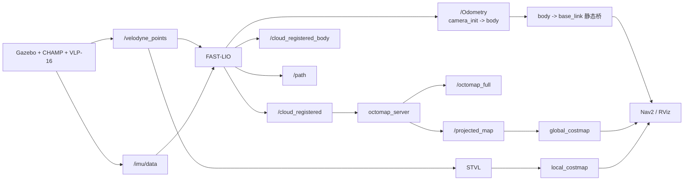

# 第 14 章 仿真中的 3D SLAM 与 Nav2 升级

> 第 13 章我们把 Go2 在 Gazebo 里跑了起来,也把 `/velodyne_points` 和 `/imu/data` 这两路关键传感器喂通了。但那还只是"能走能扫"。这一章,我们正式把它升级成一条完整的 3D 感知链:先用 FAST-LIO 建图,再让 OctoMap 和 STVL 把 3D 信息送进 Nav2。

---

## 本章你将学到

- 比较 `KISS-ICP`、`Point-LIO`、`FAST-LIO` 三条 3D LIO 路线,明白为什么本书在仿真里选 `FAST-LIO`
- 看懂 `FAST_LIO_ROS2/config/velodyne.yaml` 里最关键的 6 个参数:`lid_topic`、`imu_topic`、`extrinsic_T`、`extrinsic_R`、`scan_line`、`time_sync_en`
- 按当前仿真代码的真实话题名跑通 `FAST-LIO`:`/velodyne_points` + `/imu/data` + `/Odometry` + `/cloud_registered`
- 把 3D 点云地图变成 Nav2 能消费的代价地图,理解 **OctoMap 负责静态全局图,STVL 负责动态局部层**
- 用一套更贴近真实工程的思路验证 3D 导航:桌面障碍、坡道、楼梯口都应该被"看见",即使 CHAMP 本身不会爬楼梯

---

## 背景与原理

### 从第 13 章走到这一章,差的到底是什么

第 13 章解决的是**仿真底座**:

- Go2 能在 Gazebo 里稳定站立和移动
- VLP-16 点云已经能通过 `/velodyne_points` 发布
- Gazebo IMU 已经能通过 `/imu/data` 发布
- `use_slam:=true` 这条开关也已经准备好,可以把 CHAMP 自带的 EKF 里程计先让出来

这一章要补上的,是另外两层能力:

1. **3D 里程计与建图**:机器人不能只会"扫",还得能把多帧点云叠起来,知道自己走到了哪里
2. **3D 地图到导航的桥**:Nav2 规划器本质上还是在平面上工作,所以你得把 3D 世界整理成它吃得下的形式

别小看第二层。很多人第一次做 3D 导航时最容易犯的错,就是以为"有了 3D 地图 = Nav2 自动会 3D 导航"。并没有。现实工程更常见的做法是:

- 前端感知和建图保留 3D
- 规划和控制继续消费 2D 或 2.5D 代价地图

这不是退而求其次,而是目前 ROS2 生态里最稳的一条路。

### 三条 3D LIO 路线怎么选

这一章我们只比较本项目里真的走过的三条线,不搞百科全书式横评。

| 方案 | 是否紧耦合 | 对 IMU 品质要求 | 典型强项 | 当前结论 |
|---|---|---|---|---|
| `KISS-ICP` | 否,纯几何 ICP | 低 | 配置最少,上手快 | Go2 这种快起快停的小型四足里容易漂 |
| `Point-LIO` | 是 | 很高 | 运动响应快,理论上很适合 LiDAR+IMU | 对 IMU 契约和时间语义太敏感,前面在 L1 上已经吃过大亏 |
| `FAST-LIO / FAST-LIO2` | 是 | 中到高 | iEKF + ikd-Tree 直接配准,退化场景更稳 | 这章主线就选它 |

把它们再说得更直白一点:

#### `KISS-ICP`:最省心,但也最容易在四足上先飘

`KISS-ICP` 的核心思路很朴素:只看点云几何,每一帧和上一帧去做 ICP 匹配。

优点确实明显:

- 不依赖 IMU
- 参数少
- 很适合做"我先看看点云能不能跑"的第一轮验证

但 Go2 这种底盘有一个坏消息:

- 起步、转弯、摆动都比较急
- 纯几何匹配没有 IMU 兜底时,漂移会来得很快

所以它更像一条**试水路线**,不是这章要交付的主线。

#### `Point-LIO`:很强,但它对输入契约真的很挑

`Point-LIO` 是紧耦合 LiDAR-IMU 里程计。理论上它反应快,对高速运动也更友好。

问题是,它对这几件事都很敏感:

- IMU 的噪声和坐标系是否靠谱
- 点云逐点时间是否正确
- 加速度和角速度到底应该怎么喂

前面几周我们已经在实机 L1 路线上踩过很多坑,结论并不暧昧:

- 静态时好看
- 一动起来就容易炸

所以这里不是说 `Point-LIO` 不好,而是说**它不适合拿来当这套仿真教程的第一条可复现主线**。

#### `FAST-LIO`:参数多一点,但在当前仿真里最稳

`FAST-LIO` 同样是紧耦合路线,但它的前端做法和 `Point-LIO`、`LIO-SAM` 一类方案不完全一样。它把 LiDAR 特征和 IMU 状态都塞进迭代扩展卡尔曼滤波里,再配上 ikd-Tree 做快速地图匹配。

工程上它有三个很现实的优点:

- 社区资料最多,ROS2 移植版本也成熟
- 对 `VLP-16` 这类多线雷达已经有现成配置模板
- 在当前这套 Gazebo + 干净 IMU 的仿真里,它比 `Point-LIO` 和 `LiORF` 都更稳

当然,它也不是没缺点:

- 参数不少
- 外参、时间单位、线数这些契约配错了会直接炸
- 没有回环检测时,长时间建图还是会累积漂移

但这一章我们要的是**先把前端 3D SLAM 和 3D costmap 桥接打通**,`FAST-LIO` 正好最合适。

### 为什么 3D 地图最后还要服务 2D Nav2

这里要先把一个常见误解打掉:

**Nav2 不是原生全 3D 路径规划器。**

它最核心的 planner / controller 逻辑,仍然围着平面代价地图转。所以这章的正确目标不是"让 Nav2 直接在点云里飞",而是:

- 用 3D 地图表达复杂空间
- 再把适合规划的那部分投影或切片成 2D 代价地图

本项目里我们实际考虑过 3 种桥接方案:

| 方案 | 你得到什么 | 优点 | 缺点 | 结论 |
|---|---|---|---|---|
| `grid_map` | 2.5D 高程图 | 功能全,学术资料多 | 一个 `xy` 只能放一套高度表达,多层空间天然吃亏 | 否决 |
| `OctoMap` | 3D 八叉树 + 2D 投影 | 成熟、Humble 可装、支持多层结构 | 分辨率开太细会吃 CPU | 作为**静态全局图** |
| `STVL` | 直接面向 Nav2 的 3D voxel layer | 吃 `PointCloud2` 方便,适合动态障碍 | 更偏局部层,不是整栋楼世界模型 | 作为**动态局部层** |

本章最终采用的是这套分工:

- **`OctoMap`**:把 `FAST-LIO` 的配准点云累成稳定的 3D 占据图,再投影成 `/projected_map`
- **`STVL`**:直接消费原始 `/velodyne_points`,给 `local_costmap` 做动态障碍感知

这套"静态 + 动态"两层结构,是这一章最重要的工程价值。

!!! note "为什么 `grid_map` 在这里被否了"
    `grid_map` 很适合做高程、坡度、接触地形分析,但它本质还是 2.5D。对于"首层大厅上面还有二层平台"这类有 `xy` 重叠的结构,它天然不如 `OctoMap` 这种真正 3D 占据表达。

!!! warning "楼梯在这一章的目标不是'爬上去'"
    CHAMP 这条仿真控制链不会突然因为你接了 3D 地图就学会爬楼梯。这里真正要验证的是:

    - 3D 地图里能不能把楼梯口、台阶前沿看成障碍
    - Nav2 会不会再把楼梯当成平地硬冲

---

## 架构总览

先把整条链长什么样看清楚,后面你就不容易被 launch 和 YAML 绕晕。



这张图里最容易混的有 3 个点:

1. `FAST-LIO` 的全局参考系不是 `map`,而是 `camera_init`
2. `FAST-LIO` 的机体坐标系是 `body`,而当前 Go2 仿真 URDF 根是 `base_link`
3. Nav2 全局层想要的是**投影后的 2D 占据图**,不是原始点云

所以我们会额外做两件小事:

- 用第 13 章已经准备好的 `slam_tf_bridge` 把 `body -> base_link` 补齐
- 在接 Nav2 时,先把 `map -> camera_init` 当成一条**初始恒等变换**

后面如果你再接回环后端,比如 SC-PGO,就让它接管 `map -> camera_init`。这也是前面周记里实际走过的那条路线。

---

## 环境准备

### 前置成果

开始前请确认你已经完成:

- 第 13 章的 Gazebo 仿真底座
- `go2_config gazebo_velodyne.launch.py` 能正常启动
- `/velodyne_points` 和 `/imu/data` 都有数据
- 你知道这套仿真里用的是 `base_link`,不是第 12 章实机里的 `base`

先用下面两条命令查一下:

```bash
# 先启动第 13 章的仿真底座,确认点云和 IMU 仍然正常
cd ~/go2_sim_ws
source install/setup.bash
ros2 launch go2_config gazebo_velodyne.launch.py use_slam:=true
```

另开终端:

```bash
# 确认关键话题都在
source ~/go2_sim_ws/install/setup.bash
ros2 topic list | grep -E "velodyne_points|imu/data|clock"

# 频率别拍脑袋,直接量
ros2 topic hz /imu/data
ros2 topic hz /velodyne_points
```

如果一切正常,你应该看到:

- `/imu/data` 约 `100 Hz`
- `/velodyne_points` 约 `10 Hz`
- `/clock` 正在发布

### 新增依赖

这章要多装 4 类依赖:

- `OctoMap`
- `STVL`
- `pcl_viewer` 所在工具包
- `FAST-LIO` 自己的源码包

先装系统包:

```bash
# OctoMap + STVL + PCD 查看工具
sudo apt install -y \
    ros-humble-octomap-ros \
    ros-humble-octomap-server \
    ros-humble-spatio-temporal-voxel-layer \
    pcl-tools
```

再把 `FAST-LIO` 放进工作空间:

```bash
# 把 FAST-LIO 的 ROS2 版本放进当前教程工作空间
cd ~/go2_sim_ws/src
git clone <FAST_LIO_ROS2 官方仓库地址> FAST_LIO_ROS2
```

!!! note "关于 Gazebo 的 VLP-16 插件"
    本书当前本地工程里,还额外放了一份源码版 `velodyne_gazebo_plugins`,它把每个点的 `time` 从全 0 修成了"相对扫描起点的时间偏移"。  
    这对 `LiORF / LIO-SAM` 一类更依赖 deskew 的算法非常重要。`FAST-LIO` 没那么脆,但如果你想让仿真和本书当前工程状态更一致,也可以把这份插件源码一起放进工作空间。

如果你也要跟到同一版仿真插件,步骤是:

```bash
# 可选:让 Gazebo 的 VLP-16 插件也走源码版,便于检查逐点 time 字段
cd ~/go2_sim_ws/src
git clone <velodyne_simulator 官方仓库地址> velodyne_simulator
```

然后把那些默认忽略构建的标记删掉:

```bash
# 这三个文件不删, colcon 根本不会编它
rm velodyne_simulator/velodyne_gazebo_plugins/COLCON_IGNORE
rm velodyne_simulator/velodyne_gazebo_plugins/AMENT_IGNORE
rm velodyne_simulator/velodyne_gazebo_plugins/CATKIN_IGNORE
```

### 先把"时间"这件事分清楚

这一章同时会遇到两种时间概念:

1. **仿真时间**:来自 `/clock`,由 `use_sim_time: true` 控制
2. **点云逐点时间**:点云里每个点相对一帧扫描起点的偏移,由 `time` 或 `t` 字段提供

这两者不是一回事。

- `use_sim_time` 没开,TF 和消息时间会乱套
- `time` 字段单位配错,去畸变和配准会变形

所以你要记住一句话:

**`use_sim_time` 解决的是"大家跟谁对表"；`timestamp_unit` / `time_sync_en` 解决的是"雷达和 IMU 自己怎么对齐"。**

---

## 实现步骤

### 步骤一:先把 `FAST-LIO` 的配置文件改对

我们先处理最核心的文件:`src/FAST_LIO_ROS2/config/velodyne.yaml`。

这份配置里,下面 6 个键必须和当前仿真代码严格对上:

- `common.lid_topic`
- `common.imu_topic`
- `common.time_sync_en`
- `mapping.extrinsic_T`
- `mapping.extrinsic_R`
- `preprocess.scan_line`

把文件整理成下面这样:

```yaml
/**:
    ros__parameters:
        feature_extract_enable: false
        point_filter_num: 4
        max_iteration: 3
        filter_size_surf: 0.5
        filter_size_map: 0.5
        cube_side_length: 1000.0
        runtime_pos_log_enable: false
        map_file_path: "./test.pcd"

        common:
            lid_topic: "/velodyne_points"      # Gazebo VLP-16 发布的话题
            imu_topic: "/imu/data"             # Gazebo IMU 发布的话题
            time_sync_en: false                # 仿真里统一用 /clock,这里不要乱开软件同步
            time_offset_lidar_to_imu: 0.0

        preprocess:
            lidar_type: 2                      # 2 = Velodyne
            scan_line: 16                      # VLP-16 就是 16 线,这个键漏了基本必炸
            scan_rate: 10                      # 当前 xacro 里 update_rate = 10 Hz
            timestamp_unit: 0                  # 本仓库 Gazebo 插件的 time 字段按"秒"写入,所以填 0
            blind: 0.5

        mapping:
            acc_cov: 0.1
            gyr_cov: 0.1
            b_acc_cov: 0.0001
            b_gyr_cov: 0.0001
            fov_degree: 360.0
            det_range: 30.0
            extrinsic_est_en: false
            extrinsic_T: [0.2, 0.0, 0.118]    # 由 xacro 中的固定关节直接读出来
            extrinsic_R: [1.0, 0.0, 0.0,
                          0.0, 1.0, 0.0,
                          0.0, 0.0, 1.0]

        publish:
            path_en: true
            scan_publish_en: true
            dense_publish_en: true
            scan_bodyframe_pub_en: true
            map_en: true

        pcd_save:
            pcd_save_en: true
            interval: -1
            filter_size_save: 0.1
            ground_filter_z: -0.15
```

先把最重要的键一个个吃透:

#### `lid_topic` 和 `imu_topic`

这两个别凭感觉写。我们已经在第 13 章把真实话题查清楚了:

- 点云是 `/velodyne_points`
- IMU 是 `/imu/data`

如果你这里沿用上游模板里的 Livox 话题名,`FAST-LIO` 就会一直在那里傻等。

#### `scan_line`

这个键就是告诉 `FAST-LIO`:你喂给我的到底是几线雷达。

当前仿真里用的是 VLP-16,所以一定是:

```yaml
scan_line: 16
```

这个数写错后最常见的现象是:

- 点云能进来
- 但内部按错行号组织数据
- 地图开始扭、飘、或者直接不收敛

#### `time_sync_en`

这个参数最容易被误解。

它的意思不是"打开后就自动帮你处理所有时间问题",而是:

- 如果 LiDAR 和 IMU 头时间差比较大
- 又没有硬件或外部时间同步
- 那就让 `FAST-LIO` 做一个很朴素的软件对齐

在当前仿真里,我们的建议是**保持 `false`**。原因有两个:

1. Gazebo 本来就通过 `/clock` 给整套系统提供统一时间
2. 这个开关更像兜底手段,不是常规首选项

!!! warning "别把 `time_sync_en` 和 `use_sim_time` 混为一谈"
    `use_sim_time` 是 ROS2 节点要不要跟 `/clock` 走。  
    `time_sync_en` 是 `FAST-LIO` 在 LiDAR 和 IMU 之间要不要做软件级补偿。  
    这俩名字里都有 `time`,但解决的问题完全不同。

#### `timestamp_unit`

这个键虽然不在本章的"六大主角"名单里,但它实际上一样关键。

它表示:

- 点云里 `time` 字段的单位是什么
- `FAST-LIO` 该把它换算成什么量级去做去畸变

这一项最稳的做法不是背模板,而是**对着你当前的 PointCloud2 实际字段来确认**。

合法取值(由 `FAST-LIO` 源码决定):

- `0` = 秒(second)
- `1` = 毫秒(millisecond)
- `2` = 微秒(microsecond)
- `3` = 纳秒(nanosecond)

本书当前用的 `velodyne_simulator` 源码版 plugin(`GazeboRosVelodyneLaser.cpp`),`time` 字段的写入方式是:

- 数据类型:`FLOAT32`
- 数值含义:**每个点相对于一帧扫描起点的时间偏移,单位是"秒"**

所以本书配套的写法是:

```yaml
timestamp_unit: 0
```

!!! warning "这是"代码级"结论,不是"经验之谈""
    以上结论直接来自当前仓库 plugin 源码里的 `PointField` 定义。  
    如果你后续换了别的 plugin(比如某些实机/第三方插件把 `time` 按"微秒"或"纳秒"写入),就要对应把 `timestamp_unit` 改成 `2` 或 `3`。**换插件必重核**。

!!! tip "实测建议"
    理论上单位对齐后 FAST-LIO 去畸变就正常了。**第一次跑通时还是建议你手动录一段 rosbag**,在 RViz 里看 `/cloud_registered` 有没有明显的"拖尾 / 扭动",作为"单位真没配错"的双保险。后面常见问题里我们还会专门再说一次这个坑。

### 步骤二:从 xacro 里抄出 IMU 契约和外参

很多教程一讲到外参就开始说"去标定一下"。这话在真机上没错,但在仿真里先别自己吓自己:

- 传感器安装位置就是你写进 xacro 的
- 所以第一版外参,直接从 xacro 里读

先看 IMU:

```xml
<joint name="imu_joint" type="fixed">
    <parent link="trunk"/>
    <child link="imu_link"/>
    <origin xyz="0 0 0" rpy="0 0 0"/>
</joint>
```

再看 Gazebo 里的 IMU 插件:

```xml
<gazebo reference="imu_link">
    <sensor name="imu_sensor" type="imu">
        <update_rate>100</update_rate>
        <plugin name="imu_plugin" filename="libgazebo_ros_imu_sensor.so">
            <ros>
                <namespace>imu</namespace>
                <remapping>~/out:=data</remapping>
            </ros>
        </plugin>
    </sensor>
</gazebo>
```

这几行已经把 3 个关键事实说全了:

- IMU frame 是 `imu_link`
- IMU topic 是 `/imu/data`
- IMU 发布频率是 `100 Hz`

再看雷达:

```xml
<joint name="velodyne_base_mount_joint" type="fixed">
    <origin xyz="0.2 0 0.08" rpy="0 0 0"/>
    <parent link="base_link"/>
    <child link="velodyne_base_link"/>
</joint>

<joint name="velodyne_base_scan_joint" type="fixed">
    <origin xyz="0 0 0.0377" rpy="0 0 0"/>
    <parent link="velodyne_base_link"/>
    <child link="velodyne"/>
</joint>
```

当前这个 Go2 模型里:

- `base_link -> trunk` 是固定零变换
- `trunk -> imu_link` 也是固定零变换

所以第一版你完全可以把 `imu_link` 看成和 `base_link` 共点。

于是 LiDAR 相对 IMU 的平移,直接就是:

- `x = 0.2`
- `y = 0.0`
- `z = 0.08 + 0.0377 = 0.1177`

向上取一个教程里好抄的数,就是:

```yaml
extrinsic_T: [0.2, 0.0, 0.118]
```

而这套仿真里所有相关固定关节的旋转都是零,所以:

```yaml
extrinsic_R:
  [1.0, 0.0, 0.0,
   0.0, 1.0, 0.0,
   0.0, 0.0, 1.0]
```

### 步骤三:启动 Gazebo 和 `FAST-LIO`

先把仿真底座拉起来:

```bash
# 终端 1: 启动 Gazebo 仿真,把 CHAMP 自带 EKF 让出来
cd ~/go2_sim_ws
source install/setup.bash
ros2 launch go2_config gazebo_velodyne.launch.py use_slam:=true rviz:=false
```

再起 `FAST-LIO`:

```bash
# 终端 2: 启动 FAST-LIO,记得显式打开仿真时间
cd ~/go2_sim_ws
source install/setup.bash
ros2 launch fast_lio mapping.launch.py \
    config_file:=velodyne.yaml \
    use_sim_time:=true
```

最后起键盘控制:

```bash
# 终端 3: 键盘遥控机器人在场景里走一圈
cd ~/go2_sim_ws
source install/setup.bash
ros2 run champ_teleop champ_teleop.py
```

如果你想先做最小检查,再动机器人,先看这 4 条:

```bash
# 终端 4: 最小联调检查
source ~/go2_sim_ws/install/setup.bash
ros2 topic hz /imu/data
ros2 topic hz /velodyne_points
ros2 topic hz /cloud_registered
ros2 topic echo --once /Odometry
```

正常现象应该是:

- `/cloud_registered` 已经开始发布
- `/Odometry` 的 `header.frame_id` 是 `camera_init`
- `/Odometry` 的 `child_frame_id` 是 `body`
- RViz 里把 `Fixed Frame` 设成 `camera_init` 后,轨迹和点云都能稳定累积

!!! note "为什么这里是 `camera_init`,不是 `map`"
    这一章我们先做的是**无回环的前端建图**。  
    对 `FAST-LIO` 来说,它最自然的全局参考系就是 `camera_init`。  
    后面接回环或定位后端时,再让 `map -> camera_init` 这条 TF 去负责全局纠漂。

### 步骤四:把点云地图存成 `.pcd`

当前这份 `FAST-LIO` 源码里已经打开了地图保存服务,所以你有两种办法:

- 直接退出 `FAST-LIO`,让它自动保存
- 不退出,手动调 `/map_save`

推荐先用服务调用:

```bash
# 终端 4: 不停节点也能把当前累计地图存下来
source ~/go2_sim_ws/install/setup.bash
ros2 service call /map_save std_srvs/srv/Trigger "{}"
```

保存后去 `src/FAST_LIO_ROS2/PCD/` 目录找生成的地图文件。

如果你想快速看看保存结果:

```bash
# 在工作空间根目录下直接看一眼保存的 PCD
cd ~/go2_sim_ws
pcl_viewer src/FAST_LIO_ROS2/PCD/<你的地图文件>.pcd
```

如果更喜欢在 RViz 里看,也可以把保存后的 PCD 再转成点云话题,或者直接用 `PointCloud2` 观察正在发布的 `/Laser_map`。

!!! tip "先别急着追求'整层楼一把过'"
    `FAST-LIO` 没有回环检测,在大场景里长时间跑一定会慢慢累积漂移。  
    这一章的目标不是世界级精度建图,而是先把前端 3D 建图、PCD 保存和 3D 导航桥接全部跑通。

### 步骤五:用 `OctoMap` 把 3D 地图投影成 Nav2 能吃的全局图

现在我们来做这一章最关键的一步:

- `FAST-LIO` 持续输出 `/cloud_registered`
- `octomap_server` 订阅这路配准后的点云
- 它一边维护 3D 八叉树,一边自动发布 2D 投影 `/projected_map`

#### 先给 `map` 一个临时别名

我们前面说过,`FAST-LIO` 的全局参考系是 `camera_init`。  
而 Nav2 这边更习惯叫它 `map`。

在还没接回环后端之前,最简单的做法就是先发布一条**恒等变换**:

```python
# 文件: go2_config/launch/octomap_bridge.launch.py
# 作用:把 camera_init 临时别名成 map,再启动 octomap_server

from launch import LaunchDescription
from launch_ros.actions import Node


def generate_launch_description():
    return LaunchDescription([
        Node(
            package="tf2_ros",
            executable="static_transform_publisher",
            name="map_alias",
            arguments=["0", "0", "0", "0", "0", "0", "map", "camera_init"],
            parameters=[{"use_sim_time": True}],
        ),
        Node(
            package="octomap_server",
            executable="octomap_server_node",
            name="octomap_server",
            parameters=[{
                "use_sim_time": True,
                "frame_id": "map",
                "base_frame_id": "base_link",
                "resolution": 0.10,
                "latch": True,
                "sensor_model/max_range": 20.0,
                "pointcloud_min_z": -0.20,
                "pointcloud_max_z": 2.50,
                "occupancy_min_z": 0.00,
                "occupancy_max_z": 2.00,
            }],
            remappings=[
                ("cloud_in", "/cloud_registered"),
            ],
            output="screen",
        ),
    ])
```

这里面你要特别注意两件事:

- `frame_id` 设成 `map`,是为了让后面的 `global_costmap` 统一吃同一个全局坐标系
- 输入选 `/cloud_registered`,而不是原始 `/velodyne_points`,因为前者已经叠加了 `FAST-LIO` 估计出的位姿

#### 启动 `octomap_server`

```bash
# 终端 4: 启动 OctoMap 桥接
cd ~/go2_sim_ws
source install/setup.bash
ros2 launch go2_config octomap_bridge.launch.py
```

起来之后,你可以马上检查:

```bash
# 看看 3D 地图和 2D 投影是不是都出来了
source ~/go2_sim_ws/install/setup.bash
ros2 topic list | grep -E "octomap|projected_map"
```

正常情况下应该至少能看到:

- `/octomap_full`
- `/projected_map`

### 步骤六:给 `local_costmap` 换成 STVL,把 3D 障碍直接送进 Nav2

现在来写 Nav2 的 3D 版参数。

这里的设计思路很明确:

- `global_costmap` 读 `/projected_map`,负责全局静态环境
- `local_costmap` 直接接 STVL,实时看原始 3D 点云

在 `go2_config/config/autonomy/` 下新建 `navigation_3d.yaml`:

```yaml
bt_navigator:
  ros__parameters:
    use_sim_time: true
    global_frame: map
    robot_base_frame: base_link
    odom_topic: /Odometry
    bt_loop_duration: 10
    default_server_timeout: 20
    enable_groot_monitoring: true
    groot_zmq_publisher_port: 1666
    groot_zmq_server_port: 1667
    plugin_lib_names:
      - nav2_compute_path_to_pose_action_bt_node
      - nav2_compute_path_through_poses_action_bt_node
      - nav2_follow_path_action_bt_node
      - nav2_back_up_action_bt_node
      - nav2_spin_action_bt_node
      - nav2_wait_action_bt_node
      - nav2_clear_costmap_service_bt_node
      - nav2_is_stuck_condition_bt_node
      - nav2_goal_reached_condition_bt_node
      - nav2_goal_updated_condition_bt_node
      - nav2_initial_pose_received_condition_bt_node
      - nav2_reinitialize_global_localization_service_bt_node
      - nav2_rate_controller_bt_node
      - nav2_distance_controller_bt_node
      - nav2_speed_controller_bt_node
      - nav2_truncate_path_action_bt_node
      - nav2_goal_updater_node_bt_node
      - nav2_recovery_node_bt_node
      - nav2_pipeline_sequence_bt_node
      - nav2_round_robin_node_bt_node
      - nav2_transform_available_condition_bt_node
      - nav2_time_expired_condition_bt_node
      - nav2_distance_traveled_condition_bt_node
      - nav2_single_trigger_bt_node
      - nav2_is_battery_low_condition_bt_node
      - nav2_navigate_through_poses_action_bt_node
      - nav2_navigate_to_pose_action_bt_node
      - nav2_remove_passed_goals_action_bt_node
      - nav2_planner_selector_bt_node
      - nav2_controller_selector_bt_node
      - nav2_goal_checker_selector_bt_node

controller_server:
  ros__parameters:
    use_sim_time: true
    controller_frequency: 20.0
    min_x_velocity_threshold: 0.001
    min_y_velocity_threshold: 0.5
    min_theta_velocity_threshold: 0.001
    failure_tolerance: 0.3
    progress_checker_plugin: progress_checker
    goal_checker_plugins: [general_goal_checker]
    controller_plugins: [FollowPath]
    progress_checker:
      plugin: nav2_controller::SimpleProgressChecker
      required_movement_radius: 0.3
      movement_time_allowance: 20.0
    general_goal_checker:
      stateful: true
      plugin: nav2_controller::SimpleGoalChecker
      xy_goal_tolerance: 0.25
      yaw_goal_tolerance: 0.35
    FollowPath:
      plugin: dwb_core::DWBLocalPlanner
      debug_trajectory_details: true
      min_vel_x: -0.1
      min_vel_y: 0.0
      max_vel_x: 0.3
      max_vel_y: 0.0
      max_vel_theta: 0.5
      min_speed_xy: 0.0
      max_speed_xy: 0.3
      min_speed_theta: 0.0
      acc_lim_x: 2.5
      acc_lim_y: 0.0
      acc_lim_theta: 3.2
      decel_lim_x: -2.5
      decel_lim_y: 0.0
      decel_lim_theta: -3.2
      vx_samples: 20
      vy_samples: 5
      vtheta_samples: 20
      sim_time: 1.7
      linear_granularity: 0.05
      angular_granularity: 0.025
      transform_tolerance: 0.5
      xy_goal_tolerance: 0.25
      trans_stopped_velocity: 0.05
      short_circuit_trajectory_evaluation: true
      stateful: true
      critics: [RotateToGoal, Oscillation, BaseObstacle, GoalAlign, PathAlign, PathDist, GoalDist]
      BaseObstacle.scale: 0.02
      PathAlign.scale: 32.0
      PathAlign.forward_point_distance: 0.1
      GoalAlign.scale: 24.0
      GoalAlign.forward_point_distance: 0.1
      PathDist.scale: 32.0
      GoalDist.scale: 24.0
      RotateToGoal.scale: 24.0
      RotateToGoal.slowing_factor: 3.0
      RotateToGoal.lookahead_time: -1.0

local_costmap:
  local_costmap:
    ros__parameters:
      use_sim_time: true
      global_frame: camera_init
      robot_base_frame: base_link
      rolling_window: true
      width: 4.0
      height: 4.0
      resolution: 0.05
      robot_radius: 0.22
      update_frequency: 5.0
      publish_frequency: 2.0
      plugins: [stvl_layer, inflation_layer]
      inflation_layer:
        plugin: nav2_costmap_2d::InflationLayer
        cost_scaling_factor: 3.0
        inflation_radius: 0.55
      stvl_layer:
        plugin: spatio_temporal_voxel_layer/SpatioTemporalVoxelLayer
        enabled: true
        voxel_decay: 10.0
        decay_model: 0
        voxel_size: 0.05
        track_unknown_space: true
        unknown_threshold: 15
        mark_threshold: 0
        update_footprint_enabled: true
        combination_method: 1
        transform_tolerance: 0.2
        origin_z: 0.0
        publish_voxel_map: true
        mapping_mode: false
        observation_sources: velodyne_mark velodyne_clear
        velodyne_mark:
          data_type: PointCloud2
          topic: /velodyne_points
          marking: true
          clearing: false
          clear_after_reading: true
          min_obstacle_height: 0.05
          max_obstacle_height: 2.0
          observation_persistence: 0.0
          expected_update_rate: 0.0
        velodyne_clear:
          data_type: PointCloud2
          topic: /velodyne_points
          marking: false
          clearing: true
          clear_after_reading: true
          min_z: -0.20
          max_z: 2.20
          vertical_fov_angle: 0.52
          vertical_fov_padding: 0.05
          horizontal_fov_angle: 6.28
          model_type: 1
      always_send_full_costmap: true
  local_costmap_client:
    ros__parameters:
      use_sim_time: true
  local_costmap_rclcpp_node:
    ros__parameters:
      use_sim_time: true

global_costmap:
  global_costmap:
    ros__parameters:
      use_sim_time: true
      global_frame: map
      robot_base_frame: base_link
      update_frequency: 2.0
      publish_frequency: 1.0
      resolution: 0.10
      robot_radius: 0.22
      track_unknown_space: true
      plugins: [static_layer, inflation_layer]
      static_layer:
        plugin: nav2_costmap_2d::StaticLayer
        map_topic: /projected_map
        map_subscribe_transient_local: true
      inflation_layer:
        plugin: nav2_costmap_2d::InflationLayer
        cost_scaling_factor: 3.0
        inflation_radius: 0.55
      always_send_full_costmap: true
  global_costmap_client:
    ros__parameters:
      use_sim_time: true
  global_costmap_rclcpp_node:
    ros__parameters:
      use_sim_time: true

planner_server:
  ros__parameters:
    use_sim_time: true
    expected_planner_frequency: 20.0
    planner_plugins: [GridBased]
    GridBased:
      plugin: nav2_navfn_planner/NavfnPlanner
      tolerance: 0.5
      use_astar: false
      allow_unknown: true

behavior_server:
  ros__parameters:
    use_sim_time: true
    costmap_topic: local_costmap/costmap_raw
    footprint_topic: local_costmap/published_footprint
    cycle_frequency: 10.0
    behavior_plugins: [spin, backup, wait]
    spin:
      plugin: nav2_behaviors/Spin
    backup:
      plugin: nav2_behaviors/BackUp
    wait:
      plugin: nav2_behaviors/Wait
    global_frame: camera_init
    robot_base_frame: base_link
    transform_timeout: 0.1
    simulate_ahead_time: 2.0
    max_rotational_vel: 1.0
    min_rotational_vel: 0.4
    rotational_acc_lim: 3.2

smoother_server:
  ros__parameters:
    use_sim_time: true

velocity_smoother:
  ros__parameters:
    use_sim_time: true
    smoothing_frequency: 20.0
    scale_velocities: false
    feedback: OPEN_LOOP
    max_velocity: [0.3, 0.0, 0.5]
    min_velocity: [-0.3, 0.0, -0.5]
    max_accel: [2.5, 0.0, 3.2]
    max_decel: [-2.5, 0.0, -3.2]
    odom_topic: /Odometry
    odom_duration: 0.1
    deadband_velocity: [0.0, 0.0, 0.0]
    velocity_timeout: 1.0

waypoint_follower:
  ros__parameters:
    use_sim_time: true
    loop_rate: 20
    stop_on_failure: false
    waypoint_task_executor_plugin: wait_at_waypoint
    wait_at_waypoint:
      plugin: nav2_waypoint_follower::WaitAtWaypoint
      enabled: true
      waypoint_pause_duration: 200
```

这份参数里真正的核心只有两块:

- `global_costmap.static_layer.map_topic = /projected_map`
- `local_costmap` 用 `STVL` 直接订阅 `/velodyne_points`

如果你能把这两件事用自己的话解释清楚,这一章就算学到位了。

### 步骤七:启动 3D 版 Nav2 并发目标点

为了和当前仓库的 `twist_mux` 结构保持一致,我们新建一个 launch,延续前面 `go2_config` 里那套写法。

```python
# 文件: go2_config/launch/nav2_octomap.launch.py
# 作用:把 OctoMap、twist_mux 和 Nav2 核心节点一起拉起来

from launch import LaunchDescription
from launch.actions import DeclareLaunchArgument
from launch.conditions import IfCondition
from launch.substitutions import LaunchConfiguration, PathJoinSubstitution
from launch_ros.actions import Node
from launch_ros.descriptions import ParameterFile
from launch_ros.substitutions import FindPackageShare
from nav2_common.launch import RewrittenYaml


def generate_launch_description():
    this_package = FindPackageShare("go2_config")
    use_sim_time = LaunchConfiguration("use_sim_time")
    params_file = LaunchConfiguration("params_file")
    rviz = LaunchConfiguration("rviz")

    twist_mux_params = PathJoinSubstitution(
        [this_package, "config", "autonomy", "twist_mux.yaml"]
    )

    configured_params = ParameterFile(
        RewrittenYaml(
            source_file=params_file,
            param_rewrites={"use_sim_time": use_sim_time},
            convert_types=True,
        ),
        allow_substs=True,
    )

    tf_remappings = [("/tf", "tf"), ("/tf_static", "tf_static")]

    lifecycle_nodes = [
        "controller_server",
        "smoother_server",
        "planner_server",
        "behavior_server",
        "bt_navigator",
        "waypoint_follower",
        "velocity_smoother",
    ]

    rviz_config = PathJoinSubstitution(
        [FindPackageShare("champ_navigation"), "rviz", "navigation.rviz"]
    )

    return LaunchDescription([
        DeclareLaunchArgument("use_sim_time", default_value="true"),
        DeclareLaunchArgument(
            "params_file",
            default_value=PathJoinSubstitution(
                [this_package, "config", "autonomy", "navigation_3d.yaml"]
            ),
        ),
        DeclareLaunchArgument("rviz", default_value="true"),

        Node(
            package="twist_mux",
            executable="twist_mux",
            name="twist_mux",
            parameters=[twist_mux_params, {"use_sim_time": use_sim_time}],
            remappings=[("cmd_vel_out", "/cmd_vel")],
            output="screen",
        ),

        Node(
            package="nav2_controller",
            executable="controller_server",
            parameters=[configured_params],
            remappings=tf_remappings + [("cmd_vel", "cmd_vel_nav")],
            output="screen",
        ),
        Node(
            package="nav2_smoother",
            executable="smoother_server",
            name="smoother_server",
            parameters=[configured_params],
            remappings=tf_remappings,
            output="screen",
        ),
        Node(
            package="nav2_planner",
            executable="planner_server",
            name="planner_server",
            parameters=[configured_params],
            remappings=tf_remappings,
            output="screen",
        ),
        Node(
            package="nav2_behaviors",
            executable="behavior_server",
            name="behavior_server",
            parameters=[configured_params],
            remappings=tf_remappings + [("cmd_vel", "cmd_vel_behavior")],
            output="screen",
        ),
        Node(
            package="nav2_bt_navigator",
            executable="bt_navigator",
            name="bt_navigator",
            parameters=[configured_params],
            remappings=tf_remappings,
            output="screen",
        ),
        Node(
            package="nav2_waypoint_follower",
            executable="waypoint_follower",
            name="waypoint_follower",
            parameters=[configured_params],
            remappings=tf_remappings,
            output="screen",
        ),
        Node(
            package="nav2_velocity_smoother",
            executable="velocity_smoother",
            name="velocity_smoother",
            parameters=[configured_params],
            remappings=tf_remappings + [
                ("cmd_vel", "cmd_vel_nav"),
                ("cmd_vel_smoothed", "cmd_vel_nav_smooth"),
            ],
            output="screen",
        ),
        Node(
            package="nav2_lifecycle_manager",
            executable="lifecycle_manager",
            name="lifecycle_manager_navigation",
            parameters=[{
                "use_sim_time": use_sim_time,
                "autostart": True,
                "node_names": lifecycle_nodes,
            }],
            output="screen",
        ),
        Node(
            package="rviz2",
            executable="rviz2",
            name="rviz2",
            arguments=["-d", rviz_config],
            parameters=[{"use_sim_time": use_sim_time}],
            condition=IfCondition(rviz),
            output="screen",
        ),
    ])
```

这个 launch 不再去碰:

- `pointcloud_to_laserscan`
- `map_server`

因为这章的局部层已经直接走 3D 点云,全局层也直接吃 `/projected_map` 了。

---

## 编译与运行

先把这一章新增或改动的包编一遍:

```bash
# 编译 FAST-LIO 和 go2_config
# 如果你也放了源码版 velodyne 插件,把 velodyne_gazebo_plugins 一起加上
cd ~/go2_sim_ws
source /opt/ros/humble/setup.bash
colcon build --symlink-install --packages-select \
    fast_lio \
    go2_config
source install/setup.bash
```

下面按顺序开 5 个终端:

```bash
# 终端 1: Gazebo + Go2 + VLP-16
cd ~/go2_sim_ws
source install/setup.bash
ros2 launch go2_config gazebo_velodyne.launch.py use_slam:=true rviz:=false
```

```bash
# 终端 2: FAST-LIO 前端建图
cd ~/go2_sim_ws
source install/setup.bash
ros2 launch fast_lio mapping.launch.py \
    config_file:=velodyne.yaml \
    use_sim_time:=true
```

```bash
# 终端 3: 键盘控制
cd ~/go2_sim_ws
source install/setup.bash
ros2 run champ_teleop champ_teleop.py cmd_vel_topic:=/cmd_vel_teleop
```

```bash
# 终端 4: OctoMap 桥接
cd ~/go2_sim_ws
source install/setup.bash
ros2 launch go2_config octomap_bridge.launch.py
```

```bash
# 终端 5: 3D 版 Nav2
cd ~/go2_sim_ws
source install/setup.bash
ros2 launch go2_config nav2_octomap.launch.py \
    params_file:=src/unitree-go2-ros2/robots/configs/go2_config/config/autonomy/navigation_3d.yaml
```

如果你只想先验证建图,可以暂时不启动终端 4 和终端 5。  
如果你只想验证 OctoMap 投影,也可以先不开 Nav2,单独看 `/projected_map`。

---

## 结果验证

### 验证 1:`FAST-LIO` 是否真的跑通了

满足下面几条,就说明前端基本没问题:

- RViz 里把 `Fixed Frame` 设成 `camera_init`,能看到 `/cloud_registered` 稳定累积
- `/Odometry` 正在发布,而且机器人移动时轨迹连续
- `/path` 不再抽风,转弯时不会瞬移
- `ros2 service call /map_save` 能生成新的 `.pcd`

<!-- TODO(媒体): FAST-LIO 在 indoor.world 中建图的 RViz 截图,同时显示 RobotModel、/cloud_registered、/Odometry -->

### 验证 2:`OctoMap` 和 `/projected_map` 是否对上了

下面这几个现象同时满足,说明 3D 到 2D 的桥已经搭上:

- `/octomap_full` 在 RViz 里能看到体素占据
- `/projected_map` 已经不是空白 OccupancyGrid
- 全局代价地图里,墙和柱子会稳定出现在规划层

你可以直接看话题:

```bash
# 看 projected_map 有没有持续发布
source ~/go2_sim_ws/install/setup.bash
ros2 topic hz /projected_map
```

<!-- TODO(媒体): RViz 同时显示 /octomap_full 和 /projected_map 的对照截图 -->

### 验证 3:STVL 是否真的在拦 3D 障碍

局部层要看的不是"有没有图",而是"能不能拦住本来 2D 看不见的东西"。

最直接的检查方式:

- 让 Go2 朝一个有高度差的障碍物慢慢靠近
- 观察 `local_costmap` 是否先于机器人实体碰撞把代价抬高

如果你打开了 `publish_voxel_map: true`,还可以在 RViz 里把 STVL 的体素层也显示出来。

### 验证 4:按 3 个场景做检查

当前仓库现成的 world 主要还是 `indoor.world`。  
所以这里我们把验证分成两类:

- **当前仓库立即可复现**:先在 `indoor.world` 跑通整条链
- **下一步扩展场景**:复制 world 后加桌面、坡道、楼梯结构

| 场景 | 当前仓库是否现成 | 你该怎么做 | 通过标准 |
|---|---|---|---|
| 室内基线(`indoor.world`) | 是 | 直接启动整条链 | 墙、柱、转角都能稳定建图,Nav2 能在房间里到点 |
| 低矮桌面办公室 | 否 | 从 `indoor.world` 复制一份,加一个桌面高度约 `0.7m ~ 0.8m` 的 `box` | 全局图和局部 STVL 都应把桌面下方不可穿越区域拦住 |
| 坡道走廊 | 否 | 复制 world,用倾斜 `box` 加一段缓坡 | 局部层不应把坡道口误判成完全平地穿透 |
| 首层 + 楼梯口 + 二层平台 | 否 | 复制 world,按多层测试场景清单拼出楼梯和平台 | 地图里能看见楼梯和平台边缘,Nav2 不再把楼梯当前方可通行平地 |

启动模式其实都一样,只是 world 文件换掉:

```bash
# 把 world 换成你复制出来的新场景
cd ~/go2_sim_ws
source install/setup.bash
ros2 launch go2_config gazebo_velodyne.launch.py \
    use_slam:=true \
    world:=src/unitree-go2-ros2/robots/configs/go2_config/worlds/<你的场景>.world
```

!!! note "多层场景先别追求花里胡哨"
    第一版多层 world 用 `box`、`cylinder` 这类 primitive 几何体就够了。  
    目标是验证 3D 感知链和代价地图分工,不是先卷场景美术。

### rosbag 回放建议

如果你想把 3 个验证场景都留一份回放素材,至少录下面这些:

```bash
# 建议每个场景单独录一包,后面排查参数更轻松
cd ~/go2_sim_ws
source install/setup.bash
ros2 bag record \
    /velodyne_points \
    /imu/data \
    /cloud_registered \
    /Odometry \
    /octomap_full \
    /projected_map \
    /tf \
    /tf_static
```

后面如果某个场景只在"坡道"或"楼梯口"出问题,你就不用每次都重跑 Gazebo 了,直接回放 bag 排参数。

---

## 常见问题

### 1. `FAST-LIO` 一直提示 `Waiting for cloud and imu`

**现象**:

- 点云和 IMU 看起来都在
- 但 `FAST-LIO` 就是不开始工作

**先查 3 件事**:

1. `lid_topic` / `imu_topic` 有没有写成上游模板里的默认值
2. 所有节点是不是都开了 `use_sim_time: true`
3. `ros2 topic list` 里是不是真的有 `/velodyne_points` 和 `/imu/data`

这一章里,**`use_sim_time: true` 不是可选项**。

### 2. 点云跟着机器人一起飞,像整张地图粘在狗身上

**原因**:

- 外参填反了
- `extrinsic_T` 把 LiDAR 相对 IMU 的方向写错了
- 或者 `body -> base_link` 没桥好

**解决**:

- 回头核对 xacro 里的固定关节
- 先确认 `extrinsic_R` 在当前仿真里应该是单位阵
- 再确认 `gazebo_velodyne.launch.py` 是不是带了 `use_slam:=true`

### 3. RViz 里模型不显示,或者 TF 一直 extrapolation

**原因**:

- RViz 没跟 `/clock`
- `Fixed Frame` 设错

**解决**:

- RViz 本身也要 `use_sim_time: true`
- 跑 `FAST-LIO` 时先把 `Fixed Frame` 设成 `camera_init`
- 跑 Nav2 时,看全局图就切 `map`,看局部层就看 `camera_init`

### 4. `timestamp_unit` 配错后地图开始扭

**现象**:

- 直线走得还行
- 一转弯地图就明显扭曲

**根因**:

- 点云里的 `time` 字段单位,和 `velodyne.yaml` 里的 `timestamp_unit` 对不上

**解决**:

- 先确认你当前 PointCloud2 的 `time` 到底是秒、毫秒、微秒还是纳秒
- 再把 `timestamp_unit` 改成匹配值

!!! warning "别把这个坑当成'再调调 det_range 试试'"
    `timestamp_unit` 这种契约参数错了,后面再怎么调体素大小和量程都只是瞎忙。

### 5. `octomap_server` 吃满 CPU

**原因**:

- 分辨率设太细
- 场景又太大

**解决**:

- 先把 `resolution` 从 `0.05` 放宽到 `0.10` 或 `0.15`
- 把 `sensor_model/max_range` 控制在室内真正需要的范围内

### 6. `/projected_map` 和 Nav2 全局层对不上

**现象**:

- 代价地图有内容
- 但机器人位置和全局图不在一个地方

**原因**:

- `map -> camera_init` 没统一
- `frame_id` 写成了别的名字

**解决**:

- 先用这一章的 `map_alias` 把 `map -> camera_init` 固定成 identity
- 等后面接回环后端时,再让它接管这条 TF

### 7. Nav2 走到半路撞空气,或者局部层一直有幽灵障碍

**原因**:

- STVL 的体素衰减时间太长
- 清除视锥参数太保守
- 观测持久化没有归零

**解决**:

- 先把 `observation_persistence` 保持 `0.0`
- 保持 `clear_after_reading: true`
- 必要时把 `voxel_decay` 再减小一点

### 8. Goal 一发就被拒绝,提示在 lethal zone

**原因**:

- `/projected_map` 投影后把目标点周围也算进了膨胀区

**解决**:

- 先缩小 `inflation_radius`
- 或者把目标点往开阔区域挪一点

### 9. 多层场景看起来一团乱

**原因**:

- 你把所有高度的点都同时画出来了

**解决**:

- RViz 里给 `PointCloud2` 加高度过滤
- 或者先只看 `/octomap_full` 和 `/projected_map`

### 10. 机器人对着楼梯口还想往前拱

**先别急着骂算法**。先分清楚是哪层出问题:

- 如果 `/octomap_full` 里楼梯边缘都没出来,是前端建图问题
- 如果 `/projected_map` 里没有台阶前沿,是 3D 到 2D 投影问题
- 如果局部层看见了但 controller 还在逼近,再去查 costmap 和膨胀参数

---

## 本章小结

这一章真正完成的,不是"又跑了一个新包",而是把仿真里的 Go2 从"能扫"升级成了"能用 3D 地图做导航决策"。

我们先比较了三条 3D LIO 路线,最后选了在当前仿真里最稳的 `FAST-LIO`。然后把它和 Gazebo 的 `/velodyne_points`、`/imu/data` 对齐,顺手把外参、时间同步和 `scan_line` 这些最容易踩坑的契约参数讲清楚了。

接着,我们没有犯"3D 地图直接塞给 Nav2"的低级错误,而是明确做了分工:

- `OctoMap` 负责静态全局 3D 表达,并投影成 `/projected_map`
- `STVL` 负责局部动态 3D 障碍

到这里,你应该已经能用自己的话说清楚:

- 为什么本章选 `FAST-LIO`
- 为什么 `OctoMap` 和 `STVL` 要分开干活
- 为什么楼梯在这章里是"识别为障碍",不是"直接爬上去"

---

## 下一步

仿真里的 3D 链已经基本打通了,但它终究还是仿真。下一章我们把这条路搬回实机,同时也把雷达从仿真里的 VLP-16 换成更像官方开发主线的 **Livox MID-360**。

继续阅读:[第 15 章 实机升级 — 外接 MID-360 方案](./15-mid360.md)

---

## 拓展阅读

- FAST-LIO / FAST-LIO2 论文与官方 README
- OctoMap 论文与 `octomap_mapping` 项目文档
- `spatio_temporal_voxel_layer` 官方 README 与示例配置
- Nav2 官方 tuning guide
- `grid_map` 文档:适合继续对比 2.5D 与真正 3D 世界模型的边界
