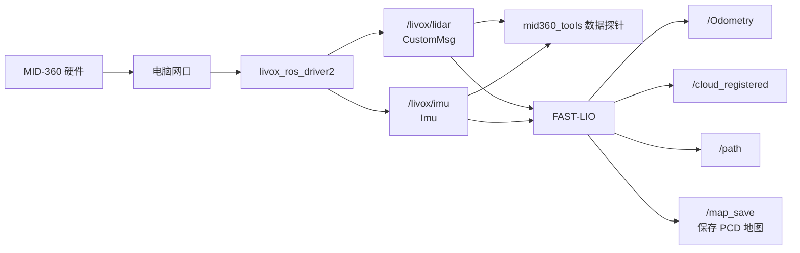

# 第 15 章 实机升级 — 接入 MID-360 并完成 3D 建图

> 前面几章我们已经用 Go2 自带雷达跑通过 2D 感知链。这一章只做一件事:把外接 Livox MID-360 接进 ROS2,确认能拿到雷达和 IMU 数据,再用 FAST-LIO 建出一张 3D 点云地图,保存下来并查看。

---

## 本章你将学到

- 给 MID-360 配置网络,让电脑能够收到雷达数据
- 启动 `livox_ros_driver2`,拿到 `/livox/lidar` 和 `/livox/imu`
- 写一个最小 ROS2 节点读取 MID-360 点云和 IMU 数据
- 配置 `FAST-LIO`,用 MID-360 实时建图
- 调用 `/map_save` 保存 PCD 地图,并用 RViz / `pcl_viewer` 查看地图

!!! warning "本章范围"
    本章只覆盖 **驱动 → 数据 → 建图 → 保存 → 查看**。

---

## 背景与原理

MID-360 是一颗 Livox 3D 激光雷达,内部带 IMU。它接入 ROS2 后通常会输出两路数据:

| Topic | 类型 | 含义 |
|---|---|---|
| `/livox/lidar` | `livox_ros_driver2/msg/CustomMsg` | MID-360 原始点云,包含每个点的坐标和时间偏移 |
| `/livox/imu` | `sensor_msgs/msg/Imu` | MID-360 内置 IMU 数据 |

这里最容易踩坑的是:  
**`/livox/lidar` 不是标准 `sensor_msgs/msg/PointCloud2`,而是 Livox 自己的 `CustomMsg`。**

所以数据链路会长这样:



FAST-LIO 的作用是把连续扫描到的点云和 IMU 运动信息融合起来,估计机器人运动轨迹,并把多帧点云拼成一张 3D 地图。

---

## 环境准备

### 硬件连接

MID-360 不能只插一根网线就完事。它至少需要:

1. 独立供电,按设备规格接 9-27V DC
2. 网线连接到电脑或机载计算机的以太网口
3. 电脑网口和雷达 IP 在同一个网段

!!! danger "不要把供电这件事糊弄过去"
    MID-360 不是 USB 摄像头。网线只传数据,不等于供电。  
    如果雷达没有独立供电,后面所有 ROS 命令都不会有意义。

### 网络规划

下面用一组示例 IP。你实际使用时,只需要保证 **电脑网口 IP** 和 **雷达 IP** 在同一个网段。

| 设备 | 示例 IP |
|---|---|
| 电脑网口 | `192.168.1.50` |
| MID-360 | `192.168.1.185` |

给电脑网口配置静态 IP:

```bash
# 把 <网口名> 换成你的实际网口,例如 eth0、enp3s0、enx......
sudo nmcli connection add type ethernet ifname <网口名> \
  con-name mid360-net \
  ipv4.method manual ipv4.addresses 192.168.1.50/24 \
  ipv6.method ignore autoconnect yes

sudo nmcli connection up mid360-net
```

检查网口:

```bash
ip -br addr
```

检查能否 ping 通雷达:

```bash
ping 192.168.1.185
```

如果 `ping` 不通,先不要启动 ROS。先检查供电、网线、网口名、电脑 IP 和雷达 IP。

### 软件依赖

本章需要这些 ROS2 / 系统工具:

```bash
sudo apt install -y \
  python3-colcon-common-extensions \
  ros-humble-rviz2 \
  pcl-tools
```

还需要两个源码包:

```bash
# 进入你的 ROS2 工作空间源码目录
cd <工作空间>/src

# Livox ROS2 驱动
git clone https://github.com/Livox-SDK/livox_ros_driver2.git

# FAST-LIO ROS2
git clone <FAST-LIO-ROS2-仓库地址> FAST_LIO_ROS2
```

!!! note "FAST-LIO 仓库地址"
    不同班级可能使用不同 ROS2 移植版 FAST-LIO。只要这个包最终能提供 `fast_lio` 包、`fastlio_mapping` 可执行文件和 `mapping.launch.py`,本章流程就能复现。

---

## 实现步骤

## 步骤一:配置 Livox 驱动

进入 `livox_ros_driver2/config/` 目录,找到 `MID360_config.json`。  
如果没有,就新建一份。下面是本章使用的最小配置模板:

```json
{
  "lidar_summary_info": {
    "lidar_type": 8
  },
  "MID360": {
    "lidar_net_info": {
      "cmd_data_port": 56100,
      "push_msg_port": 56200,
      "point_data_port": 56300,
      "imu_data_port": 56400,
      "log_data_port": 56500
    },
    "host_net_info": {
      "cmd_data_ip": "192.168.1.50",
      "cmd_data_port": 56101,
      "push_msg_ip": "192.168.1.50",
      "push_msg_port": 56201,
      "point_data_ip": "192.168.1.50",
      "point_data_port": 56301,
      "imu_data_ip": "192.168.1.50",
      "imu_data_port": 56401,
      "log_data_ip": "",
      "log_data_port": 56501
    }
  },
  "lidar_configs": [
    {
      "ip": "192.168.1.185",
      "pcl_data_type": 1,
      "pattern_mode": 0,
      "extrinsic_parameter": {
        "roll": 0.0,
        "pitch": 0.0,
        "yaw": 0.0,
        "x": 0,
        "y": 0,
        "z": 0
      }
    }
  ]
}
```

这里最关键的是 3 个地方:

| 字段 | 应该填什么 |
|---|---|
| `host_net_info` 里的 `*_ip` | 电脑网口 IP,本章示例是 `192.168.1.50` |
| `lidar_configs[0].ip` | MID-360 雷达 IP,本章示例是 `192.168.1.185` |
| `pcl_data_type` | 建议保持 `1`,让驱动发布 Livox `CustomMsg` |

!!! warning "为什么不直接发布 PointCloud2"
    FAST-LIO 更需要 Livox 点云里的逐点时间信息。  
    `CustomMsg` 能保留这些字段,比直接转成普通 `PointCloud2` 更适合建图。

---

## 步骤二:编译 Livox 驱动和 FAST-LIO

回到工作空间根目录:

```bash
cd <工作空间>
colcon build --symlink-install
source install/setup.bash
```

确认包能被 ROS2 找到:

```bash
ros2 pkg list | grep livox_ros_driver2
ros2 pkg list | grep fast_lio
```

如果找不到 `livox_ros_driver2`,通常是驱动没有编译成功。  
如果找不到 `fast_lio`,通常是 FAST-LIO 源码包名或依赖有问题。

---

## 步骤三:启动 MID-360 驱动

启动 Livox 驱动:

```bash
cd <工作空间>
source install/setup.bash
ros2 launch livox_ros_driver2 msg_MID360_launch.py
```

正常情况下,终端会出现类似信息:

```text
Init lds lidar success!
successfully set lidar attitude
successfully enable Livox Lidar imu
livox/imu publish use imu format
livox/lidar publish use livox custom format
```

另开一个终端,检查 topic:

```bash
cd <工作空间>
source install/setup.bash

ros2 topic list | grep livox
```

你应该至少看到:

```text
/livox/lidar
/livox/imu
```

再检查类型:

```bash
ros2 topic info /livox/lidar
ros2 topic info /livox/imu
```

期望结果:

```text
/livox/lidar : livox_ros_driver2/msg/CustomMsg
/livox/imu   : sensor_msgs/msg/Imu
```

!!! tip "有些环境下 ros2 topic hz 会被 CustomMsg 卡住"
    如果 `ros2 topic hz /livox/lidar` 不稳定,先不要急着判定驱动坏了。  
    可以先看 `/livox/imu`,也可以用下一步的数据探针节点确认点云帧数。

---

## 步骤四:写一个 MID-360 数据探针节点

这一节我们写一个最小包 `mid360_tools`,专门验证两件事:

- `/livox/lidar` 有没有连续发布点云
- `/livox/imu` 有没有连续发布 IMU

创建包:

```bash
cd <工作空间>/src
ros2 pkg create mid360_tools \
  --build-type ament_python \
  --dependencies rclpy sensor_msgs livox_ros_driver2 std_srvs
```

创建文件:

```text
mid360_tools/
├── mid360_tools/
│   ├── __init__.py
│   ├── mid360_probe.py
│   └── save_fastlio_map.py
├── package.xml
└── setup.py
```

### `mid360_probe.py` 原代码

把下面代码写入 `mid360_tools/mid360_tools/mid360_probe.py`:

```python
#!/usr/bin/env python3
"""
MID-360 数据探针:
订阅 /livox/lidar 和 /livox/imu,打印点云帧率、点数和 IMU 帧率。
"""

import time

import rclpy
from rclpy.node import Node
from sensor_msgs.msg import Imu
from livox_ros_driver2.msg import CustomMsg


class Mid360Probe(Node):
    def __init__(self):
        super().__init__("mid360_probe")

        self.lidar_count = 0
        self.imu_count = 0
        self.last_print = time.time()
        self.last_lidar = None
        self.last_imu = None

        self.create_subscription(
            CustomMsg,
            "/livox/lidar",
            self.on_lidar,
            10,
        )

        self.create_subscription(
            Imu,
            "/livox/imu",
            self.on_imu,
            50,
        )

        self.create_timer(1.0, self.print_status)
        self.get_logger().info("MID-360 数据探针已启动")

    def on_lidar(self, msg: CustomMsg):
        self.lidar_count += 1
        self.last_lidar = msg

    def on_imu(self, msg: Imu):
        self.imu_count += 1
        self.last_imu = msg

    def print_status(self):
        now = time.time()
        dt = max(now - self.last_print, 1e-6)

        lidar_hz = self.lidar_count / dt
        imu_hz = self.imu_count / dt

        lidar_text = "no lidar"
        if self.last_lidar is not None:
            point_num = self.last_lidar.point_num
            lidar_text = f"lidar={lidar_hz:.1f}Hz, points={point_num}"
            if point_num > 0:
                p = self.last_lidar.points[0]
                lidar_text += f", first=({p.x:.2f}, {p.y:.2f}, {p.z:.2f})"

        imu_text = "no imu"
        if self.last_imu is not None:
            w = self.last_imu.angular_velocity
            a = self.last_imu.linear_acceleration
            imu_text = (
                f"imu={imu_hz:.1f}Hz, "
                f"gyro=({w.x:.2f}, {w.y:.2f}, {w.z:.2f}), "
                f"acc=({a.x:.2f}, {a.y:.2f}, {a.z:.2f})"
            )

        self.get_logger().info(f"{lidar_text} | {imu_text}")

        self.lidar_count = 0
        self.imu_count = 0
        self.last_print = now


def main():
    rclpy.init()
    node = Mid360Probe()
    try:
        rclpy.spin(node)
    except KeyboardInterrupt:
        pass
    finally:
        node.destroy_node()
        if rclpy.ok():
            rclpy.shutdown()


if __name__ == "__main__":
    main()
```

### `save_fastlio_map.py` 原代码

FAST-LIO 建图完成后,我们用这个脚本调用 `/map_save` 服务保存地图。  
把下面代码写入 `mid360_tools/mid360_tools/save_fastlio_map.py`:

```python
#!/usr/bin/env python3
"""
调用 FAST-LIO 的 /map_save 服务保存当前点云地图。
"""

import rclpy
from rclpy.node import Node
from std_srvs.srv import Trigger


class FastLioMapSaver(Node):
    def __init__(self):
        super().__init__("fastlio_map_saver")
        self.client = self.create_client(Trigger, "/map_save")

    def save(self) -> int:
        self.get_logger().info("等待 /map_save 服务...")
        if not self.client.wait_for_service(timeout_sec=5.0):
            self.get_logger().error("没有找到 /map_save。请确认 FAST-LIO 正在运行。")
            return 1

        future = self.client.call_async(Trigger.Request())
        rclpy.spin_until_future_complete(self, future, timeout_sec=30.0)

        if not future.done():
            self.get_logger().error("保存超时。请检查 FAST-LIO 日志。")
            return 2

        response = future.result()
        if response.success:
            self.get_logger().info(f"保存成功: {response.message}")
            return 0

        self.get_logger().error(f"保存失败: {response.message}")
        return 3


def main():
    rclpy.init()
    node = FastLioMapSaver()
    try:
        return_code = node.save()
    finally:
        node.destroy_node()
        if rclpy.ok():
            rclpy.shutdown()
    raise SystemExit(return_code)


if __name__ == "__main__":
    main()
```

### 修改 `setup.py`

确认 `mid360_tools/setup.py` 里注册了两个命令:

```python
from setuptools import find_packages, setup

package_name = "mid360_tools"

setup(
    name=package_name,
    version="0.0.0",
    packages=find_packages(exclude=["test"]),
    data_files=[
        ("share/ament_index/resource_index/packages", ["resource/" + package_name]),
        ("share/" + package_name, ["package.xml"]),
    ],
    install_requires=["setuptools"],
    zip_safe=True,
    maintainer="student",
    maintainer_email="student@example.com",
    description="MID-360 data probe and FAST-LIO map save helper",
    license="Apache-2.0",
    tests_require=["pytest"],
    entry_points={
        "console_scripts": [
            "mid360_probe = mid360_tools.mid360_probe:main",
            "save_fastlio_map = mid360_tools.save_fastlio_map:main",
        ],
    },
)
```

编译:

```bash
cd <工作空间>
colcon build --symlink-install --packages-select mid360_tools
source install/setup.bash
```

运行数据探针:

```bash
ros2 run mid360_tools mid360_probe
```

正常时你会看到类似输出:

```text
lidar=10.0Hz, points=96000, first=(1.24, -0.35, 0.18) | imu=200.0Hz, gyro=(0.00, 0.01, -0.00), acc=(0.02, -0.01, 9.79)
```

如果点云和 IMU 都有稳定频率,说明 MID-360 驱动和数据调取已经跑通。

---

## 步骤五:配置 FAST-LIO 的 MID-360 参数

进入 `FAST_LIO_ROS2/config/`,创建或修改 `mid360.yaml`:

```yaml
/**:
  ros__parameters:
    feature_extract_enable: false
    point_filter_num: 3
    max_iteration: 3
    filter_size_surf: 0.5
    filter_size_map: 0.5
    cube_side_length: 1000.0
    runtime_pos_log_enable: false

    common:
      lid_topic: "/livox/lidar"
      imu_topic: "/livox/imu"
      time_sync_en: false
      time_offset_lidar_to_imu: 0.0

    preprocess:
      lidar_type: 1
      scan_line: 4
      blind: 0.5
      timestamp_unit: 3
      scan_rate: 10

    mapping:
      acc_cov: 0.1
      gyr_cov: 0.1
      b_acc_cov: 0.0001
      b_gyr_cov: 0.0001
      fov_degree: 360.0
      det_range: 100.0
      extrinsic_est_en: true
      extrinsic_T: [-0.011, -0.02329, 0.04412]
      extrinsic_R: [1.0, 0.0, 0.0,
                    0.0, 1.0, 0.0,
                    0.0, 0.0, 1.0]

    publish:
      path_en: true
      effect_map_en: false
      map_en: true
      scan_publish_en: true
      dense_publish_en: false
      scan_bodyframe_pub_en: true

    pcd_save:
      pcd_save_en: true
      interval: -1
```

几个关键参数必须记住:

| 参数 | 含义 |
|---|---|
| `common.lid_topic` | FAST-LIO 订阅的 Livox 点云 topic,本章是 `/livox/lidar` |
| `common.imu_topic` | FAST-LIO 订阅的 IMU topic,本章是 `/livox/imu` |
| `preprocess.lidar_type` | `1` 表示 Livox 类雷达 |
| `preprocess.scan_line` | MID-360 常用 `4` |
| `pcd_save.pcd_save_en` | 必须为 `true`,否则 `/map_save` 会返回保存关闭 |
| `pcd_save.interval` | `-1` 表示所有点最后保存到一个 PCD 文件 |

!!! warning "不要长时间开着 interval=-1 建图"
    `interval=-1` 对教学最简单,但长时间建图会让内存持续增长。  
    本章建议只在教室、走廊等小场景短时间建图。跑完一圈马上保存。

---

## 步骤六:启动 FAST-LIO 建图

先确认 Livox 驱动还在运行:

```bash
ros2 topic list | grep livox
```

然后启动 FAST-LIO:

```bash
cd <工作空间>
source install/setup.bash

ros2 launch fast_lio mapping.launch.py \
  config_file:=mid360.yaml \
  rviz:=false
```

另开一个终端查看输出 topic:

```bash
cd <工作空间>
source install/setup.bash

ros2 topic list | grep -E "Odometry|cloud_registered|path|Laser_map"
```

正常情况下,你会看到:

```text
/Odometry
/cloud_registered
/cloud_registered_body
/Laser_map
/path
```

检查频率:

```bash
ros2 topic hz /Odometry
ros2 topic hz /cloud_registered
```

`/Odometry` 和 `/cloud_registered` 能持续更新,说明 FAST-LIO 已经开始融合雷达和 IMU。

---

## 步骤七:用 RViz 实时查看建图效果

开一个新终端:

```bash
cd <工作空间>
source install/setup.bash
rviz2
```

在 RViz 里设置:

1. `Fixed Frame` 设为 `camera_init`
2. 添加 `PointCloud2`
3. Topic 选择 `/cloud_registered`
4. 添加 `Path`
5. Topic 选择 `/path`

你应该能看到:

- 当前扫描点云不断刷新
- 机器人走动时轨迹 `/path` 在增长
- 环境点云逐渐拼成一张 3D 地图

!!! tip "如果 RViz 空白"
    优先检查三件事:

    1. `Fixed Frame` 是否是 `camera_init`
    2. `/cloud_registered` 是否有频率
    3. FAST-LIO 终端有没有 IMU 初始化失败或点云同步失败

---

## 步骤八:边走边建图

建图时建议按下面方式移动机器人:

1. 先原地静置 5-10 秒,让 FAST-LIO 完成 IMU 初始化
2. 缓慢向前走,不要突然冲刺
3. 转弯时放慢速度
4. 尽量让雷达能看到墙面、门框、桌椅等几何特征
5. 走完一圈后回到起点附近,观察点云是否大致闭合

!!! danger "实机建图安全要求"
    建图时机器人会移动。现场必须有人能随时接管或急停。  
    第一次实验只在空旷、平整、静态环境里做,不要在人群、楼梯口、玻璃门附近测试。

---

## 步骤九:保存 PCD 地图

FAST-LIO 提供 `/map_save` 服务。  
调用前先确认服务存在:

```bash
ros2 service list | grep map_save
```

如果没有输出,说明 FAST-LIO 没有正常启动,或者你用的 FAST-LIO 版本没有打开地图保存服务。

保存地图:

```bash
ros2 run mid360_tools save_fastlio_map
```

也可以直接用 ROS2 命令调用:

```bash
ros2 service call /map_save std_srvs/srv/Trigger "{}"
```

成功时会看到类似输出:

```text
success=True
message='Map saved.'
```

同时 FAST-LIO 终端会打印地图保存位置,类似:

```text
Map saved to PCD/xxxx.pcd
```

!!! warning "如果 /map_save 一直卡住"
    常见原因是 FAST-LIO 要写入的 `PCD` 目录不存在。  
    在 FAST-LIO 源码包里提前创建 `PCD` 目录后,重新启动 FAST-LIO 再保存。

---

## 步骤十:查看保存后的地图

保存得到的是 `.pcd` 点云地图。最简单的查看方式是 `pcl_viewer`:

```bash
pcl_viewer PCD/xxxx.pcd
```

常用操作:

| 操作 | 作用 |
|---|---|
| 鼠标左键拖动 | 旋转视角 |
| 鼠标滚轮 | 缩放 |
| 鼠标中键拖动 | 平移 |
| `r` | 重置视角 |

如果你想在 RViz 里看保存前的实时地图,继续看 `/cloud_registered`。  
如果你想看保存后的静态 PCD,可以用 PCL 工具打开,或者后续写一个 PCD 发布节点把它重新发布成 `PointCloud2`。

---

## 完整运行顺序

第一次做实验时,建议严格按这个顺序来:

```bash
# 1. 编译
cd <工作空间>
colcon build --symlink-install
source install/setup.bash

# 2. 启动 MID-360 驱动
ros2 launch livox_ros_driver2 msg_MID360_launch.py
```

另开终端:

```bash
# 3. 验证数据
cd <工作空间>
source install/setup.bash
ros2 run mid360_tools mid360_probe
```

确认点云和 IMU 正常后,再开一个终端:

```bash
# 4. 启动 FAST-LIO 建图
cd <工作空间>
source install/setup.bash
ros2 launch fast_lio mapping.launch.py config_file:=mid360.yaml rviz:=false
```

再开一个终端:

```bash
# 5. RViz 查看
cd <工作空间>
source install/setup.bash
rviz2
```

建图完成后:

```bash
# 6. 保存地图
cd <工作空间>
source install/setup.bash
ros2 run mid360_tools save_fastlio_map

# 7. 查看保存的 PCD
pcl_viewer PCD/xxxx.pcd
```

---

## 结果验收

本章完成后,你至少要拿到下面 4 个结果:

| 验收项 | 通过标准 |
|---|---|
| MID-360 网络 | 电脑能 ping 通雷达 |
| 驱动输出 | `/livox/lidar` 和 `/livox/imu` 都存在 |
| 数据探针 | `mid360_probe` 能打印点云频率、点数、IMU 频率 |
| FAST-LIO 建图 | `/Odometry`、`/cloud_registered`、`/path` 持续更新 |
| 地图保存 | `/map_save` 返回成功,生成 `.pcd` 文件 |
| 地图查看 | `pcl_viewer` 或 RViz 中能看到环境点云 |

---

## 常见问题

### 1. `ping` 不通 MID-360

原因通常是:

- 雷达没供电
- 网线没插好
- 电脑网口 IP 和雷达 IP 不在同一网段
- 网口名填错

先用 `ip -br addr` 找到真实网口名,再重新配置静态 IP。

### 2. `/livox/lidar` 没有出现

检查顺序:

```bash
ros2 pkg list | grep livox_ros_driver2
ros2 launch livox_ros_driver2 msg_MID360_launch.py
ros2 topic list | grep livox
```

如果驱动日志里有 `Init lds lidar fail`,优先回到网络配置和 `MID360_config.json`。

### 3. `/livox/imu` 有,但 FAST-LIO 不出 `/Odometry`

常见原因:

- `mid360.yaml` 里的 `lid_topic` 或 `imu_topic` 写错
- `preprocess.lidar_type` 没设成 `1`
- 雷达点云没有进 FAST-LIO
- IMU 初始化阶段机器人一直在剧烈晃动

解决:

```bash
ros2 topic info /livox/lidar
ros2 topic info /livox/imu
ros2 topic hz /livox/imu
```

然后让机器人静止几秒,重新启动 FAST-LIO。

### 4. RViz 没有点云

先确认:

```bash
ros2 topic hz /cloud_registered
```

如果有频率,RViz 大概率是 `Fixed Frame` 设置错了。  
把 `Fixed Frame` 改成 `camera_init`,再重新添加 `/cloud_registered`。

### 5. `/map_save` 返回 `Map save disabled`

说明 `mid360.yaml` 里没有打开:

```yaml
pcd_save:
  pcd_save_en: true
```

改完后重新编译或重新 source,再重启 FAST-LIO。

### 6. 地图保存成功,但点云很斜或漂得很厉害

常见原因:

- 雷达安装角度没有测准
- 雷达和 IMU 外参不准
- 机器人移动太快
- 场地几何特征太少,比如长直玻璃走廊

本章只要求跑通建图与保存。  
如果要做高质量点云地图,后面还需要专门做外参标定和地图质量优化。

---

## 本章小结

这一章完成了 MID-360 的最小可复现实机链路:

```text
MID-360
  -> livox_ros_driver2
  -> /livox/lidar + /livox/imu
  -> mid360_tools 数据探针
  -> FAST-LIO
  -> /Odometry + /cloud_registered + /path
  -> /map_save
  -> PCD 点云地图
```

到这里,你已经能把 MID-360 接入 ROS2,读取原始数据,完成 FAST-LIO 3D 建图,并把地图保存成 `.pcd` 文件查看。
