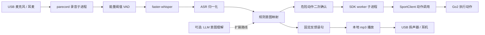

# 第 16 章 语音交互系统

> 前面十五章,我们已经让 Go2 能连上、能动、能看见环境,也能自己找路。但交互方式还很"工程师"—— 键盘、终端、命令行。到了这一章,我们给它加上一条更像真实产品的入口:你开口说话,它听懂、执行,再用语音回你。

---

## 本章你将学到

- 理解一条完整语音交互链里最常见的四个环节:`VAD`、`ASR`、`LLM`、`TTS`
- 明白为什么本项目最后选了**本地识别 + 规则映射 + 预生成语音反馈**这条更稳的工程路线
- 用 `faster-whisper` 跑通中文语音识别,并理解 `small` 模型为什么比 `medium` 更适合扩展坞 CPU
- 把识别结果映射到 Go2 的动作接口,实现"小白,站起来""小白,前进""停止"这类命令
- 处理 6 类真正会把语音系统搞崩的坑:音频设备占用、采样率、误识别、危险动作、DDS 崩溃、扩展坞常驻服务

---

## 背景与原理

### 一条语音管线通常有哪四段

语音交互常被说成"语音助手",但工程上最好把它拆开看。最常见的是下面四段:

| 模块 | 全称 | 干什么 | 本章是否主线使用 |
|---|---|---|---|
| `VAD` | Voice Activity Detection | 判断"现在有没有人在说话" | **是** |
| `ASR` | Automatic Speech Recognition | 把语音转成文字 | **是** |
| `LLM` | Large Language Model | 做复杂意图理解、多轮对话 | 可选 |
| `TTS` | Text To Speech | 把文本变成语音播报 | **是** |

把这四段翻译成 Go2 的场景,就是:

- 麦克风先判断你是不是开口了
- 识别模型把"小白,站起来"转成文本
- 意图层决定这句到底对应哪个动作
- 播报层给你回一句"好的"

这一章我们不会一上来就把 LLM 塞进去。原因很简单:

- "前进""坐下""停止" 这类命令,规则映射就够了
- 规则匹配更可控,也更容易做安全兜底
- 先把基础链跑通,后面再加大模型才不会把问题搅成一锅粥

所以本章的主线是:

**VAD + ASR + 规则意图映射 + TTS**

### 为什么本书选"本地 ASR + 在线生成语音素材"的混合方案

刚开始做语音系统时,最容易出现两种冲动:

- 要么全本地
- 要么全在线

但真落到 Go2 上,这两个极端都不太舒服。

#### 全本地的优点

- 隐私最好
- 断网也能跑
- 延迟可控

#### 全在线的问题

- 网络一抖就卡
- 语音命令这种高频交互,很容易把体验拖垮
- 敏感场景不适合把内容全发出去

所以我们最后走的是折中路线:

- **ASR 本地做**:用 `faster-whisper` 在本机直接识别
- **TTS 素材预生成**:首次用 `edge-tts` 生成几段固定反馈音频,运行时只播放本地 `mp3`

这条路线有两个很实用的好处:

1. 运行时不需要每次都联网调用 TTS
2. 播放固定短语比临时合成更稳,也更快

!!! info "隐私提示"
    `edge-tts` 背后用的是微软的在线语音服务。  
    如果你用它来生成反馈语音,文本内容会离开本机。  
    所以本章把它放在"预生成固定提示音"这个位置,不建议直接拿它播敏感内容。

### `faster-whisper` 是什么

`faster-whisper` 可以理解成:

- 模型本体还是 Whisper 那套识别能力
- 但底层推理由 `CTranslate2` 加速
- CPU 和 GPU 上都更省资源

它特别适合这章的原因有三个:

- Python 接口直接
- 支持 `int8` 量化,CPU 友好
- 中文识别效果够用,而且能加 `initial_prompt` 提示词表

在本项目的真实验证里,一个很值钱的结论是:

- `medium` 模型在扩展坞 ARM CPU 上延迟偏大,经常要十几秒
- `small` 模型虽然精度略低一点,但能把延迟压到约 3.5 秒量级

这就是很典型的工程取舍:

- 不是追求学术上最强
- 而是追求"机器人说完你能忍住不骂娘"

### 为什么最终实现没有把 TTS 做成"实时在线朗读"

如果你只看功能描述,会本能觉得:

> 既然装了 `edge-tts`,那是不是每次都该把"好的,我来了"实时合成出来?

理论上可以,但项目里最后没有这么做。原因是:

- 反馈语句其实很固定
- 运行时临时联网生成更容易出故障
- 一旦设备占用或网络不稳,整条交互链会被拖慢

所以现有代码用的是:

- 先生成 `wake.mp3`、`ok.mp3`、`unknown.mp3`、`stop.mp3` 这类固定音频
- 运行时用 `gst-play` 或 `gst-launch-1.0 playbin` 直接本地播放

这是一个非常典型的"别犯傻"决策。

### 扩展坞音频硬件的真相

这一段一定要提前说,不然后面你很容易在硬件上白耗半天。

项目里实际摸底后确认:

- Go2 主板上的麦克风和扬声器,并**不是**扩展坞这边随手就能直接调的那种设备
- 扩展坞虽然能看到一堆 ALSA / PulseAudio 设备,但并不代表真有可用音频通路
- 最稳的工程做法,还是**外接标准 USB Audio 设备**

所以本章主线默认你用的是:

- USB 麦克风
- 或 USB 耳麦一体设备

如果你说的"无线麦克风"底层其实只是一个标准 USB Audio 接收器,那也可以。  
但如果它只是某个私有串口模块,那它大概率就不在这章的主线里。

---

## 架构总览

先看最终跑通版的数据流。它不是四个 ROS2 节点拼起来的大拼盘,而是一个**单进程 Python 程序**,内部自己管理录音、识别、动作和播报。



这条链有 3 个地方尤其重要:

1. **录音不用 `sounddevice` 做主线**,而是用 `parecord` 子进程
2. **动作执行放进独立 worker 子进程**,避免 DDS / SDK 崩溃把主程序一起带走
3. **TTS 播放固定 mp3**,不在运行时临时合成

如果你把这 3 个点记住,后面很多设计就不会看着"怪",实际上它们全是踩坑踩出来的。

### 状态机怎么工作

这套语音系统不是一直不停地听完一句接一句瞎执行,它内部有个很朴素但很好用的状态机:

```text
待机
  -> 听到唤醒词 "小白"
  -> 播放 "我在，请说指令"
  -> 等一条指令
  -> 执行动作
  -> 播放反馈
  -> 回到待机
```

这个"一条指令执行完就回待机"的模式,比持续激活更适合实机。

原因很现实:

- 可以减少误触发
- 不容易把播报回声当成下一条命令
- 出了问题更容易停住

---

## 环境准备

### 前置成果

这一章默认你已经有两样东西:

- 第 2 章讲过的 Go2 动作接口认知
- 一套能正常 `pip install`、能运行 Python 脚本的开发环境

如果你准备直接在扩展坞上部署,还需要额外确认:

- Go2 网络已经通
- 你知道当前控制网卡名是什么

项目里实际出现过两种常见网卡名:

- 笔记本开发时常见 `enp111s0`
- 扩展坞侧最终常见 `eth0`

这一章我们会把它做成可配置项,而不是硬写死。

### 硬件建议

主线建议只用一种最稳的组合:

- 一个标准 USB 音频输入设备
- 一个标准 USB 音频输出设备

最省事的是直接用 USB 耳麦一体设备,因为:

- 输入输出路径都清楚
- 设备枚举更稳定
- 后面做 systemd 常驻和热插拔也更好配

!!! warning "别一开始就赌 Go2 自带音频链"
    这条路在项目里实际踩过坑。  
    如果你只是想先把语音链跑通,别拿自己给自己加难度。  
    先用标准 USB Audio 设备,后面再优化硬件形态。

### 需要安装的系统依赖

我们这章主线用 `parecord` 录音,用 `gst` 播音频,所以先把系统工具装上:

```bash
# parecord 来自 PulseAudio 工具集
# gst-launch / gst-play 用来播本地 mp3
sudo apt install -y \
    pulseaudio-utils \
    gstreamer1.0-tools \
    gstreamer1.0-plugins-good \
    gstreamer1.0-plugins-bad
```

如果你想顺手保留早期 `sounddevice` 调试路线,可以再装一份 PortAudio:

```bash
# 这不是本章主线必须,但做桌面机调试时有时方便
sudo apt install -y libportaudio2 portaudio19-dev
```

### 需要安装的 Python 包

主线要装的 Python 包有 3 个:

- `faster-whisper`
- `edge-tts`
- `numpy`

可选再装一个:

- `sounddevice`

```bash
# 在当前 Python 环境里安装语音依赖
pip install \
    faster-whisper \
    edge-tts \
    numpy \
    sounddevice
```

### 模型准备

这章我们用 `faster-whisper` 的 `small` 模型。

第一次运行时,模型会自动下载到**用户缓存目录**。如果你之前用过 Speech Note 或别的 Whisper 工具,也很可能已经缓存过一份,这时就不用重复下。

如果你准备把系统部署到扩展坞并长期离线运行,建议再做一步:

- 把缓存好的模型复制到 `go2_voice/model_small/`

这样后面即使扩展坞没网,也能直接起。

### 先确认音频设备能不能用

在继续写代码前,先查查系统有没有认到 USB 音频:

```bash
# 查看当前输入输出设备
pactl list sources short
pactl list sinks short
```

如果你看到带 `usb` 的输入源和输出 sink,说明路线基本没跑偏。

再做一个最小播放测试:

```bash
# 播个测试音,确认耳机或音箱真的在响
speaker-test -t sine -f 440 -l 1
```

---

## 实现步骤

这一章我们把实现放进一个新的 Python 包 `go2_voice`。  
它不是"一堆节点",而是一个入口脚本 + 一个音频生成脚本 + 一个 launch 文件。

建议的目录结构长这样:

```text
go2_voice/
├── go2_voice/
│   ├── __init__.py
│   ├── voice_cmd.py
│   └── build_prompts.py
├── audio/
├── launch/
│   └── voice.launch.py
├── package.xml
├── setup.py
└── setup.cfg
```

### 步骤一:创建 `go2_voice` 包

先在工作空间里创建一个 `ament_python` 包:

```bash
# 在工作空间源码目录下创建语音包
cd ~/go2_tutorial_ws/src
ros2 pkg create go2_voice --build-type ament_python
```

然后手动补一个 `audio/` 目录和 `launch/` 目录:

```bash
# 这两个目录 ros2 pkg create 不会自动给你建
cd ~/go2_tutorial_ws/src/go2_voice
mkdir -p audio launch go2_voice
touch go2_voice/__init__.py
```

### 步骤二:先把固定反馈音频生成出来

这一小步很值钱。我们先把最常见的反馈语句提前做成 mp3:

- `wake.mp3`
- `ok.mp3`
- `unknown.mp3`
- `stop.mp3`
- `timeout.mp3`
- `confirm.mp3`

这样主程序后面只管播放,不管在线合成。

在 `go2_voice/go2_voice/build_prompts.py` 里写一个小脚本:

```python
#!/usr/bin/env python3
"""
把固定反馈语句预生成成 mp3。
运行一次就够，后面主程序只播本地文件。
"""

from pathlib import Path                          # 跨平台路径处理,拼接 audio/ 目录更稳

import edge_tts                                  # 微软在线 TTS 的 Python 封装,这里用它生成素材音频


VOICE = "zh-CN-XiaoxiaoNeural"                  # 示例中文音色,如果不可用先用 edge-tts --list-voices 查看
OUTPUT_DIR = Path(__file__).resolve().parents[1] / "audio"

PROMPTS = {
    "wake": "我在，请说指令",
    "ok": "好的",
    "unknown": "没听懂，请再说一次",
    "stop": "好的，已经停下来了",
    "timeout": "没有新的指令，我先休息啦",
    "confirm": "这个动作有点危险，请再确认一次",
}


def main() -> None:
    OUTPUT_DIR.mkdir(parents=True, exist_ok=True)

    for name, text in PROMPTS.items():
        target = OUTPUT_DIR / f"{name}.mp3"
        communicator = edge_tts.Communicate(text=text, voice=VOICE)
        communicator.save_sync(str(target))
        print(f"已生成: {target.name}")


if __name__ == "__main__":
    main()
```

上面这段的关键点只有两个:

- `edge_tts.Communicate(...)` 负责请求在线语音
- `save_sync(...)` 直接把结果保存成 mp3 文件

写好后先运行一次:

```bash
# 生成固定反馈语音
cd ~/go2_tutorial_ws/src/go2_voice
python3 go2_voice/build_prompts.py
```

如果你想换音色,先列一下当前可用中文声音:

```bash
# 找出可用的中文语音
edge-tts --list-voices | grep zh-CN
```

### 步骤三:在主程序里先解决录音 + VAD

这一章的主程序放在 `go2_voice/go2_voice/voice_cmd.py`。

先把配置、录音子进程和能量阈值 VAD 搭起来。  
这里有个重要选择:

- 桌面机第一版常用 `sounddevice`
- 但项目里最后跑稳的是 `parecord`

所以本章主线直接用 `parecord`。

先写配置和录音部分:

```python
#!/usr/bin/env python3
"""
Go2 语音控制主程序。
主线是:待机 -> 唤醒 -> 一条指令 -> 执行动作 -> 回待机。
"""

import multiprocessing                           # 把 SDK 调用丢到子进程,避免崩了带走主程序
import os                                        # 读取环境变量,比如当前控制网卡名
import queue                                     # 录音线程和主循环之间传音频块
import subprocess                                # 调 parecord 和 gst 播放命令
import threading                                 # 后台读录音子进程 stdout
import time                                      # 状态机超时、动作等待都要用
from enum import Enum                            # 用枚举表达待机/激活状态
from pathlib import Path                         # 拼接 audio/ 路径

import numpy as np                               # 音频块 RMS 能量计算和拼接
from faster_whisper import WhisperModel          # 本地 ASR 核心模型


SAMPLE_RATE = 16000
CHANNELS = 1
BLOCK_DURATION = 0.1
BLOCK_SIZE = int(SAMPLE_RATE * BLOCK_DURATION)
BYTES_PER_BLOCK = BLOCK_SIZE * 2                 # int16 每个采样 2 字节

ENERGY_THRESHOLD = 0.02
SILENCE_TIMEOUT = 0.8
MIN_SPEECH_DURATION = 0.2
MAX_SPEECH_DURATION = 10.0
ACTIVE_TIMEOUT = 30.0

NETWORK_INTERFACE = os.getenv("GO2_NET_IFACE", "eth0")
MODEL_PATH = os.getenv("GO2_WHISPER_MODEL", "small")
WAKE_WORDS = ["小白"]

AUDIO_DIR = Path(__file__).resolve().parents[1] / "audio"
audio_queue: "queue.Queue[np.ndarray]" = queue.Queue()

_parecord_proc = None
_recording = False


class State(Enum):
    SLEEPING = "sleeping"
    ACTIVE = "active"
```

接着把 `parecord` 和后台读取线程补上:

```python
def _find_usb_source() -> str | None:
    """从 PulseAudio/PipeWire 兼容层里找 USB 麦克风 source 名称。"""
    try:
        output = subprocess.check_output(
            ["pactl", "list", "sources", "short"],
            stderr=subprocess.DEVNULL,
        ).decode()
    except Exception:
        return None

    for line in output.strip().splitlines():
        if "usb" in line.lower() and "monitor" not in line.lower():
            return line.split()[1]
    return None


def _parecord_reader() -> None:
    """后台线程:不断把 parecord 的 PCM 数据读出来,切成小块塞进队列。"""
    global _parecord_proc
    buffer = b""

    while _recording and _parecord_proc and _parecord_proc.poll() is None:
        data = _parecord_proc.stdout.read(BYTES_PER_BLOCK)
        if not data:
            break

        buffer += data
        while len(buffer) >= BYTES_PER_BLOCK:
            block = buffer[:BYTES_PER_BLOCK]
            buffer = buffer[BYTES_PER_BLOCK:]
            samples = np.frombuffer(block, dtype=np.int16).astype(np.float32) / 32768.0
            audio_queue.put(samples)


def start_recording() -> None:
    """启动 parecord 子进程和读取线程。"""
    global _parecord_proc, _recording

    cmd = [
        "parecord",
        f"--rate={SAMPLE_RATE}",
        f"--channels={CHANNELS}",
        "--format=s16le",
        "--raw",
    ]

    source_name = _find_usb_source()
    if source_name:
        cmd.append(f"--device={source_name}")

    _parecord_proc = subprocess.Popen(
        cmd,
        stdout=subprocess.PIPE,
        stderr=subprocess.DEVNULL,
    )
    _recording = True
    threading.Thread(target=_parecord_reader, daemon=True).start()


def stop_recording() -> None:
    """退出时记得把录音子进程收干净。"""
    global _recording, _parecord_proc

    _recording = False
    if _parecord_proc:
        _parecord_proc.terminate()
        _parecord_proc.wait(timeout=3)
        _parecord_proc = None
```

最后把最朴素但非常实用的 VAD 写出来:

```python
def record_speech(timeout: float = 0.0) -> np.ndarray | None:
    """
    等待一段语音。
    timeout=0 表示无限等待;
    返回 None 表示超时或没检测到有效语音。
    """
    speech_chunks: list[np.ndarray] = []
    is_speaking = False
    speech_start = 0.0
    silence_start = 0.0
    wait_start = time.time()

    while True:
        try:
            chunk = audio_queue.get(timeout=0.5)
        except queue.Empty:
            if timeout > 0 and not is_speaking and time.time() - wait_start > timeout:
                return None
            continue

        energy = float(np.sqrt(np.mean(chunk ** 2)))

        if not is_speaking:
            if timeout > 0 and time.time() - wait_start > timeout:
                return None
            if energy > ENERGY_THRESHOLD:
                is_speaking = True
                speech_start = time.time()
                speech_chunks = [chunk]
        else:
            speech_chunks.append(chunk)

            if energy < ENERGY_THRESHOLD:
                if silence_start == 0:
                    silence_start = time.time()
                elif time.time() - silence_start > SILENCE_TIMEOUT:
                    duration = time.time() - speech_start
                    if duration < MIN_SPEECH_DURATION:
                        speech_chunks.clear()
                        is_speaking = False
                        silence_start = 0.0
                        continue
                    return np.concatenate(speech_chunks)
            else:
                silence_start = 0.0

            if time.time() - speech_start > MAX_SPEECH_DURATION:
                return np.concatenate(speech_chunks)
```

这段看着不高级,但在本项目里它非常够用。  
先用能量阈值把系统做出来,比一上来把自己绑死在复杂 VAD 模型上靠谱得多。

### 步骤四:接上 `faster-whisper` 和意图映射

现在我们把"听见声音"变成"听懂内容"。

先写一个最小可用的 ASR 函数:

```python
def transcribe(model: WhisperModel, audio_data: np.ndarray) -> str:
    """把一段音频转成中文文本。"""
    segments, _ = model.transcribe(
        audio_data,
        language="zh",
        beam_size=3,
        vad_filter=True,
        vad_parameters={
            "min_silence_duration_ms": 500,
            "speech_pad_ms": 200,
        },
        initial_prompt=(
            "小白；坐下；站起；前进；后退；左转；右转；"
            "打招呼；伸懒腰；转圈；跳舞；比心；前空翻；后空翻；"
            "停止；确认；取消"
        ),
    )
    return "".join(segment.text for segment in segments).strip()
```

这里有三个参数很值得你记一下:

- `compute_type="int8"`:CPU 上更友好
- `vad_filter=True`:让模型自己再帮你清一遍静音
- `initial_prompt=...`:把常见命令词提前喂进去,中文识别会稳一点

接着,把真实项目里很有用的**ASR 归一化**补上。

为什么要这一步?  
因为 Whisper 很爱把:

- "小白" 识别成 "小百"
- "左转" 识别成 "做转"
- "比心" 识别成 "笔心"

在 `voice_cmd.py` 里继续加:

```python
CHAR_NORMALIZE = {
    "確": "确", "認": "认", "後": "后", "轉": "转", "動": "动",
}

WORD_NORMALIZE = {
    "小百": "小白",
    "拜拜": "小白",
    "做转": "左转",
    "有转": "右转",
    "笔心": "比心",
    "后翻": "后空翻",
    "前翻": "前空翻",
    "组合计": "组合一",
}


def normalize_asr(text: str) -> str:
    """繁简修正 + 已知误识别修正。"""
    text = "".join(CHAR_NORMALIZE.get(ch, ch) for ch in text)
    for wrong, right in sorted(WORD_NORMALIZE.items(), key=lambda item: -len(item[0])):
        text = text.replace(wrong, right)
    return text
```

然后定义唤醒词、停止词和命令映射:

```python
STOP_KEYWORDS = ["停", "停下", "停止", "暂停", "取消", "够了", "结束"]

DANGEROUS_ACTIONS = {"back_flip", "front_flip", "combo_1"}

COMMAND_MAP = [
    (["坐下", "蹲下", "趴下"], "stand_down", "趴下"),
    (["站起", "起来", "起立", "站立"], "stand_up", "站起来"),
    (["前进", "向前", "往前"], "move_forward", "前进"),
    (["后退", "往后", "退后"], "move_back", "后退"),
    (["左转", "向左", "往左"], "turn_left", "左转"),
    (["右转", "向右", "往右"], "turn_right", "右转"),
    (["打招呼", "握手", "你好"], "hello", "打招呼"),
    (["伸懒腰", "伸展"], "stretch", "伸懒腰"),
    (["转圈", "转一圈"], "spin", "原地转圈"),
    (["跳舞"], "dance1", "跳舞"),
    (["比心"], "heart", "比心"),
    (["后空翻"], "back_flip", "后空翻"),
    (["前空翻"], "front_flip", "前空翻"),
    (["恢复", "复位"], "recovery", "恢复站立"),
]


def check_wake_word(text: str) -> bool:
    return any(word in text for word in WAKE_WORDS)


def check_stop(text: str) -> bool:
    return any(word in text for word in STOP_KEYWORDS)


def parse_intent(text: str) -> tuple[str, str] | None:
    text = text.strip().lower()
    for keywords, action_id, desc in COMMAND_MAP:
        if any(keyword in text for keyword in keywords):
            return action_id, desc
    return None
```

这里有个很重要的设计判断:

- **唤醒词检查**和**动作匹配**分开做
- **停止词**单独放高优先级

因为实机上最不能出事的不是"识别不到",而是"明明让它停,它还在往前冲"。

### 步骤五:把 Go2 动作调用包进独立 worker 子进程

这一步是整章最像"工程活"的地方。

如果你只在桌面上跑 Python 脚本,会本能觉得:

> 直接在主线程里调 `SportClient` 不就完了?

但项目里的真实情况是:

- SDK 调用曾经出现过 segfault
- 某些 DDS 版本和 Unitree SDK 组合不稳定
- 如果主程序和动作调用绑死在一个进程,一崩全崩

所以最终代码用了一个很朴素但很有效的方案:

- 主进程负责录音、识别、状态机
- 子进程专门负责 `SportClient`
- 子进程挂了就重拉

先写 worker:

```python
def _sdk_worker(cmd_queue: multiprocessing.Queue, result_queue: multiprocessing.Queue, network_interface: str) -> None:
    """动作执行子进程:只负责 SDK 初始化和动作调用。"""
    from unitree_sdk2py.core.channel import ChannelFactoryInitialize
    from unitree_sdk2py.go2.sport.sport_client import SportClient

    ChannelFactoryInitialize(0, network_interface)

    client = SportClient()
    client.SetTimeout(10.0)
    client.Init()

    result_queue.put("READY")

    while True:
        action_id = cmd_queue.get()
        if action_id == "__EXIT__":
            break

        try:
            if action_id == "stand_down":
                ret = client.StandDown()
            elif action_id == "stand_up":
                ret = client.StandUp()
            elif action_id == "recovery":
                ret = client.RecoveryStand()
            elif action_id == "move_forward":
                t0 = time.time()
                while time.time() - t0 < 1.7:
                    client.Move(0.3, 0.0, 0.0)
                    time.sleep(0.05)
                client.StopMove()
                ret = 0
            elif action_id == "move_back":
                t0 = time.time()
                while time.time() - t0 < 1.7:
                    client.Move(-0.3, 0.0, 0.0)
                    time.sleep(0.05)
                client.StopMove()
                ret = 0
            elif action_id == "turn_left":
                t0 = time.time()
                while time.time() - t0 < 3.14:
                    client.Move(0.0, 0.0, 0.5)
                    time.sleep(0.05)
                client.StopMove()
                ret = 0
            elif action_id == "turn_right":
                t0 = time.time()
                while time.time() - t0 < 3.14:
                    client.Move(0.0, 0.0, -0.5)
                    time.sleep(0.05)
                client.StopMove()
                ret = 0
            elif action_id == "hello":
                ret = client.Hello()
            elif action_id == "stretch":
                ret = client.Stretch()
            elif action_id == "spin":
                t0 = time.time()
                while time.time() - t0 < 4.19:
                    client.Move(0.0, 0.0, 1.5)
                    time.sleep(0.05)
                client.StopMove()
                ret = 0
            elif action_id == "dance1":
                ret = client.Dance1()
            elif action_id == "heart":
                ret = client.Heart()
            elif action_id == "back_flip":
                ret = client.BackFlip()
            elif action_id == "front_flip":
                ret = client.FrontFlip()
            elif action_id == "emergency_stop":
                client.StopMove()
                client.RecoveryStand()
                ret = 0
            else:
                ret = -1

            result_queue.put("OK" if ret in (None, 0) else f"FAIL:{ret}")
        except Exception as exc:
            result_queue.put(f"ERROR:{exc}")
```

再写一个主进程可调用的控制器:

```python
class Go2Controller:
    def __init__(self) -> None:
        self._cmd_q: multiprocessing.Queue = multiprocessing.Queue()
        self._res_q: multiprocessing.Queue = multiprocessing.Queue()
        self._proc: multiprocessing.Process | None = None
        self._spawn_worker()

    def _spawn_worker(self) -> None:
        if self._proc and self._proc.is_alive():
            self._proc.terminate()
            self._proc.join(timeout=3)

        self._cmd_q = multiprocessing.Queue()
        self._res_q = multiprocessing.Queue()
        self._proc = multiprocessing.Process(
            target=_sdk_worker,
            args=(self._cmd_q, self._res_q, NETWORK_INTERFACE),
            daemon=True,
        )
        self._proc.start()

        ready = self._res_q.get(timeout=15)
        if ready != "READY":
            raise RuntimeError(f"SDK worker 初始化失败: {ready}")

    def _ensure_worker(self) -> None:
        if self._proc is None or not self._proc.is_alive():
            self._spawn_worker()

    def execute(self, action_id: str) -> str:
        self._ensure_worker()
        self._cmd_q.put(action_id)

        for _ in range(6):                                  # 最多等 3 秒
            try:
                return self._res_q.get(timeout=0.5)
            except Exception:
                if self._proc and not self._proc.is_alive():
                    self._spawn_worker()
                    return "OK"                              # 命令很可能已经发出
        return "OK"

    def emergency_stop(self) -> None:
        self.execute("emergency_stop")
```

这段代码背后的核心思想只有一句:

**宁可把动作调用包得土一点,也别让主进程跟着一起死。**

### 步骤六:把危险动作确认和本地播报接进主循环

现在补上两个安全层:

- 危险动作二次确认
- 固定反馈 mp3 播放

先写播放函数:

```python
def _find_usb_sink() -> str | None:
    """找 USB 输出设备名,给 gst 播放时显式指定。"""
    try:
        output = subprocess.check_output(
            ["pactl", "list", "sinks", "short"],
            stderr=subprocess.DEVNULL,
        ).decode()
    except Exception:
        return None

    for line in output.strip().splitlines():
        if "usb" in line.lower():
            return line.split()[1]
    return None


def _gst_play_cmd(path: Path) -> list[str]:
    sink_name = _find_usb_sink()
    if sink_name:
        return [
            "gst-launch-1.0",
            "playbin",
            f"uri=file://{path}",
            f"audio-sink=pulsesink device={sink_name}",
        ]
    return ["gst-play-1.0", "--no-interactive", str(path)]


def play_audio_blocking(name: str) -> None:
    path = AUDIO_DIR / f"{name}.mp3"
    if path.exists():
        subprocess.run(_gst_play_cmd(path), stdout=subprocess.DEVNULL, stderr=subprocess.DEVNULL)
```

然后把危险动作确认做出来:

```python
CONFIRM_KEYWORDS = ["确认", "确定", "好的", "可以", "执行", "来吧"]


def drain_audio_queue() -> None:
    """清掉积压音频,避免上一轮残留回声干扰当前识别。"""
    while True:
        try:
            audio_queue.get_nowait()
        except queue.Empty:
            break


def confirm_dangerous(model: WhisperModel, desc: str) -> bool:
    """危险动作必须二次确认。"""
    play_audio_blocking("confirm")
    time.sleep(0.3)
    drain_audio_queue()

    audio_data = record_speech(timeout=8.0)
    if audio_data is None:
        play_audio_blocking("timeout")
        return False

    confirm_text = normalize_asr(transcribe(model, audio_data))

    if any(keyword in confirm_text for keyword in CONFIRM_KEYWORDS):
        return True

    if any(keyword in confirm_text for keyword in ["不", "不要", "取消", "算了", "别"]):
        play_audio_blocking("stop")
        return False

    play_audio_blocking("unknown")
    return False
```

到这里,语音系统才算开始像一个真正能上狗的东西。  
因为空翻、组合动作这些命令,你不能只靠"我感觉识别得挺准"这种自信去赌。

### 步骤七:把主循环和 launch 收口

最后把所有零件接成一条完整流程。

继续在 `voice_cmd.py` 里补 `main()`:

```python
def main() -> None:
    model = WhisperModel(MODEL_PATH, device="cpu", compute_type="int8")
    controller = Go2Controller()

    start_recording()
    state = State.SLEEPING

    try:
        while True:
            if state == State.SLEEPING:
                audio_data = record_speech(timeout=0.0)
                if audio_data is None:
                    continue

                text = normalize_asr(transcribe(model, audio_data))
                if not text:
                    continue

                if not check_wake_word(text):
                    continue

                play_audio_blocking("wake")
                time.sleep(0.3)
                drain_audio_queue()

                # 唤醒词后面直接带命令: "小白，站起来"
                result = parse_intent(text)
                if result is not None:
                    action_id, desc = result
                else:
                    state = State.ACTIVE
                    audio_data = record_speech(timeout=ACTIVE_TIMEOUT)
                    if audio_data is None:
                        play_audio_blocking("timeout")
                        state = State.SLEEPING
                        continue

                    text = normalize_asr(transcribe(model, audio_data))
                    if not text:
                        play_audio_blocking("timeout")
                        state = State.SLEEPING
                        continue

                    if check_stop(text):
                        controller.emergency_stop()
                        play_audio_blocking("stop")
                        state = State.SLEEPING
                        continue

                    result = parse_intent(text)
                    if result is None:
                        play_audio_blocking("unknown")
                        state = State.SLEEPING
                        continue

                    action_id, desc = result

                if action_id in DANGEROUS_ACTIONS:
                    if not confirm_dangerous(model, desc):
                        state = State.SLEEPING
                        continue

                controller.execute(action_id)
                play_audio_blocking("ok")
                state = State.SLEEPING

    finally:
        stop_recording()


if __name__ == "__main__":
    main()
```

主线就是这么简单:

- 先听唤醒词
- 再听一条命令
- 执行动作
- 播放反馈
- 回待机

最后,再加一个最小 launch 文件,方便统一启动:

```python
# 文件: launch/voice.launch.py
# 作用:用 launch 启动 go2_voice 主程序

from launch import LaunchDescription
from launch.actions import ExecuteProcess


def generate_launch_description() -> LaunchDescription:
    return LaunchDescription([
        ExecuteProcess(
            cmd=["ros2", "run", "go2_voice", "voice_cmd"],
            output="screen",
        )
    ])
```

再把 `setup.py` 的入口补上:

```python
from setuptools import setup

package_name = "go2_voice"

setup(
    name=package_name,
    version="0.0.0",
    packages=[package_name],
    data_files=[
        ("share/ament_index/resource_index/packages", [f"resource/{package_name}"]),
        (f"share/{package_name}", ["package.xml"]),
        (f"share/{package_name}/launch", ["launch/voice.launch.py"]),
        (f"share/{package_name}/audio", [
            "audio/wake.mp3",
            "audio/ok.mp3",
            "audio/unknown.mp3",
            "audio/stop.mp3",
            "audio/timeout.mp3",
            "audio/confirm.mp3",
        ]),
    ],
    install_requires=["setuptools"],
    zip_safe=True,
    maintainer="you",
    maintainer_email="you@example.com",
    description="Go2 voice interaction demo",
    license="Apache-2.0",
    entry_points={
        "console_scripts": [
            "voice_cmd = go2_voice.voice_cmd:main",
            "build_prompts = go2_voice.build_prompts:main",
        ],
    },
)
```

!!! note "进阶:扩展坞长期运行为什么还会再加 systemd 和 udev"
    主线代码跑通之后,项目里还额外做了两层工程化:

    - `systemd service`:开机常驻
    - `udev + systemd-run`:USB 耳机插上自动启动,拔掉自动停止

    这些都很有用,但它们属于"把 demo 变成长期服务"的范畴。  
    本章主线先把语音闭环跑通,扩展部署放到常见问题和进阶说明里讲。

---

## 编译与运行

先生成固定反馈语音:

```bash
# 先把 audio/ 目录里的提示音生成出来
cd ~/go2_tutorial_ws
python3 src/go2_voice/go2_voice/build_prompts.py
```

再编译包:

```bash
# 编译 go2_voice 并加载环境
cd ~/go2_tutorial_ws
source /opt/ros/humble/setup.bash
colcon build --packages-select go2_voice
source install/setup.bash
```

如果你要在扩展坞上跑,先把控制网卡设好:

```bash
# 根据你的机器改成当前实际网卡名
export GO2_NET_IFACE=eth0
export GO2_WHISPER_MODEL=small
```

最后启动语音系统:

```bash
# 用 ros2 run 直接启动
cd ~/go2_tutorial_ws
source install/setup.bash
ros2 run go2_voice voice_cmd
```

或者用 launch:

```bash
# 用 launch 启动,方便后面接 systemd
cd ~/go2_tutorial_ws
source install/setup.bash
ros2 launch go2_voice voice.launch.py
```

如果你想先做最小检查,先看音频设备和模型是否正常:

```bash
# 检查音频输入输出设备
pactl list sources short
pactl list sinks short

# 检查提示音文件是否都生成了
ls src/go2_voice/audio
```

---

## 结果验证

### 验证 1:最小闭环

先不要一上来就测空翻。  
第一轮只测最朴素的三件事:

1. 说"小白"
2. 听到播报"我在，请说指令"
3. 再说"站起来"

如果系统正常,你应该看到:

- 语音播报正常
- Go2 执行 `StandUp`
- 执行结束后回到待机

<!-- TODO(媒体): 录一段 16-voice-wakeup-demo.mp4，展示“小白，站起来”的完整流程 -->

### 验证 2:停止指令

再测一条更关键的:

1. 说"小白"
2. 说"前进"
3. 紧接着说"停止"

理想现象是:

- 当前动作被打断
- Go2 执行 `StopMove + RecoveryStand`
- 语音播报"好的，已经停下来了"

### 验证 3:危险动作二次确认

最后再测危险动作:

1. 说"小白"
2. 说"后空翻"
3. 系统先播确认提示
4. 再说"确认"

这一步通过后,说明你的二次确认链已经生效。  
如果它在没确认时就直接翻了,那不是"体验问题",那是安全设计没做好。

<!-- TODO(媒体): 录一段 16-voice-danger-confirm.mp4，展示危险动作确认流程 -->

### 验证 4:误识别容错

你还可以故意说几句项目里出现过的误识别:

- "小百"
- "做转"
- "笔心"

如果归一化逻辑写对了,这些也应该还能映射回:

- "小白"
- "左转"
- "比心"

---

## 常见问题

### 1. 扩展坞上根本找不到可用麦克风或扬声器

**现象**:

- `pactl list sources short` 里没看到可用输入
- 或者看到一堆设备,但录不到声音

**原因**:

- Go2 主板自带音频链并没有按你想的方式暴露给扩展坞
- 你接的设备可能不是标准 USB Audio

**解决**:

- 先换成标准 USB 耳麦
- 再用 `pactl list sources short` / `pactl list sinks short` 确认设备名

### 2. 录音和播报打架,一播放就报设备忙

**现象**:

- 录音能跑
- 一播 mp3 就报 `Device is busy`

**原因**:

- 录放音都在抢同一个底层音频设备
- 早期用 `sounddevice` 时尤其容易出现独占问题

**解决**:

- 主线改用 `parecord` 录音子进程
- 播放时显式指定 `pulsesink`
- 播放后 `sleep 0.3s` 再清空录音队列,避免回声被当命令

### 3. `medium` 模型太慢,一句话等十几秒

**原因**:

- 扩展坞 CPU 不是给你跑大号 Whisper 当桌面机用的

**解决**:

- 先换 `small`
- `compute_type` 用 `int8`
- `beam_size` 保守一点,别瞎卷

项目里的真实经验就是:

- `medium` 更准
- 但 `small` 才更像能用

### 4. 中文识别老是差一点,比如"小白"变"小百"

**原因**:

- 中文短指令很容易谐音
- 机器人动作词又特别集中

**解决**:

- 补 `initial_prompt`
- 做 `normalize_asr()`
- 把项目里已经踩过的误识别词都收进去

### 5. 危险动作太容易误触发

**现象**:

- 你说"打招呼",它差点执行空翻

**解决**:

- 危险动作必须走二次确认
- 停止词优先级必须高于普通动作词
- 空翻、组合动作都不要放进"一句话直接执行"的无门槛路径

### 6. SDK 偶发崩溃,主程序直接退出

**原因**:

- DDS 版本和 Unitree SDK 不兼容
- 或者 SDK 调用链本身偶发不稳

**解决**:

- 把 `SportClient` 放进独立 worker 子进程
- 扩展坞侧如果你也遇到 `cyclonedds` 兼容问题,优先核对版本

项目里实际踩出的一个血泪结论是:

- 某些环境下 `cyclonedds 0.10.5` 会和 Unitree SDK 打架
- 降到 `0.10.2` 后稳定性明显改善

### 7. `parecord` 录不到 USB 麦克风

**原因**:

- PulseAudio 默认 source 不是你当前的 USB 设备
- 无头环境下默认设备更容易漂

**解决**:

- 不要赌默认设备
- 启动时先用 `pactl list sources short` 找 USB source
- 再把 `--device=<source_name>` 明确传给 `parecord`

### 8. 说完指令后,系统把自己的播报又识别成下一条命令

**原因**:

- 扬声器回声被麦克风收进去了

**解决**:

- 播放后延迟几百毫秒
- 清空音频队列
- 麦克风和扬声器物理上尽量别互相正对

### 9. 噪声环境下 VAD 总误触发

**原因**:

- `ENERGY_THRESHOLD` 太低

**解决**:

- 先打印几轮静音时的平均能量
- 再把阈值从 `0.02` 往上慢慢加

别反着来。  
如果你上来就把阈值提得很高,最后会变成"环境噪声没了,人声也没了"。

### 10. 想做扩展坞常驻服务,但 SSH 断开后程序就没了

**解决方向**:

- 用 `systemd service` 托管
- 再用 `udev + systemd-run` 处理 USB 热插拔

项目里最后跑通的是这套模式:

- 开机如果耳机已插好,服务自动启动
- 运行中插上耳机,5 秒后自动启动
- 拔掉耳机,服务自动停止

这部分不影响本章主线,但如果你要把语音系统长期挂在扩展坞上,它非常值得做。

---

## 本章小结

这一章我们把 Go2 的交互入口从"命令行"升级成了"说人话也能控制"。

看起来好像只是多了一个麦克风,但真正值钱的是你已经把一条完整的语音闭环拆清楚了:

- `VAD` 负责判断有没有说话
- `ASR` 负责把声音变成文字
- 规则映射负责把文字变成动作
- 本地音频播放负责给出反馈

更重要的是,你没有走那条看起来更"高级"、实际上更容易崩的路。  
我们没有强行全在线,也没有一上来就把 LLM 塞进主链路,而是用了更像真实工程的组合:

- 本地 `faster-whisper`
- 规则意图映射
- 预生成语音提示
- SDK worker 子进程隔离

如果你现在已经能说出:

- 为什么 `small` 比 `medium` 更适合扩展坞
- 为什么 `parecord` 比 `sounddevice` 更适合这套最终实现
- 为什么危险动作必须二次确认

那这一章就不是"抄完一段代码",而是真的入门了。

---

## 下一步

语音已经能让 Go2 "听懂你说什么"了。下一章,我们再给它补上另一只眼睛:接入相机和视觉模型,让它不光能听,还能看懂场景和目标。

继续阅读:[第 17 章 视觉与 VLM 应用](./17-vision.md)

---

## 拓展阅读

- `faster-whisper` 官方仓库: <https://github.com/SYSTRAN/faster-whisper>
- `edge-tts` 官方仓库: <https://github.com/rany2/edge-tts>
- OpenAI Whisper 论文
- PulseAudio / PipeWire 兼容层文档
- Unitree SDK2 Python 示例和动作接口说明
