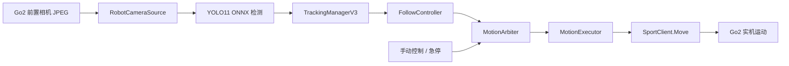
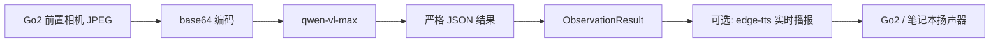

# 第 17 章 视觉与 VLM 应用

> 第 16 章里，Go2 已经能“听懂你说什么”了。接下来我们给它补上另一只眼睛：让它先看，再决定怎么做。不过“看”这件事并不只有一条路。你可以走经典视觉路线，用检测框和像素偏移做跟随；也可以走 VLM 路线，直接让视觉大模型回答“前面有什么”“门开了没”。这一章就把这两条路都带你跑一遍，而且按真实代码讲，不硬编一套没落地的架构。

---

## 本章你将学到

- 明白本项目里视觉能力为什么最终分成两条线：**视觉跟随** 和 **视觉问答**
- 理解当前代码的真实输入链并不是 ROS2 图像 topic，而是 Go2 SDK 的 `VideoClient.GetImageSample()`
- 用 YOLO11 ONNX 检测 + 跟踪管理器 + 速度策略，跑通一个能动起来的视觉跟随 demo
- 用千问 VL 做“看看前面有什么”“有没有水杯”“门开了没”这类视觉问答，并把结果整理成结构化 JSON
- 看懂这条视觉链里最重要的安全边界：**单目 bbox 不等于可靠距离**，低置信度时宁可不走，也别让狗乱冲

---

## 背景与原理

### 视觉任务为什么会自然分成两类

从“让机器人看懂世界”这个口号出发，好像什么都能叫视觉。但真到工程上，需求通常会裂成两类：

- 一类是**实时闭环控制**：目标在左边还是右边？离得近还是远？要不要继续前进？
- 一类是**语义理解**：前面是不是门？桌上有没有杯子？这个场景大概是什么样？

这两类任务看起来都和“相机”有关，但对系统的要求完全不同：

- 闭环控制更看重延迟和稳定性
- 语义理解更看重表达能力和泛化能力

这也是为什么项目里最后没有强行用一套模型包打天下，而是分成两条主线：

- **Demo A：视觉跟随**
- **Demo B：VLM 场景问答**

### 经典视觉路线：快，但你得自己把控制逻辑补齐

视觉跟随这条线的核心思路并不神秘：

1. 先从画面里找到目标
2. 再看目标在画面中心的左边还是右边
3. 再估一个“远近”
4. 最后把这些误差变成速度指令

如果你只看控制思想，它和 [第 4 章 Twist 消息桥接](../02-packages/04-twist-bridge.md) 其实是同一类问题：

- 都是在算 `vx`
- 都是在算 `vyaw`
- 都在做限幅和保护

只不过第 4 章的输入是键盘和上层控制器，这一章的输入换成了视觉检测结果。

### VLM 路线：慢一些，但语义能力强很多

和“检测框 + 控制”不同，VLM 更像是在回答问题：

- “看看前面有什么”
- “有没有水杯”
- “门开了没”
- “画面里有几个箱子”

这类问题如果全靠传统 CV 去堆规则，很快就会写得又臭又长。  
而 VLM 的优势恰好就在这里：

- 它能直接处理开放问句
- 输出本来就是自然语言
- 很适合接语音播报

所以第 10 周里，项目真正先跑稳的，反而是 **VLM 观察服务**，不是视觉跟随。

### 关于 RGB / 深度 topic，这一章必须说老实话

交接要求里提到了“Go2 前置相机的 RGB + 深度 topic 名”。  
但当前这批**已验证代码**，并不是通过 ROS2 订阅图像 topic 在工作。

项目主线实际做的是：

- 通过宇树 SDK 初始化 DDS
- 用 `VideoClient.GetImageSample()` 直接抓一帧前置相机 JPEG
- 再把这张 JPEG 送给 OpenCV、YOLO ONNX 或 VLM

也就是说，本章真正忠于代码的输入链是：

- **前置 RGB JPEG：有**
- **ROS2 图像 topic：这批 demo 里没有作为主线**
- **深度图：当前 demo 没接，也没用于控制闭环**

!!! note "为什么这里不硬写一个“深度 topic 名”"
    因为现有可运行代码没有这样用。  
    如果教材为了看起来“更像 ROS2”就编一个没被这批代码用过的 topic 名，那是在坑读者。  
    本章会明确告诉你：当前 demo 走的是 **SDK 抓帧路线**，不是 ROS 图像 topic 路线。

### 为什么视觉跟随一定要把安全讲在前面

视觉跟随听起来特别像“让狗跟着人走”，很酷，也很容易演示。  
但项目在第 10 周真实踩过一个关键坑：

**单目 RGB + bbox 尺寸反推距离，对小目标并不可靠。**

原因不复杂：

- 目标靠近时，检测框可能被画面裁切
- 一旦被裁切，bbox 高度不一定继续变大
- 你如果把 bbox 高度当成“距离真值”，狗就可能误判“还很远”，继续往前冲

所以这章里你会看到一堆看起来“有点保守”的设计：

- 低置信度时禁止前进
- 跟丢时立刻停
- 跟随默认先 dry-run
- 紧急停止优先级最高

这些都不是形式主义，它们是被真机撞出来的规则。

### 为什么本章会出现两种不同的 TTS 处理方式

你可能注意到了：第 16 章的语音系统，主线是**预生成固定 mp3**；  
而这一章的视觉问答里，现有代码又用了**实时 `edge-tts`**。

这不是自相矛盾，而是两个场景不一样：

- 第 16 章的反馈语句很固定，比如“好的”“没听懂”
- 第 17 章的视觉结果是动态文本，比如“前面有一个蓝色水杯，在桌子上”

所以视觉问答里实时 TTS 反而更合理。  
它是一个“回答生成后再播报”的链路，不像语音控制那样追求极低延迟。

---

## 架构总览

先看视觉跟随这条线。  
当前真实代码不是“ROS2 图像节点 -> YOLO 节点 -> Twist 节点”的分布式架构，而是一个**普通 Python 服务**，内部把抓帧、检测、跟踪、控制和运动仲裁串起来。



这条链有 4 个地方特别重要：

1. 输入层不是 ROS 图像 topic，而是 SDK 抓帧
2. 检测层跑的是 **YOLO11 的 ONNX 模型**，不是运行时 `ultralytics` 推理
3. 控制层输出的是 `vx / vy / vyaw`，但现有代码**直接调 `SportClient.Move()`**
4. 中间插了一个 **MotionArbiter**，保证 `EMERGENCY > MANUAL > FOLLOW`

再看 VLM 观察服务这条线。  
它的核心不是闭环控制，而是“拍一张图 + 提一个问题 + 得到结构化答案”。



如果把这两条路放在一起比较，可以得到一个很实用的结论：

| 路线 | 擅长什么 | 代价是什么 | 适合的任务 |
|---|---|---|---|
| 视觉跟随 | 延迟更低，能做运动闭环 | 对误检和估距很敏感 | 跟人、对准目标、简单视觉伺服 |
| VLM 观察 | 语义能力强，问题表达自然 | 慢一些，要走云端 API | 场景描述、找物、状态判断 |

!!! tip "这一章最值得带走的判断"
    不要把“看见”默认理解成“只要上一个大模型就完了”。  
    要不要闭环控制、要不要极低延迟、结果是不是自然语言，这些都会决定你到底该用哪条视觉路线。

---

## 环境准备

### 前置条件

这一章默认你已经具备三样基础：

- 已完成 [第 6 章完整驱动包集成](../02-packages/06-driver.md)，知道 Go2 的 DDS / SDK 基本怎么连
- 已理解 [第 4 章 Twist 消息桥接](../02-packages/04-twist-bridge.md) 里的 `vx / vy / vyaw` 语义
- 能在笔记本或扩展坞上跑普通 Python 脚本

注意，这章虽然放在 `go2_tutorial_ws` 里组织代码，但**主线不是 ROS2 节点开发**。  
你不需要先写 `rclpy.Node`，先把视觉能力本身跑通更重要。

### 建议的目录结构

这一章建议把代码先按普通 Python 工程收起来。  
这样做的好处是：跟踪服务和 VLM 服务都能独立运行，不必一开始就绑进 launch。

```text
go2_vision/
├── vision_observer.py
├── test_vision.py
├── test_robot_vision.py
├── tracking/
│   ├── frame_source.py
│   ├── onnx_detector.py
│   ├── track_actions.py
│   ├── motion_arbiter.py
│   ├── motion_executor.py
│   ├── tracking_core_v3.py
│   ├── tracking_server_v3.py
│   └── models/
│       ├── yolo11l.onnx
│       └── coco80.names
└── templates/
```

如果你习惯把所有东西都放进 `~/go2_tutorial_ws/src/`，也完全可以。  
只要记住一点：

- 这章的主线入口是 `python3 xxx.py`
- 不是 `ros2 run xxx`

### 需要安装的 Python 依赖

按现有代码，主线依赖是下面这些：

```bash
# 视觉问答 + 跟随 demo 的运行时依赖
pip install \
    openai \
    edge-tts \
    opencv-python \
    numpy \
    onnxruntime \
    flask
```

这里有两个容易误会的点：

- 视觉问答虽然用的是阿里云百炼 / 千问 VL，但**当前代码客户端是 `openai`**
- 跟随 demo 虽然模型叫 YOLO11，但**运行时不是 `ultralytics`，而是 ONNX + `onnxruntime`**

!!! note "为什么这里装 `openai`，不装 `dashscope`"
    因为现有代码走的是 DashScope 的 OpenAI compatible mode。  
    API Key 还是 `DASHSCOPE_API_KEY`，但 Python 客户端实际用的是 `openai.OpenAI(...)`。

如果你手里只有 `yolo11l.pt`，想自己导出 ONNX，再额外装一份 `ultralytics`：

```bash
# 只有在“你需要自己把 .pt 导成 .onnx”时才需要
pip install ultralytics
```

### API Key 和环境变量

先把 VLM 和 SDK 相关环境准备好：

```bash
# 千问 VL 的 API Key，不要写进代码
export DASHSCOPE_API_KEY=<YOUR_API_KEY>

# Unitree Python SDK 路径
export UNITREE_SDK_PATH=~/unitree_sdk2_python
export PYTHONPATH="$UNITREE_SDK_PATH:$PYTHONPATH"

# 当前连接 Go2 的网卡名，按你自己的机器改
export GO2_NET_IFACE=enp111s0
export TRACKING_NETWORK_INTERFACE=enp111s0
```

如果你本机长期开着代理，建议顺手检查一下：

```bash
# 如果你之前开了代理，先看一眼
env | grep -i proxy
```

项目里真实踩过的坑是：

- `httpx` / OpenAI 客户端读到了系统代理
- 代理配置又不是给 DashScope 准备的
- 最后请求平白无故卡住或报错

现有代码会在启动时主动清掉代理环境变量，但你自己知道这个坑在哪里，后面排错会轻松很多。

### 模型准备

跟随 demo 当前代码优先找的是 `tracking/models/` 里的 ONNX 模型。  
第 10 周末实际保留下来的主模型是 **`yolo11l.onnx`**。

如果你已经有模型文件，目录可以这样放：

```text
tracking/models/
├── yolo11l.onnx
└── coco80.names
```

如果你手里只有 `.pt` 权重，可以先导出：

```bash
# 把 YOLO11 的 PyTorch 权重导出成 ONNX，供 onnxruntime 使用
yolo export model=yolo11l.pt format=onnx imgsz=640
```

!!! warning "第一次别急着上最大的模型"
    `yolo11l` 精度更高，但 CPU 也更慢。  
    第 10 周的实测里，`yolo11l` 在笔记本 CPU 上大约是 181ms/帧。  
    如果你只是先打通链路，`yolo11s` 往往更容易接受。

### 真机前的安全准备

视觉跟随这部分，强烈建议你分两步：

1. 先不开运动，只看检测和跟踪
2. 确认目标锁得准，再允许发运动指令

运行时控制这个开关的环境变量是：

```bash
# 先只看、不动
export TRACKING_ENABLE_MOTION=0
```

等你看着稳了，再改成：

```bash
# 确认页面和日志都正常后，再允许实际运动
export TRACKING_ENABLE_MOTION=1
```

!!! danger "视觉跟随先 dry-run，再真动"
    第 10 周已经真实踩过误锁和近距离误判的坑。  
    尤其是小物体跟随，**先看日志和画框，不要直接让狗追**。  
    这不是胆小，这是工程常识。

---

## 实现步骤

这一章按两个 demo 串着讲：

- **Demo A：视觉跟随**
- **Demo B：VLM 场景问答**

虽然最后都会用到 Go2 的相机，但它们的目标完全不一样。  
所以代码也不该混成一坨。

### Demo A：视觉跟随

#### 步骤一：先把“抓一帧 JPEG”封成公共输入层

我们先做最底层的相机输入。  
现有代码主线不是订阅 ROS2 `sensor_msgs/Image`，而是直接复用宇树 SDK 的 `VideoClient`。

在 `vision_observer.py` 里，最关键的相机部分可以先写成这样：

```python
import base64                                           # 把 JPEG 编成 base64，给 VLM 或网页接口复用
import os                                               # 读取网卡环境变量

from unitree_sdk2py.core.channel import ChannelFactoryInitialize  # 初始化 DDS 通道
from unitree_sdk2py.go2.video.video_client import VideoClient     # Go2 前置相机客户端


NETWORK_INTERFACE = os.getenv("GO2_NET_IFACE", "enp111s0")


class RobotCamera:
    """最小相机封装：负责初始化 DDS，并抓取前置相机 JPEG。"""

    def __init__(self) -> None:
        ChannelFactoryInitialize(0, NETWORK_INTERFACE)

        self.client = VideoClient()
        self.client.SetTimeout(3.0)
        self.client.Init()

    def grab_frame(self) -> bytes:
        code, data = self.client.GetImageSample()
        if code != 0:
            raise RuntimeError(f"摄像头抓帧失败 (code={code})")
        return bytes(data)

    def grab_frame_b64(self) -> str:
        return base64.b64encode(self.grab_frame()).decode()
```

这段代码看起来很普通，但它有两个很关键的工程含义：

- 你拿到的是**前置相机 JPEG 字节流**
- 这张图既可以给 VLM，也可以给 OpenCV / ONNX detector

也就是说，后面两个 demo 虽然做的事不同，但**输入层其实能共用**。

#### 步骤二：让跟随 demo 先学会“从 JPEG 变成 OpenCV 图像”

跟随这条线后面全靠 OpenCV 和 ONNX，所以先把帧解码成 `numpy.ndarray`。

在 `tracking/frame_source.py` 里，可以这样写：

```python
import cv2                                              # OpenCV 负责 JPEG 解码
import numpy as np                                      # OpenCV 图像本质上是 numpy 数组

from vision_observer import RobotCamera                 # 复用前面封好的相机输入层


class RobotCameraSource:
    """把 Go2 JPEG 抓帧路径包装成 OpenCV 图像源。"""

    def __init__(self) -> None:
        self.camera = RobotCamera()

    def get_frame(self) -> np.ndarray:
        raw = self.camera.grab_frame()
        buf = np.frombuffer(raw, dtype=np.uint8)
        frame = cv2.imdecode(buf, cv2.IMREAD_COLOR)
        if frame is None:
            raise RuntimeError("无法解码 Go2 相机帧")
        return frame
```

这一步做完以后，后面所有视觉模块都只需要面对一件事：

- 输入是一张 BGR 图像

而不需要每个模块自己去关心 DDS、JPEG、字节流这些细节。

#### 步骤三：用 ONNX 版 YOLO11 做检测，而不是运行时依赖 `ultralytics`

这一章交接里写的是“YOLO11 目标跟踪”，这没问题。  
但真实代码不是在运行时 `from ultralytics import YOLO`，而是直接加载导出的 ONNX 模型。

这样做有三个现实理由：

- 环境里已经有 `onnxruntime`，不需要硬补完整的 torch 栈
- ONNX 部署更轻，迁移到别的机器也更方便
- 这批代码真实就是这么跑的

在 `tracking/onnx_detector.py` 里，最核心的初始化逻辑可以先写成这样：

```python
import os                                               # 检查模型文件是否存在

import cv2                                              # 做 resize 和 NMS
import numpy as np                                      # 处理模型输入输出
import onnxruntime as ort                               # ONNX 运行时


class OnnxDetector:
    """最小 ONNX 检测器：加载 YOLO11 ONNX 并输出检测框。"""

    def __init__(self, model_path: str) -> None:
        if not os.path.exists(model_path):
            raise FileNotFoundError(f"模型不存在: {model_path}")

        self.session = ort.InferenceSession(
            model_path,
            providers=["CPUExecutionProvider"],
        )
        self.input_name = self.session.get_inputs()[0].name
        self.output_names = [item.name for item in self.session.get_outputs()]

    def preprocess(self, frame: np.ndarray, size: int = 640) -> tuple[np.ndarray, float, int, int]:
        h, w = frame.shape[:2]
        scale = min(size / max(w, 1), size / max(h, 1))
        nw, nh = int(round(w * scale)), int(round(h * scale))

        resized = cv2.resize(frame, (nw, nh))
        canvas = np.full((size, size, 3), 114, dtype=np.uint8)

        pad_x = (size - nw) // 2
        pad_y = (size - nh) // 2
        canvas[pad_y:pad_y + nh, pad_x:pad_x + nw] = resized

        blob = canvas[:, :, ::-1].transpose(2, 0, 1).astype(np.float32) / 255.0
        blob = np.expand_dims(blob, 0)
        return blob, scale, pad_x, pad_y

    def detect_raw(self, frame: np.ndarray) -> list[np.ndarray]:
        blob, _, _, _ = self.preprocess(frame)
        return self.session.run(self.output_names, {self.input_name: blob})
```

这里只先讲初始化和预处理，先别急着把完整后处理全贴上来。  
对本科初学者来说，先理解这件事已经很值钱了：

- `YOLO11` 本体是检测模型
- 运行时真正被你调用的是 ONNX 推理引擎

#### 步骤四：把“画面偏差”变成速度，而不是一上来就上 PID

这章的视觉跟随，主线只讲**够用的 P 控制思想**。  
别一上来就把自己扔进一整套 PID 参数地狱里。

现有代码里，最直接的控制策略在 `tracking/track_actions.py`，核心是：

- 看 bbox 中心偏离画面中心多少
- 看 bbox 高度占画面的比例是多少
- 偏左就转、偏右就转、太远就前进、太近就停

可以直接写成下面这样：

```python
from dataclasses import dataclass                       # 把控制阈值收成可调参数


@dataclass
class FollowConfig:
    center_tolerance_ratio: float = 0.12
    near_height_ratio: float = 0.45
    far_height_ratio: float = 0.35
    turn_speed: float = 0.525
    move_speed: float = 0.33


class FollowController:
    """用 bbox 中心和高度比例生成最简单的跟随速度。"""

    def __init__(self, config: FollowConfig | None = None) -> None:
        self.config = config or FollowConfig()

    def build_command(self, bbox, frame_width: int, frame_height: int) -> dict:
        cx = bbox.x + bbox.w / 2.0
        center_error = (cx - frame_width / 2.0) / max(frame_width, 1)
        height_ratio = bbox.h / max(frame_height, 1)
        tolerance = self.config.center_tolerance_ratio

        vx = 0.0
        vyaw = 0.0
        reason = []

        if center_error < -tolerance:
            vyaw = self.config.turn_speed
            reason.append("目标偏左，左转")
        elif center_error > tolerance:
            vyaw = -self.config.turn_speed
            reason.append("目标偏右，右转")
        else:
            reason.append("目标居中")

        if height_ratio < self.config.far_height_ratio:
            vx = self.config.move_speed
            reason.append(f"目标较远，前进 (h={height_ratio:.2f})")
        elif height_ratio > self.config.near_height_ratio:
            reason.append(f"目标较近，停止 (h={height_ratio:.2f})")
        else:
            reason.append(f"距离合适 (h={height_ratio:.2f})")

        return {
            "vx": vx,
            "vy": 0.0,
            "vyaw": vyaw,
            "reason": "；".join(reason),
        }
```

这段代码非常“工程派”：

- 不炫技
- 不追求理论最优
- 先把能理解、能调、能限速的链路搭起来

!!! danger "别把 bbox 高度当绝对距离"
    `near_height_ratio=0.45` 和 `far_height_ratio=0.35` 只是**当前单目 demo 的经验阈值**。  
    它们不是物理距离，也不是适用于一切目标的真理。  
    尤其是瓶子、袋子这种小目标，bbox 高度受视角和裁切影响很大，千万别当成靠谱测距。

#### 步骤五：把“会动”包进运动仲裁器，不要直接让跟随逻辑抢底盘

如果你前面已经把 `vx` 和 `vyaw` 算出来了，最容易犯的错误就是：

> 那我现在直接在跟随线程里 `SportClient.Move()` 不就完了？

短期看可以。  
长期看很危险。

因为实际系统里，不只有 follow 会发运动：

- 你还可能有手动按钮
- 你还可能有语音指令
- 你还一定要有急停

所以现有代码专门加了一层 `MotionArbiter`，优先级规则是：

- `EMERGENCY > MANUAL > FOLLOW`

在 `tracking/motion_arbiter.py` 里，核心可以写成这样：

```python
import enum                                             # 定义优先级枚举
import threading                                        # 多线程下保护共享运动命令
import time                                             # 做超时释放
from dataclasses import dataclass                       # 封装当前运动命令


class Priority(enum.IntEnum):
    FOLLOW = 0
    MANUAL = 10
    EMERGENCY = 99


@dataclass
class MotionCommand:
    vx: float = 0.0
    vy: float = 0.0
    vyaw: float = 0.0
    priority: Priority = Priority.FOLLOW
    timestamp: float = 0.0


class MotionArbiter:
    """多个运动源共享底盘时，负责按优先级仲裁。"""

    def __init__(self, manual_timeout: float = 1.5) -> None:
        self._lock = threading.Lock()
        self._commands: dict[Priority, MotionCommand] = {}
        self._manual_timeout = manual_timeout

    def claim(self, priority: Priority, vx: float, vy: float, vyaw: float) -> None:
        self._commands[priority] = MotionCommand(
            vx=vx,
            vy=vy,
            vyaw=vyaw,
            priority=priority,
            timestamp=time.time(),
        )

    def release(self, priority: Priority) -> None:
        with self._lock:
            self._commands.pop(priority, None)

    def emergency_stop(self) -> None:
        with self._lock:
            self._commands.clear()
            self._commands[Priority.EMERGENCY] = MotionCommand(
                priority=Priority.EMERGENCY,
                timestamp=time.time(),
            )
```

这层仲裁器的意义不是“架构更高级”，而是：

- 你终于能明确谁在控制底盘
- 高优先级指令来了，低优先级必须让路

#### 步骤六：真正发运动时，再补一个执行器线程

仲裁器只负责“谁说了算”，不负责真正和 Go2 通信。  
所以现有代码又加了 `MotionExecutor`，专门把仲裁结果送进 `SportClient.Move()`。

这个分层很重要：

- 跟随逻辑只管算命令
- 仲裁器只管抢占关系
- 执行器只管发给 Go2

`tracking/motion_executor.py` 的主循环核心大概是这样：

```python
import os                                               # 读取 SDK 路径和网卡配置
import sys                                              # 动态补 SDK 路径
import threading                                        # 用后台线程持续发运动
import time                                             # 控制发送频率

from motion_arbiter import MotionArbiter                # 获取当前有效运动命令


SDK_PATH = os.environ.get("UNITREE_SDK_PATH", "~/unitree_sdk2_python")
NETWORK_INTERFACE = os.environ.get("TRACKING_NETWORK_INTERFACE", "enp111s0")


class MotionExecutor:
    """后台线程：周期性读取仲裁结果，并发送给 SportClient。"""

    def __init__(self, arbiter: MotionArbiter) -> None:
        self.arbiter = arbiter
        self.client = None
        self.running = False

    def start(self) -> None:
        if SDK_PATH not in sys.path:
            sys.path.insert(0, SDK_PATH)

        from unitree_sdk2py.core.channel import ChannelFactoryInitialize
        from unitree_sdk2py.go2.sport.sport_client import SportClient

        ChannelFactoryInitialize(0, NETWORK_INTERFACE)
        self.client = SportClient()
        self.client.SetTimeout(10.0)
        self.client.Init()

        self.running = True
        threading.Thread(target=self.loop, daemon=True).start()

    def loop(self) -> None:
        while self.running:
            cmd = self.arbiter.tick()
            if cmd is None:
                self.client.StopMove()
            else:
                self.client.Move(cmd.vx, cmd.vy, cmd.vyaw)
            time.sleep(0.05)                             # 20Hz
```

这里你应该看到一个非常关键的现实：

**当前这批视觉跟随代码并没有通过 `/cmd_vel -> twist_bridge` 发控制。**  
它是直接走 `SportClient.Move()` 的。

如果你想把它改成更标准的 ROS2 控制链，也不是不行。  
但那是下一步工程化，而不是这章现有代码的事实。

#### 步骤七：把低置信度禁前进和丢目标停走写清楚

前面几步只是“能动”。  
真正决定这条链是不是危险的，是这一步。

在现有 `tracking_core_v3.py` 里，有一个特别值钱的保护逻辑：

```python
motion_conf_gate = 0.55

if app_score < motion_conf_gate:
    cmd = {
        "vx": 0.0,
        "vy": 0.0,
        "vyaw": cmd["vyaw"],
        "reason": f"置信度过低({app_score:.2f}<{motion_conf_gate})，禁止前进",
    }
```

它的含义非常直接：

- 目标是不是还在画面里，不够
- 目标是不是还是“它本来应该跟的那个目标”，更重要

所以当前代码的保护思路可以总结成 4 条：

1. **低置信度时，不准前进**
2. **跟丢时，follow 释放控制权**
3. **急停优先级最高**
4. **默认不开运动，只做画框和日志**

!!! danger "这 4 条别删"
    第 10 周的视觉跟随不是因为“检测模型太差”才危险，而是因为**误锁 + 单目估距**会叠加成真机风险。  
    如果你把这些保护层删了，短视频也许更好看，但狗更容易乱跑。

#### 步骤八：最后用一个 Flask 页面把跟踪链收起来

当前代码为了方便调试，不是直接开一个命令行循环，而是起了一个 Flask 服务。  
这样你能看到三种很重要的信息：

- 当前画面和检测框
- 当前跟踪状态
- 当前 follow 生成的速度命令

`tracking/tracking_server_v3.py` 的启动逻辑核心是：

```python
import os                                               # 读取是否启用真实运动

from flask import Flask, jsonify, request               # 提供调试页面和 HTTP API

from tracking.frame_source import RobotCameraSource     # 负责拿图像
from tracking.motion_arbiter import MotionArbiter       # 负责优先级仲裁
from tracking.motion_executor import MotionExecutor     # 负责真正发运动
from tracking.tracking_core_v3 import TrackingManagerV3 # 负责检测、跟踪和 follow


app = Flask(__name__)

source = RobotCameraSource()
arbiter = MotionArbiter()
executor = MotionExecutor(arbiter)

if os.environ.get("TRACKING_ENABLE_MOTION", "0") == "1":
    executor.start()

manager = TrackingManagerV3(source, arbiter=arbiter)


@app.route("/api/track/status")
def api_track_status():
    return jsonify({"ok": True, "status": manager.status()})


@app.route("/api/motion/emergency", methods=["POST"])
def api_motion_emergency():
    arbiter.emergency_stop()
    manager.set_follow_enabled(False)
    return jsonify({"ok": True, "message": "紧急停止已执行"})
```

这套写法很适合现阶段教学，因为你能清楚看到：

- 视觉跟踪本身是一条服务链
- 页面只是它的外壳
- 真正有价值的是里面的输入、检测、跟踪、控制和仲裁逻辑

### Demo B：VLM 场景问答

如果说 Demo A 是“看见目标并跟过去”，那 Demo B 更像：

> 你拍一张图，然后问 Go2：“前面有什么？”

这条线在项目里实际更成熟，也更容易第一次跑通。

#### 步骤一：先定义结构化结果，而不是直接返回一段散文

VLM 的输出天然是文本。  
但工程里你不能每次都靠字符串猜它想表达什么。

所以现有代码第一件事，就是把结果固定成一个结构体：

```python
from dataclasses import asdict, dataclass               # 定义观察结果的数据结构
import time                                             # 给结果打时间戳


@dataclass
class ObservationResult:
    target_type: str
    label: str
    state: str | None
    confidence: float
    description: str
    count: int | None = None
    need_reobserve: bool = False
    timestamp: float = 0.0

    def __post_init__(self) -> None:
        if self.timestamp == 0.0:
            self.timestamp = time.time()

    def to_dict(self) -> dict:
        return asdict(self)
```

这个设计非常值钱，因为它把“模型回答得像不像人”之外，又多加了一层工程约束：

- 结果有没有标签
- 有没有状态字段
- 要不要重拍

后面如果你想接语音、接任务编排、接数据库，都会省很多事。

#### 步骤二：用 DashScope 的 OpenAI 兼容接口发图片和问题

现有 `vision_observer.py` 的 VLM 客户端，不是直接调 `dashscope` SDK，而是这样写的：

```python
import openai                                           # 用 OpenAI 兼容客户端请求 DashScope


DASHSCOPE_BASE_URL = "https://dashscope.aliyuncs.com/compatible-mode/v1"
VLM_MODEL = "qwen-vl-max"


class VLMClient:
    def __init__(self, api_key: str) -> None:
        self.client = openai.OpenAI(
            api_key=api_key,
            base_url=DASHSCOPE_BASE_URL,
        )

    def analyze(self, image_b64: str, prompt: str, system_prompt: str = "") -> str:
        messages = []

        if system_prompt:
            messages.append({"role": "system", "content": system_prompt})

        messages.append({
            "role": "user",
            "content": [
                {
                    "type": "image_url",
                    "image_url": {
                        "url": f"data:image/jpeg;base64,{image_b64}",
                    },
                },
                {"type": "text", "text": prompt},
            ],
        })

        resp = self.client.chat.completions.create(
            model=VLM_MODEL,
            messages=messages,
            max_tokens=300,
            temperature=0.3,
        )
        return resp.choices[0].message.content
```

这里要特别注意两点：

- 发送给模型的是 **base64 图片**
- 我们明确要求它返回**严格 JSON**

这和“拿一张图去网页聊天框里问问看”是两回事。  
后者适合演示，前者才适合被程序继续处理。

#### 步骤三：把不同任务类型拆成不同 prompt

如果你把所有任务都扔给同一个超级 prompt，短期也许能跑。  
但后面很快会变得难维护。

现有代码里，一个很好的做法是把任务先分成四类：

- 开放描述
- 查找目标
- 状态判断
- 数量统计

写法可以像这样：

```python
TASK_PROMPTS = {
    "vision_open": "请描述画面中看到的主要物体和场景。",
    "vision_find": "请在画面中查找：{target}。如果找到，描述它的位置和状态；如果没找到，说明没有看到。",
    "vision_state": "请判断画面中 {target} 的状态（如：开/关、亮/灭、有/无等）。",
    "vision_count": "请数一下画面中有多少个 {target}。",
}


def build_prompt(task: str) -> tuple[str, str]:
    task = task.strip()

    for kw in ["是不是", "是否", "开没开", "关没关", "亮没亮", "开了没", "关了没"]:
        if kw in task:
            target = extract_target(task)
            return "state", TASK_PROMPTS["vision_state"].format(target=target)

    for kw in ["有没有", "有没", "有无", "找找", "找一下"]:
        if kw in task:
            target = extract_target(task)
            return "find", TASK_PROMPTS["vision_find"].format(target=target)

    for kw in ["几个", "多少", "数一下", "数数"]:
        if kw in task:
            target = extract_target(task)
            return "count", TASK_PROMPTS["vision_count"].format(target=target)

    return "open", TASK_PROMPTS["vision_open"]
```

这一步看似只是 prompt 工程，实际上在做一件很重要的事：

**把“自然语言任务”收束成可控的任务路由。**

对于入门阶段，这比一上来就搞复杂 Agent 编排更合适。

#### 步骤四：要求模型只返回 JSON，然后用代码兜底

VLM 最烦人的地方之一，就是你明明说了“只返回 JSON”，它还是可能顺手给你加两句解释。  
所以现有代码做了两层处理：

- system prompt 明确要求“只输出 JSON”
- 解析阶段再做一次兜底

核心解析逻辑可以写成这样：

```python
import json                                             # 把模型返回的 JSON 字符串转成 Python 对象


def parse_result(raw: str, task_type: str) -> ObservationResult:
    text = raw.strip()

    if text.startswith("```"):
        text = text.split("\n", 1)[-1]
    if text.endswith("```"):
        text = text.rsplit("```", 1)[0]

    text = text.strip()

    try:
        data = json.loads(text)
        return ObservationResult(
            target_type=data.get("target_type", task_type),
            label=data.get("label", "未知"),
            state=data.get("state"),
            confidence=float(data.get("confidence", 0.5)),
            description=data.get("description", text),
            count=data.get("count"),
            need_reobserve=data.get("need_reobserve", False),
        )
    except json.JSONDecodeError:
        return ObservationResult(
            target_type=task_type,
            label="未知",
            state=None,
            confidence=0.3,
            description=raw.strip(),
            need_reobserve=True,
        )
```

这类“兜底解析”千万别嫌啰嗦。  
因为真实模型不是编译器，它偶尔跑偏是常态。

#### 步骤五：把抓帧、问答和结构化解析收成一个观察服务

前面几步拼起来之后，`VisionObserver` 的主接口其实已经非常清晰了：

```python
class VisionObserver:
    """观察服务：抓帧 -> 调 VLM -> 产出结构化结果。"""

    def __init__(self, api_key: str) -> None:
        self.camera = RobotCamera()
        self.vlm = VLMClient(api_key=api_key)

    def observe(self, task: str) -> ObservationResult:
        image_b64 = self.camera.grab_frame_b64()
        task_type, prompt = build_prompt(task)
        raw = self.vlm.analyze(image_b64, prompt, SYSTEM_PROMPT)
        return parse_result(raw, task_type)
```

这段接口设计有一个很大的优点：

- 它对上层暴露的是 `observe("门开了没")`
- 上层根本不用管 VLM 的 HTTP 请求细节

这也是为什么项目里后面能继续往网页面板、语音播报、任务编排上接。  
因为核心观察服务本身已经收敛得比较干净。

#### 步骤六：需要动态播报时，再单独接实时 TTS

这一章的 VLM 观察结果是动态文本，所以现有代码用了实时 `edge-tts`。

写法并不复杂：

```python
import asyncio                                          # edge-tts 的保存接口是异步的
import os                                               # 播放完后删除临时文件
import subprocess                                       # 调 gst-play-1.0 播放音频
import tempfile                                         # 临时创建 mp3 文件


class VisionTTS:
    def __init__(self, voice: str = "zh-CN-XiaoxiaoNeural") -> None:
        self.voice = voice

    def speak(self, text: str) -> None:
        if not text:
            return

        tmp = tempfile.NamedTemporaryFile(suffix=".mp3", delete=False)
        tmp_path = tmp.name
        tmp.close()

        try:
            asyncio.run(self._generate(text, tmp_path))
            subprocess.run(
                ["gst-play-1.0", "--no-interactive", tmp_path],
                stdout=subprocess.DEVNULL,
                stderr=subprocess.DEVNULL,
            )
        finally:
            os.unlink(tmp_path)

    async def _generate(self, text: str, output_path: str) -> None:
        import edge_tts                                  # 只有真正生成时才导入

        comm = edge_tts.Communicate(text, self.voice)
        await comm.save(output_path)
```

!!! note "为什么这里用实时 TTS，而第 16 章不是"
    因为视觉回答是动态的。  
    “前面有一个蓝色水杯，在桌子上”这种文本，你没法像第 16 章那样提前录成固定 mp3。

#### 步骤七：分别准备“本地图测试”和“真机测试”

这一点也是现有代码里很值得学的习惯。

不要什么都等连上狗再调。  
先准备一个**本地图片测试脚本**，再准备一个**真机抓帧测试脚本**，排错效率会高很多。

本地图片测试的思路是：

- 读一张 JPEG
- base64 编码
- 直接喂给 `VisionObserver.observe(...)`

真机测试则是：

- 先抓一帧看看相机通不通
- 再跑 VLM
- 最后再开 TTS

这两个测试入口分开之后，问题定位会很清楚：

- 本地图能跑、真机不能跑：多半是相机或 DDS
- 真机能抓帧、VLM 不通：多半是 API Key 或网络
- VLM 能返回、TTS 不响：多半是播放器或音频环境

---

## 编译与运行

这一章是**纯 Python**。  
所以这里没有 `colcon build` 这一步，直接跑脚本就行。

### 先准备公共环境

先进入你的视觉目录，并加载环境变量：

```bash
# 进入本章代码目录
cd ~/go2_tutorial_ws/src/go2_vision

# VLM API Key
export DASHSCOPE_API_KEY=<YOUR_API_KEY>

# Unitree SDK
export UNITREE_SDK_PATH=~/unitree_sdk2_python
export PYTHONPATH="$UNITREE_SDK_PATH:$PYTHONPATH"

# Go2 网卡
export GO2_NET_IFACE=enp111s0
export TRACKING_NETWORK_INTERFACE=enp111s0
```

如果你只是先跑 VLM 观察，不需要开跟随运动。  
如果你要测跟随，第一轮仍然建议先不开底盘：

```bash
# 第一轮只看跟踪画面，不让狗动
export TRACKING_ENABLE_MOTION=0
```

### 运行 Demo B：先用本地图片验证 VLM

先跑一个最不依赖真机的测试：

```bash
# 用本地生成的测试图验证 VLM 观察链
python3 test_vision.py
```

如果你想拿自己的照片测试：

```bash
# 用你自己的图片问一个具体问题
python3 test_vision.py ./sample.jpg "门开了没"
```

正常情况下，你应该能看到：

- 一段结构化结果
- `description` 字段里的自然语言描述
- 可选的实时语音播报

### 运行 Demo B：再接 Go2 真机相机

确认本地图没问题后，再连真机抓帧：

```bash
# 连 Go2 前置相机做真实观察
python3 test_robot_vision.py "看看前面有什么"
```

如果你不传任务，现有脚本会默认测三类问题：

- “看看前面有什么”
- “有没有水杯”
- “门开了没”

### 运行 Demo A：先开跟踪服务，不开运动

跟随 demo 的第一轮调试，建议永远先走这一条：

```bash
# 跑跟踪控制台，但先不启用真实运动
export TRACKING_ENABLE_MOTION=0
python3 tracking/tracking_server_v3.py
```

启动后，浏览器访问：

```text
http://localhost:5002
```

这时你应该先做三件事：

1. 确认页面能看到实时画面
2. 手动框一下目标，确认检测框不会立刻漂掉
3. 看状态接口和日志里有没有速度输出

只有这三件都稳了，再考虑让狗真的动。

### 运行 Demo A：确认无误后，再启用真实运动

第二轮再打开运动执行器：

```bash
# 确认 dry-run 稳定后，再允许发送真实运动
export TRACKING_ENABLE_MOTION=1
python3 tracking/tracking_server_v3.py
```

页面启动后，注意两件事：

- 手动控制和急停要先试
- 跟随只在开阔地、低速条件下试

如果你只是想离线看页面逻辑、不连 Go2 相机，也可以用视频文件做输入：

```bash
# 不连真机，用视频文件回放调试跟踪逻辑
export TRACKING_VIDEO_PATH=./demo.mp4
export TRACKING_ENABLE_MOTION=0
python3 tracking/tracking_server_v3.py
```

!!! warning "不要把“能出速度”误会成“能安全跟随一切目标”"
    这套 demo 适合人或较大目标的近距离视觉跟随验证。  
    对瓶子、袋子这类小目标，单目估距的物理上限仍然在，别拿它去赌。

---

## 结果验证

### 验证 1：VLM 能稳定回答开放问题

先跑：

```bash
python3 test_vision.py
```

你应该至少看到一条类似结果：

- `target_type` 是 `scene` 或 `object`
- `description` 能说清画面里有什么
- `confidence` 不应该总是低到 0.1、0.2

<!-- TODO(媒体): 录制 17-vlm-local-demo.mp4，展示“看看前面有什么”的本地图测试 -->

### 验证 2：VLM 真机链路能抓帧、识别、播报

再跑：

```bash
python3 test_robot_vision.py "有没有水杯"
```

如果链路正常，你应该看到：

- 真机抓帧成功
- 返回结构化 JSON
- 语音播报和文字描述一致

这一步通过，说明：

- DDS 初始化没问题
- Go2 相机通了
- VLM API 也通了

### 验证 3：跟踪页面能稳定锁住目标

启动跟踪页面后，先不开运动。  
在页面上手动框一个目标，观察 10 到 20 秒。

理想状态是：

- 框不会立刻跳到背景上
- 跟丢后会进入 `reacquiring` 或 `lost`
- 而不是一边丢目标、一边继续输出前进速度

如果你在日志里看到类似下面的内容，说明控制器已经在工作：

```text
[follow] vx=0.33 vyaw=0.00 conf=0.82 | 目标居中；目标较远，前进
```

### 验证 4：急停能抢占 follow

这是跟随 demo 里比“能跟上”更重要的一条。

你必须确认：

- follow 正在输出速度时
- 手动控制能抢占
- 紧急停止能立即清掉所有低优先级命令

只要这一条没验证过，别往实机开放场景里推。

<!-- TODO(媒体): 录制 17-follow-emergency-demo.mp4，展示目标跟随与急停抢占 -->

### 验证 5：低置信度时不会继续往前冲

故意让目标遮挡、走出画面或者快速晃动。  
你希望看到的不是“狗还在硬追”，而是：

- `vx` 被压成 0
- 最多只剩一个小角速度去重新对准
- 再不行就直接停

这条通过，才说明你前面写的置信度保护不是摆设。

---

## 常见问题

### 1. `DASHSCOPE_API_KEY` 没设，程序一启动就报错

这是最常见的问题之一。  
现有代码会直接在初始化阶段检查环境变量，不会等你跑到一半再报。

先确认：

```bash
echo "$DASHSCOPE_API_KEY"
```

如果是空的，就先导出：

```bash
export DASHSCOPE_API_KEY=<YOUR_API_KEY>
```

### 2. VLM 请求一直卡，或者提示网络异常

项目里真实踩过一个很典型的坑：

- 系统里开着 Clash 或别的代理
- Python 客户端自动读了 `http_proxy` / `https_proxy`
- 结果 DashScope 请求被错误代理走歪了

先检查：

```bash
env | grep -i proxy
```

如果你知道当前环境不该走代理，就先清掉再试。

### 3. 跟踪服务能起，但检测效果差得离谱

优先排查模型文件是不是根本没加载上。

第 10 周真实出现过这个坑：

- 代码以为自己在跑 YOLO ONNX
- 实际因为模型路径没找到，自动退回了启发式检测
- 最后实机几乎不可用

所以你至少要确认两件事：

- `tracking/models/yolo11l.onnx` 真的在
- 日志里没有退化到“只剩 heuristic detector”

### 4. 跟踪页面有框，但狗就是不动

先别急着怪控制器。  
现有代码默认就是可以“只看不动”的。

重点检查：

- `TRACKING_ENABLE_MOTION` 是不是还等于 `0`
- `MotionExecutor` 有没有真的初始化成功
- SDK 路径和网卡名是不是对的

如果只是想验证画框和日志，不动反而是正常现象。

### 5. 跟随时老是误锁到背景或别的同类物体

这不是你一个人的问题。  
第 10 周整个 V3.1 / V3.2 调优，核心都在对付这个问题。

当前代码已经做过这些缓解：

- IoU 共识
- reference bank
- 负样本记忆
- golden watchdog
- 低置信度禁前进

但要说彻底解决，没有。  
如果目标特别小、纹理特别弱、同类干扰特别多，误锁风险仍然存在。

### 6. 为什么人跟随还能玩，小物体跟随就很危险

因为单目 bbox 高度对小物体太不稳定了。

项目里最后得出的结论非常明确：

- 跟人、箱子、椅子这类较大目标，demo 还能做验证
- 跟瓶子、袋子这类小目标，bbox 高度估距物理上不稳

这不是参数没调好，而是路线本身的上限。

### 7. `yolo11l` 太慢，帧率不舒服

这是正常现象。  
精度和速度本来就在做交换。

你可以这样理解当前选择：

- `yolo11l`：更准，但 CPU 更重
- `yolo11s`：更轻，更适合先跑通

如果你只是第一次验证链路，先别追求“大模型一步到位”。

### 8. 为什么这章没把视觉跟随写成 `/cmd_vel -> twist_bridge`

因为现有代码不是这么实现的。

它虽然在控制意义上仍然是在算 `vx / vyaw`，  
但最终运动输出走的是：

- `MotionArbiter`
- `MotionExecutor`
- `SportClient.Move()`

如果你后面要统一进 ROS2 主控编排，再把这层改成 `/cmd_vel` 也不迟。  
但在这章里，按代码来，比按理想架构来更重要。

### 9. 为什么这章没把“深度相机避障跟随”也一起做掉

因为当前代码没有这个能力。  
而且第 10 周已经明确：

- 真正要根治近距离估距问题
- 更靠谱的路是引入深度相机或更强的感知硬件

所以这章会把“深度能解决什么”讲清楚，  
但不会假装你现在已经有一套稳定深度闭环。

### 10. VLM 回答偶尔不是标准 JSON，解析失败怎么办

这正是为什么我们前面专门写了 `parse_result()` 的兜底逻辑。

工程上别把模型当成永远听话的函数。  
你应该假设它偶尔会：

- 多说两句
- 套个 Markdown 代码块
- 某个字段没按要求返回

只要你提前有兜底，这类问题就会从“系统崩了”降级成“本轮回答可信度低一点”。

---

## 本章小结

这一章你真正做出来的，不是“一个视觉功能”，而是两条完全不同的视觉路线：

- 一条是**视觉跟随**：目标检测、目标跟踪、速度控制、运动仲裁
- 一条是**VLM 观察**：抓图、问答、结构化结果、可选播报

更重要的是，你应该已经看懂了它们各自的边界：

- 视觉跟随更适合低延迟闭环，但非常吃安全保护
- VLM 更适合开放语义理解，但别指望它拿来做毫秒级控制

这章最值钱的地方，不是“代码跑出来了”，而是你已经知道：

- 为什么当前代码走 SDK 抓帧，而不是 ROS 图像 topic
- 为什么 YOLO11 在这里用 ONNX 部署，而不是运行时直接上 `ultralytics`
- 为什么视觉跟随一定要先 dry-run，再开底盘
- 为什么单目 bbox 估距不能被吹成“已经解决距离问题”

如果你已经能自己复述下面这句话，这章就算真的学到了：

> 视觉不是一个功能，而是一组任务。要不要低延迟闭环、要不要自然语言理解、要不要安全停走，这些决定了你该选哪条路线。

---

## 下一步

前面几章，你已经分别做出了：

- 驱动和标准通信接口
- 语音交互
- 视觉观察与视觉跟随 demo

下一步就不该再让这些模块各玩各的了。  
第 18 章，我们会开始讨论怎么把语音、视觉、动作和任务编排收成一套更像“主控”的系统。

继续阅读：[第 18 章 模块编排与总控设计](../06-integration/18-orchestration.md)

---

## 拓展阅读

- YOLO11 / Ultralytics 文档
- ONNX Runtime 官方文档
- 阿里云百炼 DashScope 开发文档
- Qwen-VL 模型说明
- OpenCV 图像处理基础
- 视觉伺服控制（Visual Servoing）入门资料
- CLIP / DINO / SAM 等更强视觉特征与分割路线
